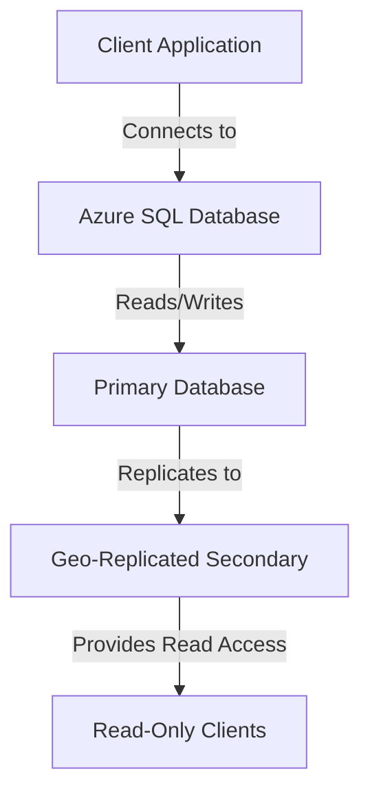

## 13.6.2 Azure SQL Database

Azure SQL Database is a fully managed relational database service provided by Microsoft Azure. It offers a robust platform for building scalable, secure, and high-performance applications. In this section, we will delve into the various offerings, features, and best practices associated with Azure SQL Database, providing expert software engineers and architects with the insights needed to leverage this powerful cloud-based solution effectively.

### Offerings

Azure SQL Database provides two primary offerings to cater to different application needs: **Single Database** and **Managed Instance**.

#### Single Database

The Single Database offering is a fully managed SQL database that provides scalable resources tailored to the specific needs of your application. It is ideal for applications that require isolated databases with predictable performance. Key features include:

- **Elastic Pooling**: Allows you to share resources among multiple databases, optimizing cost and performance.
- **Scalability**: Easily scale up or down based on workload demands.
- **Automatic Backups**: Ensures data protection with automated backups and point-in-time restore capabilities.

#### Managed Instance

Managed Instance offers instance-level compatibility with SQL Server, making it an excellent choice for migrating existing SQL Server applications to the cloud. It provides:

- **Full SQL Server Compatibility**: Supports SQL Server features such as SQL Agent, cross-database queries, and more.
- **Network Isolation**: Offers VNet integration for enhanced security.
- **High Availability**: Built-in high availability with automatic failover.

### Features

Azure SQL Database is equipped with a range of features designed to enhance performance, security, and scalability.

#### Intelligent Performance

Azure SQL Database includes built-in intelligence that optimizes performance through features like:

- **Automatic Tuning**: Continuously monitors and optimizes query performance.
- **Query Performance Insights**: Provides detailed insights into query performance and resource utilization.
- **Adaptive Query Processing**: Automatically adjusts query execution plans for optimal performance.

#### Global Scaling

Azure SQL Database supports global scaling through geo-replication, enabling high availability and disaster recovery:

- **Active Geo-Replication**: Allows you to create readable replicas in different regions for load balancing and disaster recovery.
- **Zone Redundant Configuration**: Ensures high availability by replicating data across multiple availability zones.

### Code Examples

Let's explore some code examples to demonstrate how to interact with Azure SQL Database using SQL and Azure CLI.

#### Creating a Single Database

```sql
-- Create a new database in Azure SQL Database
CREATE DATABASE MySampleDatabase;
```

#### Scaling a Database

```bash
az sql db update --resource-group myResourceGroup --server myServer --name MySampleDatabase --service-objective S3
```

#### Implementing Geo-Replication

```sql
-- Enable geo-replication for a database
ALTER DATABASE MySampleDatabase
ADD SECONDARY ON SERVER mySecondaryServer;
```

### Visualizing Azure SQL Database Architecture

To better understand the architecture of Azure SQL Database, let's visualize its components and interactions using a Mermaid.js diagram.



**Diagram Description**: This diagram illustrates the architecture of Azure SQL Database, showing how client applications connect to the primary database, which replicates data to a geo-replicated secondary database for read-only access.

### Best Practices

To maximize the benefits of Azure SQL Database, consider the following best practices:

- **Optimize Query Performance**: Use query performance insights and automatic tuning to identify and resolve performance bottlenecks.
- **Implement Security Measures**: Leverage network isolation, encryption, and role-based access control (RBAC) to secure your data.
- **Plan for Scalability**: Use elastic pools and geo-replication to ensure your database can handle varying workloads and provide high availability.
- **Monitor and Manage**: Utilize Azure Monitor and Azure Security Center to keep track of performance, security, and compliance.

### Knowledge Check

Before we conclude, let's reinforce your understanding with a few questions:

- What are the two primary offerings of Azure SQL Database?
- How does Azure SQL Database ensure high availability and disaster recovery?
- What features does Azure SQL Database provide to optimize query performance?

### Embrace the Journey

Remember, mastering Azure SQL Database is a journey. As you continue to explore its capabilities, you'll uncover new ways to optimize and secure your applications. Keep experimenting, stay curious, and enjoy the process!

## Quiz Time!



### What are the two primary offerings of Azure SQL Database?

- [x] Single Database and Managed Instance
- [ ] Elastic Pool and Virtual Machine
- [ ] SQL Server and MySQL
- [ ] Blob Storage and Table Storage

> **Explanation:** Azure SQL Database offers Single Database and Managed Instance as its primary offerings, each catering to different application needs.

### How does Azure SQL Database ensure high availability?

- [x] Geo-replication and Zone Redundant Configuration
- [ ] Manual Backups and Restores
- [ ] Local Storage and Caching
- [ ] On-premises Failover Clusters

> **Explanation:** Azure SQL Database ensures high availability through geo-replication and zone redundant configuration, providing data replication across regions and availability zones.

### Which feature helps optimize query performance in Azure SQL Database?

- [x] Automatic Tuning
- [ ] Manual Indexing
- [ ] Static Query Plans
- [ ] Fixed Execution Paths

> **Explanation:** Automatic Tuning in Azure SQL Database continuously monitors and optimizes query performance, making it a key feature for performance optimization.

### What is the purpose of Active Geo-Replication in Azure SQL Database?

- [x] To create readable replicas in different regions
- [ ] To backup data to local storage
- [ ] To encrypt data at rest
- [ ] To provide network isolation

> **Explanation:** Active Geo-Replication allows Azure SQL Database to create readable replicas in different regions, enhancing load balancing and disaster recovery.

### Which Azure SQL Database offering provides instance-level compatibility with SQL Server?

- [x] Managed Instance
- [ ] Single Database
- [ ] Elastic Pool
- [ ] Virtual Machine

> **Explanation:** Managed Instance offers instance-level compatibility with SQL Server, making it suitable for migrating existing SQL Server applications to the cloud.

### What is the benefit of using elastic pools in Azure SQL Database?

- [x] To share resources among multiple databases
- [ ] To encrypt data in transit
- [ ] To provide network isolation
- [ ] To backup data to local storage

> **Explanation:** Elastic pools allow you to share resources among multiple databases, optimizing cost and performance in Azure SQL Database.

### How can you scale a database in Azure SQL Database using Azure CLI?

- [x] az sql db update --resource-group myResourceGroup --server myServer --name MySampleDatabase --service-objective S3
- [ ] az sql db scale --resource-group myResourceGroup --server myServer --name MySampleDatabase --service-objective S3
- [ ] az sql db resize --resource-group myResourceGroup --server myServer --name MySampleDatabase --service-objective S3
- [ ] az sql db upgrade --resource-group myResourceGroup --server myServer --name MySampleDatabase --service-objective S3

> **Explanation:** The correct Azure CLI command to scale a database in Azure SQL Database is `az sql db update --resource-group myResourceGroup --server myServer --name MySampleDatabase --service-objective S3`.

### What does the Zone Redundant Configuration in Azure SQL Database ensure?

- [x] High availability by replicating data across multiple availability zones
- [ ] Data encryption at rest
- [ ] Network isolation
- [ ] Manual failover

> **Explanation:** Zone Redundant Configuration ensures high availability by replicating data across multiple availability zones in Azure SQL Database.

### Which feature provides detailed insights into query performance in Azure SQL Database?

- [x] Query Performance Insights
- [ ] Manual Indexing
- [ ] Static Query Plans
- [ ] Fixed Execution Paths

> **Explanation:** Query Performance Insights provides detailed insights into query performance and resource utilization in Azure SQL Database.

### True or False: Azure SQL Database can only be used for new applications and not for migrating existing SQL Server applications.

- [ ] True
- [x] False

> **Explanation:** False. Azure SQL Database, particularly the Managed Instance offering, is designed to support the migration of existing SQL Server applications to the cloud.




