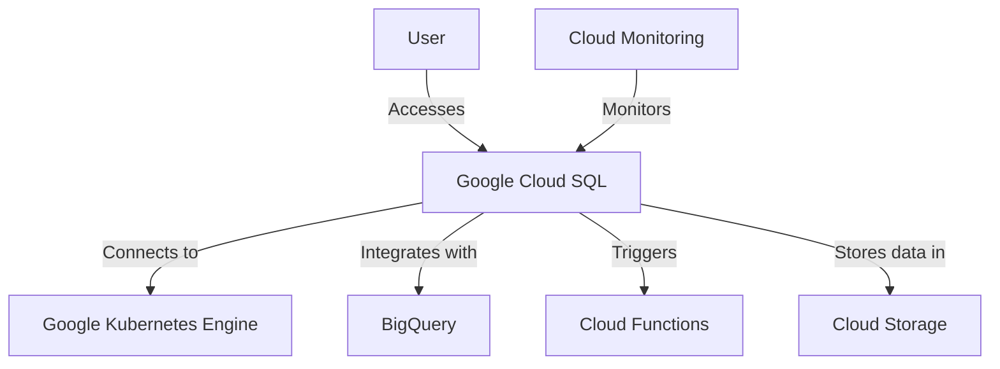

## 13.6.3 Google Cloud SQL

Google Cloud SQL is a fully-managed relational database service that supports MySQL, PostgreSQL, and SQL Server. It is designed to handle the heavy lifting of database management, allowing developers and architects to focus on building applications without worrying about the underlying infrastructure. In this section, we will explore the key features, integration capabilities, and best practices for using Google Cloud SQL effectively.

### Key Features of Google Cloud SQL

#### 1. Supported Engines

Google Cloud SQL supports three major SQL database engines:

- **MySQL**: One of the most popular open-source databases, known for its reliability and ease of use.
- **PostgreSQL**: An advanced open-source database known for its robustness and support for complex queries.
- **SQL Server**: A relational database management system developed by Microsoft, known for its enterprise-grade features.

#### 2. Managed Service

Google Cloud SQL offers a fully-managed service, which includes:

- **Automated Backups**: Regular backups are automatically taken to ensure data safety and recovery.
- **Replication**: Data is replicated across multiple zones to ensure high availability and durability.
- **Automatic Failover**: In case of a failure, automatic failover ensures minimal downtime.
- **Patching and Updates**: Automatic patching and updates keep the database secure and up-to-date.

#### 3. Integration with Google Cloud Platform (GCP)

Google Cloud SQL integrates seamlessly with other GCP services, such as:

- **Google Kubernetes Engine (GKE)**: Easily deploy and manage containerized applications with Cloud SQL as the backend.
- **BigQuery**: Perform advanced analytics on your Cloud SQL data using BigQuery.
- **Cloud Functions**: Trigger serverless functions based on database events.
- **Cloud Storage**: Store and retrieve large datasets with ease.

#### 4. Security Features

- **Encryption**: Data is encrypted both at rest and in transit.
- **IAM Integration**: Fine-grained access control using Google Cloud Identity and Access Management (IAM).
- **VPC Peering**: Securely connect your Cloud SQL instances to your Virtual Private Cloud (VPC).

#### 5. Scalability and Performance

- **Vertical Scaling**: Easily scale up resources such as CPU and memory.
- **Horizontal Scaling**: Use read replicas to distribute read traffic and improve performance.
- **Performance Insights**: Monitor and optimize database performance using built-in tools.

### Setting Up Google Cloud SQL

#### Step 1: Creating a Cloud SQL Instance

To create a Cloud SQL instance, follow these steps:

1. **Navigate to the Cloud SQL Console**: Go to the [Google Cloud Console](https://console.cloud.google.com/) and select "SQL" from the navigation menu.
2. **Create Instance**: Click on "Create Instance" and choose the desired database engine (MySQL, PostgreSQL, or SQL Server).
3. **Configure Instance**: Set the instance name, region, and zone. Configure the machine type and storage options based on your requirements.
4. **Set Authentication**: Configure the root password and any additional users or databases.
5. **Network Configuration**: Set up authorized networks to allow connections from specific IP addresses.

#### Step 2: Connecting to Cloud SQL

You can connect to your Cloud SQL instance using various methods:

- **Cloud SQL Proxy**: A secure way to connect to your instance from your local machine or application.
- **Direct IP Connection**: Connect using the public IP address of your instance.
- **Private IP**: Use private IP for secure connections within your VPC.

#### Step 3: Managing and Monitoring

- **Cloud Console**: Use the Cloud Console to manage your instances, view logs, and monitor performance.
- **Cloud Monitoring**: Set up alerts and dashboards to monitor database health and performance metrics.

### Best Practices for Using Google Cloud SQL

#### 1. Optimize Performance

- **Use Read Replicas**: Distribute read traffic across multiple replicas to improve performance.
- **Indexing**: Ensure proper indexing of tables to speed up query execution.
- **Query Optimization**: Analyze and optimize slow queries using the query execution plan.

#### 2. Ensure Security

- **Use IAM Roles**: Assign appropriate IAM roles to control access to your Cloud SQL instances.
- **Enable SSL/TLS**: Use SSL/TLS for secure connections to your database.
- **Regular Backups**: Schedule regular backups and test recovery procedures.

#### 3. Cost Management

- **Right-Size Instances**: Choose the appropriate machine type and storage options to balance cost and performance.
- **Use Committed Use Discounts**: Take advantage of committed use discounts for long-term savings.

#### 4. High Availability

- **Multi-Zone Deployment**: Deploy instances across multiple zones for high availability.
- **Automatic Failover**: Enable automatic failover to minimize downtime during failures.

### Code Examples

Let's explore some code examples to demonstrate how to interact with Google Cloud SQL.

#### Example 1: Connecting to a MySQL Instance

```python
import mysql.connector

connection = mysql.connector.connect(
    host='your-instance-ip',
    user='your-username',
    password='your-password',
    database='your-database'
)

cursor = connection.cursor()

cursor.execute("SELECT * FROM your_table")

for row in cursor.fetchall():
    print(row)

connection.close()
```

#### Example 2: Using Cloud SQL Proxy

```bash
./cloud_sql_proxy -instances=your-project:your-region:your-instance=tcp:3306

mysql -u your-username -p -h 127.0.0.1 -P 3306
```

### Visualizing Google Cloud SQL Architecture

Below is a diagram illustrating the architecture of Google Cloud SQL and its integration with other GCP services.



**Diagram Description**: This diagram shows how Google Cloud SQL integrates with various GCP services, including Google Kubernetes Engine, BigQuery, Cloud Functions, and Cloud Storage. It also highlights user access and monitoring capabilities.

### References and Links

- [Google Cloud SQL Documentation](https://cloud.google.com/sql/docs)
- [Google Cloud Console](https://console.cloud.google.com/)
- [Cloud SQL Proxy](https://cloud.google.com/sql/docs/mysql/sql-proxy)

### Knowledge Check

- Explain the benefits of using Google Cloud SQL as a managed service.
- Describe how Google Cloud SQL integrates with other GCP services.
- Discuss the security features provided by Google Cloud SQL.
- Demonstrate how to connect to a Cloud SQL instance using the Cloud SQL Proxy.

### Embrace the Journey

Remember, mastering Google Cloud SQL is a journey. As you explore its features and capabilities, you'll discover new ways to optimize your database solutions. Keep experimenting, stay curious, and enjoy the process of building scalable and secure applications with Google Cloud SQL.

## Quiz Time!



### What are the supported database engines for Google Cloud SQL?

- [x] MySQL
- [x] PostgreSQL
- [x] SQL Server
- [ ] Oracle

> **Explanation:** Google Cloud SQL supports MySQL, PostgreSQL, and SQL Server as its database engines.

### Which feature ensures data safety and recovery in Google Cloud SQL?

- [x] Automated Backups
- [ ] Manual Backups
- [ ] Data Mirroring
- [ ] Data Archiving

> **Explanation:** Automated backups in Google Cloud SQL ensure data safety and recovery.

### How does Google Cloud SQL integrate with Google Kubernetes Engine?

- [x] As a backend database
- [ ] As a frontend service
- [ ] As a monitoring tool
- [ ] As a storage solution

> **Explanation:** Google Cloud SQL can be used as a backend database for applications deployed on Google Kubernetes Engine.

### What is the purpose of the Cloud SQL Proxy?

- [x] To securely connect to Cloud SQL instances
- [ ] To backup data
- [ ] To monitor database performance
- [ ] To replicate data

> **Explanation:** The Cloud SQL Proxy is used to securely connect to Cloud SQL instances.

### Which security feature encrypts data at rest and in transit?

- [x] Encryption
- [ ] Firewalls
- [ ] IAM Roles
- [ ] SSL/TLS

> **Explanation:** Encryption in Google Cloud SQL ensures that data is encrypted both at rest and in transit.

### What is the benefit of using read replicas in Google Cloud SQL?

- [x] Improved performance by distributing read traffic
- [ ] Increased storage capacity
- [ ] Enhanced security
- [ ] Simplified backups

> **Explanation:** Read replicas improve performance by distributing read traffic across multiple replicas.

### Which tool is used to monitor and optimize database performance in Google Cloud SQL?

- [x] Performance Insights
- [ ] Cloud Functions
- [ ] Cloud Storage
- [ ] Cloud SQL Proxy

> **Explanation:** Performance Insights is used to monitor and optimize database performance in Google Cloud SQL.

### What is the advantage of using IAM roles in Google Cloud SQL?

- [x] Fine-grained access control
- [ ] Increased storage capacity
- [ ] Improved query performance
- [ ] Simplified backups

> **Explanation:** IAM roles provide fine-grained access control to Cloud SQL instances.

### Which method allows secure connections within a VPC?

- [x] Private IP
- [ ] Public IP
- [ ] Cloud SQL Proxy
- [ ] Direct IP Connection

> **Explanation:** Private IP allows secure connections within a Virtual Private Cloud (VPC).

### True or False: Google Cloud SQL automatically patches and updates the database.

- [x] True
- [ ] False

> **Explanation:** Google Cloud SQL automatically patches and updates the database to keep it secure and up-to-date.




