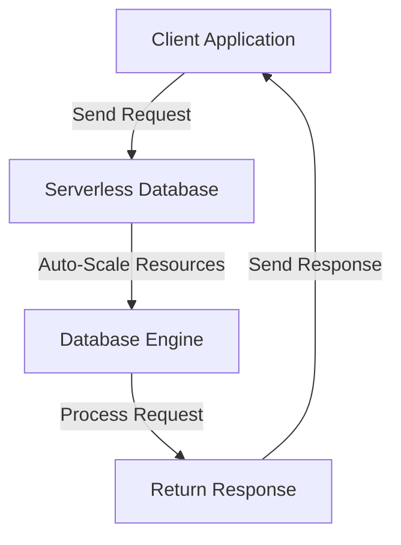

## 13.7 Serverless Databases

In the ever-evolving landscape of database management, serverless databases have emerged as a transformative solution, offering unparalleled flexibility, scalability, and cost efficiency. This section delves into the concept of serverless databases, explores prominent examples, and examines their benefits and ideal use cases.

### Understanding Serverless Databases

**Concept**: Serverless databases eliminate the need for traditional server management by automatically scaling resources based on demand. This paradigm shift allows developers to focus on application logic without worrying about infrastructure provisioning or capacity planning.

#### Key Characteristics

- **Automatic Scaling**: Resources are dynamically allocated based on workload demands, ensuring optimal performance without manual intervention.
- **Pay-as-You-Go Pricing**: Costs are incurred only for the resources consumed, making serverless databases a cost-effective solution for varying workloads.
- **Simplified Management**: With no servers to manage, developers can concentrate on building applications rather than maintaining infrastructure.

### Prominent Serverless Database Platforms

Several cloud providers offer serverless database solutions, each with unique features and capabilities. Here, we explore two leading platforms: Amazon Aurora Serverless and Azure SQL Database Serverless.

#### Amazon Aurora Serverless

Amazon Aurora Serverless is a fully managed, serverless database service that automatically adjusts capacity based on application needs. It supports MySQL and PostgreSQL, providing the performance and availability of commercial databases at a fraction of the cost.

- **Key Features**:
  - **Auto-Scaling**: Seamlessly scales database capacity up or down based on application demand.
  - **High Availability**: Built on Amazon's robust infrastructure, ensuring data durability and availability.
  - **Compatibility**: Supports MySQL and PostgreSQL, allowing easy migration from existing databases.

- **Use Cases**:
  - **Intermittent Workloads**: Ideal for applications with unpredictable or variable workloads, such as development and testing environments.
  - **Event-Driven Applications**: Perfect for applications that experience sudden spikes in traffic, such as e-commerce platforms during sales events.

#### Azure SQL Database Serverless

Azure SQL Database Serverless is a cloud-based, serverless database offering from Microsoft, designed to optimize cost and performance for applications with intermittent, unpredictable usage patterns.

- **Key Features**:
  - **Auto-Pause and Resume**: Automatically pauses the database during inactivity and resumes when activity is detected, reducing costs.
  - **Flexible Compute**: Adjusts compute resources dynamically, ensuring efficient resource utilization.
  - **Integrated Security**: Offers advanced security features, including data encryption and threat detection.

- **Use Cases**:
  - **Development and Testing**: Suitable for environments where databases are not continuously in use.
  - **Microservices Architectures**: Supports microservices that require independent, scalable databases.

### Benefits of Serverless Databases

Serverless databases offer numerous advantages that make them an attractive choice for modern application architectures.

#### Cost Efficiency

- **Pay Only for What You Use**: Serverless databases charge based on actual usage, eliminating the need to pay for idle resources.
- **Reduced Operational Costs**: With no servers to manage, operational overhead is significantly reduced.

#### Simplified Management

- **No Server Provisioning**: Developers can focus on application development without worrying about server setup and maintenance.
- **Automatic Scaling**: Resources are automatically adjusted to meet demand, ensuring optimal performance without manual intervention.

#### Enhanced Flexibility

- **Adapt to Changing Workloads**: Serverless databases can handle varying workloads, making them ideal for applications with unpredictable traffic patterns.
- **Seamless Integration**: Easily integrate with other cloud services, enabling the development of complex, distributed applications.

### Ideal Use Cases for Serverless Databases

Serverless databases are particularly well-suited for specific scenarios where traditional database management may fall short.

#### Intermittent Workloads

Applications with sporadic usage patterns, such as development and testing environments, can benefit from the cost savings and flexibility of serverless databases.

#### Unpredictable Traffic Patterns

Serverless databases excel in handling applications with sudden spikes in traffic, such as e-commerce platforms during sales events or social media applications during viral trends.

#### Event-Driven Architectures

In event-driven architectures, where applications respond to real-time events, serverless databases provide the scalability and responsiveness needed to handle varying workloads.

### Code Example: Connecting to a Serverless Database

Let's explore a simple code example demonstrating how to connect to an Amazon Aurora Serverless database using Python and the `mysql-connector-python` library.

```python
import mysql.connector
from mysql.connector import Error

def connect_to_aurora():
    try:
        # Establish a connection to the Aurora Serverless database
        connection = mysql.connector.connect(
            host='your-aurora-endpoint',
            database='your-database-name',
            user='your-username',
            password='your-password'
        )
        
        if connection.is_connected():
            print("Connected to Aurora Serverless database")
            # Perform database operations here
            # Example: Fetch data from a table
            cursor = connection.cursor()
            cursor.execute("SELECT * FROM your_table_name")
            records = cursor.fetchall()
            for record in records:
                print(record)
    
    except Error as e:
        print(f"Error: {e}")
    
    finally:
        if connection.is_connected():
            cursor.close()
            connection.close()
            print("Connection closed")

connect_to_aurora()
```

### Visualizing Serverless Database Architecture

To better understand the architecture of serverless databases, let's visualize the workflow using a Mermaid.js diagram.



**Diagram Description**: This flowchart illustrates the interaction between a client application and a serverless database. The serverless database automatically scales resources based on incoming requests, processes the request, and returns the response to the client.

### References and Further Reading

- [Amazon Aurora Serverless Documentation](https://docs.aws.amazon.com/AmazonRDS/latest/AuroraUserGuide/aurora-serverless.html)
- [Azure SQL Database Serverless Documentation](https://docs.microsoft.com/en-us/azure/azure-sql/database/serverless-tier-overview)
- [Serverless Computing on Wikipedia](https://en.wikipedia.org/wiki/Serverless_computing)

### Knowledge Check

Before we wrap up, let's reinforce our understanding with a few questions:

- What are the key benefits of using serverless databases?
- How do serverless databases handle scaling?
- In what scenarios are serverless databases most beneficial?

### Embrace the Journey

Remember, serverless databases are just one piece of the puzzle in modern application development. As you continue to explore and experiment, you'll discover new ways to leverage these powerful tools to build efficient, scalable, and cost-effective solutions. Keep experimenting, stay curious, and enjoy the journey!

## Quiz Time!



### What is a key characteristic of serverless databases?

- [x] Automatic scaling of resources
- [ ] Manual server provisioning
- [ ] Fixed pricing model
- [ ] Limited integration with cloud services

> **Explanation:** Serverless databases automatically scale resources based on demand, eliminating the need for manual server provisioning.

### Which of the following is an example of a serverless database platform?

- [x] Amazon Aurora Serverless
- [ ] MySQL Community Edition
- [ ] Oracle Database
- [ ] Microsoft Access

> **Explanation:** Amazon Aurora Serverless is a serverless database platform that automatically adjusts capacity based on application needs.

### What is a primary benefit of serverless databases?

- [x] Cost efficiency through pay-as-you-go pricing
- [ ] Complex server management
- [ ] Fixed resource allocation
- [ ] High operational overhead

> **Explanation:** Serverless databases offer cost efficiency by charging only for the resources consumed, reducing operational overhead.

### In which scenario are serverless databases most beneficial?

- [x] Applications with unpredictable traffic patterns
- [ ] Applications with constant, predictable workloads
- [ ] Applications requiring manual server management
- [ ] Applications with fixed resource needs

> **Explanation:** Serverless databases are ideal for applications with unpredictable traffic patterns, as they can automatically scale resources to meet demand.

### What feature does Azure SQL Database Serverless offer?

- [x] Auto-pause and resume
- [ ] Manual scaling
- [ ] Fixed compute resources
- [ ] Limited security features

> **Explanation:** Azure SQL Database Serverless offers auto-pause and resume, allowing the database to pause during inactivity and resume when activity is detected.

### How do serverless databases handle resource scaling?

- [x] Automatically based on workload demands
- [ ] Manually by the developer
- [ ] Through fixed resource allocation
- [ ] By purchasing additional servers

> **Explanation:** Serverless databases automatically scale resources based on workload demands, ensuring optimal performance without manual intervention.

### What is a common use case for serverless databases?

- [x] Development and testing environments
- [ ] High-frequency trading systems
- [ ] Applications with fixed resource needs
- [ ] Legacy systems with static workloads

> **Explanation:** Serverless databases are well-suited for development and testing environments, where workloads are often intermittent and unpredictable.

### Which cloud provider offers Azure SQL Database Serverless?

- [x] Microsoft
- [ ] Amazon
- [ ] Google
- [ ] IBM

> **Explanation:** Azure SQL Database Serverless is offered by Microsoft as part of its cloud services.

### What is a benefit of the pay-as-you-go pricing model in serverless databases?

- [x] Cost savings by paying only for consumed resources
- [ ] Fixed monthly fees regardless of usage
- [ ] High initial setup costs
- [ ] Limited scalability options

> **Explanation:** The pay-as-you-go pricing model allows users to save costs by paying only for the resources they consume, making it a cost-effective solution.

### Serverless databases require manual server provisioning.

- [ ] True
- [x] False

> **Explanation:** Serverless databases do not require manual server provisioning, as they automatically scale resources based on demand.


