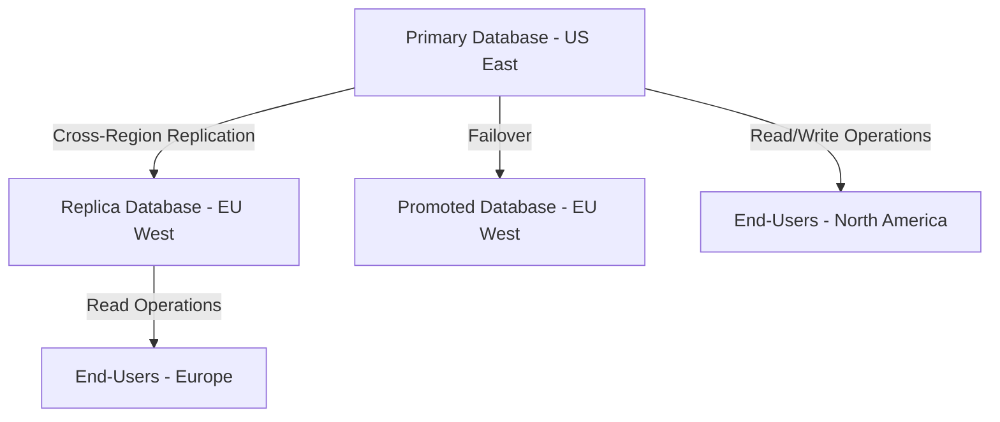

## 13.8 Multi-Region Deployment

In today's globalized digital landscape, deploying SQL databases across multiple regions is a strategic approach to enhance performance, reliability, and compliance. Multi-region deployment involves distributing database instances across various geographic locations, allowing organizations to serve users more efficiently and ensure business continuity. This section will delve into the purpose, benefits, challenges, and best practices of multi-region deployment for SQL databases.

### Purpose of Multi-Region Deployment

The primary purpose of multi-region deployment is to improve the performance and reliability of database systems by leveraging geographic distribution. By deploying databases closer to end-users, organizations can significantly reduce latency, thereby enhancing user experience. Additionally, multi-region deployment provides a robust disaster recovery mechanism, ensuring data availability and business continuity even in the face of regional failures.

### Benefits of Multi-Region Deployment

#### Reduced Latency

One of the most significant advantages of multi-region deployment is reduced latency. By hosting database instances in regions closer to end-users, data retrieval times are minimized, leading to faster application response times. This is particularly crucial for applications with a global user base, where latency can significantly impact user satisfaction and engagement.

#### Disaster Recovery

Multi-region deployment inherently supports disaster recovery by providing geographic redundancy. In the event of a regional outage or disaster, data can be quickly accessed from another region, minimizing downtime and data loss. This redundancy is essential for maintaining high availability and ensuring that critical applications remain operational.

#### Enhanced Reliability

Deploying databases across multiple regions increases the overall reliability of the system. With data replicated in various locations, the system can withstand regional failures without affecting the overall service. This reliability is crucial for mission-critical applications that require continuous availability.

#### Compliance and Data Sovereignty

Multi-region deployment can also aid in compliance with regional data sovereignty laws. By storing data in specific geographic locations, organizations can adhere to local regulations regarding data storage and processing. This is particularly important in regions with strict data protection laws, such as the European Union's GDPR.

### Challenges of Multi-Region Deployment

While multi-region deployment offers numerous benefits, it also presents several challenges that organizations must address to ensure successful implementation.

#### Data Sovereignty

Data sovereignty refers to the concept of data being subject to the laws and governance structures within the nation it is collected. When deploying databases across multiple regions, organizations must ensure compliance with local data protection laws and regulations. This may involve implementing specific data handling practices and ensuring that data is stored and processed in accordance with regional requirements.

#### Consistency Models

Managing data consistency across regions is a significant challenge in multi-region deployment. Different regions may experience varying network latencies and outages, leading to potential data inconsistencies. Organizations must choose an appropriate consistency model, such as eventual consistency or strong consistency, based on their specific application requirements and tolerance for data staleness.

#### Network Latency and Bandwidth

While multi-region deployment reduces latency for end-users, it can introduce latency and bandwidth challenges between regions. Data replication and synchronization across regions require efficient network infrastructure to ensure timely updates and minimize data transfer delays.

#### Cost Considerations

Deploying and maintaining databases across multiple regions can be costly. Organizations must consider the financial implications of multi-region deployment, including infrastructure costs, data transfer fees, and operational expenses. Balancing cost with performance and reliability is crucial for optimizing the deployment strategy.

### Best Practices for Multi-Region Deployment

To effectively implement multi-region deployment for SQL databases, organizations should follow best practices that address the challenges and maximize the benefits.

#### Design for Failure

When deploying databases across multiple regions, it's essential to design the system with failure in mind. Implement automated failover mechanisms to ensure seamless transition between regions in the event of an outage. Regularly test disaster recovery plans to validate their effectiveness and ensure that data can be quickly restored.

#### Choose the Right Consistency Model

Selecting an appropriate consistency model is critical for maintaining data integrity across regions. Evaluate the trade-offs between consistency, availability, and partition tolerance (CAP theorem) to determine the best fit for your application. Consider using eventual consistency for applications that can tolerate temporary data staleness, or strong consistency for applications requiring immediate data accuracy.

#### Optimize Data Replication

Efficient data replication is crucial for minimizing latency and ensuring data consistency across regions. Use asynchronous replication for non-critical data to reduce network overhead, and synchronous replication for critical data to ensure immediate consistency. Implement data compression and deduplication techniques to optimize bandwidth usage.

#### Monitor and Optimize Performance

Regularly monitor the performance of multi-region deployments to identify and address potential bottlenecks. Use performance monitoring tools to track latency, throughput, and error rates across regions. Optimize database queries and indexing strategies to improve performance and reduce resource consumption.

#### Ensure Compliance with Data Regulations

Stay informed about regional data protection laws and ensure that your multi-region deployment complies with all relevant regulations. Implement data encryption and access controls to protect sensitive information and maintain data privacy. Regularly audit data handling practices to ensure compliance and identify potential vulnerabilities.

### Code Example: Setting Up Multi-Region Deployment

Let's explore a simple example of setting up a multi-region deployment using a cloud-based SQL database service. In this example, we'll use AWS RDS (Relational Database Service) to create a multi-region deployment for a MySQL database.

```sql
-- Create a primary database instance in the US East (N. Virginia) region
CREATE DATABASE mydb PRIMARY_REGION 'us-east-1';

-- Enable cross-region replication to the EU (Ireland) region
CALL mysql.rds_set_external_master (
    'mydb-replica.eu-west-1.rds.amazonaws.com',
    3306,
    'replication_user',
    'replication_password',
    'mydb',
    0
);

-- Verify the replication status
SHOW SLAVE STATUS\G;

-- Promote the replica to a standalone database in case of a regional failure
CALL mysql.rds_start_replication;
```

In this example, we create a primary database instance in the US East region and enable cross-region replication to the EU West region. We then verify the replication status and demonstrate how to promote the replica to a standalone database in case of a regional failure.

### Visualizing Multi-Region Deployment

To better understand the architecture of multi-region deployment, let's visualize the setup using a Mermaid.js diagram.



**Diagram Description:** This diagram illustrates a multi-region deployment setup with a primary database in the US East region and a replica database in the EU West region. Cross-region replication ensures data consistency, while failover mechanisms allow the replica to be promoted to a standalone database in case of a regional failure. End-users in Europe and North America can access the databases for read and write operations.

### Try It Yourself

Experiment with the code example by modifying the regions and database configurations. Try setting up multi-region deployment using different cloud providers, such as Azure SQL Database or Google Cloud SQL. Test the failover process by simulating a regional outage and observe how the system handles the transition.

### Knowledge Check

- Explain the benefits of multi-region deployment for SQL databases.
- Describe the challenges associated with data sovereignty in multi-region deployment.
- Discuss the trade-offs between eventual consistency and strong consistency models.
- Provide an example of how to set up cross-region replication using a cloud-based SQL database service.

### Embrace the Journey

Remember, multi-region deployment is a powerful strategy for enhancing the performance and reliability of SQL databases. As you explore this approach, keep in mind the challenges and best practices to ensure a successful implementation. Stay curious, experiment with different configurations, and enjoy the journey of mastering multi-region deployment!

## Quiz Time!



### What is the primary purpose of multi-region deployment?

- [x] To enhance performance and reliability by distributing databases across regions
- [ ] To reduce the cost of database maintenance
- [ ] To simplify database management
- [ ] To increase the complexity of database architecture

> **Explanation:** The primary purpose of multi-region deployment is to enhance performance and reliability by distributing databases across regions, thereby reducing latency and providing disaster recovery.

### Which of the following is a benefit of multi-region deployment?

- [x] Reduced latency
- [ ] Increased database complexity
- [ ] Higher operational costs
- [ ] Simplified data management

> **Explanation:** Reduced latency is a benefit of multi-region deployment, as it allows databases to be closer to end-users, improving response times.

### What is a challenge associated with multi-region deployment?

- [x] Data sovereignty
- [ ] Simplified data replication
- [ ] Reduced latency
- [ ] Increased reliability

> **Explanation:** Data sovereignty is a challenge in multi-region deployment, as organizations must comply with regional data protection laws and regulations.

### Which consistency model is suitable for applications that can tolerate temporary data staleness?

- [x] Eventual consistency
- [ ] Strong consistency
- [ ] Immediate consistency
- [ ] Strict consistency

> **Explanation:** Eventual consistency is suitable for applications that can tolerate temporary data staleness, as it allows for eventual synchronization of data across regions.

### What is the CAP theorem?

- [x] A principle that describes the trade-offs between consistency, availability, and partition tolerance
- [ ] A method for optimizing database queries
- [ ] A technique for reducing database latency
- [ ] A strategy for improving database security

> **Explanation:** The CAP theorem is a principle that describes the trade-offs between consistency, availability, and partition tolerance in distributed systems.

### How can organizations ensure compliance with data sovereignty laws in multi-region deployment?

- [x] By storing data in specific geographic locations and adhering to local regulations
- [ ] By ignoring regional data protection laws
- [ ] By centralizing all data in a single location
- [ ] By using only eventual consistency models

> **Explanation:** Organizations can ensure compliance with data sovereignty laws by storing data in specific geographic locations and adhering to local regulations regarding data storage and processing.

### What is a best practice for optimizing data replication in multi-region deployment?

- [x] Use asynchronous replication for non-critical data to reduce network overhead
- [ ] Use synchronous replication for all data to ensure immediate consistency
- [ ] Avoid data compression and deduplication techniques
- [ ] Replicate data only during peak usage times

> **Explanation:** Using asynchronous replication for non-critical data is a best practice for optimizing data replication, as it reduces network overhead while ensuring data consistency.

### What should organizations regularly monitor in multi-region deployments?

- [x] Latency, throughput, and error rates across regions
- [ ] Only the primary database instance
- [ ] The number of database users
- [ ] The size of the database

> **Explanation:** Organizations should regularly monitor latency, throughput, and error rates across regions to identify and address potential performance bottlenecks.

### How can organizations design for failure in multi-region deployment?

- [x] Implement automated failover mechanisms and regularly test disaster recovery plans
- [ ] Ignore potential regional outages
- [ ] Centralize all data in a single region
- [ ] Use only eventual consistency models

> **Explanation:** Designing for failure involves implementing automated failover mechanisms and regularly testing disaster recovery plans to ensure seamless transition between regions in the event of an outage.

### True or False: Multi-region deployment can help organizations comply with regional data sovereignty laws.

- [x] True
- [ ] False

> **Explanation:** True. Multi-region deployment can help organizations comply with regional data sovereignty laws by allowing them to store data in specific geographic locations and adhere to local regulations.




