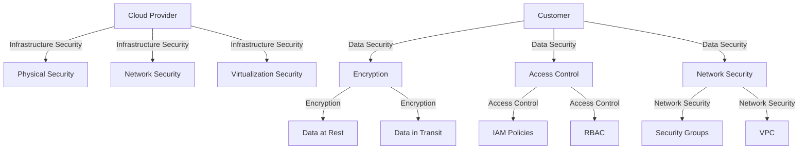

## 13.9 Security Considerations in the Cloud

As organizations increasingly migrate their SQL databases to cloud environments, understanding and implementing robust security measures becomes paramount. This section delves into the critical security considerations for SQL databases in the cloud, focusing on the shared responsibility model, encryption, access control, and network security. By mastering these concepts, expert software engineers and architects can ensure the protection of sensitive data and maintain compliance with industry standards.

### Shared Responsibility Model

The shared responsibility model is a foundational concept in cloud security, delineating the security obligations of cloud providers and customers. Understanding this model is crucial for effectively securing SQL databases in the cloud.

#### Cloud Provider Responsibilities

Cloud providers are responsible for the security of the cloud infrastructure, which includes the physical security of data centers, network infrastructure, and the virtualization layer. They ensure that the underlying hardware and software are secure and compliant with industry standards.

#### Customer Responsibilities

Customers are responsible for security in the cloud, which encompasses securing their data, applications, and configurations. This includes implementing strong access controls, encrypting data, and ensuring that applications are secure from vulnerabilities.

### Security Practices

To secure SQL databases in the cloud, several best practices must be followed. These practices include encryption, access control, and network security.

#### Encryption

Encryption is a critical component of data security, protecting data both at rest and in transit.

##### Data Encryption at Rest

Data at rest refers to inactive data stored physically in any digital form. Encrypting data at rest ensures that even if unauthorized access occurs, the data remains unreadable without the appropriate decryption keys.

```sql
-- Example of creating an encrypted table in SQL Server
CREATE DATABASE ENCRYPTION KEY
WITH ALGORITHM = AES_256
ENCRYPTION BY SERVER CERTIFICATE MyServerCert;

ALTER DATABASE MyDatabase
SET ENCRYPTION ON;
```

##### Data Encryption in Transit

Data in transit refers to data actively moving from one location to another, such as across the internet or through a private network. Encrypting data in transit protects it from interception and unauthorized access.

```plaintext
-- Example of enabling SSL/TLS for MySQL connections
[mysqld]
ssl-ca=/path/to/ca-cert.pem
ssl-cert=/path/to/server-cert.pem
ssl-key=/path/to/server-key.pem
```

#### Access Control

Implementing strong access control mechanisms is essential to ensure that only authorized users can access sensitive data.

##### Identity and Access Management (IAM)

IAM policies define who can access resources and what actions they can perform. Implementing robust IAM policies helps prevent unauthorized access to SQL databases.

```plaintext
-- Example of an IAM policy for AWS RDS
{
  "Version": "2012-10-17",
  "Statement": [
    {
      "Effect": "Allow",
      "Action": "rds:*",
      "Resource": "arn:aws:rds:us-west-2:123456789012:db:mydatabase"
    }
  ]
}
```

##### Role-Based Access Control (RBAC)

RBAC restricts system access to authorized users based on their roles within an organization. This ensures that users have the minimum necessary permissions to perform their tasks.

```sql
-- Example of creating a role and assigning permissions in PostgreSQL
CREATE ROLE data_analyst;
GRANT SELECT ON ALL TABLES IN SCHEMA public TO data_analyst;
```

#### Network Security

Securing the network layer is crucial to protect SQL databases from unauthorized access and attacks.

##### Security Groups and Firewalls

Security groups and firewalls control inbound and outbound traffic to and from SQL databases. Configuring these correctly helps prevent unauthorized access and attacks.

```plaintext
-- Example of a security group rule for AWS RDS
{
  "IpProtocol": "tcp",
  "FromPort": 3306,
  "ToPort": 3306,
  "IpRanges": [
    {
      "CidrIp": "203.0.113.0/24"
    }
  ]
}
```

##### Virtual Private Cloud (VPC)

A VPC provides a secure environment for SQL databases by isolating them from the public internet. Configuring a VPC ensures that databases are only accessible through secure, private connections.

```plaintext
-- Example of creating a VPC in AWS
aws ec2 create-vpc --cidr-block 10.0.0.0/16
```

### Visualizing Cloud Security Architecture

To better understand the security architecture in cloud environments, let's visualize the components involved in securing SQL databases.



**Caption:** This diagram illustrates the shared responsibility model and the key security components for SQL databases in cloud environments.

### References and Links

- [AWS Shared Responsibility Model](https://aws.amazon.com/compliance/shared-responsibility-model/)
- [Azure Security Documentation](https://docs.microsoft.com/en-us/azure/security/)
- [Google Cloud Security Overview](https://cloud.google.com/security/overview)

### Knowledge Check

To reinforce your understanding of cloud security considerations for SQL databases, consider the following questions:

1. What is the shared responsibility model, and why is it important for cloud security?
2. How does encryption protect data at rest and in transit?
3. What are IAM policies, and how do they contribute to access control?
4. Why is network security crucial for protecting SQL databases in the cloud?

### Embrace the Journey

Remember, mastering cloud security is an ongoing journey. As you continue to learn and implement these practices, you'll enhance the security of your SQL databases and protect sensitive data from potential threats. Keep exploring, stay vigilant, and enjoy the process of securing your cloud environments!

## Quiz Time!



### What is the shared responsibility model in cloud security?

- [x] A model that defines the security responsibilities of cloud providers and customers
- [ ] A model that outlines the financial responsibilities of cloud providers
- [ ] A model that specifies the data storage locations in the cloud
- [ ] A model that describes the performance metrics of cloud services

> **Explanation:** The shared responsibility model defines the security responsibilities of cloud providers and customers, ensuring both parties understand their roles in securing cloud environments.

### What is the primary purpose of encrypting data at rest?

- [x] To protect data from unauthorized access when it is stored
- [ ] To enhance the performance of data retrieval
- [ ] To reduce the storage space required for data
- [ ] To improve the readability of data

> **Explanation:** Encrypting data at rest protects it from unauthorized access, ensuring that even if data is accessed, it remains unreadable without the appropriate decryption keys.

### How does IAM contribute to cloud security?

- [x] By defining who can access resources and what actions they can perform
- [ ] By encrypting data in transit
- [ ] By monitoring network traffic for anomalies
- [ ] By providing backup solutions for data

> **Explanation:** IAM (Identity and Access Management) contributes to cloud security by defining who can access resources and what actions they can perform, thereby preventing unauthorized access.

### What is the role of a VPC in cloud security?

- [x] To provide a secure environment by isolating resources from the public internet
- [ ] To enhance the speed of data processing
- [ ] To increase the storage capacity of cloud databases
- [ ] To improve the user interface of cloud services

> **Explanation:** A VPC (Virtual Private Cloud) provides a secure environment by isolating resources from the public internet, ensuring that databases are only accessible through secure, private connections.

### Which of the following is a benefit of encrypting data in transit?

- [x] Protecting data from interception and unauthorized access
- [ ] Reducing the cost of data transmission
- [ ] Increasing the speed of data transfer
- [ ] Simplifying the data format

> **Explanation:** Encrypting data in transit protects it from interception and unauthorized access, ensuring that data remains secure as it moves across networks.

### What is the purpose of security groups in cloud environments?

- [x] To control inbound and outbound traffic to and from resources
- [ ] To increase the storage capacity of databases
- [ ] To enhance the graphical user interface of cloud applications
- [ ] To provide backup solutions for data

> **Explanation:** Security groups control inbound and outbound traffic to and from resources, helping to prevent unauthorized access and attacks.

### What is RBAC, and how does it enhance security?

- [x] Role-Based Access Control; it restricts access based on user roles
- [ ] Resource-Based Access Control; it limits access to specific resources
- [ ] Region-Based Access Control; it restricts access based on geographic location
- [ ] Rate-Based Access Control; it limits access based on usage rates

> **Explanation:** RBAC (Role-Based Access Control) enhances security by restricting access based on user roles, ensuring that users have the minimum necessary permissions to perform their tasks.

### Why is network security crucial for SQL databases in the cloud?

- [x] To protect databases from unauthorized access and attacks
- [ ] To increase the speed of data processing
- [ ] To enhance the user interface of cloud applications
- [ ] To provide backup solutions for data

> **Explanation:** Network security is crucial for SQL databases in the cloud to protect them from unauthorized access and attacks, ensuring the integrity and confidentiality of data.

### What is the significance of the shared responsibility model?

- [x] It clarifies the security roles of cloud providers and customers
- [ ] It defines the pricing structure of cloud services
- [ ] It outlines the data storage locations in the cloud
- [ ] It describes the performance metrics of cloud services

> **Explanation:** The shared responsibility model clarifies the security roles of cloud providers and customers, ensuring both parties understand their responsibilities in securing cloud environments.

### True or False: Encryption is only necessary for data at rest.

- [ ] True
- [x] False

> **Explanation:** Encryption is necessary for both data at rest and data in transit to ensure comprehensive data protection in cloud environments.


