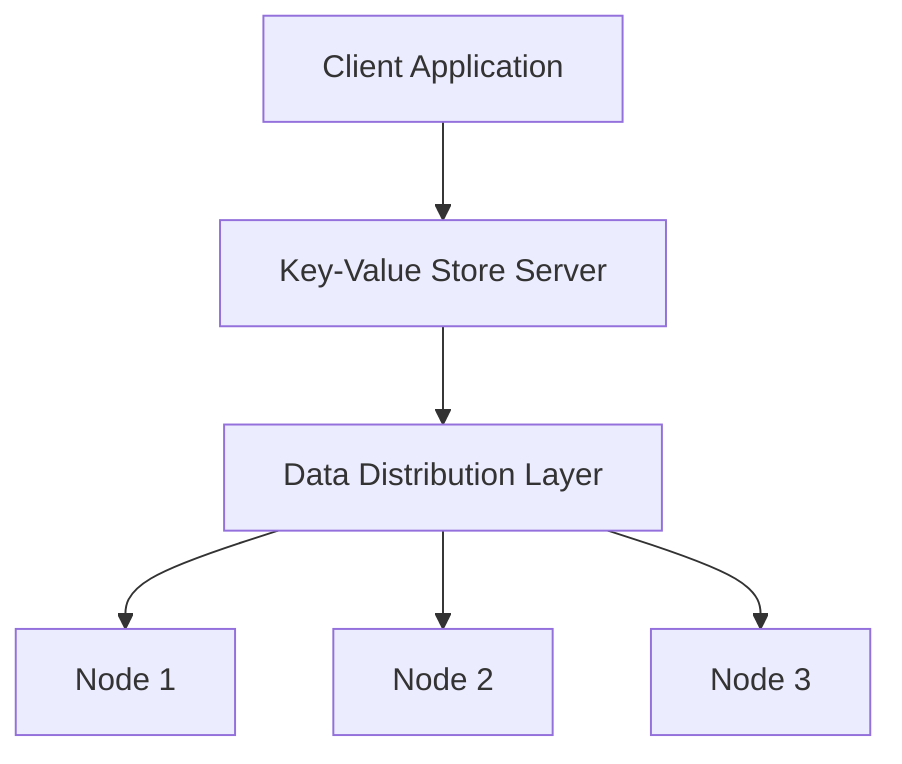

## 14.1.1 Key-Value Stores

In the realm of data storage, Key-Value Stores stand out for their simplicity and efficiency. As part of the NoSQL family, they offer a straightforward approach to storing and retrieving data, making them an essential tool for modern software engineers and architects. In this section, we will delve into the intricacies of Key-Value Stores, explore their characteristics, examine their use cases, and discuss how they can be integrated with SQL systems.

### Understanding Key-Value Stores

**Key-Value Stores** are a type of NoSQL database that use a simple data model: each data item is stored as a key-value pair. This model is akin to a dictionary or hash table, where each key is unique and maps directly to a value. The simplicity of this structure allows for rapid data retrieval and insertion, making Key-Value Stores highly performant.

#### Characteristics of Key-Value Stores

- **Simplicity**: The data model is straightforward, consisting of keys and their associated values.
- **Scalability**: Key-Value Stores are designed to scale horizontally, accommodating large volumes of data across distributed systems.
- **Performance**: With O(1) time complexity for lookups, Key-Value Stores provide fast access to data.
- **Flexibility**: Values can be of any type, including strings, numbers, JSON objects, or even binary data.

#### Use Cases for Key-Value Stores

Key-Value Stores are particularly well-suited for scenarios where the data access pattern involves frequent reads and writes of individual items. Common use cases include:

- **Caching**: Storing frequently accessed data to reduce load on primary databases.
- **Session Management**: Maintaining user session data in web applications.
- **Configuration Management**: Storing application configuration settings.
- **Shopping Carts**: Managing user-specific shopping cart data in e-commerce platforms.

### Key Participants in Key-Value Stores

In a typical Key-Value Store architecture, the key participants include:

- **Client Applications**: These interact with the Key-Value Store to perform read and write operations.
- **Key-Value Store Server**: The backend system that manages the storage and retrieval of key-value pairs.
- **Data Distribution Layer**: Responsible for distributing data across multiple nodes in a distributed Key-Value Store.

### Applicability of Key-Value Stores

Key-Value Stores are ideal for applications that require:

- High throughput and low latency for data access.
- Simple data models without complex relationships.
- Scalability to handle large volumes of data.

### Sample Code Snippet

Let's explore a simple example of using a Key-Value Store with Redis, a popular in-memory data structure store.

```python
import redis

client = redis.StrictRedis(host='localhost', port=6379, db=0)

client.set('user:1000', 'John Doe')

user_name = client.get('user:1000')
print(f'User Name: {user_name.decode("utf-8")}')

client.delete('user:1000')
```

In this example, we connect to a Redis server, set a key-value pair, retrieve the value, and then delete the key-value pair. Redis provides a simple and efficient way to manage key-value data.

### Design Considerations

When designing systems with Key-Value Stores, consider the following:

- **Data Consistency**: Ensure that your application can handle eventual consistency, as many Key-Value Stores prioritize availability over consistency.
- **Data Expiry**: Implement mechanisms to handle data expiration if your use case involves temporary data storage.
- **Data Partitioning**: Use consistent hashing or other partitioning strategies to distribute data evenly across nodes.

### Differences and Similarities with Other NoSQL Databases

While Key-Value Stores are similar to other NoSQL databases in their schema-less design and scalability, they differ in their simplicity and focus on key-based access. Unlike document stores or column-family stores, Key-Value Stores do not support complex queries or indexing on values.

### Integration with SQL Systems

Integrating Key-Value Stores with SQL systems can provide the best of both worlds: the flexibility and scalability of NoSQL with the robust querying capabilities of SQL. Here are some strategies for integration:

- **Hybrid Architecture**: Use Key-Value Stores for caching and session management while relying on SQL databases for transactional data.
- **Data Synchronization**: Implement data synchronization mechanisms to keep data consistent across Key-Value Stores and SQL databases.
- **API Layer**: Develop an API layer that abstracts the underlying data storage, allowing seamless interaction with both Key-Value and SQL databases.

### Visualizing Key-Value Store Architecture

To better understand the architecture of a Key-Value Store, let's visualize a typical setup using Mermaid.js:



This diagram illustrates how client applications interact with the Key-Value Store server, which distributes data across multiple nodes for scalability and redundancy.

### Try It Yourself

To deepen your understanding of Key-Value Stores, try modifying the sample code to:

- Store and retrieve more complex data types, such as JSON objects.
- Implement data expiration for session management.
- Experiment with different Key-Value Store systems, such as Amazon DynamoDB or Apache Cassandra.

### References and Links

For further reading on Key-Value Stores and their integration with SQL systems, consider the following resources:

- [Redis Documentation](https://redis.io/documentation)
- [Amazon DynamoDB](https://aws.amazon.com/dynamodb/)
- [Apache Cassandra](https://cassandra.apache.org/)

### Knowledge Check

To reinforce your understanding of Key-Value Stores, consider the following questions:

- What are the primary characteristics of Key-Value Stores?
- How do Key-Value Stores differ from other NoSQL databases?
- What are some common use cases for Key-Value Stores?
- How can Key-Value Stores be integrated with SQL systems?

### Embrace the Journey

Remember, mastering Key-Value Stores is just one step in your journey as a software engineer or architect. As you continue to explore different data storage solutions, you'll gain a deeper understanding of how to design efficient and scalable systems. Keep experimenting, stay curious, and enjoy the journey!

## Quiz Time!



### What is a Key-Value Store?

- [x] A type of NoSQL database that stores data as key-value pairs.
- [ ] A relational database that uses tables to store data.
- [ ] A document database that stores data as JSON documents.
- [ ] A graph database that stores data as nodes and edges.

> **Explanation:** Key-Value Stores are a type of NoSQL database that use a simple key-value pair model for data storage.

### What is the time complexity for lookups in a Key-Value Store?

- [x] O(1)
- [ ] O(n)
- [ ] O(log n)
- [ ] O(n^2)

> **Explanation:** Key-Value Stores provide O(1) time complexity for lookups, allowing for fast data retrieval.

### Which of the following is a common use case for Key-Value Stores?

- [x] Caching
- [ ] Complex querying
- [ ] Relational data modeling
- [ ] Full-text search

> **Explanation:** Key-Value Stores are commonly used for caching due to their fast data retrieval capabilities.

### How do Key-Value Stores differ from document stores?

- [x] Key-Value Stores use a simple key-value model, while document stores use a more complex document model.
- [ ] Key-Value Stores support complex queries, while document stores do not.
- [ ] Key-Value Stores are schema-based, while document stores are schema-less.
- [ ] Key-Value Stores are designed for relational data, while document stores are not.

> **Explanation:** Key-Value Stores use a simple key-value model, whereas document stores use a document model that can support more complex data structures.

### What is a key participant in a Key-Value Store architecture?

- [x] Client Applications
- [ ] SQL Query Engine
- [ ] Data Warehouse
- [ ] Graph Processor

> **Explanation:** Client applications interact with the Key-Value Store to perform read and write operations.

### What is a design consideration when using Key-Value Stores?

- [x] Data Consistency
- [ ] Complex Query Optimization
- [ ] Schema Design
- [ ] Full-Text Indexing

> **Explanation:** Data consistency is an important consideration when using Key-Value Stores, as they often prioritize availability over consistency.

### How can Key-Value Stores be integrated with SQL systems?

- [x] By using a hybrid architecture that combines both systems.
- [ ] By replacing SQL databases entirely.
- [ ] By converting all data to a relational model.
- [ ] By using SQL queries directly on Key-Value Stores.

> **Explanation:** A hybrid architecture allows for the use of both Key-Value Stores and SQL systems, leveraging the strengths of each.

### What is a characteristic of Key-Value Stores?

- [x] Scalability
- [ ] Complex Data Relationships
- [ ] Strong Consistency
- [ ] Schema Enforcement

> **Explanation:** Key-Value Stores are designed to scale horizontally, accommodating large volumes of data.

### Which of the following is a popular Key-Value Store?

- [x] Redis
- [ ] MySQL
- [ ] MongoDB
- [ ] Neo4j

> **Explanation:** Redis is a popular in-memory Key-Value Store known for its performance and simplicity.

### True or False: Key-Value Stores are ideal for applications with complex data relationships.

- [ ] True
- [x] False

> **Explanation:** Key-Value Stores are best suited for simple data models and are not ideal for applications with complex data relationships.


