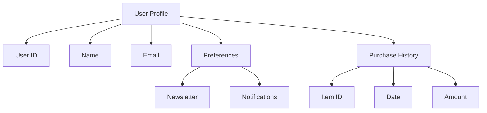

## 14.1.2 Document Databases

In the evolving landscape of data management, document databases have emerged as a powerful alternative to traditional relational databases. These databases are a subset of NoSQL systems, designed to handle semi-structured data with ease and flexibility. In this section, we will delve into the intricacies of document databases, exploring their structure, characteristics, use cases, and how they integrate with modern application architectures.

### Understanding Document Databases

Document databases store data in a format similar to JSON (JavaScript Object Notation), XML, or BSON (Binary JSON). Each record, or "document," is a self-contained unit that can contain nested structures, arrays, and key-value pairs. This flexibility allows developers to store complex data types without the rigid schema constraints of traditional SQL databases.

#### Key Characteristics of Document Databases

1. **Flexible Schemas**: Unlike relational databases, document databases do not require a predefined schema. This means that documents within the same collection can have different structures, making it easier to evolve the data model over time.

2. **Hierarchical Data Storage**: Documents can store data in a hierarchical format, allowing for nested objects and arrays. This is particularly useful for representing complex data relationships.

3. **Rich Query Capabilities**: Document databases support powerful query languages that allow for filtering, aggregation, and transformation of data. These queries can operate on nested fields and arrays, providing a high level of expressiveness.

4. **Scalability**: Document databases are designed to scale horizontally, distributing data across multiple nodes. This makes them suitable for handling large volumes of data and high-traffic applications.

5. **Indexing**: Advanced indexing capabilities allow for efficient querying of documents. Indexes can be created on any field, including nested fields, to optimize query performance.

6. **Integration with Modern Architectures**: Document databases integrate seamlessly with microservices, cloud-based systems, and other modern application architectures, providing a flexible and scalable data storage solution.

### Use Cases for Document Databases

Document databases are well-suited for a variety of applications, particularly those that require flexibility and scalability. Some common use cases include:

- **Content Management Systems (CMS)**: Document databases can store diverse content types, such as articles, images, and metadata, without requiring a fixed schema.

- **User Profiles**: Applications that manage user profiles benefit from the flexible schema of document databases, allowing for easy updates and customization of user data.

- **E-commerce Platforms**: Product catalogs with varying attributes can be efficiently managed using document databases, accommodating different product types and categories.

- **Real-Time Analytics**: Document databases can handle large volumes of semi-structured data, making them ideal for real-time analytics and reporting.

- **IoT Applications**: Internet of Things (IoT) devices generate diverse data types, which can be stored and processed effectively using document databases.

### Sample Code Snippet

Let's explore a simple example using a document database to store and query user profiles. We'll use MongoDB, a popular document database, to demonstrate these concepts.

```json
// Sample user profile document
{
  "user_id": "12345",
  "name": "John Doe",
  "email": "johndoe@example.com",
  "preferences": {
    "newsletter": true,
    "notifications": ["email", "sms"]
  },
  "purchase_history": [
    {
      "item_id": "A1",
      "date": "2024-01-15",
      "amount": 29.99
    },
    {
      "item_id": "B2",
      "date": "2024-02-20",
      "amount": 49.99
    }
  ]
}
```

In this example, we have a user profile document with nested objects and arrays. The `preferences` field contains a nested object, while `purchase_history` is an array of objects.

#### Querying Documents

To query documents in MongoDB, we use the MongoDB Query Language (MQL). Here's an example of how to find all users who have opted in for newsletters:

```javascript
// MongoDB query to find users with newsletter preference
db.users.find({ "preferences.newsletter": true })
```

This query filters documents based on the nested `preferences.newsletter` field.

### Visualizing Document Database Structure

To better understand the structure of document databases, let's visualize how data is organized using a hierarchical model.



**Figure 1: Hierarchical Structure of a User Profile Document**

This diagram illustrates how a user profile document is organized, with nested fields and arrays representing complex data relationships.

### Design Considerations

When designing applications with document databases, consider the following:

- **Schema Design**: Although document databases offer flexible schemas, it's important to design documents thoughtfully to ensure efficient querying and data integrity.

- **Indexing Strategy**: Proper indexing is crucial for performance. Identify frequently queried fields and create indexes to optimize query execution.

- **Data Consistency**: Document databases often prioritize availability and partition tolerance over strict consistency. Consider your application's consistency requirements when choosing a database.

- **Scalability**: Plan for horizontal scaling by distributing data across multiple nodes. This involves sharding strategies and understanding the trade-offs between consistency and availability.

### Differences and Similarities with Other NoSQL Databases

Document databases are often compared to other NoSQL systems, such as key-value stores, column-family stores, and graph databases. Here are some key differences and similarities:

- **Key-Value Stores**: Both document databases and key-value stores offer flexible schemas, but document databases provide richer query capabilities and support for nested data structures.

- **Column-Family Stores**: While column-family stores excel at handling wide tables with many columns, document databases are better suited for hierarchical data and complex queries.

- **Graph Databases**: Graph databases are optimized for traversing relationships between entities, whereas document databases focus on storing and querying hierarchical data.

### Try It Yourself

To get hands-on experience with document databases, try setting up a MongoDB instance and experimenting with different data models and queries. Modify the sample user profile document to include additional fields or nested structures, and observe how the database handles these changes.

### References and Links

- [MongoDB Documentation](https://docs.mongodb.com/)
- [NoSQL Databases Explained](https://www.ibm.com/cloud/learn/nosql-databases)
- [JSON Data Format](https://www.json.org/json-en.html)

### Knowledge Check

- What are the key characteristics of document databases?
- How do document databases differ from relational databases?
- What are some common use cases for document databases?
- How does the flexible schema of document databases benefit application development?

### Embrace the Journey

Remember, mastering document databases is a journey. As you explore their capabilities, you'll discover new ways to model and query data, enabling you to build more dynamic and scalable applications. Keep experimenting, stay curious, and enjoy the journey!

## Quiz Time!



### What is a key characteristic of document databases?

- [x] Flexible schemas
- [ ] Fixed schemas
- [ ] Only supports flat data
- [ ] Requires predefined tables

> **Explanation:** Document databases allow for flexible schemas, meaning documents can have varying structures without a predefined schema.

### Which of the following is a common use case for document databases?

- [x] Content management systems
- [ ] Real-time stock trading
- [ ] High-frequency trading
- [ ] Batch processing

> **Explanation:** Document databases are well-suited for content management systems due to their ability to handle diverse content types and flexible data structures.

### How do document databases handle hierarchical data?

- [x] By storing data in nested structures
- [ ] By using flat tables
- [ ] By requiring separate tables for each level
- [ ] By using only key-value pairs

> **Explanation:** Document databases store hierarchical data in nested structures, allowing for complex data relationships within a single document.

### What is the primary query language used in MongoDB?

- [x] MongoDB Query Language (MQL)
- [ ] SQL
- [ ] SPARQL
- [ ] GraphQL

> **Explanation:** MongoDB uses its own query language, MongoDB Query Language (MQL), to interact with the database.

### Which of the following is a benefit of using document databases for user profiles?

- [x] Easy updates and customization
- [ ] Requires strict schema adherence
- [ ] Limited to flat data structures
- [ ] Requires complex joins

> **Explanation:** Document databases allow for easy updates and customization of user profiles due to their flexible schema and support for nested data structures.

### What is a common indexing strategy in document databases?

- [x] Creating indexes on frequently queried fields
- [ ] Indexing every field by default
- [ ] Avoiding indexes for performance
- [ ] Using only primary keys

> **Explanation:** Creating indexes on frequently queried fields optimizes query performance in document databases.

### How do document databases prioritize data consistency?

- [x] They often prioritize availability and partition tolerance
- [ ] They enforce strict consistency
- [ ] They require manual consistency checks
- [ ] They do not support consistency

> **Explanation:** Document databases often prioritize availability and partition tolerance over strict consistency, aligning with the CAP theorem.

### What is a key difference between document databases and graph databases?

- [x] Document databases focus on hierarchical data
- [ ] Document databases are optimized for relationship traversal
- [ ] Graph databases store flat data
- [ ] Graph databases require fixed schemas

> **Explanation:** Document databases focus on storing and querying hierarchical data, while graph databases are optimized for traversing relationships between entities.

### True or False: Document databases require a predefined schema.

- [ ] True
- [x] False

> **Explanation:** Document databases do not require a predefined schema, allowing for flexible data structures.

### Which data format is commonly used in document databases?

- [x] JSON
- [ ] CSV
- [ ] XML
- [ ] YAML

> **Explanation:** JSON is a commonly used data format in document databases, allowing for flexible and hierarchical data storage.


