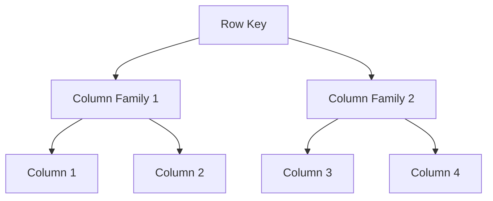
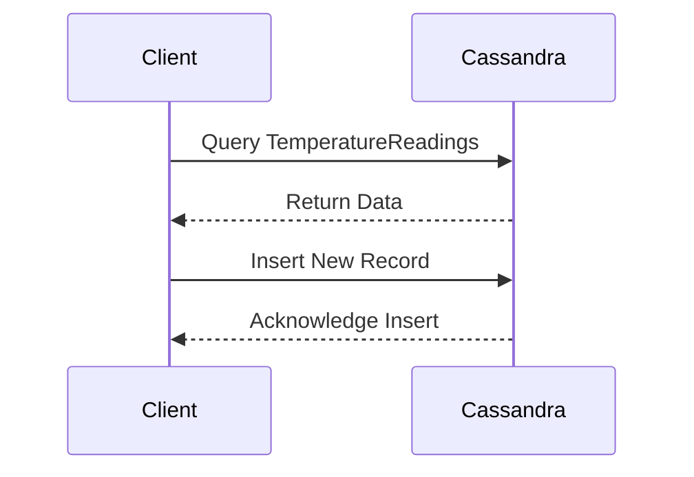

## 14.1.3 Column-Family Stores

Column-Family Stores represent a unique approach to data storage within the NoSQL ecosystem, offering a flexible and efficient way to handle large volumes of structured and semi-structured data. This section delves into the architecture, characteristics, and practical applications of Column-Family Stores, providing expert software engineers and architects with the insights needed to leverage this powerful data model effectively.

### Understanding Column-Family Stores

Column-Family Stores, often associated with databases like Apache Cassandra and HBase, organize data into rows and columns, similar to relational databases. However, they introduce the concept of column families, which group related columns together, allowing for efficient data retrieval and storage.

#### Structure of Column-Family Stores

In a Column-Family Store, data is stored in a schema-less manner, where each row can have a different number of columns. This flexibility is achieved through the use of column families, which are collections of columns that are logically related. Each column family can contain a large number of columns, and new columns can be added dynamically without altering the existing schema.

- **Rows and Columns**: Data is organized into rows, each identified by a unique key. Within each row, columns are stored as key-value pairs.
- **Column Families**: Columns are grouped into families, which are stored together on disk. This grouping allows for efficient read and write operations, as only the relevant column families need to be accessed.



*Diagram: Visualizing the structure of a Column-Family Store, where data is organized into rows and column families.*

### Characteristics of Column-Family Stores

Column-Family Stores are designed to handle large volumes of data across distributed systems, making them ideal for applications that require high availability and scalability.

- **Wide Tables**: Column-Family Stores support wide tables, where rows can have a large number of columns. This is particularly useful for storing sparse data, where not all columns are populated for every row.
- **Efficient Storage**: By grouping related columns into families, Column-Family Stores optimize storage and retrieval operations, reducing the amount of data that needs to be read from disk.
- **Scalability**: These stores are built to scale horizontally, allowing for the addition of more nodes to handle increased data loads and traffic.

### Use Cases for Column-Family Stores

Column-Family Stores are well-suited for a variety of use cases, particularly those involving large datasets and high write throughput.

- **Logging**: The ability to handle wide tables and sparse data makes Column-Family Stores ideal for logging applications, where each log entry may have different attributes.
- **Time-Series Data**: Column-Family Stores excel at storing time-series data, where each row represents a timestamp and columns store various metrics or events.
- **Real-Time Analytics**: The efficient read and write capabilities of Column-Family Stores make them suitable for real-time analytics applications, where data needs to be ingested and queried rapidly.

### Sample Code Snippet

Let's explore a simple example using Apache Cassandra, a popular Column-Family Store. We'll create a table to store time-series data for a weather monitoring application.

```sql
-- Create a keyspace for the application
CREATE KEYSPACE WeatherData WITH REPLICATION = {
  'class': 'SimpleStrategy',
  'replication_factor': 3
};

-- Use the keyspace
USE WeatherData;

-- Create a table to store temperature readings
CREATE TABLE TemperatureReadings (
  station_id UUID,
  timestamp TIMESTAMP,
  temperature FLOAT,
  humidity FLOAT,
  PRIMARY KEY (station_id, timestamp)
);

-- Insert a sample record
INSERT INTO TemperatureReadings (station_id, timestamp, temperature, humidity)
VALUES (uuid(), '2024-11-17 10:00:00', 22.5, 60.0);

-- Query the data
SELECT * FROM TemperatureReadings WHERE station_id = some_uuid;
```

*Code Explanation:*

- **Keyspace**: A keyspace in Cassandra is analogous to a database in SQL systems. It defines the replication strategy and factor.
- **Table Creation**: The `TemperatureReadings` table stores data with a composite primary key, allowing for efficient querying by `station_id` and `timestamp`.
- **Data Insertion**: A sample record is inserted, demonstrating how data is stored in a Column-Family Store.

### Design Considerations

When designing a system using Column-Family Stores, consider the following:

- **Data Model**: Carefully design your data model to take advantage of column families and wide tables. Consider the access patterns and query requirements of your application.
- **Partitioning**: Choose an appropriate partition key to ensure even data distribution across nodes and avoid hotspots.
- **Consistency**: Understand the trade-offs between consistency and availability, as Column-Family Stores often follow the eventual consistency model.

### Differences and Similarities with Other NoSQL Models

Column-Family Stores share some similarities with other NoSQL models, such as Key-Value Stores and Document Stores, but also have distinct differences:

- **Similarities**: Like Key-Value Stores, Column-Family Stores use a key to access data. They also offer schema flexibility similar to Document Stores.
- **Differences**: Unlike Document Stores, which store data in JSON-like documents, Column-Family Stores organize data into rows and columns. They also provide more complex querying capabilities compared to Key-Value Stores.

### Try It Yourself

To deepen your understanding of Column-Family Stores, try modifying the sample code to add new columns to the `TemperatureReadings` table, such as `wind_speed` or `precipitation`. Experiment with different partition keys and observe how they affect query performance.

### Visualizing Data Access Patterns

To further illustrate how data is accessed in a Column-Family Store, consider the following sequence diagram:



*Diagram: Sequence of interactions between a client and a Column-Family Store during data retrieval and insertion.*

### References and Links

For further reading on Column-Family Stores and their applications, consider the following resources:

- [Apache Cassandra Documentation](https://cassandra.apache.org/doc/latest/)
- [HBase Reference Guide](https://hbase.apache.org/book.html)
- [NoSQL Databases Explained](https://www.mongodb.com/nosql-explained)

### Knowledge Check

To reinforce your understanding, consider the following questions:

- What are the key characteristics of Column-Family Stores?
- How do Column-Family Stores differ from traditional relational databases?
- What are some common use cases for Column-Family Stores?

### Embrace the Journey

Remember, mastering Column-Family Stores is just one step in your journey to becoming an expert in database design patterns. As you explore more complex data models and integration patterns, keep experimenting, stay curious, and enjoy the journey!

## Quiz Time!



### What is a key characteristic of Column-Family Stores?

- [x] They support wide tables for sparse data.
- [ ] They require a fixed schema for all rows.
- [ ] They store data in JSON-like documents.
- [ ] They do not support horizontal scaling.

> **Explanation:** Column-Family Stores support wide tables, which are efficient for storing sparse data, allowing each row to have a different number of columns.

### Which of the following is a common use case for Column-Family Stores?

- [x] Logging
- [ ] Storing relational data
- [ ] Document storage
- [ ] Graph data modeling

> **Explanation:** Column-Family Stores are well-suited for logging applications due to their ability to handle wide tables and sparse data.

### How do Column-Family Stores differ from Document Stores?

- [x] Column-Family Stores organize data into rows and columns, while Document Stores use JSON-like documents.
- [ ] Column-Family Stores require a fixed schema, while Document Stores do not.
- [ ] Column-Family Stores do not support complex queries, while Document Stores do.
- [ ] Column-Family Stores are not suitable for time-series data, while Document Stores are.

> **Explanation:** Column-Family Stores organize data into rows and columns, whereas Document Stores use JSON-like documents to store data.

### What is the primary key in the sample code provided for a Column-Family Store?

- [x] (station_id, timestamp)
- [ ] station_id
- [ ] timestamp
- [ ] temperature

> **Explanation:** The primary key in the sample code is a composite key consisting of `station_id` and `timestamp`, allowing for efficient querying.

### Which of the following is a design consideration when using Column-Family Stores?

- [x] Choosing an appropriate partition key
- [ ] Ensuring strict consistency for all operations
- [ ] Using a fixed schema for all data
- [ ] Avoiding the use of wide tables

> **Explanation:** Choosing an appropriate partition key is crucial for ensuring even data distribution and avoiding hotspots in Column-Family Stores.

### What is a similarity between Column-Family Stores and Key-Value Stores?

- [x] Both use a key to access data.
- [ ] Both require a fixed schema.
- [ ] Both store data in JSON-like documents.
- [ ] Both do not support horizontal scaling.

> **Explanation:** Both Column-Family Stores and Key-Value Stores use a key to access data, providing a simple and efficient retrieval mechanism.

### Which of the following is NOT a characteristic of Column-Family Stores?

- [x] They require a fixed schema for all rows.
- [ ] They support wide tables.
- [ ] They allow for dynamic addition of columns.
- [ ] They are designed for high availability and scalability.

> **Explanation:** Column-Family Stores do not require a fixed schema, allowing for dynamic addition of columns and flexibility in data modeling.

### What is the purpose of column families in Column-Family Stores?

- [x] To group related columns together for efficient storage and retrieval
- [ ] To enforce a fixed schema for all data
- [ ] To store data in JSON-like documents
- [ ] To provide a unique identifier for each row

> **Explanation:** Column families group related columns together, optimizing storage and retrieval operations by allowing only the relevant column families to be accessed.

### True or False: Column-Family Stores are suitable for real-time analytics applications.

- [x] True
- [ ] False

> **Explanation:** Column-Family Stores are suitable for real-time analytics applications due to their efficient read and write capabilities and ability to handle large datasets.

### Which of the following databases is an example of a Column-Family Store?

- [x] Apache Cassandra
- [ ] MongoDB
- [ ] Neo4j
- [ ] MySQL

> **Explanation:** Apache Cassandra is a well-known example of a Column-Family Store, designed to handle large volumes of data across distributed systems.


