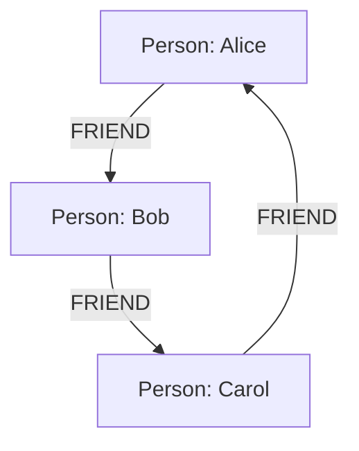

## 14.1.4 Graph Databases

In the ever-evolving landscape of data management, graph databases have emerged as a powerful tool for handling complex relationships and interconnected data. Unlike traditional relational databases that rely on tables and joins, graph databases use nodes and edges to represent entities and their relationships. This structure allows for fast relationship traversal and is particularly suited for applications like social networks and recommendation systems.

### Understanding Graph Databases

Graph databases are a type of NoSQL database designed to treat the relationships between data as equally important as the data itself. They are built upon graph theory, where data is represented as a collection of nodes (entities) and edges (relationships). This model is inherently flexible and can efficiently handle complex queries about relationships.

#### Key Concepts

- **Nodes**: Represent entities such as people, products, or locations. Each node can have properties that describe its characteristics.
- **Edges**: Represent relationships between nodes. Edges can also have properties, such as the type of relationship or its weight.
- **Properties**: Key-value pairs associated with nodes and edges that provide additional information.

### Characteristics of Graph Databases

Graph databases offer several unique characteristics that make them ideal for certain types of applications:

- **Fast Relationship Traversal**: Graph databases are optimized for traversing relationships, making them suitable for queries that involve multiple hops or connections.
- **Schema-less Nature**: Unlike relational databases, graph databases do not require a fixed schema, allowing for more flexibility in data modeling.
- **Efficient Storage and Retrieval**: Graph databases store data in a way that makes it easy to retrieve related information without complex joins.
- **High Performance for Connected Data**: They excel in scenarios where data is highly interconnected, such as social networks or recommendation engines.

### Use Cases for Graph Databases

Graph databases are particularly well-suited for applications that require complex relationship management and analysis:

- **Social Networks**: Graph databases can efficiently model and query social connections, enabling features like friend suggestions and community detection.
- **Recommendation Systems**: By analyzing relationships between users and products, graph databases can provide personalized recommendations.
- **Fraud Detection**: Graph databases can identify patterns and anomalies in transactional data, helping to detect fraudulent activities.
- **Network and IT Operations**: They can model and analyze network topologies, dependencies, and configurations.
- **Knowledge Graphs**: Used to represent and query complex knowledge domains, such as semantic web applications.

### Sample Code Snippet

Let's explore a simple example using a graph database to model a social network. We'll use Cypher, a query language for graph databases like Neo4j.

```cypher
// Create nodes
CREATE (alice:Person {name: 'Alice', age: 30})
CREATE (bob:Person {name: 'Bob', age: 25})
CREATE (carol:Person {name: 'Carol', age: 35})

// Create relationships
CREATE (alice)-[:FRIEND]->(bob)
CREATE (bob)-[:FRIEND]->(carol)
CREATE (carol)-[:FRIEND]->(alice)

// Query to find friends of Alice
MATCH (alice:Person {name: 'Alice'})-[:FRIEND]->(friend)
RETURN friend.name
```

In this example, we create nodes for three people and establish friendships between them. The query retrieves Alice's friends by traversing the `FRIEND` relationships.

### Visualizing Graph Databases

To better understand the structure of graph databases, let's visualize the social network example using a graph diagram.



This diagram illustrates the nodes (Alice, Bob, Carol) and the edges (FRIEND relationships) connecting them.

### Design Considerations

When designing a graph database, consider the following:

- **Data Model**: Identify the entities and relationships in your domain. Determine the properties for nodes and edges.
- **Query Patterns**: Understand the types of queries you need to support. Graph databases excel at traversing relationships, so design your model to take advantage of this capability.
- **Performance**: Graph databases are optimized for certain types of queries, but performance can vary based on the size and complexity of the graph. Consider indexing strategies and query optimization techniques.
- **Scalability**: Evaluate the scalability requirements of your application. Some graph databases offer features like sharding and replication to handle large datasets.

### Differences and Similarities

Graph databases are often compared to other NoSQL databases, such as document or key-value stores. Here are some key differences and similarities:

- **Differences**:
  - Graph databases focus on relationships, while document and key-value stores focus on data storage and retrieval.
  - Graph databases use nodes and edges, whereas document stores use JSON-like documents and key-value stores use simple key-value pairs.

- **Similarities**:
  - Both graph and other NoSQL databases offer schema-less data models, providing flexibility in data representation.
  - They are designed to handle large volumes of data and provide high availability and scalability.

### Try It Yourself

Experiment with the provided Cypher code by adding more nodes and relationships. Try querying different paths and relationships to see how the graph database handles complex queries. Consider using a graph database platform like Neo4j to visualize and interact with your data.

### References and Links

- [Neo4j Documentation](https://neo4j.com/docs/)
- [Graph Databases by O'Reilly](https://www.oreilly.com/library/view/graph-databases/9781491930863/)
- [Cypher Query Language](https://neo4j.com/developer/cypher/)

### Knowledge Check

- What are the main components of a graph database?
- How do graph databases differ from relational databases?
- What are some common use cases for graph databases?

### Embrace the Journey

Graph databases offer a unique approach to handling complex relationships and interconnected data. As you explore this powerful technology, remember that mastering graph databases can unlock new possibilities for your applications. Stay curious, experiment with different data models, and enjoy the journey of discovery.

## Quiz Time!



### What is a key characteristic of graph databases?

- [x] Fast relationship traversal
- [ ] Fixed schema
- [ ] Complex joins
- [ ] Limited scalability

> **Explanation:** Graph databases are optimized for fast relationship traversal, making them ideal for queries involving multiple connections.

### Which of the following is a common use case for graph databases?

- [x] Social networks
- [ ] Financial transactions
- [ ] Simple data storage
- [ ] Static websites

> **Explanation:** Graph databases are well-suited for applications like social networks, where relationships between entities are complex and dynamic.

### What language is commonly used to query graph databases like Neo4j?

- [x] Cypher
- [ ] SQL
- [ ] JSON
- [ ] XML

> **Explanation:** Cypher is a query language designed specifically for graph databases like Neo4j.

### In a graph database, what do nodes represent?

- [x] Entities
- [ ] Relationships
- [ ] Properties
- [ ] Queries

> **Explanation:** Nodes in a graph database represent entities such as people, products, or locations.

### What is the primary focus of graph databases compared to other NoSQL databases?

- [x] Relationships
- [ ] Data storage
- [ ] Transaction management
- [ ] Schema enforcement

> **Explanation:** Graph databases focus on relationships between data, unlike other NoSQL databases that prioritize data storage and retrieval.

### How do graph databases handle schema?

- [x] They are schema-less
- [ ] They require a fixed schema
- [ ] They use XML schemas
- [ ] They enforce strict data types

> **Explanation:** Graph databases are schema-less, allowing for flexible data modeling without a fixed schema.

### What is an edge in a graph database?

- [x] A relationship between nodes
- [ ] A property of a node
- [ ] A type of query
- [ ] A database index

> **Explanation:** An edge in a graph database represents a relationship between two nodes.

### Which of the following is NOT a characteristic of graph databases?

- [ ] Fast relationship traversal
- [ ] Schema-less nature
- [ ] Efficient storage and retrieval
- [x] Complex joins

> **Explanation:** Graph databases do not use complex joins; they use direct relationships between nodes for efficient data retrieval.

### What is a common tool for visualizing graph databases?

- [x] Neo4j
- [ ] MySQL
- [ ] MongoDB
- [ ] PostgreSQL

> **Explanation:** Neo4j is a popular graph database platform that provides tools for visualizing and interacting with graph data.

### True or False: Graph databases are a type of SQL database.

- [ ] True
- [x] False

> **Explanation:** Graph databases are a type of NoSQL database, designed to handle complex relationships and interconnected data.


