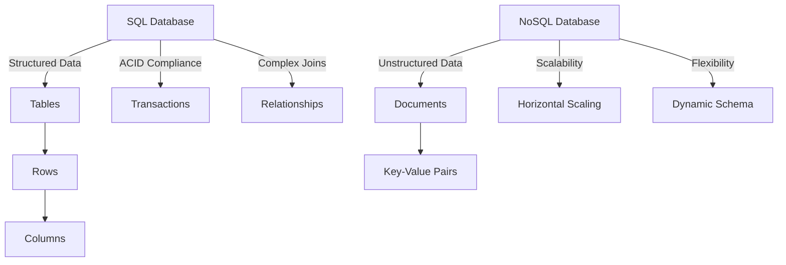

## 14.2 When to Use SQL vs. NoSQL

In the evolving landscape of database technologies, choosing between SQL and NoSQL databases is a critical decision that can significantly impact the architecture and performance of your applications. Understanding the strengths and suitable use cases for each type of database is essential for expert software engineers and architects. This section will guide you through the key considerations and decision factors when selecting between SQL and NoSQL databases.

### Understanding SQL Databases

**SQL (Structured Query Language) databases** are relational databases that use structured schemas to define data models. They are known for their ACID (Atomicity, Consistency, Isolation, Durability) compliance, which ensures reliable transactions and data integrity. SQL databases are ideal for applications that require complex queries, transactions, and data consistency.

#### Strengths of SQL Databases

1. **ACID Compliance**: SQL databases provide strong transactional support, ensuring data integrity and consistency even in the event of system failures.
2. **Complex Joins and Transactions**: They excel at handling complex queries involving multiple tables and relationships, making them suitable for applications with intricate data models.
3. **Structured Data**: SQL databases are designed for structured data with predefined schemas, making them ideal for applications with clear data relationships.

#### Suitable Use Cases for SQL Databases

- **Financial Systems**: Require high levels of data integrity and consistency.
- **Enterprise Resource Planning (ERP) Systems**: Involve complex transactions and data relationships.
- **Customer Relationship Management (CRM) Systems**: Manage structured customer data and interactions.

### Understanding NoSQL Databases

**NoSQL (Not Only SQL) databases** are non-relational databases that provide flexibility in data modeling. They are designed to handle large volumes of unstructured or semi-structured data and offer scalability and performance benefits for specific use cases.

#### Strengths of NoSQL Databases

1. **Scalability**: NoSQL databases are designed to scale horizontally, making them suitable for handling large volumes of data and high traffic loads.
2. **Flexibility with Unstructured Data**: They can store unstructured or semi-structured data, allowing for dynamic schema changes without downtime.
3. **High Performance**: NoSQL databases are optimized for specific data access patterns, providing high performance for read and write operations.

#### Suitable Use Cases for NoSQL Databases

- **Social Media Platforms**: Handle large volumes of rapidly changing unstructured data.
- **Content Management Systems**: Store diverse content types with varying structures.
- **Real-Time Analytics**: Require fast data ingestion and retrieval.

### Decision Factors: SQL vs. NoSQL

Choosing between SQL and NoSQL databases involves evaluating several decision factors based on your application's requirements and constraints.

#### Data Model Complexity

- **SQL Databases**: Best suited for applications with complex data models and relationships. If your application requires intricate joins and transactions, SQL databases provide the necessary capabilities.
- **NoSQL Databases**: Ideal for applications with simple or flexible data models. If your data is unstructured or semi-structured, NoSQL databases offer the flexibility to adapt to changing data requirements.

#### Scalability Needs

- **SQL Databases**: Suitable for applications with moderate scalability requirements. They can scale vertically by adding more resources to a single server.
- **NoSQL Databases**: Designed for applications with high scalability needs. They can scale horizontally by distributing data across multiple servers, making them ideal for handling large volumes of data and high traffic loads.

#### Performance Requirements

- **SQL Databases**: Provide consistent performance for complex queries and transactions. They are optimized for read-heavy workloads with structured data.
- **NoSQL Databases**: Offer high performance for specific data access patterns, such as key-value lookups or document retrieval. They are optimized for write-heavy workloads and real-time data processing.

#### Flexibility and Agility

- **SQL Databases**: Require predefined schemas, which can limit flexibility in adapting to changing data requirements. Schema changes may require downtime or data migration.
- **NoSQL Databases**: Allow for dynamic schema changes without downtime, providing greater flexibility and agility in evolving data models.

### Code Examples: SQL vs. NoSQL

Let's explore some code examples to illustrate the differences between SQL and NoSQL databases.

#### SQL Database Example

Consider a simple SQL database schema for a customer management system:

```sql
-- Create a table for customers
CREATE TABLE Customers (
    CustomerID INT PRIMARY KEY,
    FirstName VARCHAR(50),
    LastName VARCHAR(50),
    Email VARCHAR(100),
    Phone VARCHAR(20)
);

-- Insert a new customer
INSERT INTO Customers (CustomerID, FirstName, LastName, Email, Phone)
VALUES (1, 'John', 'Doe', 'john.doe@example.com', '123-456-7890');

-- Query to retrieve customer information
SELECT * FROM Customers WHERE CustomerID = 1;
```

In this example, we define a structured schema for the `Customers` table and perform a simple query to retrieve customer information.

#### NoSQL Database Example

Consider a NoSQL database using a document-based model for storing customer information:

```json
{
    "CustomerID": 1,
    "FirstName": "John",
    "LastName": "Doe",
    "Email": "john.doe@example.com",
    "Phone": "123-456-7890",
    "Orders": [
        {
            "OrderID": 101,
            "Product": "Laptop",
            "Quantity": 1
        },
        {
            "OrderID": 102,
            "Product": "Mouse",
            "Quantity": 2
        }
    ]
}
```

In this example, customer information is stored as a JSON document, allowing for flexible data structures and nested relationships.

### Visualizing SQL vs. NoSQL

To better understand the differences between SQL and NoSQL databases, let's visualize their architectures and data models.



**Diagram Description**: This diagram illustrates the key differences between SQL and NoSQL databases. SQL databases use structured data models with tables, rows, and columns, and provide ACID compliance and complex joins. NoSQL databases handle unstructured data with documents and key-value pairs, offering scalability and flexibility with dynamic schemas.

### References and Links

- [ACID Properties](https://en.wikipedia.org/wiki/ACID)
- [NoSQL Databases Explained](https://www.mongodb.com/nosql-explained)
- [SQL vs. NoSQL: What's the Difference?](https://www.ibm.com/cloud/blog/sql-vs-nosql)

### Knowledge Check

Let's test your understanding of SQL and NoSQL databases with some questions and exercises.

#### Questions

1. What are the key strengths of SQL databases?
2. When should you consider using a NoSQL database?
3. How do SQL and NoSQL databases differ in terms of scalability?
4. What are the suitable use cases for SQL databases?
5. How do NoSQL databases handle unstructured data?

#### Exercises

1. Design a simple SQL schema for an e-commerce application.
2. Create a JSON document to represent a product catalog in a NoSQL database.
3. Compare the performance of SQL and NoSQL databases for a read-heavy workload.

### Embrace the Journey

Remember, choosing the right database is just the beginning. As you progress, you'll gain deeper insights into the strengths and limitations of SQL and NoSQL databases. Keep experimenting, stay curious, and enjoy the journey!

## Quiz Time!



### What are the key strengths of SQL databases?

- [x] ACID compliance and complex joins
- [ ] Scalability and flexibility
- [ ] Handling unstructured data
- [ ] High performance for write-heavy workloads

> **Explanation:** SQL databases are known for their ACID compliance and ability to handle complex joins and transactions, making them suitable for structured data with clear relationships.

### When should you consider using a NoSQL database?

- [x] For large volumes of unstructured data
- [ ] For applications with complex data models
- [ ] For applications requiring high data integrity
- [ ] For read-heavy workloads

> **Explanation:** NoSQL databases are ideal for handling large volumes of unstructured or semi-structured data, offering scalability and flexibility.

### How do SQL and NoSQL databases differ in terms of scalability?

- [x] SQL databases scale vertically, NoSQL databases scale horizontally
- [ ] SQL databases scale horizontally, NoSQL databases scale vertically
- [ ] Both scale horizontally
- [ ] Both scale vertically

> **Explanation:** SQL databases typically scale vertically by adding resources to a single server, while NoSQL databases scale horizontally by distributing data across multiple servers.

### What are the suitable use cases for SQL databases?

- [x] Financial systems and ERP systems
- [ ] Social media platforms
- [ ] Real-time analytics
- [ ] Content management systems

> **Explanation:** SQL databases are suitable for applications that require high data integrity and complex transactions, such as financial systems and ERP systems.

### How do NoSQL databases handle unstructured data?

- [x] By using flexible data models and dynamic schemas
- [ ] By enforcing strict schemas
- [ ] By using complex joins
- [ ] By providing ACID compliance

> **Explanation:** NoSQL databases handle unstructured data by allowing flexible data models and dynamic schemas, which can adapt to changing data requirements.

### What is a key advantage of NoSQL databases over SQL databases?

- [x] Scalability and flexibility
- [ ] ACID compliance
- [ ] Complex joins
- [ ] Structured data handling

> **Explanation:** NoSQL databases offer scalability and flexibility, making them suitable for handling large volumes of unstructured data and high traffic loads.

### Which database type is optimized for read-heavy workloads?

- [x] SQL databases
- [ ] NoSQL databases
- [ ] Both
- [ ] Neither

> **Explanation:** SQL databases are optimized for read-heavy workloads with structured data, providing consistent performance for complex queries.

### What is a common use case for NoSQL databases?

- [x] Real-time analytics
- [ ] Financial systems
- [ ] ERP systems
- [ ] CRM systems

> **Explanation:** NoSQL databases are commonly used for real-time analytics, where fast data ingestion and retrieval are required.

### How do SQL databases ensure data integrity?

- [x] Through ACID compliance
- [ ] By using dynamic schemas
- [ ] By scaling horizontally
- [ ] By handling unstructured data

> **Explanation:** SQL databases ensure data integrity through ACID compliance, which provides strong transactional support and consistency.

### True or False: NoSQL databases require predefined schemas.

- [ ] True
- [x] False

> **Explanation:** NoSQL databases do not require predefined schemas, allowing for greater flexibility and agility in evolving data models.


