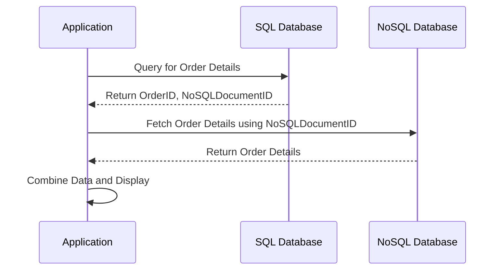

## 14.3 Integrating SQL with NoSQL Databases

In the evolving landscape of data management, integrating SQL and NoSQL databases has become a critical strategy for organizations seeking to leverage the strengths of both systems. SQL databases offer robust transactional support and structured data storage, while NoSQL databases provide flexibility and scalability for unstructured or semi-structured data. This section explores the methodologies, challenges, and best practices for integrating these two paradigms, enabling you to design systems that are both efficient and scalable.

### Understanding the Need for Integration

As data grows in volume and complexity, organizations often find themselves using both SQL and NoSQL databases to meet different needs. SQL databases are ideal for applications requiring ACID (Atomicity, Consistency, Isolation, Durability) transactions and complex queries. In contrast, NoSQL databases excel in handling large volumes of unstructured data, offering horizontal scalability and high availability.

**Key Reasons for Integration:**

- **Diverse Data Requirements**: Applications often need to handle both structured and unstructured data.
- **Scalability Needs**: NoSQL databases provide better scalability for certain workloads.
- **Flexibility**: NoSQL databases offer schema-less data models, which can be advantageous for rapidly changing data structures.
- **Performance**: Combining SQL and NoSQL can optimize performance by leveraging the strengths of each.

### Approaches to Integration

#### Data Linking

Data linking involves storing references between SQL and NoSQL data, allowing applications to access and manipulate data across both systems seamlessly.

**Implementation Steps:**

1. **Identify Relationships**: Determine which entities in your SQL database need to reference data in your NoSQL database.
2. **Create Reference Keys**: Store unique identifiers in your SQL tables that correspond to documents or records in your NoSQL database.
3. **Develop Access Logic**: Implement application logic to retrieve and join data from both databases as needed.

**Example Code:**

```sql
-- SQL Table storing reference to NoSQL document
CREATE TABLE Orders (
    OrderID INT PRIMARY KEY,
    CustomerID INT,
    NoSQLDocumentID VARCHAR(255) -- Reference to NoSQL document
);

-- NoSQL Document Example (MongoDB)
{
    "_id": "5f4d4c4b4f4c4b4d4e4f4c4b",
    "OrderDetails": {
        "ProductID": "12345",
        "Quantity": 2
    }
}
```

**Try It Yourself**: Modify the SQL table to include additional fields that might be relevant for your application, such as timestamps or status indicators.

#### Denormalization

Denormalization involves embedding data from one database into another to reduce the need for cross-database queries, thus improving performance.

**Implementation Steps:**

1. **Identify Frequent Access Patterns**: Determine which data is frequently accessed together.
2. **Embed Data**: Store related data from the NoSQL database directly within SQL tables or vice versa.
3. **Synchronize Updates**: Implement mechanisms to keep embedded data up-to-date.

**Example Code:**

```sql
-- SQL Table with embedded NoSQL data
CREATE TABLE Customers (
    CustomerID INT PRIMARY KEY,
    Name VARCHAR(255),
    Address JSON -- Embedded NoSQL data
);

-- Example JSON data
{
    "street": "123 Elm St",
    "city": "Springfield",
    "state": "IL"
}
```

**Try It Yourself**: Experiment with different JSON structures to see how they can be stored and queried within SQL databases.

### Challenges in Integration

#### Data Consistency

Ensuring data consistency across SQL and NoSQL databases is a significant challenge due to their differing consistency models.

**Strategies:**

- **Eventual Consistency**: Accept that data may not be immediately consistent across systems and design your application to handle this.
- **Two-Phase Commit**: Implement distributed transactions to ensure atomicity, though this can impact performance.

**Example Code:**

```sql
-- Pseudo-code for two-phase commit
BEGIN TRANSACTION;
UPDATE SQLDatabase SET ...;
UPDATE NoSQLDatabase SET ...;
COMMIT TRANSACTION;
```

#### Transaction Management

Handling transactions across SQL and NoSQL databases requires careful planning to ensure atomic operations.

**Strategies:**

- **Compensating Transactions**: Implement logic to undo operations if a transaction fails.
- **Saga Pattern**: Break down transactions into smaller, manageable steps with compensating actions.

**Example Code:**

```sql
-- Pseudo-code for Saga Pattern
BEGIN TRANSACTION;
TRY {
    STEP 1: Update SQLDatabase;
    STEP 2: Update NoSQLDatabase;
} CATCH {
    COMPENSATE: Undo SQLDatabase Update;
}
COMMIT;
```

### Visualizing Integration

To better understand the integration process, let's visualize the data flow between SQL and NoSQL databases using a sequence diagram.



**Diagram Description**: This sequence diagram illustrates the process of querying an SQL database for order details, using a reference to fetch additional data from a NoSQL database, and then combining the results for display.

### Best Practices for Integration

- **Design for Failure**: Assume that network or system failures can occur and design your integration logic to handle them gracefully.
- **Monitor Performance**: Regularly assess the performance of your integrated system and optimize queries and data structures as needed.
- **Use Middleware**: Consider using middleware solutions that abstract the complexity of integrating SQL and NoSQL databases.
- **Document Integration Logic**: Maintain clear documentation of your integration logic to facilitate maintenance and troubleshooting.

### References and Further Reading

- [MongoDB Documentation](https://docs.mongodb.com/)
- [PostgreSQL JSON Functions](https://www.postgresql.org/docs/current/functions-json.html)
- [Distributed Transactions in Microservices](https://microservices.io/patterns/data/transactional-outbox.html)

### Knowledge Check

- **What are the main advantages of integrating SQL and NoSQL databases?**
- **How can data linking be implemented between SQL and NoSQL databases?**
- **What are the challenges of maintaining data consistency across SQL and NoSQL systems?**

### Embrace the Journey

Remember, integrating SQL and NoSQL databases is a journey that requires careful planning and execution. As you explore these integration patterns, you'll gain valuable insights into designing systems that are both robust and flexible. Keep experimenting, stay curious, and enjoy the process!

## Quiz Time!



### What is a primary reason for integrating SQL and NoSQL databases?

- [x] To leverage the strengths of both systems
- [ ] To replace SQL databases entirely
- [ ] To eliminate the need for data modeling
- [ ] To simplify database administration

> **Explanation:** Integrating SQL and NoSQL databases allows organizations to leverage the strengths of both systems, such as robust transactional support and scalability.

### What is data linking in the context of SQL and NoSQL integration?

- [x] Storing references between SQL and NoSQL data
- [ ] Embedding SQL data into NoSQL databases
- [ ] Using SQL queries to access NoSQL data directly
- [ ] Converting SQL data to NoSQL format

> **Explanation:** Data linking involves storing references between SQL and NoSQL data, allowing applications to access and manipulate data across both systems.

### What is a challenge of integrating SQL and NoSQL databases?

- [x] Ensuring data consistency across systems
- [ ] Simplifying database schemas
- [ ] Reducing data storage costs
- [ ] Eliminating the need for transactions

> **Explanation:** Ensuring data consistency across SQL and NoSQL databases is a significant challenge due to their differing consistency models.

### How can denormalization help in SQL and NoSQL integration?

- [x] By embedding data to reduce cross-database queries
- [ ] By normalizing data structures
- [ ] By increasing data redundancy
- [ ] By eliminating the need for indexes

> **Explanation:** Denormalization involves embedding data from one database into another to reduce the need for cross-database queries, thus improving performance.

### What is the Saga Pattern used for in database integration?

- [x] Handling transactions across distributed systems
- [ ] Simplifying database queries
- [ ] Reducing data duplication
- [ ] Improving data visualization

> **Explanation:** The Saga Pattern is used to handle transactions across distributed systems by breaking them into smaller, manageable steps with compensating actions.

### What is a benefit of using middleware in SQL and NoSQL integration?

- [x] Abstracting the complexity of integration
- [ ] Eliminating the need for data consistency
- [ ] Reducing the number of databases needed
- [ ] Simplifying SQL queries

> **Explanation:** Middleware can abstract the complexity of integrating SQL and NoSQL databases, making it easier to manage and maintain the integration logic.

### What is a common strategy for ensuring data consistency in SQL and NoSQL integration?

- [x] Eventual consistency
- [ ] Immediate consistency
- [ ] Data duplication
- [ ] Schema enforcement

> **Explanation:** Eventual consistency is a common strategy for ensuring data consistency across SQL and NoSQL databases, accepting that data may not be immediately consistent.

### What is a key consideration when designing for failure in database integration?

- [x] Handling network or system failures gracefully
- [ ] Eliminating all potential failure points
- [ ] Reducing the number of transactions
- [ ] Simplifying database schemas

> **Explanation:** Designing for failure involves assuming that network or system failures can occur and ensuring that your integration logic can handle them gracefully.

### What is a potential drawback of using two-phase commit in SQL and NoSQL integration?

- [x] It can impact performance
- [ ] It simplifies transaction management
- [ ] It eliminates the need for compensating transactions
- [ ] It reduces data redundancy

> **Explanation:** Implementing distributed transactions with two-phase commit can ensure atomicity but may impact performance due to the overhead involved.

### True or False: Denormalization always improves performance in SQL and NoSQL integration.

- [ ] True
- [x] False

> **Explanation:** While denormalization can improve performance by reducing cross-database queries, it can also lead to data redundancy and complicate data updates.


