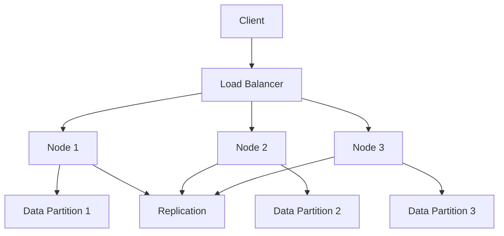

## 14.4 NewSQL Databases and Their Features

In the evolving landscape of database technologies, NewSQL databases have emerged as a compelling solution that bridges the gap between traditional SQL databases and the scalability demands of modern applications. NewSQL databases aim to provide the best of both worlds: the robust ACID (Atomicity, Consistency, Isolation, Durability) properties of SQL databases and the horizontal scalability of NoSQL systems. In this section, we will delve into the defining characteristics of NewSQL databases, explore their architecture, and examine some prominent examples.

### Understanding NewSQL

**Definition**: NewSQL databases are a class of modern relational databases that aim to provide the same scalable performance of NoSQL systems while maintaining the ACID guarantees of traditional SQL databases. They are designed to handle the high transaction rates and large-scale data volumes typical of modern web applications.

#### Key Characteristics of NewSQL Databases

1. **ACID Transactions**: Unlike many NoSQL databases that sacrifice consistency for availability and partition tolerance, NewSQL databases maintain strong consistency through ACID transactions. This ensures data integrity and reliability, which is crucial for applications requiring precise data accuracy.

2. **Distributed Architecture**: NewSQL databases are built on a distributed architecture that allows them to scale horizontally across multiple nodes. This design enables them to handle large volumes of data and high transaction rates efficiently.

3. **SQL Interface**: NewSQL databases provide a familiar SQL interface, making it easier for developers to transition from traditional SQL databases. This compatibility ensures that existing SQL skills and tools can be leveraged.

4. **High Throughput and Low Latency**: By optimizing data distribution and query execution, NewSQL databases achieve high throughput and low latency, making them suitable for real-time applications.

5. **Fault Tolerance and High Availability**: NewSQL systems are designed to be fault-tolerant, ensuring high availability even in the event of node failures. This is achieved through data replication and automated failover mechanisms.

### Architectural Overview

To understand how NewSQL databases achieve their unique capabilities, let's explore their architecture:

#### Distributed Data Storage

NewSQL databases employ a distributed data storage model, where data is partitioned across multiple nodes. This partitioning, often referred to as sharding, allows the database to scale horizontally by adding more nodes to the cluster.

#### Consistency and Replication

NewSQL systems use advanced replication techniques to ensure data consistency across nodes. Some systems, like Google Spanner, use a global clock to achieve strong consistency, while others rely on consensus algorithms like Raft or Paxos.

#### Query Execution and Optimization

NewSQL databases optimize query execution by distributing the workload across nodes. They use sophisticated query planners and optimizers to ensure efficient execution, minimizing latency and maximizing throughput.

#### Fault Tolerance Mechanisms

To achieve high availability, NewSQL databases implement fault tolerance mechanisms such as data replication, automated failover, and self-healing capabilities. These features ensure that the system remains operational even in the face of hardware or network failures.

### Prominent Examples of NewSQL Databases

Let's explore some of the most notable NewSQL databases and their unique features:

#### Google Spanner

- **Overview**: Google Spanner is a globally distributed NewSQL database that offers strong consistency and high availability. It is designed to handle massive amounts of data across multiple regions.
- **Features**:
  - **TrueTime API**: Spanner uses Google's TrueTime API to achieve global consistency. This API provides a globally synchronized clock, allowing Spanner to maintain consistency across distributed nodes.
  - **Horizontal Scalability**: Spanner can scale horizontally by adding more nodes, making it suitable for large-scale applications.
  - **SQL Interface**: Spanner supports a SQL interface, allowing developers to use familiar SQL queries.

#### CockroachDB

- **Overview**: CockroachDB is an open-source NewSQL database designed for high availability and horizontal scalability. It is inspired by Google's Spanner and aims to provide a similar level of consistency and performance.
- **Features**:
  - **Multi-Region Deployment**: CockroachDB supports multi-region deployments, allowing data to be distributed across different geographical locations.
  - **ACID Transactions**: CockroachDB provides strong consistency through ACID transactions, ensuring data integrity.
  - **Fault Tolerance**: The database is designed to be resilient to node failures, with automated failover and data replication.

#### VoltDB

- **Overview**: VoltDB is a NewSQL database that focuses on high-speed transaction processing. It is designed for applications that require real-time analytics and low-latency transactions.
- **Features**:
  - **In-Memory Processing**: VoltDB uses in-memory processing to achieve high-speed transaction execution.
  - **ACID Compliance**: The database provides full ACID compliance, ensuring data consistency and reliability.
  - **Horizontal Scalability**: VoltDB can scale horizontally by adding more nodes to the cluster.

### Code Example: Using CockroachDB

To illustrate the use of a NewSQL database, let's explore a simple example using CockroachDB. We'll create a table, insert some data, and perform a query.

```sql
-- Create a table for storing user information
CREATE TABLE users (
    id SERIAL PRIMARY KEY,
    name STRING NOT NULL,
    email STRING UNIQUE NOT NULL,
    created_at TIMESTAMP DEFAULT current_timestamp()
);

-- Insert some data into the users table
INSERT INTO users (name, email) VALUES
('Alice', 'alice@example.com'),
('Bob', 'bob@example.com'),
('Charlie', 'charlie@example.com');

-- Query the users table to retrieve all users
SELECT * FROM users;
```

In this example, we create a `users` table with columns for `id`, `name`, `email`, and `created_at`. We then insert some sample data and perform a query to retrieve all users. CockroachDB's SQL interface makes it easy to perform these operations using familiar SQL syntax.

### Visualizing NewSQL Architecture

To better understand the architecture of NewSQL databases, let's visualize a typical NewSQL system using a Mermaid.js diagram.



**Diagram Description**: This diagram illustrates a typical NewSQL architecture with a client interacting with a load balancer, which distributes requests to multiple nodes. Each node manages a data partition, and data is replicated across nodes to ensure consistency and fault tolerance.

### Design Considerations

When considering the use of NewSQL databases, it's important to evaluate the following design considerations:

- **Use Cases**: NewSQL databases are ideal for applications that require both strong consistency and horizontal scalability. They are well-suited for real-time analytics, financial transactions, and global applications.
- **Complexity**: While NewSQL databases offer powerful features, they can be complex to set up and manage. Consider the operational overhead and ensure your team has the necessary expertise.
- **Cost**: Evaluate the cost implications of using a NewSQL database, especially if deploying in a cloud environment. Consider factors such as data storage, network bandwidth, and compute resources.

### Differences and Similarities with Other Database Types

NewSQL databases are often compared to traditional SQL and NoSQL databases. Here are some key differences and similarities:

- **Consistency**: NewSQL databases provide strong consistency through ACID transactions, similar to traditional SQL databases. In contrast, many NoSQL databases prioritize availability and partition tolerance over consistency.
- **Scalability**: Like NoSQL databases, NewSQL systems are designed for horizontal scalability. This sets them apart from traditional SQL databases, which often struggle to scale beyond a single node.
- **Query Language**: NewSQL databases use a SQL interface, making them more accessible to developers familiar with SQL. This contrasts with NoSQL databases, which often use proprietary query languages.

### Try It Yourself

To gain hands-on experience with NewSQL databases, try setting up a CockroachDB cluster and experimenting with different queries. Modify the provided code example to add more complex queries, such as joins or aggregations. Explore the impact of scaling the cluster by adding or removing nodes.

### Knowledge Check

- **Question**: What are the key characteristics of NewSQL databases?
- **Question**: How do NewSQL databases achieve strong consistency?
- **Question**: What are some prominent examples of NewSQL databases?
- **Question**: How does the architecture of NewSQL databases enable horizontal scalability?

### Embrace the Journey

Remember, mastering NewSQL databases is a journey. As you explore their features and capabilities, you'll gain valuable insights into building scalable and consistent database solutions. Stay curious, experiment with different configurations, and enjoy the process of learning and discovery.

## Quiz Time!



### What is a defining feature of NewSQL databases?

- [x] They provide SQL-like querying with NoSQL-like scalability.
- [ ] They only support eventual consistency.
- [ ] They do not support ACID transactions.
- [ ] They are limited to single-node deployments.

> **Explanation:** NewSQL databases are designed to combine SQL-like querying with the scalability of NoSQL systems while maintaining ACID transactions.

### Which of the following is a NewSQL database?

- [x] Google Spanner
- [ ] MongoDB
- [ ] Redis
- [ ] Cassandra

> **Explanation:** Google Spanner is a NewSQL database known for its global distribution and strong consistency.

### How do NewSQL databases achieve horizontal scalability?

- [x] By distributing data across multiple nodes
- [ ] By using a single powerful server
- [ ] By limiting the number of transactions
- [ ] By reducing data redundancy

> **Explanation:** NewSQL databases achieve horizontal scalability by distributing data across multiple nodes, allowing them to handle large volumes of data and transactions.

### What is the role of the TrueTime API in Google Spanner?

- [x] To provide a globally synchronized clock for consistency
- [ ] To manage user authentication
- [ ] To optimize query execution
- [ ] To handle data encryption

> **Explanation:** The TrueTime API provides a globally synchronized clock, which is crucial for maintaining consistency across distributed nodes in Google Spanner.

### Which feature of NewSQL databases ensures high availability?

- [x] Fault tolerance mechanisms
- [ ] Single-node architecture
- [ ] Eventual consistency
- [ ] Manual data replication

> **Explanation:** NewSQL databases implement fault tolerance mechanisms such as data replication and automated failover to ensure high availability.

### What type of transactions do NewSQL databases support?

- [x] ACID transactions
- [ ] BASE transactions
- [ ] Eventual transactions
- [ ] None of the above

> **Explanation:** NewSQL databases support ACID transactions, ensuring strong consistency and data integrity.

### Which of the following is NOT a characteristic of NewSQL databases?

- [x] Limited to eventual consistency
- [ ] Distributed architecture
- [ ] SQL interface
- [ ] High throughput

> **Explanation:** NewSQL databases are not limited to eventual consistency; they provide strong consistency through ACID transactions.

### What is a common use case for NewSQL databases?

- [x] Real-time analytics
- [ ] Simple key-value storage
- [ ] Static content delivery
- [ ] Single-user applications

> **Explanation:** NewSQL databases are well-suited for real-time analytics due to their high throughput and low latency.

### How do NewSQL databases differ from traditional SQL databases?

- [x] They offer horizontal scalability
- [ ] They do not support SQL queries
- [ ] They lack ACID compliance
- [ ] They are limited to single-node deployments

> **Explanation:** NewSQL databases offer horizontal scalability, which is a key difference from traditional SQL databases that often struggle to scale beyond a single node.

### True or False: NewSQL databases are designed to sacrifice consistency for scalability.

- [ ] True
- [x] False

> **Explanation:** False. NewSQL databases are designed to provide both scalability and strong consistency through ACID transactions.


