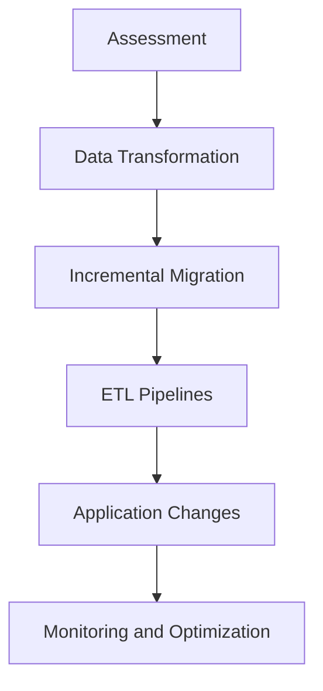

## 14.5 Migrating Between SQL and NoSQL

Migrating between SQL and NoSQL databases is a complex process that requires careful planning and execution. This section provides a comprehensive guide to understanding the strategies, tools, and challenges involved in this transition. Whether you're looking to leverage the scalability of NoSQL or need to accommodate new data models, this guide will help you navigate the migration process effectively.

### Introduction

As the landscape of data management evolves, organizations often find themselves needing to transition between different types of databases. SQL databases, known for their structured data and ACID (Atomicity, Consistency, Isolation, Durability) properties, have been the backbone of data storage for decades. However, the rise of NoSQL databases offers new opportunities for handling unstructured data, scalability, and flexibility.

Migrating from SQL to NoSQL involves several key considerations, including data model transformation, application changes, and the potential loss of ACID properties. This guide will walk you through the essential steps and best practices for a successful migration.

### Strategies for Migration

#### Assessment

Before embarking on a migration journey, it's crucial to assess your current data models and access patterns. This involves understanding the structure of your existing SQL database and how your applications interact with it. Key steps include:

- **Analyze Data Models**: Examine the tables, relationships, and constraints in your SQL database. Identify which aspects can be directly mapped to NoSQL and which require transformation.
- **Evaluate Access Patterns**: Determine how your applications query and update the database. This will help you choose the appropriate NoSQL model (e.g., document, key-value, column-family, or graph) that best suits your needs.

#### Data Transformation

Mapping relational schemas to NoSQL models is a critical step in the migration process. Unlike SQL databases, NoSQL databases do not adhere to a fixed schema, allowing for more flexible data storage. However, this flexibility requires careful planning to ensure data integrity and consistency.

- **Schema Mapping**: Convert tables and relationships into NoSQL structures. For example, a table with a one-to-many relationship might be represented as a nested document in a document-based NoSQL database.
- **Data Denormalization**: NoSQL databases often benefit from denormalized data models, where related data is stored together to optimize read performance. This may involve duplicating data across multiple documents or collections.

#### Incremental Migration

To minimize risk and ensure a smooth transition, consider an incremental migration approach. This involves gradually moving components of your application to the new database, allowing you to test and validate each step before proceeding.

- **Phased Rollout**: Start by migrating non-critical components or a subset of your data. Monitor performance and address any issues before expanding the migration.
- **Dual-Write Strategy**: During the transition, consider writing data to both the SQL and NoSQL databases. This ensures data consistency and allows you to switch back if necessary.

### Tools for Migration

#### ETL Pipelines

Extract, Transform, Load (ETL) processes are essential tools for migrating data between SQL and NoSQL databases. ETL pipelines automate the extraction of data from the source database, transform it into the desired format, and load it into the target database.

- **Data Extraction**: Use SQL queries to extract data from the source database. Ensure that all necessary data is captured, including metadata and relationships.
- **Data Transformation**: Convert the extracted data into the appropriate NoSQL format. This may involve restructuring data, converting data types, and applying business logic.
- **Data Loading**: Load the transformed data into the NoSQL database. Use batch processing to optimize performance and minimize downtime.

### Challenges of Migration

#### Loss of ACID Properties

One of the primary challenges of migrating from SQL to NoSQL is the potential loss of ACID properties. NoSQL databases often prioritize availability and partition tolerance over strict consistency, leading to eventual consistency models.

- **Adjusting Consistency Models**: Understand the consistency guarantees provided by your chosen NoSQL database. Implement strategies to handle eventual consistency, such as conflict resolution and data reconciliation.
- **Transaction Management**: NoSQL databases may not support multi-document transactions. Consider redesigning your application logic to accommodate this limitation.

#### Application Changes

Migrating to a NoSQL database often requires significant changes to your application code. This includes modifying data access logic, query syntax, and transaction handling.

- **Refactor Data Access Layer**: Update your application's data access layer to interact with the NoSQL database. This may involve using new APIs or libraries specific to the NoSQL platform.
- **Redesign Queries**: Rewrite SQL queries to match the query language and capabilities of the NoSQL database. This may involve using map-reduce functions or aggregation pipelines.

### Code Examples

Let's explore a simple example of migrating a SQL table to a NoSQL document model.

#### SQL Table

```sql
CREATE TABLE Orders (
    OrderID INT PRIMARY KEY,
    CustomerID INT,
    OrderDate DATE,
    TotalAmount DECIMAL(10, 2)
);

CREATE TABLE OrderItems (
    OrderItemID INT PRIMARY KEY,
    OrderID INT,
    ProductID INT,
    Quantity INT,
    Price DECIMAL(10, 2),
    FOREIGN KEY (OrderID) REFERENCES Orders(OrderID)
);
```

#### NoSQL Document Model

```json
{
    "OrderID": 1,
    "CustomerID": 123,
    "OrderDate": "2024-11-17",
    "TotalAmount": 250.00,
    "OrderItems": [
        {
            "ProductID": 456,
            "Quantity": 2,
            "Price": 50.00
        },
        {
            "ProductID": 789,
            "Quantity": 3,
            "Price": 50.00
        }
    ]
}
```

In this example, the `Orders` and `OrderItems` tables are combined into a single document, with `OrderItems` represented as an array of nested objects. This denormalized structure is common in NoSQL databases and optimizes read performance by reducing the need for joins.

### Visualizing the Migration Process

Below is a flowchart illustrating the migration process from SQL to NoSQL:



**Description**: This flowchart outlines the key steps in migrating from SQL to NoSQL, starting with assessment and ending with monitoring and optimization.

### Knowledge Check

- **Question**: What are the key differences between SQL and NoSQL databases?
- **Question**: How can you ensure data consistency when migrating to a NoSQL database?
- **Question**: What are the benefits of using an incremental migration approach?

### Embrace the Journey

Migrating between SQL and NoSQL databases is a journey that requires careful planning and execution. Remember, this is just the beginning. As you progress, you'll gain valuable insights and experience that will help you tackle more complex data management challenges. Keep experimenting, stay curious, and enjoy the journey!

### References and Links

- [MongoDB Documentation](https://docs.mongodb.com/)
- [Cassandra Documentation](https://cassandra.apache.org/doc/latest/)
- [AWS Database Migration Service](https://aws.amazon.com/dms/)
- [Google Cloud Dataflow](https://cloud.google.com/dataflow)

## Quiz Time!



### What is the first step in migrating from SQL to NoSQL?

- [x] Assessment
- [ ] Data Transformation
- [ ] Incremental Migration
- [ ] Application Changes

> **Explanation:** Assessment is the first step, where you analyze data models and access patterns.

### Which of the following is a common NoSQL data model?

- [x] Document
- [ ] Table
- [ ] Row
- [ ] Column

> **Explanation:** Document is a common NoSQL data model, unlike tables and rows which are SQL concepts.

### What is a key challenge when migrating to NoSQL?

- [x] Loss of ACID Properties
- [ ] Increased Storage Costs
- [ ] Lack of Scalability
- [ ] Complex Query Language

> **Explanation:** Loss of ACID properties is a key challenge due to different consistency models in NoSQL.

### What does ETL stand for?

- [x] Extract, Transform, Load
- [ ] Evaluate, Test, Launch
- [ ] Execute, Transfer, Log
- [ ] Edit, Translate, Link

> **Explanation:** ETL stands for Extract, Transform, Load, a process used in data migration.

### Which strategy involves writing data to both SQL and NoSQL databases during migration?

- [x] Dual-Write Strategy
- [ ] Single-Write Strategy
- [ ] Multi-Write Strategy
- [ ] Parallel-Write Strategy

> **Explanation:** The Dual-Write Strategy involves writing data to both databases to ensure consistency.

### What is a benefit of denormalizing data in NoSQL?

- [x] Optimized Read Performance
- [ ] Reduced Data Redundancy
- [ ] Simplified Data Structure
- [ ] Enhanced Security

> **Explanation:** Denormalizing data in NoSQL optimizes read performance by reducing the need for joins.

### Which tool is commonly used for data transformation during migration?

- [x] ETL Pipelines
- [ ] SQL Queries
- [ ] NoSQL Queries
- [ ] Data Warehouses

> **Explanation:** ETL Pipelines are used for data transformation during migration.

### What is a common method for handling eventual consistency in NoSQL?

- [x] Conflict Resolution
- [ ] Data Normalization
- [ ] Schema Enforcement
- [ ] Indexing

> **Explanation:** Conflict Resolution is a method for handling eventual consistency in NoSQL.

### True or False: NoSQL databases always support multi-document transactions.

- [ ] True
- [x] False

> **Explanation:** NoSQL databases do not always support multi-document transactions, which can be a limitation.

### What is the purpose of the assessment phase in migration?

- [x] To analyze data models and access patterns
- [ ] To load data into the NoSQL database
- [ ] To transform data into NoSQL format
- [ ] To refactor application code

> **Explanation:** The assessment phase is for analyzing data models and access patterns to plan the migration.


