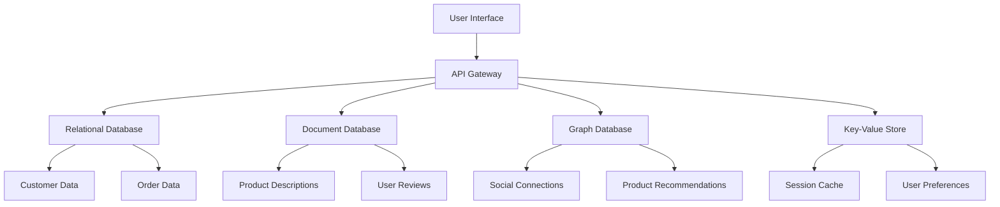
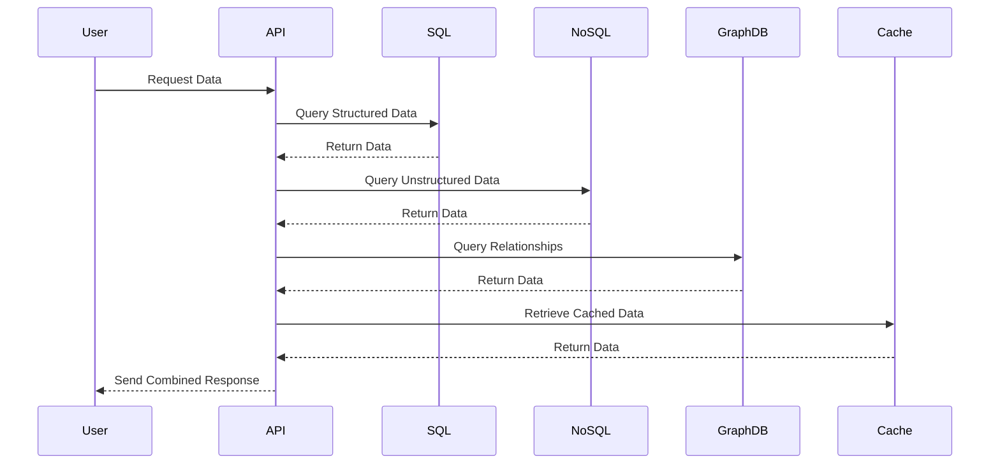

## 14.6 Polyglot Persistence in Modern Applications

In today's rapidly evolving technological landscape, applications are required to handle diverse data types and workloads. This has led to the emergence of **polyglot persistence**, a strategy that involves using multiple database technologies within a single application to best meet the varied data storage and processing needs. This approach allows developers to leverage the strengths of different databases, optimizing for performance, scalability, and flexibility.

### Understanding Polyglot Persistence

**Polyglot persistence** is a term derived from the concept of polyglot programming, where multiple programming languages are used within a single application. Similarly, polyglot persistence involves using different database technologies to handle different types of data and workloads. This approach acknowledges that no single database can efficiently handle all types of data storage and retrieval needs.

#### Key Concepts

- **Optimized Storage**: Different databases are optimized for different types of data. For example, a relational database like SQL is excellent for structured data with complex relationships, while a NoSQL database like MongoDB is better suited for unstructured or semi-structured data.
- **Performance**: By choosing the right database for each type of data, applications can achieve better performance and efficiency. For instance, using a graph database for social network data can significantly improve query performance compared to a relational database.
- **Scalability**: Polyglot persistence allows applications to scale more effectively by distributing data across multiple databases, each optimized for specific workloads.

### Benefits of Polyglot Persistence

1. **Optimized Storage**: By selecting the most appropriate database technology for each data type, applications can achieve more efficient storage and retrieval. This leads to reduced storage costs and improved performance.

2. **Improved Performance**: Different databases are designed to handle specific types of queries and workloads. By using the right database for each task, applications can achieve faster query execution and better overall performance.

3. **Flexibility**: Polyglot persistence provides the flexibility to choose the best database technology for each use case, allowing developers to adapt to changing requirements and technologies.

4. **Scalability**: By distributing data across multiple databases, applications can scale more effectively, handling increased loads and larger datasets without sacrificing performance.

5. **Resilience**: Using multiple databases can increase system resilience, as the failure of one database does not necessarily impact the entire application.

### Considerations for Implementing Polyglot Persistence

While polyglot persistence offers many benefits, it also introduces complexity and challenges that must be carefully managed.

#### Complexity

- **System Complexity**: Managing multiple databases increases the complexity of the system architecture. Developers must be familiar with different database technologies and their integration points.
- **Operational Overhead**: Maintaining multiple databases requires additional operational resources, including monitoring, backups, and updates.

#### Data Integration

- **Data Consistency**: Ensuring data consistency across multiple databases can be challenging, especially when dealing with distributed systems.
- **Data Flow**: Seamless data flow between different databases is crucial for maintaining data integrity and ensuring that applications can access the data they need.

#### Security

- **Security Management**: Each database technology may have different security requirements and configurations, adding complexity to the overall security management.

### Best Practices for Polyglot Persistence

1. **Evaluate Data Needs**: Before implementing polyglot persistence, evaluate the data needs of your application. Identify the types of data you need to store and the workloads you need to support.

2. **Choose the Right Databases**: Select the most appropriate database technologies for each type of data and workload. Consider factors such as data structure, query patterns, and scalability requirements.

3. **Plan for Data Integration**: Develop a strategy for integrating data across multiple databases. Consider using data integration tools or middleware to facilitate seamless data flow.

4. **Ensure Data Consistency**: Implement mechanisms to ensure data consistency across databases. This may involve using distributed transactions, eventual consistency models, or data synchronization techniques.

5. **Monitor and Optimize**: Continuously monitor the performance of your databases and optimize them as needed. Use performance monitoring tools to identify bottlenecks and areas for improvement.

6. **Security and Compliance**: Ensure that all databases are configured securely and comply with relevant regulations and standards. Implement access controls and encryption where necessary.

### Sample Architecture: Polyglot Persistence in Action

Let's consider an example of a modern e-commerce application that uses polyglot persistence to optimize data storage and performance.

#### Architecture Overview

- **Relational Database (SQL)**: Used for storing structured data such as customer information, orders, and product catalogs. SQL databases are ideal for handling complex queries and maintaining data integrity through ACID transactions.

- **Document Database (NoSQL)**: Used for storing unstructured data such as product descriptions, reviews, and user-generated content. Document databases like MongoDB are well-suited for handling large volumes of unstructured data.

- **Graph Database**: Used for managing relationships between entities, such as social connections, product recommendations, and user interactions. Graph databases like Neo4j provide efficient querying of complex relationships.

- **Key-Value Store**: Used for caching frequently accessed data, such as session information and user preferences. Key-value stores like Redis offer fast read and write operations, making them ideal for caching.

#### Diagram: Polyglot Persistence Architecture



*Diagram: An example architecture of a polyglot persistence system in a modern e-commerce application.*

### Code Example: Integrating Multiple Databases

Let's explore a code example that demonstrates how to integrate multiple databases within a single application using a Node.js backend.

```javascript
// Import necessary libraries
const mysql = require('mysql');
const mongoose = require('mongoose');
const neo4j = require('neo4j-driver');
const redis = require('redis');

// Connect to MySQL (Relational Database)
const sqlConnection = mysql.createConnection({
  host: 'localhost',
  user: 'root',
  password: 'password',
  database: 'ecommerce'
});

// Connect to MongoDB (Document Database)
mongoose.connect('mongodb://localhost:27017/ecommerce', { useNewUrlParser: true, useUnifiedTopology: true });

// Connect to Neo4j (Graph Database)
const neo4jDriver = neo4j.driver('bolt://localhost', neo4j.auth.basic('neo4j', 'password'));

// Connect to Redis (Key-Value Store)
const redisClient = redis.createClient();

// Function to fetch customer data from MySQL
function getCustomerData(customerId) {
  return new Promise((resolve, reject) => {
    sqlConnection.query('SELECT * FROM customers WHERE id = ?', [customerId], (error, results) => {
      if (error) return reject(error);
      resolve(results[0]);
    });
  });
}

// Function to fetch product descriptions from MongoDB
function getProductDescription(productId) {
  return mongoose.model('Product').findById(productId).exec();
}

// Function to fetch social connections from Neo4j
async function getSocialConnections(userId) {
  const session = neo4jDriver.session();
  const result = await session.run('MATCH (u:User {id: $userId})-[:FRIEND]->(f) RETURN f', { userId });
  session.close();
  return result.records.map(record => record.get('f'));
}

// Function to get session data from Redis
function getSessionData(sessionId) {
  return new Promise((resolve, reject) => {
    redisClient.get(sessionId, (error, data) => {
      if (error) return reject(error);
      resolve(JSON.parse(data));
    });
  });
}

// Example usage
(async () => {
  try {
    const customer = await getCustomerData(1);
    const productDescription = await getProductDescription('60d5f9b5f9b5f9b5f9b5f9b5');
    const socialConnections = await getSocialConnections('user123');
    const sessionData = await getSessionData('session123');

    console.log('Customer:', customer);
    console.log('Product Description:', productDescription);
    console.log('Social Connections:', socialConnections);
    console.log('Session Data:', sessionData);
  } catch (error) {
    console.error('Error:', error);
  }
})();
```

*Code Example: Integrating multiple databases in a Node.js application.*

### Try It Yourself

Experiment with the code example by modifying the database connections and queries. Try adding a new database technology, such as a time-series database for handling time-based data, and integrate it into the application.

### Visualizing Data Flow in Polyglot Persistence

Understanding the data flow in a polyglot persistence system is crucial for ensuring seamless integration and performance optimization.

#### Diagram: Data Flow in Polyglot Persistence



*Diagram: Data flow in a polyglot persistence system, illustrating how different databases are queried to fulfill a user request.*

### Challenges and Solutions

Implementing polyglot persistence comes with its own set of challenges. Here are some common challenges and potential solutions:

1. **Data Consistency**: Ensuring data consistency across multiple databases can be challenging. Consider using distributed transactions or eventual consistency models to manage consistency.

2. **Data Integration**: Seamless data integration is crucial for maintaining data integrity. Use data integration tools or middleware to facilitate data flow between databases.

3. **Security Management**: Managing security across multiple databases can be complex. Implement centralized security management and ensure that all databases comply with security standards.

4. **Operational Overhead**: Maintaining multiple databases requires additional resources. Automate routine tasks such as backups and monitoring to reduce operational overhead.

### Knowledge Check

- **Question**: What is polyglot persistence, and why is it used in modern applications?
- **Question**: What are the benefits of using polyglot persistence?
- **Question**: What are some challenges associated with implementing polyglot persistence?
- **Question**: How can data consistency be maintained across multiple databases in a polyglot persistence system?

### Conclusion

Polyglot persistence is a powerful strategy for optimizing data storage and performance in modern applications. By leveraging the strengths of different database technologies, developers can build applications that are more efficient, scalable, and flexible. However, implementing polyglot persistence requires careful planning and management to address the associated challenges. As you continue your journey in mastering SQL design patterns, remember to embrace the diversity of database technologies and explore the possibilities that polyglot persistence offers.

## Quiz Time!



### What is polyglot persistence?

- [x] Using multiple database technologies within a single application
- [ ] Using a single database technology for all data types
- [ ] Using multiple programming languages in an application
- [ ] Using a single programming language for all applications

> **Explanation:** Polyglot persistence involves using multiple database technologies within a single application to optimize for different data types and workloads.

### What is a key benefit of polyglot persistence?

- [x] Optimized storage for different data types
- [ ] Reduced system complexity
- [ ] Single point of failure
- [ ] Limited scalability

> **Explanation:** Polyglot persistence allows for optimized storage by selecting the best database technology for each data type, improving performance and efficiency.

### Which of the following is a challenge of polyglot persistence?

- [x] Increased system complexity
- [ ] Improved data consistency
- [ ] Simplified security management
- [ ] Reduced operational overhead

> **Explanation:** Managing multiple databases increases system complexity, requiring careful planning and management.

### How can data consistency be maintained in a polyglot persistence system?

- [x] Using distributed transactions
- [ ] Ignoring data consistency
- [ ] Using a single database for all data
- [ ] Avoiding data integration

> **Explanation:** Distributed transactions or eventual consistency models can help maintain data consistency across multiple databases.

### What is a common use case for a graph database in polyglot persistence?

- [x] Managing relationships between entities
- [ ] Storing unstructured data
- [ ] Caching frequently accessed data
- [ ] Handling time-series data

> **Explanation:** Graph databases are ideal for managing relationships between entities, such as social connections and product recommendations.

### What is the role of a key-value store in polyglot persistence?

- [x] Caching frequently accessed data
- [ ] Storing structured data
- [ ] Managing complex relationships
- [ ] Handling large volumes of unstructured data

> **Explanation:** Key-value stores like Redis are used for caching frequently accessed data, offering fast read and write operations.

### Which database technology is best suited for storing structured data with complex relationships?

- [x] Relational Database (SQL)
- [ ] Document Database (NoSQL)
- [ ] Graph Database
- [ ] Key-Value Store

> **Explanation:** Relational databases are ideal for storing structured data with complex relationships, supporting ACID transactions and complex queries.

### What is a potential solution for managing security across multiple databases?

- [x] Centralized security management
- [ ] Ignoring security standards
- [ ] Using a single database for all data
- [ ] Avoiding access controls

> **Explanation:** Centralized security management ensures that all databases comply with security standards and simplifies security management.

### What is a benefit of using a document database in polyglot persistence?

- [x] Handling large volumes of unstructured data
- [ ] Managing complex relationships
- [ ] Caching frequently accessed data
- [ ] Storing structured data with complex relationships

> **Explanation:** Document databases like MongoDB are well-suited for handling large volumes of unstructured or semi-structured data.

### True or False: Polyglot persistence can increase system resilience.

- [x] True
- [ ] False

> **Explanation:** Using multiple databases can increase system resilience, as the failure of one database does not necessarily impact the entire application.



Remember, this is just the beginning. As you progress, you'll build more complex and interactive systems. Keep experimenting, stay curious, and enjoy the journey!
