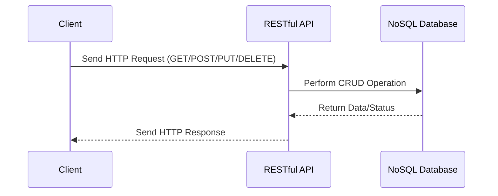

## 14.7 Query Languages and APIs for NoSQL Databases

In the evolving landscape of data management, NoSQL databases have emerged as a powerful alternative to traditional relational databases, offering flexibility, scalability, and performance for specific use cases. A key aspect of working with NoSQL databases is understanding their query languages and APIs, which differ significantly from SQL. In this section, we will explore the various query languages and APIs used in NoSQL databases, their unique features, and how they compare to SQL.

### Understanding NoSQL Query Languages

NoSQL databases come in various types, including document stores, key-value stores, column-family stores, and graph databases. Each type has its own query language or API, designed to leverage the specific data model and capabilities of the database.

#### Cassandra Query Language (CQL)

Cassandra Query Language (CQL) is a SQL-like language used to interact with Apache Cassandra, a distributed column-family store. CQL provides a familiar syntax for those accustomed to SQL, but it is tailored to Cassandra's architecture and data model.

**Key Features of CQL:**

- **Schema Definition**: CQL allows you to define tables, columns, and data types, similar to SQL's DDL (Data Definition Language).
- **Data Manipulation**: You can perform CRUD (Create, Read, Update, Delete) operations using CQL.
- **Batch Operations**: CQL supports batch statements to execute multiple queries atomically.

**Sample CQL Code:**

```sql
-- Create a keyspace
CREATE KEYSPACE IF NOT EXISTS my_keyspace WITH REPLICATION = {
  'class': 'SimpleStrategy',
  'replication_factor': 3
};

-- Create a table
CREATE TABLE my_keyspace.users (
  user_id UUID PRIMARY KEY,
  name TEXT,
  email TEXT
);

-- Insert data
INSERT INTO my_keyspace.users (user_id, name, email) VALUES (uuid(), 'Alice', 'alice@example.com');

-- Query data
SELECT * FROM my_keyspace.users WHERE user_id = some_uuid;
```

#### MongoDB Query Language

MongoDB, a popular document store, uses a JSON-based query language that allows for flexible and dynamic queries. MongoDB's query language is designed to work with its BSON (Binary JSON) data format.

**Key Features of MongoDB Query Language:**

- **Dynamic Queries**: MongoDB supports complex queries with nested fields and arrays.
- **Aggregation Framework**: Provides powerful data aggregation capabilities.
- **Indexing**: Supports various types of indexes to optimize query performance.

**Sample MongoDB Query:**

```javascript
// Insert a document
db.users.insertOne({
  user_id: ObjectId(),
  name: "Bob",
  email: "bob@example.com",
  interests: ["reading", "hiking"]
});

// Query documents
db.users.find({ name: "Bob" });

// Aggregation example
db.users.aggregate([
  { $match: { interests: "reading" } },
  { $group: { _id: "$interests", count: { $sum: 1 } } }
]);
```

### APIs for NoSQL Databases

APIs play a crucial role in accessing and manipulating data in NoSQL databases. They provide the interface through which applications interact with the database.

#### RESTful APIs

RESTful APIs are a common way to interact with NoSQL databases over HTTP. They provide a standardized way to perform CRUD operations using HTTP methods like GET, POST, PUT, and DELETE.

**Example of a RESTful API Interaction:**

```http
GET /api/users HTTP/1.1
Host: example.com
Accept: application/json

POST /api/users HTTP/1.1
Host: example.com
Content-Type: application/json

{
  "name": "Charlie",
  "email": "charlie@example.com"
}
```

#### Native Drivers

Most NoSQL databases offer native drivers for various programming languages, providing a more direct and efficient way to interact with the database. These drivers are often preferred for their performance and feature set.

**Example of Using a Native Driver (Node.js with MongoDB):**

```javascript
const { MongoClient } = require('mongodb');

async function main() {
  const uri = "mongodb+srv://<username>:<password>@cluster0.mongodb.net/myFirstDatabase?retryWrites=true&w=majority";
  const client = new MongoClient(uri);

  try {
    await client.connect();
    const database = client.db('sample_mflix');
    const movies = database.collection('movies');

    // Query for a movie
    const query = { title: "Back to the Future" };
    const movie = await movies.findOne(query);
    console.log(movie);
  } finally {
    await client.close();
  }
}

main().catch(console.error);
```

### Differences from SQL

NoSQL query languages and APIs differ from SQL in several key ways:

- **Flexibility**: NoSQL databases often have less strict schemas, allowing for more dynamic and flexible data models.
- **Functionality**: The complexity and capabilities of NoSQL query languages can vary widely, with some offering advanced features like aggregation and indexing, while others focus on simplicity and speed.
- **Scalability**: NoSQL databases are designed to scale horizontally, often sacrificing some ACID (Atomicity, Consistency, Isolation, Durability) properties for performance and scalability.

### Visualizing NoSQL Query Language Architecture

To better understand how NoSQL query languages and APIs fit into the overall architecture, let's visualize the interaction between a client application and a NoSQL database using a RESTful API.



**Diagram Description:** This sequence diagram illustrates the interaction between a client application and a NoSQL database through a RESTful API. The client sends an HTTP request to the API, which then performs the corresponding CRUD operation on the database. The database returns the result to the API, which sends an HTTP response back to the client.

### Try It Yourself

Experiment with the provided code examples by modifying the queries or data structures. For instance, try adding new fields to the MongoDB documents or creating additional tables in Cassandra. Observe how the query languages handle these changes and explore the flexibility they offer.

### References and Links

- [MongoDB Documentation](https://docs.mongodb.com/)
- [Cassandra Documentation](https://cassandra.apache.org/doc/latest/)
- [RESTful API Design](https://restfulapi.net/)

### Knowledge Check

- What are the key differences between CQL and SQL?
- How does MongoDB's query language handle nested fields?
- What are the advantages of using native drivers over RESTful APIs?

### Embrace the Journey

Remember, mastering NoSQL query languages and APIs is a journey. As you explore these technologies, you'll gain a deeper understanding of their strengths and limitations. Keep experimenting, stay curious, and enjoy the process!

## Quiz Time!



### What is a key feature of Cassandra Query Language (CQL)?

- [x] SQL-like syntax
- [ ] JSON-based queries
- [ ] Graph traversal capabilities
- [ ] Full-text search

> **Explanation:** CQL uses a SQL-like syntax tailored for Cassandra's architecture.

### Which NoSQL database uses a JSON-based query language?

- [ ] Cassandra
- [x] MongoDB
- [ ] Neo4j
- [ ] Redis

> **Explanation:** MongoDB uses a JSON-based query language to interact with its BSON data format.

### What is a common method for interacting with NoSQL databases over HTTP?

- [ ] Native Drivers
- [x] RESTful APIs
- [ ] SQL Queries
- [ ] GraphQL

> **Explanation:** RESTful APIs provide a standardized way to perform CRUD operations over HTTP.

### What is an advantage of using native drivers for NoSQL databases?

- [x] Direct and efficient interaction
- [ ] Requires HTTP requests
- [ ] Limited to one programming language
- [ ] Only supports read operations

> **Explanation:** Native drivers offer direct and efficient interaction with the database, often providing better performance.

### How do NoSQL databases typically handle schemas?

- [x] Less strict schemas
- [ ] Fixed schemas
- [ ] No schemas
- [ ] Only JSON schemas

> **Explanation:** NoSQL databases often have less strict schemas, allowing for more dynamic data models.

### What is a key difference between NoSQL and SQL databases?

- [x] NoSQL often sacrifices some ACID properties for scalability
- [ ] SQL databases are always faster
- [ ] NoSQL databases cannot handle large datasets
- [ ] SQL databases do not support indexing

> **Explanation:** NoSQL databases are designed to scale horizontally and may sacrifice some ACID properties for performance.

### Which of the following is a feature of MongoDB's aggregation framework?

- [x] Data aggregation capabilities
- [ ] Only supports simple queries
- [ ] Requires SQL syntax
- [ ] Limited to single document operations

> **Explanation:** MongoDB's aggregation framework provides powerful data aggregation capabilities.

### What is a benefit of using RESTful APIs with NoSQL databases?

- [x] Standardized CRUD operations over HTTP
- [ ] Requires a specific programming language
- [ ] Only supports read operations
- [ ] Limited to document stores

> **Explanation:** RESTful APIs provide a standardized way to perform CRUD operations over HTTP, making them versatile for various applications.

### How can you perform batch operations in Cassandra?

- [x] Using batch statements
- [ ] Using JSON queries
- [ ] Through RESTful APIs
- [ ] With native drivers only

> **Explanation:** CQL supports batch statements to execute multiple queries atomically.

### True or False: NoSQL databases are designed to scale vertically.

- [ ] True
- [x] False

> **Explanation:** NoSQL databases are designed to scale horizontally, distributing data across multiple nodes.


