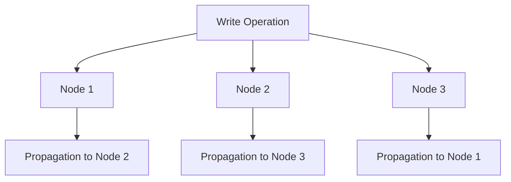
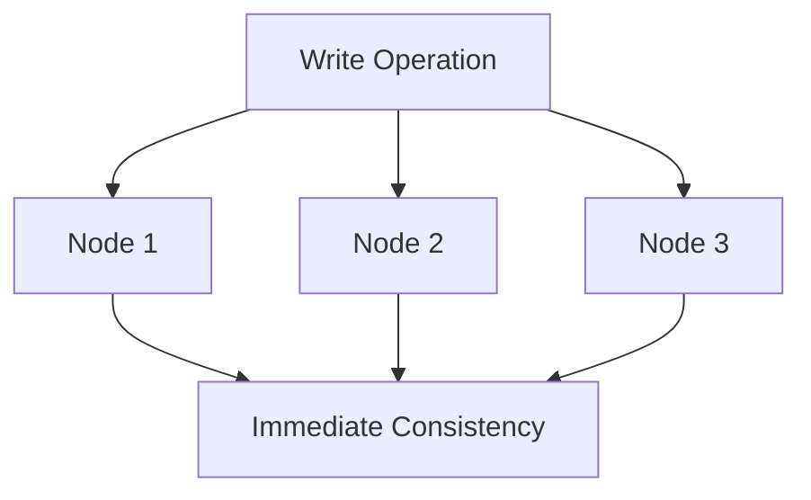
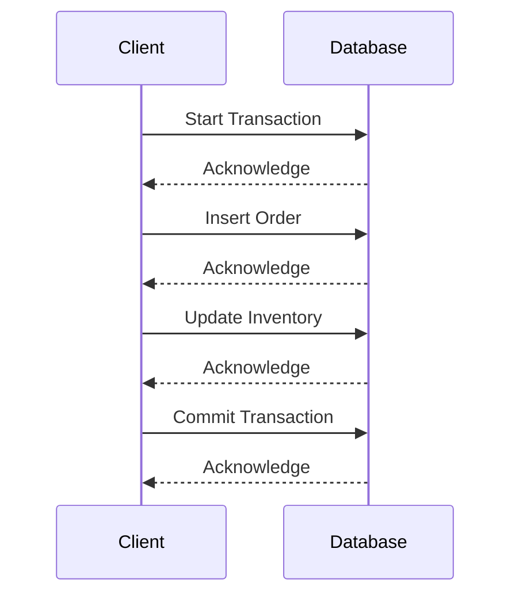

## 14.8 Transactions and ACID Compliance in NoSQL

In the world of databases, transactions and ACID (Atomicity, Consistency, Isolation, Durability) compliance are fundamental concepts that ensure data integrity and reliability. While these principles are well-established in traditional SQL databases, the rise of NoSQL databases has introduced new paradigms and challenges. In this section, we will delve into the nuances of transactions and ACID compliance in NoSQL databases, exploring their capabilities, limitations, and the trade-offs involved.

### Understanding ACID in NoSQL

ACID properties are a set of principles that guarantee reliable processing of database transactions. Let's briefly revisit these principles:

- **Atomicity**: Ensures that a series of operations within a transaction are completed entirely or not at all.
- **Consistency**: Guarantees that a transaction brings the database from one valid state to another, maintaining database invariants.
- **Isolation**: Ensures that concurrent transactions do not interfere with each other.
- **Durability**: Guarantees that once a transaction is committed, it will remain so, even in the event of a system failure.

NoSQL databases, designed for scalability and flexibility, often relax one or more of these properties to achieve their goals. This relaxation leads to different consistency models and transaction capabilities.

### Limited Support for Transactions

NoSQL databases are known for their schema-less design and ability to handle large volumes of unstructured data. However, this flexibility comes at the cost of traditional ACID compliance. Many NoSQL databases offer limited support for transactions, often restricting them to a single document or record.

#### Multi-Document Transactions

Recent advancements in NoSQL databases, such as MongoDB, have introduced support for multi-document transactions. This feature allows developers to perform ACID-compliant operations across multiple documents, bringing NoSQL closer to traditional relational databases in terms of transaction capabilities.

```json
// Example of a multi-document transaction in MongoDB
const session = client.startSession();
session.startTransaction();
try {
  const ordersCollection = client.db("shop").collection("orders");
  const inventoryCollection = client.db("shop").collection("inventory");

  // Insert a new order
  await ordersCollection.insertOne({ item: "laptop", qty: 1 }, { session });

  // Update inventory
  await inventoryCollection.updateOne(
    { item: "laptop" },
    { $inc: { qty: -1 } },
    { session }
  );

  // Commit the transaction
  await session.commitTransaction();
} catch (error) {
  // Abort the transaction in case of an error
  await session.abortTransaction();
} finally {
  session.endSession();
}
```

In this example, we demonstrate a multi-document transaction in MongoDB, where an order is inserted, and the inventory is updated atomically.

### Consistency Models in NoSQL

NoSQL databases offer various consistency models, each with its own trade-offs between performance and data integrity.

#### Eventual Consistency

Eventual consistency is a model where updates to a database will eventually propagate to all nodes, given enough time. This model is suitable for applications where immediate consistency is not critical, such as social media feeds or product catalogs.



*Diagram: Eventual Consistency Model - Updates propagate to all nodes over time.*

#### Strong Consistency

Strong consistency ensures that all nodes reflect the most recent write operation immediately. This model provides a higher level of data integrity but can impact performance and scalability.



*Diagram: Strong Consistency Model - All nodes reflect the latest write immediately.*

### Trade-offs: Scalability vs. Consistency

NoSQL databases often face trade-offs between scalability and consistency. The CAP theorem (Consistency, Availability, Partition Tolerance) highlights these trade-offs, stating that a distributed system can only guarantee two out of the three properties at any given time.

- **Consistency**: All nodes see the same data at the same time.
- **Availability**: Every request receives a response, regardless of the success or failure of the operation.
- **Partition Tolerance**: The system continues to operate despite network partitions.

#### Balancing Performance and Data Integrity

Choosing the right consistency model depends on the application's requirements. For example, a banking application may prioritize strong consistency to ensure accurate account balances, while a social media platform may opt for eventual consistency to improve performance and user experience.

### Practical Examples and Use Cases

Let's explore some practical examples and use cases where NoSQL databases with varying levels of ACID compliance are beneficial.

#### Use Case: E-Commerce Platform

An e-commerce platform requires real-time inventory updates and order processing. Using a NoSQL database with multi-document transactions, developers can ensure that inventory levels are accurately updated when an order is placed.

```json
// Example of an e-commerce transaction
const session = client.startSession();
session.startTransaction();
try {
  const ordersCollection = client.db("ecommerce").collection("orders");
  const inventoryCollection = client.db("ecommerce").collection("inventory");

  // Insert a new order
  await ordersCollection.insertOne({ item: "phone", qty: 1 }, { session });

  // Update inventory
  await inventoryCollection.updateOne(
    { item: "phone" },
    { $inc: { qty: -1 } },
    { session }
  );

  // Commit the transaction
  await session.commitTransaction();
} catch (error) {
  // Abort the transaction in case of an error
  await session.abortTransaction();
} finally {
  session.endSession();
}
```

#### Use Case: Social Media Application

A social media application can benefit from eventual consistency, allowing users to see updates and posts with minimal delay. This model enhances performance and scalability, ensuring a seamless user experience.

### Try It Yourself

Experiment with the provided code examples by modifying the item names and quantities. Observe how the transaction behaves when you introduce errors or simulate network failures. This hands-on approach will deepen your understanding of transactions in NoSQL databases.

### Visualizing Transactions and Consistency Models

To further illustrate the concepts discussed, let's visualize the transaction flow and consistency models using Mermaid.js diagrams.



*Diagram: Transaction Flow in a NoSQL Database - Demonstrates the sequence of operations in a transaction.*

### References and Further Reading

For more information on NoSQL databases and ACID compliance, consider exploring the following resources:

- [MongoDB Transactions](https://docs.mongodb.com/manual/core/transactions/)
- [CAP Theorem](https://en.wikipedia.org/wiki/CAP_theorem)
- [Eventual Consistency](https://en.wikipedia.org/wiki/Eventual_consistency)

### Knowledge Check

To reinforce your understanding of transactions and ACID compliance in NoSQL databases, consider the following questions and exercises:

1. Explain the differences between eventual consistency and strong consistency.
2. Describe a scenario where eventual consistency would be preferable over strong consistency.
3. Implement a multi-document transaction in a NoSQL database of your choice.

### Embrace the Journey

As you explore the world of NoSQL databases, remember that each database has its strengths and weaknesses. Understanding the trade-offs and capabilities of different consistency models will empower you to make informed decisions when designing and implementing database solutions. Keep experimenting, stay curious, and enjoy the journey!

## Quiz Time!



### Which of the following is NOT an ACID property?

- [ ] Atomicity
- [ ] Consistency
- [ ] Isolation
- [x] Availability

> **Explanation:** Availability is not part of the ACID properties; it is part of the CAP theorem.

### What does eventual consistency mean in NoSQL databases?

- [x] Updates will propagate to all nodes given enough time.
- [ ] All nodes reflect the latest write immediately.
- [ ] Transactions are always ACID-compliant.
- [ ] Data is never consistent across nodes.

> **Explanation:** Eventual consistency means that updates will eventually propagate to all nodes, but not immediately.

### Which NoSQL database supports multi-document transactions?

- [x] MongoDB
- [ ] Cassandra
- [ ] Redis
- [ ] Neo4j

> **Explanation:** MongoDB supports multi-document transactions, allowing ACID-compliant operations across multiple documents.

### What is the CAP theorem?

- [x] It states that a distributed system can only guarantee two out of three properties: Consistency, Availability, Partition Tolerance.
- [ ] It describes the ACID properties of transactions.
- [ ] It is a model for eventual consistency.
- [ ] It is a method for optimizing database queries.

> **Explanation:** The CAP theorem states that a distributed system can only guarantee two out of three properties: Consistency, Availability, Partition Tolerance.

### In which scenario is eventual consistency most suitable?

- [ ] Banking applications
- [x] Social media platforms
- [ ] Real-time analytics
- [ ] E-commerce transactions

> **Explanation:** Eventual consistency is suitable for social media platforms where immediate consistency is not critical.

### What is a trade-off of strong consistency in NoSQL databases?

- [ ] Improved performance
- [x] Reduced scalability
- [ ] Increased flexibility
- [ ] Enhanced availability

> **Explanation:** Strong consistency can reduce scalability as it requires all nodes to reflect the latest write immediately.

### How does a NoSQL database achieve partition tolerance?

- [ ] By ensuring all nodes are always consistent
- [ ] By sacrificing availability
- [x] By continuing to operate despite network partitions
- [ ] By using multi-document transactions

> **Explanation:** Partition tolerance means the system continues to operate despite network partitions.

### What is the primary benefit of using multi-document transactions in NoSQL?

- [x] Ensures ACID compliance across multiple documents
- [ ] Improves query performance
- [ ] Enhances data flexibility
- [ ] Increases database availability

> **Explanation:** Multi-document transactions ensure ACID compliance across multiple documents, similar to SQL databases.

### Which consistency model prioritizes performance over immediate data integrity?

- [ ] Strong consistency
- [x] Eventual consistency
- [ ] Immediate consistency
- [ ] Transactional consistency

> **Explanation:** Eventual consistency prioritizes performance, allowing updates to propagate over time.

### True or False: All NoSQL databases are ACID-compliant by default.

- [ ] True
- [x] False

> **Explanation:** Not all NoSQL databases are ACID-compliant by default; many offer limited transaction support.


