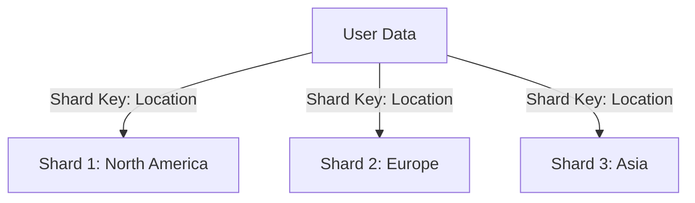
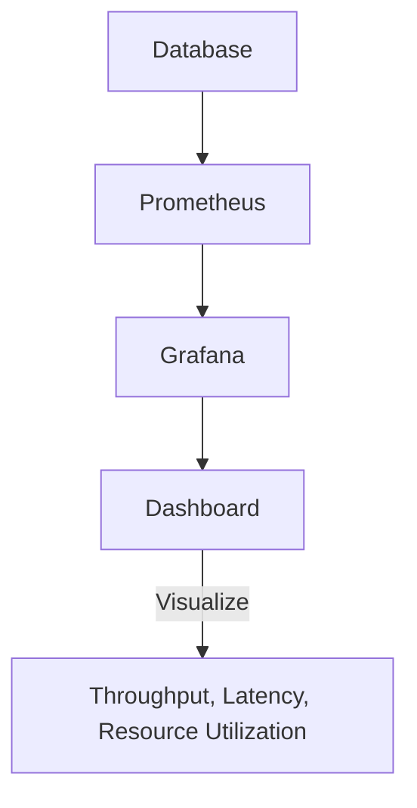

## 14.9 Performance Considerations

In the realm of database management, performance is a critical factor that can make or break the efficiency of your applications. As we delve into the integration of SQL with NoSQL and NewSQL databases, understanding performance considerations becomes paramount. This section will guide you through the essential aspects of optimizing performance, focusing on data modeling, indexing, resource management, and monitoring.

### Data Modeling

Data modeling is the foundation of database performance. The way data is structured and accessed can significantly impact the speed and efficiency of your queries.

#### Denormalization

Denormalization is a technique often employed in NoSQL databases to enhance performance by reducing the need for complex joins. In traditional SQL databases, normalization is used to eliminate redundancy and ensure data integrity. However, in NoSQL systems, where data is often distributed across multiple nodes, denormalization can be beneficial.

- **Concept**: Denormalization involves duplicating data across tables or documents to reduce the number of joins required during query execution. This can lead to faster read operations, as data is readily available without the need for complex joins.

- **Example**: Consider a scenario where you have a `users` table and an `orders` table. In a normalized SQL database, you would join these tables to get user orders. In a denormalized NoSQL setup, you might store user information directly within each order document, eliminating the need for a join.

```sql
-- SQL Example: Normalized
SELECT users.name, orders.order_id
FROM users
JOIN orders ON users.user_id = orders.user_id;

-- NoSQL Example: Denormalized
{
  "order_id": "12345",
  "user": {
    "name": "John Doe",
    "user_id": "67890"
  }
}
```

- **Considerations**: While denormalization can improve read performance, it may lead to data inconsistency and increased storage requirements. It's crucial to balance these trade-offs based on your application's needs.

#### Data Access Patterns

Understanding and designing around data access patterns is crucial for optimizing performance in both SQL and NoSQL databases. This involves analyzing how data is read and written and structuring your schema accordingly.

- **Read-Heavy vs. Write-Heavy**: Determine whether your application is read-heavy or write-heavy. For read-heavy applications, optimize for fast retrieval by using techniques like denormalization and indexing. For write-heavy applications, focus on efficient data insertion and update mechanisms.

- **Example**: In a read-heavy application, you might use a denormalized schema with precomputed aggregates to speed up query performance. In a write-heavy application, you might use a normalized schema to minimize data duplication and ensure consistency.

- **Schema Design**: Tailor your schema to match your application's access patterns. For instance, if your application frequently queries user profiles, consider creating a dedicated collection or table for user data with relevant indexes.

### Indexing

Indexing is a powerful tool for improving query performance. By creating indexes on frequently queried fields, you can significantly reduce query execution time.

#### Custom Indexes

Custom indexes are tailored to support specific query patterns, ensuring that your database can efficiently handle the most common operations.

- **Concept**: Create indexes on fields that are frequently used in WHERE clauses, JOIN conditions, and ORDER BY clauses. This allows the database to quickly locate and retrieve the relevant data.

- **Example**: Suppose you have a `products` table and frequently query products by category and price. Creating an index on the `category` and `price` columns can speed up these queries.

```sql
-- Creating a custom index on category and price
CREATE INDEX idx_category_price ON products (category, price);
```

- **Considerations**: While indexes can improve read performance, they can also slow down write operations due to the overhead of maintaining the index. It's important to strike a balance between read and write performance.

### Resource Management

Efficient resource management is essential for scaling your database to handle increased load and ensuring high availability.

#### Sharding and Replication

Sharding and replication are techniques used to distribute data across multiple nodes, improving scalability and fault tolerance.

- **Sharding**: Sharding involves partitioning your data across multiple nodes based on a shard key. This allows you to distribute the load and improve performance by parallelizing queries.

- **Example**: In a sharded database, user data might be distributed across multiple shards based on the user's geographic location. This ensures that queries targeting specific regions are handled by the relevant shard.



- **Replication**: Replication involves creating copies of your data across multiple nodes. This enhances fault tolerance and allows for load balancing by directing read queries to replicas.

- **Considerations**: Both sharding and replication introduce complexity in terms of data consistency and management. It's crucial to carefully plan your sharding strategy and replication setup to avoid issues like data skew and replication lag.

### Monitoring

Monitoring is a critical aspect of performance optimization, allowing you to track key metrics and identify bottlenecks.

#### Performance Metrics

Tracking performance metrics such as throughput, latency, and resource utilization provides valuable insights into your database's performance.

- **Throughput**: Measure the number of operations (reads/writes) your database can handle per second. High throughput indicates efficient resource utilization.

- **Latency**: Monitor the time taken to execute queries. Low latency is crucial for ensuring a responsive application.

- **Resource Utilization**: Track CPU, memory, and disk usage to identify potential bottlenecks and optimize resource allocation.

- **Tools**: Use monitoring tools like Prometheus, Grafana, or native database monitoring solutions to visualize and analyze performance metrics.



- **Considerations**: Regularly review and analyze performance metrics to identify trends and potential issues. Implement alerts and automated responses to address performance degradation proactively.

### Try It Yourself

To solidify your understanding of performance considerations, try experimenting with the following:

1. **Denormalization**: Take a normalized SQL schema and denormalize it for a NoSQL database. Observe the impact on read and write performance.

2. **Indexing**: Create custom indexes on a sample dataset and measure the difference in query execution time before and after indexing.

3. **Sharding**: Implement a simple sharding strategy using a sample dataset. Analyze how data distribution affects query performance.

4. **Monitoring**: Set up a monitoring solution for a sample database and track key performance metrics. Experiment with different load scenarios to see how the database responds.

### Conclusion

Performance considerations are a crucial aspect of integrating SQL with NoSQL and NewSQL databases. By focusing on data modeling, indexing, resource management, and monitoring, you can optimize your database for both read and write operations, ensuring a responsive and scalable application. Remember, this is just the beginning. As you progress, you'll build more complex and efficient database solutions. Keep experimenting, stay curious, and enjoy the journey!

## Quiz Time!



### What is the primary benefit of denormalization in NoSQL databases?

- [x] Reducing the need for complex joins
- [ ] Ensuring data integrity
- [ ] Minimizing storage requirements
- [ ] Simplifying schema design

> **Explanation:** Denormalization reduces the need for complex joins, which can improve read performance in NoSQL databases.

### Which of the following is a key consideration when creating custom indexes?

- [x] Balancing read and write performance
- [ ] Ensuring data consistency
- [ ] Reducing storage requirements
- [ ] Simplifying query syntax

> **Explanation:** Custom indexes can improve read performance but may slow down write operations, so it's important to balance both.

### What is the purpose of sharding in database management?

- [x] Distributing data across multiple nodes
- [ ] Creating copies of data for fault tolerance
- [ ] Reducing data redundancy
- [ ] Simplifying query execution

> **Explanation:** Sharding involves partitioning data across multiple nodes to distribute load and improve performance.

### How does replication enhance database performance?

- [x] By allowing load balancing of read queries
- [ ] By reducing data redundancy
- [ ] By simplifying schema design
- [ ] By minimizing storage requirements

> **Explanation:** Replication creates copies of data across nodes, allowing read queries to be distributed and balanced.

### Which metric is crucial for ensuring a responsive application?

- [x] Low latency
- [ ] High throughput
- [ ] High resource utilization
- [ ] Low storage usage

> **Explanation:** Low latency is crucial for ensuring that queries are executed quickly, resulting in a responsive application.

### What tool can be used to visualize database performance metrics?

- [x] Grafana
- [ ] SQL Server Management Studio
- [ ] MySQL Workbench
- [ ] MongoDB Compass

> **Explanation:** Grafana is a popular tool for visualizing performance metrics, often used in conjunction with Prometheus.

### What is a potential downside of denormalization?

- [x] Data inconsistency
- [ ] Increased query complexity
- [ ] Reduced read performance
- [ ] Simplified schema design

> **Explanation:** Denormalization can lead to data inconsistency due to duplicated data across tables or documents.

### What is the role of a shard key in sharding?

- [x] Determining how data is partitioned across nodes
- [ ] Ensuring data consistency
- [ ] Simplifying query execution
- [ ] Reducing storage requirements

> **Explanation:** The shard key determines how data is distributed across nodes in a sharded database.

### Which of the following is a benefit of monitoring database performance?

- [x] Identifying bottlenecks and optimizing resource allocation
- [ ] Reducing data redundancy
- [ ] Simplifying schema design
- [ ] Ensuring data integrity

> **Explanation:** Monitoring helps identify performance bottlenecks and optimize resource allocation to improve efficiency.

### True or False: High throughput always indicates efficient resource utilization.

- [ ] True
- [x] False

> **Explanation:** High throughput is a positive indicator, but it must be considered alongside other metrics like latency and resource utilization to determine overall efficiency.


