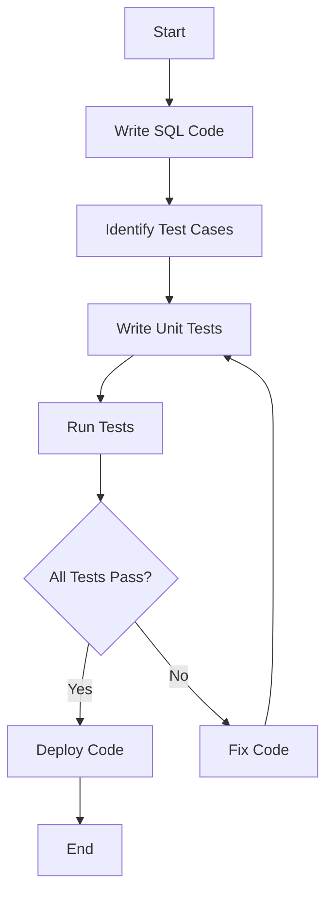

## 15.1 Unit Testing SQL Code

In the realm of software development, unit testing is a critical practice that ensures the reliability and quality of code. This principle holds true for SQL code as well, where unit testing plays a vital role in validating individual units of database logic, such as functions, stored procedures, and triggers. In this section, we will delve into the importance of unit testing SQL code, explore popular frameworks like tSQLt and pgTAP, and discuss best practices for effective testing.

### Understanding Unit Testing in SQL

**Unit Testing** is a software testing method where individual units or components of a software are tested in isolation from the rest of the application. In the context of SQL, these units are typically stored procedures, functions, and triggers. The primary goal is to validate that each unit of SQL code performs as expected under various conditions.

#### Why Unit Test SQL Code?

1. **Reliability**: Ensure that database logic is reliable and behaves as expected.
2. **Maintainability**: Facilitate easier maintenance and refactoring of SQL code.
3. **Bug Detection**: Identify and fix bugs early in the development process.
4. **Documentation**: Serve as documentation for the expected behavior of SQL code.
5. **Confidence**: Provide confidence in the correctness of database operations.

### Popular Frameworks for Unit Testing SQL

Several frameworks are available to facilitate unit testing in SQL. Let's explore two of the most popular ones: tSQLt for SQL Server and pgTAP for PostgreSQL.

#### tSQLt: Unit Testing Framework for SQL Server

**tSQLt** is a powerful unit testing framework specifically designed for SQL Server. It allows developers to write tests in T-SQL, the native language of SQL Server, making it easy to integrate into existing development workflows.

- **Installation**: tSQLt is installed as a set of stored procedures in your database. You can download it from the [tSQLt website](http://tsqlt.org/).
- **Features**:
  - **Mocking**: Simulate tables and procedures to isolate tests.
  - **Assertions**: Provide various assertions to validate test outcomes.
  - **Test Suites**: Organize tests into suites for better management.

##### Example: Testing a Stored Procedure with tSQLt

Let's consider a simple stored procedure that calculates the total price of an order, including tax.

```sql
CREATE PROCEDURE CalculateTotalPrice
    @OrderId INT,
    @TotalPrice DECIMAL(10, 2) OUTPUT
AS
BEGIN
    DECLARE @SubTotal DECIMAL(10, 2);
    DECLARE @TaxRate DECIMAL(4, 2) = 0.08; -- 8% tax

    SELECT @SubTotal = SUM(Price) FROM OrderItems WHERE OrderId = @OrderId;
    SET @TotalPrice = @SubTotal + (@SubTotal * @TaxRate);
END;
```

To test this procedure using tSQLt, we can create a test case as follows:

```sql
-- Create a test class
EXEC tSQLt.NewTestClass 'OrderTests';

-- Create a test case
CREATE PROCEDURE OrderTests.[test CalculateTotalPrice]
AS
BEGIN
    -- Arrange
    EXEC tSQLt.FakeTable 'OrderItems';
    INSERT INTO OrderItems (OrderId, Price) VALUES (1, 100.00), (1, 50.00);

    DECLARE @TotalPrice DECIMAL(10, 2);

    -- Act
    EXEC CalculateTotalPrice @OrderId = 1, @TotalPrice = @TotalPrice OUTPUT;

    -- Assert
    EXEC tSQLt.AssertEquals @Expected = 162.00, @Actual = @TotalPrice;
END;
```

In this example, we use `tSQLt.FakeTable` to isolate the test by creating a fake version of the `OrderItems` table. We then insert test data and call the `CalculateTotalPrice` procedure. Finally, we use `tSQLt.AssertEquals` to verify that the calculated total price matches the expected value.

#### pgTAP: Unit Testing Framework for PostgreSQL

**pgTAP** is a unit testing framework for PostgreSQL that allows you to write tests in SQL. It is inspired by the TAP (Test Anything Protocol) and provides a rich set of functions for testing database logic.

- **Installation**: pgTAP can be installed via the PostgreSQL extension mechanism. You can find installation instructions on the [pgTAP GitHub repository](https://github.com/theory/pgtap).
- **Features**:
  - **Assertions**: Offers a wide range of assertions for testing.
  - **Integration**: Easily integrates with PostgreSQL's native features.
  - **Flexibility**: Supports testing of functions, triggers, and more.

##### Example: Testing a Function with pgTAP

Consider a function that calculates the discount for a given customer based on their purchase history.

```sql
CREATE FUNCTION CalculateDiscount(customer_id INT) RETURNS NUMERIC AS $$
DECLARE
    total_spent NUMERIC;
BEGIN
    SELECT SUM(amount) INTO total_spent FROM purchases WHERE customer_id = $1;
    IF total_spent > 1000 THEN
        RETURN 0.10; -- 10% discount
    ELSE
        RETURN 0.05; -- 5% discount
    END IF;
END;
$$ LANGUAGE plpgsql;
```

To test this function using pgTAP, we can write a test case as follows:

```sql
-- Load the pgTAP extension
CREATE EXTENSION IF NOT EXISTS pgtap;

-- Create a test function
CREATE OR REPLACE FUNCTION test_calculate_discount() RETURNS SETOF TEXT AS $$
BEGIN
    -- Test case 1: Customer with total spent over 1000
    PERFORM ok(CalculateDiscount(1) = 0.10, 'Customer 1 should receive a 10% discount');

    -- Test case 2: Customer with total spent under 1000
    PERFORM ok(CalculateDiscount(2) = 0.05, 'Customer 2 should receive a 5% discount');

    RETURN;
END;
$$ LANGUAGE plpgsql;

-- Run the test
SELECT * FROM test_calculate_discount();
```

In this example, we use the `ok` function provided by pgTAP to assert that the discount calculated by the `CalculateDiscount` function matches the expected value for each test case.

### Best Practices for Unit Testing SQL Code

To ensure effective unit testing of SQL code, it is essential to follow best practices that enhance the reliability and maintainability of tests.

#### 1. Isolation

- **Purpose**: Ensure that each test runs independently and does not affect others.
- **Techniques**:
  - Use mocking frameworks to simulate dependencies.
  - Create temporary tables or use fake tables to isolate tests.
  - Reset the database state before each test.

#### 2. Repeatability

- **Purpose**: Ensure that tests produce the same results every time they are run.
- **Techniques**:
  - Avoid relying on external data sources or system states.
  - Use fixed test data and configurations.
  - Ensure that tests are idempotent and can be run multiple times without side effects.

#### 3. Coverage

- **Purpose**: Ensure that all critical paths and edge cases are tested.
- **Techniques**:
  - Write tests for all functions, procedures, and triggers.
  - Include tests for both expected and unexpected inputs.
  - Use code coverage tools to identify untested areas.

#### 4. Maintainability

- **Purpose**: Ensure that tests are easy to maintain and update.
- **Techniques**:
  - Use descriptive names for test cases and assertions.
  - Organize tests into logical suites or categories.
  - Regularly review and refactor tests to improve clarity and efficiency.

#### 5. Documentation

- **Purpose**: Provide clear documentation of test cases and expected outcomes.
- **Techniques**:
  - Include comments in test code to explain the purpose and logic.
  - Maintain a test plan or documentation that outlines the scope and objectives of testing.

### Visualizing the Unit Testing Process

To better understand the unit testing process in SQL, let's visualize the workflow using a flowchart.



**Figure 1: Unit Testing Workflow for SQL Code**

This flowchart illustrates the typical workflow for unit testing SQL code. We start by writing the SQL code and identifying test cases. Next, we write unit tests and run them. If all tests pass, we proceed to deploy the code. If any tests fail, we fix the code and rerun the tests.

### Try It Yourself

To reinforce your understanding of unit testing SQL code, try modifying the examples provided in this section. Experiment with different test cases, assertions, and scenarios to see how the tests behave. Consider the following challenges:

- Modify the `CalculateTotalPrice` procedure to include a discount and update the test case accordingly.
- Add additional test cases to the `CalculateDiscount` function to cover more scenarios.
- Explore the features of tSQLt and pgTAP by writing tests for your own SQL code.

### References and Further Reading

- [tSQLt Official Website](http://tsqlt.org/)
- [pgTAP GitHub Repository](https://github.com/theory/pgtap)
- [SQL Server Documentation](https://docs.microsoft.com/en-us/sql/)
- [PostgreSQL Documentation](https://www.postgresql.org/docs/)

### Knowledge Check

Before we conclude this section, let's summarize the key takeaways:

- Unit testing SQL code is essential for ensuring reliability, maintainability, and confidence in database logic.
- tSQLt and pgTAP are popular frameworks for unit testing SQL Server and PostgreSQL, respectively.
- Best practices for unit testing SQL include isolation, repeatability, coverage, maintainability, and documentation.

Remember, this is just the beginning. As you progress, you'll build more complex and reliable database solutions. Keep experimenting, stay curious, and enjoy the journey!

## Quiz Time!



### What is the primary goal of unit testing SQL code?

- [x] Validate that each unit of SQL code performs as expected
- [ ] Improve the performance of SQL queries
- [ ] Simplify database schema design
- [ ] Enhance user interface design

> **Explanation:** The primary goal of unit testing SQL code is to validate that each unit of SQL code performs as expected under various conditions.

### Which framework is specifically designed for unit testing SQL Server code?

- [x] tSQLt
- [ ] pgTAP
- [ ] JUnit
- [ ] NUnit

> **Explanation:** tSQLt is a unit testing framework specifically designed for SQL Server.

### What is the purpose of isolation in unit testing SQL code?

- [x] Ensure that each test runs independently
- [ ] Improve the readability of SQL code
- [ ] Reduce the size of the database
- [ ] Increase the speed of query execution

> **Explanation:** Isolation ensures that each test runs independently and does not affect others.

### What technique can be used to ensure repeatability in unit tests?

- [x] Use fixed test data and configurations
- [ ] Rely on external data sources
- [ ] Use random data generation
- [ ] Depend on system states

> **Explanation:** Using fixed test data and configurations ensures that tests produce the same results every time they are run.

### Which of the following is a feature of pgTAP?

- [x] Offers a wide range of assertions for testing
- [ ] Provides a graphical user interface for testing
- [ ] Supports testing of Java applications
- [ ] Integrates with NoSQL databases

> **Explanation:** pgTAP offers a wide range of assertions for testing database logic in PostgreSQL.

### What is the purpose of using `tSQLt.FakeTable` in a test case?

- [x] Simulate tables to isolate tests
- [ ] Improve the performance of SQL queries
- [ ] Simplify database schema design
- [ ] Enhance user interface design

> **Explanation:** `tSQLt.FakeTable` is used to simulate tables and isolate tests from the actual database schema.

### What is the benefit of organizing tests into logical suites or categories?

- [x] Improve maintainability and management of tests
- [ ] Increase the speed of query execution
- [ ] Reduce the size of the database
- [ ] Enhance user interface design

> **Explanation:** Organizing tests into logical suites or categories improves maintainability and management of tests.

### Which of the following is NOT a best practice for unit testing SQL code?

- [ ] Isolation
- [ ] Repeatability
- [ ] Coverage
- [x] Random data generation

> **Explanation:** Random data generation is not a best practice for unit testing SQL code, as it can lead to inconsistent test results.

### True or False: Unit testing SQL code can serve as documentation for the expected behavior of SQL code.

- [x] True
- [ ] False

> **Explanation:** Unit testing SQL code can serve as documentation for the expected behavior of SQL code, providing clear examples of how the code should function.

### What is the role of assertions in unit testing?

- [x] Validate test outcomes
- [ ] Improve the performance of SQL queries
- [ ] Simplify database schema design
- [ ] Enhance user interface design

> **Explanation:** Assertions are used to validate test outcomes by checking if the actual results match the expected results.


