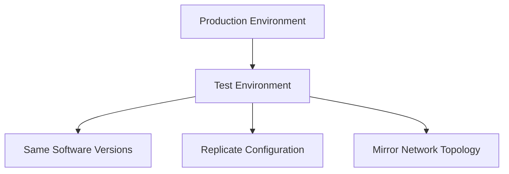
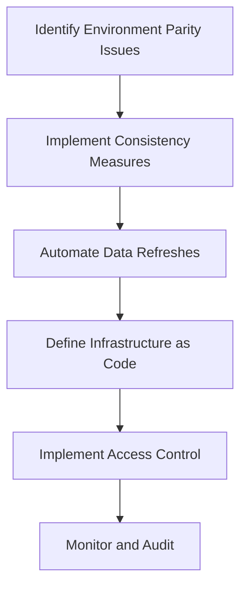

## 15.10 Handling Test Environment Challenges

In the realm of SQL development, ensuring that your test environment mirrors the production environment as closely as possible is crucial for effective testing and quality assurance. This section delves into the common challenges faced in maintaining test environments and provides strategies to overcome them. We will explore the importance of environment parity, effective data management, configuration management through Infrastructure as Code (IaC), and robust access control mechanisms.

### Environment Parity

**Environment parity** refers to the consistency between your test and production environments. Achieving this consistency is essential for reliable testing outcomes. Let's explore the key aspects of maintaining environment parity:

#### Consistency

1. **Explain the Importance of Consistency**: Consistency between test and production environments ensures that tests accurately reflect real-world scenarios. This minimizes the risk of encountering unexpected issues when deploying to production.

2. **Demonstrate How to Achieve Consistency**:
   - **Use the Same Software Versions**: Ensure that the database management system (DBMS) and any related software are the same versions in both environments.
   - **Replicate Configuration Settings**: Match configuration settings such as memory allocation, connection limits, and timeout settings.
   - **Mirror Network Topology**: If possible, replicate the network setup, including firewalls and load balancers.

3. **Provide Tools and Techniques**:
   - **Docker and Containers**: Use containerization to create consistent environments. Docker allows you to define your environment in a Dockerfile, ensuring that every instance is identical.
   - **Virtual Machines (VMs)**: Use VMs to replicate the production environment's hardware and software configurations.



### Data Management

Managing data in test environments is a critical challenge. Test data should be representative of production data while ensuring privacy and security.

#### Data Refreshes

1. **Explain the Need for Data Refreshes**: Regularly updating test data ensures that it reflects the current state of production, allowing for more accurate testing.

2. **Demonstrate How to Perform Data Refreshes**:
   - **Automate Data Refreshes**: Use scripts or tools to automate the process of copying data from production to test environments.
   - **Anonymize Sensitive Data**: Ensure that any sensitive information is anonymized or masked to protect privacy.

3. **Provide Tools and Techniques**:
   - **ETL Tools**: Use Extract, Transform, Load (ETL) tools to automate data refreshes and transformations.
   - **Data Masking Tools**: Implement data masking solutions to anonymize sensitive data.

```sql
-- Example of a simple data refresh script
BEGIN TRANSACTION;

-- Step 1: Truncate existing test data
TRUNCATE TABLE test_schema.customers;

-- Step 2: Insert anonymized data from production
INSERT INTO test_schema.customers (id, name, email)
SELECT id, name, CONCAT('user', id, '@example.com') AS email
FROM prod_schema.customers;

COMMIT;
```

### Configuration Management

Configuration management is crucial for maintaining consistency and control over test environments. Infrastructure as Code (IaC) is a powerful approach to achieve this.

#### Infrastructure as Code (IaC)

1. **Explain the Concept of IaC**: IaC involves managing and provisioning infrastructure through code, allowing for version control and automation.

2. **Demonstrate How to Implement IaC**:
   - **Define Infrastructure in Code**: Use tools like Terraform or Ansible to define your infrastructure as code.
   - **Automate Environment Setup**: Automate the setup of test environments using IaC scripts.

3. **Provide Tools and Techniques**:
   - **Terraform**: Use Terraform to define and provision infrastructure across multiple cloud providers.
   - **Ansible**: Use Ansible for configuration management and application deployment.

```hcl
provider "aws" {
  region = "us-west-2"
}

resource "aws_db_instance" "test_db" {
  allocated_storage    = 20
  engine               = "mysql"
  engine_version       = "5.7"
  instance_class       = "db.t2.micro"
  name                 = "testdb"
  username             = "admin"
  password             = "password"
  parameter_group_name = "default.mysql5.7"
}
```

### Access Control

Access control is vital to ensure that only authorized personnel can access test environments, protecting sensitive data and maintaining compliance.

#### Security

1. **Explain the Importance of Security**: Protecting test environments from unauthorized access is crucial to prevent data breaches and maintain compliance with regulations.

2. **Demonstrate How to Implement Access Control**:
   - **Role-Based Access Control (RBAC)**: Implement RBAC to restrict access based on user roles.
   - **Audit Logs**: Maintain audit logs to track access and changes to the test environment.

3. **Provide Tools and Techniques**:
   - **LDAP/Active Directory**: Use directory services for centralized authentication and authorization.
   - **Database Security Features**: Leverage built-in security features of your DBMS, such as user roles and permissions.

```sql
-- Example of setting up role-based access control
CREATE ROLE test_user;
GRANT SELECT, INSERT ON test_schema.* TO test_user;
```

### Visualizing Test Environment Challenges

To better understand the flow of managing test environments, let's visualize the process using a flowchart.



### References and Links

- [Docker Documentation](https://docs.docker.com/)
- [Terraform by HashiCorp](https://www.terraform.io/)
- [Ansible Documentation](https://docs.ansible.com/)
- [AWS RDS Documentation](https://docs.aws.amazon.com/rds/index.html)

### Knowledge Check

- **Question**: Why is environment parity important in test environments?
- **Question**: What are some tools you can use for data masking?
- **Question**: How does Infrastructure as Code benefit test environment management?

### Embrace the Journey

Remember, mastering test environment challenges is a continuous journey. As you implement these strategies, you'll gain confidence in your testing processes and improve the reliability of your SQL applications. Keep experimenting, stay curious, and enjoy the journey!

## Quiz Time!



### Why is environment parity important in test environments?

- [x] It ensures tests accurately reflect real-world scenarios.
- [ ] It reduces the cost of testing.
- [ ] It allows for more creative testing.
- [ ] It simplifies the testing process.

> **Explanation:** Environment parity ensures that tests accurately reflect real-world scenarios, minimizing the risk of encountering unexpected issues when deploying to production.

### What is a key benefit of using Infrastructure as Code (IaC)?

- [x] It allows for version control and automation of infrastructure.
- [ ] It reduces the need for testing.
- [ ] It simplifies database queries.
- [ ] It eliminates the need for data refreshes.

> **Explanation:** IaC allows for version control and automation of infrastructure, making it easier to manage and replicate environments.

### Which tool can be used for data masking?

- [x] Data Masking Tools
- [ ] Docker
- [ ] Ansible
- [ ] Terraform

> **Explanation:** Data masking tools are specifically designed to anonymize sensitive data, ensuring privacy in test environments.

### What is the purpose of audit logs in test environments?

- [x] To track access and changes to the test environment.
- [ ] To simplify data refreshes.
- [ ] To automate infrastructure setup.
- [ ] To reduce testing costs.

> **Explanation:** Audit logs are used to track access and changes to the test environment, ensuring security and compliance.

### How can you automate data refreshes?

- [x] Use scripts or tools to automate the process.
- [ ] Manually copy data from production.
- [ ] Use Docker containers.
- [ ] Implement role-based access control.

> **Explanation:** Automating data refreshes involves using scripts or tools to regularly update test data, ensuring it reflects the current state of production.

### What is a benefit of using Docker for test environments?

- [x] It creates consistent environments through containerization.
- [ ] It simplifies SQL queries.
- [ ] It eliminates the need for data masking.
- [ ] It reduces the need for configuration management.

> **Explanation:** Docker creates consistent environments through containerization, ensuring that every instance is identical.

### What is the role of role-based access control (RBAC) in test environments?

- [x] To restrict access based on user roles.
- [ ] To automate data refreshes.
- [ ] To simplify infrastructure setup.
- [ ] To eliminate the need for audit logs.

> **Explanation:** RBAC restricts access based on user roles, ensuring that only authorized personnel can access test environments.

### Which tool is used for defining infrastructure as code?

- [x] Terraform
- [ ] Docker
- [ ] Data Masking Tools
- [ ] LDAP

> **Explanation:** Terraform is a tool used for defining and provisioning infrastructure as code.

### What is the purpose of data anonymization in test environments?

- [x] To protect privacy and ensure compliance.
- [ ] To simplify data refreshes.
- [ ] To automate infrastructure setup.
- [ ] To reduce testing costs.

> **Explanation:** Data anonymization protects privacy and ensures compliance by masking sensitive information in test environments.

### True or False: Consistency between test and production environments reduces the risk of encountering unexpected issues in production.

- [x] True
- [ ] False

> **Explanation:** Consistency between test and production environments ensures that tests accurately reflect real-world scenarios, reducing the risk of encountering unexpected issues in production.


