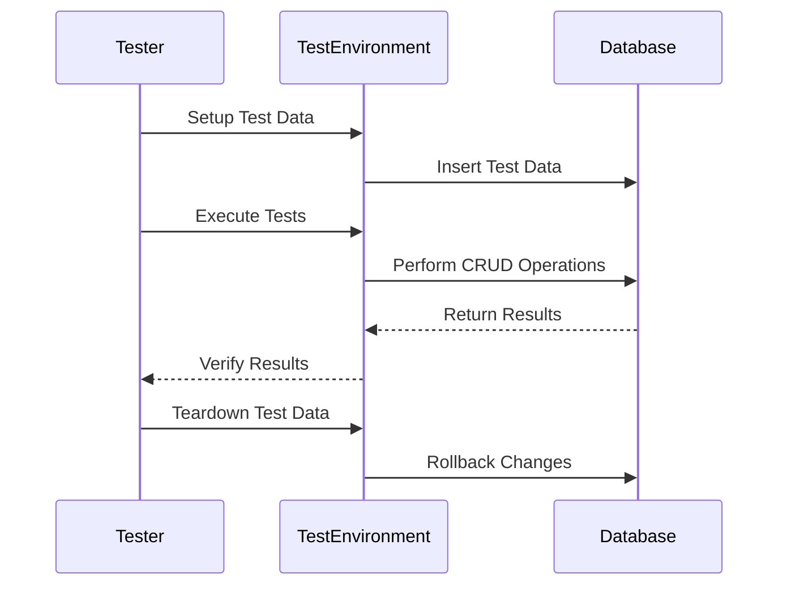

## 15.2 Integration Testing with Databases

Integration testing is a critical phase in the software development lifecycle, especially when dealing with databases. It ensures that different components of an application work together seamlessly with the database, validating that the system as a whole functions as expected. In this section, we will delve into the intricacies of integration testing with databases, exploring various approaches, challenges, and best practices.

### Understanding Integration Testing

Integration testing focuses on verifying the interactions between different components of a system. When it comes to databases, this involves testing the interaction between the application code and the database to ensure that data is correctly stored, retrieved, and manipulated. This type of testing is crucial for identifying issues that may not be apparent during unit testing, such as data integrity problems, transaction handling errors, and performance bottlenecks.

### Approaches to Database Integration Testing

There are several approaches to integration testing with databases, each with its own advantages and challenges. Let's explore the most common ones:

#### 1. Live Database Testing

**Live Database Testing** involves using a real database with test data. This approach provides the most realistic testing environment, as it closely mimics the production setup. However, it also comes with certain challenges:

- **Data Setup and Teardown**: Managing test data is crucial. You need to ensure that the database is in a known state before each test and that any changes made during the test are rolled back or cleaned up afterward.
- **Environment Consistency**: The test environment must closely resemble the production environment to ensure accurate results. This includes using the same database version, configuration, and schema.

**Example**: Consider a scenario where you need to test a user registration feature. You would set up a test database with the necessary tables and constraints, insert test data, and then run your tests to verify that users can be registered, updated, and deleted as expected.

```sql
-- Example setup for a user registration test
CREATE TABLE IF NOT EXISTS users (
    id SERIAL PRIMARY KEY,
    username VARCHAR(50) UNIQUE NOT NULL,
    email VARCHAR(100) UNIQUE NOT NULL,
    password_hash VARCHAR(255) NOT NULL
);

-- Insert test data
INSERT INTO users (username, email, password_hash) VALUES
('testuser1', 'test1@example.com', 'hashed_password1'),
('testuser2', 'test2@example.com', 'hashed_password2');
```

#### 2. In-Memory Databases

**In-Memory Databases** are lightweight databases that run entirely in memory. They are ideal for fast and isolated tests, as they eliminate the overhead of disk I/O. Popular in-memory databases include SQLite and H2.

- **Speed**: In-memory databases are significantly faster than disk-based databases, making them suitable for running a large number of tests quickly.
- **Isolation**: Tests can be run in complete isolation, ensuring that they do not interfere with each other.

**Example**: Using an in-memory database for testing a simple CRUD (Create, Read, Update, Delete) operation.

```java
// Example using H2 in-memory database in Java
import java.sql.Connection;
import java.sql.DriverManager;
import java.sql.Statement;

public class InMemoryDatabaseTest {
    public static void main(String[] args) throws Exception {
        Connection connection = DriverManager.getConnection("jdbc:h2:mem:testdb");
        Statement statement = connection.createStatement();

        // Create table
        statement.execute("CREATE TABLE users (id INT AUTO_INCREMENT PRIMARY KEY, username VARCHAR(50), email VARCHAR(100))");

        // Insert data
        statement.execute("INSERT INTO users (username, email) VALUES ('testuser', 'test@example.com')");

        // Query data
        var resultSet = statement.executeQuery("SELECT * FROM users");
        while (resultSet.next()) {
            System.out.println("User: " + resultSet.getString("username"));
        }

        // Clean up
        statement.execute("DROP TABLE users");
        connection.close();
    }
}
```

### Challenges in Database Integration Testing

Integration testing with databases presents unique challenges that must be addressed to ensure effective testing:

#### Data Setup and Teardown

Managing test data is one of the most significant challenges in database integration testing. You need to ensure that the database is in a known state before each test and that any changes made during the test are rolled back or cleaned up afterward. This can be achieved through:

- **Database Transactions**: Use transactions to wrap each test, ensuring that changes are rolled back after the test completes.
- **Data Fixtures**: Predefine sets of test data that can be loaded into the database before each test.
- **Database Snapshots**: Take snapshots of the database state before tests and restore them afterward.

#### Environment Consistency

Ensuring that the test environment mimics the production environment is crucial for accurate testing. This includes:

- **Database Configuration**: Use the same database version, configuration, and schema as production.
- **Network Conditions**: Simulate network latency and other conditions that may affect database performance.
- **Data Volume**: Ensure that the test database contains a realistic volume of data to identify performance bottlenecks.

### Best Practices for Database Integration Testing

To effectively perform integration testing with databases, consider the following best practices:

#### Use Test Containers

Test containers are a powerful tool for managing database instances during testing. They allow you to spin up and tear down database instances as needed, ensuring a clean environment for each test. Popular tools include Docker and Testcontainers.

#### Automate Data Setup and Teardown

Automate the process of setting up and tearing down test data to ensure consistency and reduce manual effort. This can be achieved through scripts or tools like Flyway and Liquibase.

#### Mock External Dependencies

When testing database interactions, it's important to isolate the database from other external dependencies. Use mocking frameworks to simulate external services and APIs, ensuring that tests focus solely on database interactions.

#### Monitor Test Coverage

Ensure that your tests cover all critical database interactions, including edge cases and error scenarios. Use code coverage tools to identify gaps in your test suite and ensure comprehensive coverage.

### Visualizing Database Integration Testing

To better understand the process of database integration testing, let's visualize the workflow using a sequence diagram.



**Diagram Description**: This sequence diagram illustrates the typical workflow of database integration testing. The tester sets up test data, executes tests, verifies results, and tears down test data, ensuring that the database is returned to its original state.

### Try It Yourself

To gain hands-on experience with database integration testing, try the following exercise:

1. **Set Up a Test Database**: Use a real or in-memory database to set up a test environment. Create tables and insert test data as needed.

2. **Write Integration Tests**: Implement integration tests for a simple CRUD operation. Use transactions to ensure that changes are rolled back after each test.

3. **Automate Data Setup and Teardown**: Write scripts to automate the process of setting up and tearing down test data.

4. **Experiment with Test Containers**: Use Docker or Testcontainers to manage database instances during testing. Spin up a new database instance for each test and tear it down afterward.

5. **Analyze Test Coverage**: Use a code coverage tool to analyze your test suite and identify any gaps in coverage.

### References and Further Reading

- [MDN Web Docs: Integration Testing](https://developer.mozilla.org/en-US/docs/Learn/Server-side/Express_Nodejs/testing)
- [Testcontainers: Java Testing Library](https://www.testcontainers.org/)
- [Flyway: Database Migrations Made Easy](https://flywaydb.org/)
- [Liquibase: Database Schema Change Management](https://www.liquibase.org/)

### Knowledge Check

Before we wrap up, let's reinforce what we've learned with a few questions:

1. What are the key differences between live database testing and in-memory database testing?
2. How can you ensure that your test environment mimics the production environment?
3. What are some common challenges in database integration testing, and how can they be addressed?
4. Why is it important to automate data setup and teardown in integration testing?
5. How can test containers be used to improve database integration testing?

### Embrace the Journey

Remember, integration testing with databases is a journey. As you gain experience, you'll develop a deeper understanding of how to effectively test database interactions and ensure that your applications work seamlessly with the database. Keep experimenting, stay curious, and enjoy the journey!

## Quiz Time!



### What is the primary objective of integration testing with databases?

- [x] Ensure that different components of the application work together with the database as expected.
- [ ] Test the performance of the database under load.
- [ ] Validate the user interface of the application.
- [ ] Ensure that the application code is free of syntax errors.

> **Explanation:** The primary objective of integration testing with databases is to ensure that different components of the application work together with the database as expected.

### Which of the following is a benefit of using in-memory databases for testing?

- [x] Faster test execution
- [ ] More realistic test environment
- [ ] Easier to manage large datasets
- [ ] Better security

> **Explanation:** In-memory databases are faster because they eliminate the overhead of disk I/O, making them ideal for quick test execution.

### What is a common challenge in database integration testing?

- [x] Data setup and teardown
- [ ] Writing unit tests
- [ ] Designing user interfaces
- [ ] Implementing business logic

> **Explanation:** Data setup and teardown is a common challenge in database integration testing, as it involves ensuring the database is in a known state before and after tests.

### How can you ensure environment consistency in database integration testing?

- [x] Use the same database version and configuration as production
- [ ] Use different database versions for testing
- [ ] Ignore network conditions
- [ ] Use a smaller dataset than production

> **Explanation:** Ensuring environment consistency involves using the same database version and configuration as production to get accurate test results.

### What tool can be used to manage database instances during testing?

- [x] Testcontainers
- [ ] JUnit
- [ ] Selenium
- [ ] Jenkins

> **Explanation:** Testcontainers is a tool that can be used to manage database instances during testing, allowing for clean and isolated test environments.

### Why is it important to automate data setup and teardown?

- [x] To ensure consistency and reduce manual effort
- [ ] To increase the complexity of tests
- [ ] To make tests run slower
- [ ] To avoid using transactions

> **Explanation:** Automating data setup and teardown ensures consistency and reduces manual effort, making tests more reliable and easier to maintain.

### What is the role of transactions in database integration testing?

- [x] To ensure changes are rolled back after each test
- [ ] To speed up test execution
- [ ] To simplify test data management
- [ ] To increase test coverage

> **Explanation:** Transactions are used to ensure that changes made during a test are rolled back afterward, maintaining a clean state for subsequent tests.

### How can you isolate database tests from external dependencies?

- [x] Use mocking frameworks
- [ ] Use real external services
- [ ] Ignore external dependencies
- [ ] Use larger datasets

> **Explanation:** Mocking frameworks can be used to simulate external services and APIs, isolating database tests from external dependencies.

### What is the benefit of using test containers in integration testing?

- [x] They provide clean and isolated test environments
- [ ] They increase the complexity of tests
- [ ] They make tests run slower
- [ ] They require manual setup

> **Explanation:** Test containers provide clean and isolated test environments, ensuring that each test runs in a consistent and controlled setting.

### True or False: Integration testing with databases is only necessary for large applications.

- [ ] True
- [x] False

> **Explanation:** Integration testing with databases is important for applications of all sizes to ensure that components interact correctly with the database.


