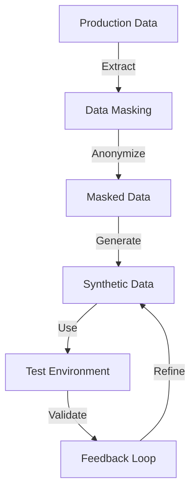

## 15.3 Test Data Management

In the realm of SQL development, test data management is a critical component that ensures the robustness and reliability of database systems. As expert software engineers and architects, understanding how to effectively manage test data is essential for maintaining data integrity, ensuring compliance with data privacy laws, and facilitating efficient testing processes. This section delves into the strategies, tools, and considerations necessary for mastering test data management in SQL development.

### Introduction to Test Data Management

Test data management involves the creation, maintenance, and use of data sets that are used to test and validate the functionality of SQL databases and applications. Effective test data management ensures that testing environments are realistic and comprehensive, allowing developers to identify and rectify issues before they impact production systems.

### Strategies for Test Data Management

#### Synthetic Test Data

Synthetic test data refers to artificially generated data that mimics real-world scenarios. This approach allows developers to create data sets that cover a wide range of test cases, including edge cases and unusual scenarios that may not be present in production data.

- **Advantages**: Synthetic data is highly customizable and can be tailored to specific testing needs. It eliminates the risk of exposing sensitive production data and can be generated in large volumes to support extensive testing.
- **Challenges**: Creating realistic synthetic data requires a deep understanding of the data model and the relationships between different data entities.

**Example**: Using a FAKER library to generate synthetic data for a customer database.

```sql
-- Example of generating synthetic customer data using a FAKER library
INSERT INTO Customers (CustomerID, FirstName, LastName, Email, PhoneNumber)
VALUES
  (1, 'John', 'Doe', 'john.doe@example.com', '555-0100'),
  (2, 'Jane', 'Smith', 'jane.smith@example.com', '555-0101'),
  (3, 'Alice', 'Johnson', 'alice.johnson@example.com', '555-0102');
```

#### Data Masking

Data masking involves obfuscating sensitive data from production environments to create a safe and compliant test data set. This technique is crucial for maintaining data privacy and adhering to regulations such as GDPR and HIPAA.

- **Static Data Masking**: Involves masking data in a non-production environment, creating a permanent masked data set.
- **Dynamic Data Masking**: Masks data on-the-fly as it is accessed by non-privileged users, ensuring that sensitive information is never exposed.

**Example**: Masking sensitive customer data.

```sql
-- Example of masking sensitive data in a customer table
UPDATE Customers
SET Email = CONCAT('masked_', CustomerID, '@example.com'),
    PhoneNumber = 'XXX-XXXX'
WHERE CustomerID IN (SELECT CustomerID FROM Customers);
```

### Tools for Test Data Management

#### Data Generation Tools

Data generation tools, such as FAKER libraries and specialized data generators, are invaluable for creating synthetic test data. These tools can automate the process of data creation, ensuring consistency and reducing manual effort.

- **FAKER Libraries**: Provide a wide range of functions to generate random data for various data types, including names, addresses, and dates.
- **Data Generators**: Offer more advanced features, such as generating data based on complex rules and relationships.

#### Data Masking Software

Data masking software automates the process of anonymizing sensitive data, ensuring compliance with data privacy regulations. These tools often provide features such as:

- **Rule-Based Masking**: Allows users to define masking rules based on data types and sensitivity levels.
- **Audit Trails**: Tracks changes made to data, ensuring transparency and accountability.

### Considerations for Test Data Management

#### Compliance

Compliance with data privacy laws is a paramount consideration in test data management. Regulations such as GDPR and HIPAA impose strict requirements on how personal data is handled, even in testing environments.

- **Data Minimization**: Ensure that only the necessary data is used for testing purposes.
- **Anonymization**: Implement techniques to anonymize personal data, reducing the risk of data breaches.

#### Data Integrity

Maintaining data integrity is crucial for ensuring that test results are reliable and accurate. This involves:

- **Consistency**: Ensuring that data relationships and constraints are preserved in test data sets.
- **Validation**: Regularly validating test data to ensure it accurately reflects the production environment.

### Visualizing Test Data Management

To better understand the flow of test data management, consider the following diagram illustrating the process of generating and managing test data.



**Diagram Description**: This flowchart illustrates the process of test data management, starting from extracting production data, applying data masking to create masked data, generating synthetic data, and using it in the test environment. A feedback loop ensures continuous refinement and validation of test data.

### Try It Yourself

Encourage experimentation by modifying the code examples provided. For instance, try generating synthetic data for different database tables or applying different masking techniques to see how they affect the test data set.

### References and Links

- [GDPR Compliance](https://gdpr-info.eu/)
- [HIPAA Compliance](https://www.hhs.gov/hipaa/index.html)
- [FAKER Library Documentation](https://faker.readthedocs.io/en/master/)

### Knowledge Check

- What are the benefits of using synthetic test data?
- How does data masking contribute to data privacy?
- What tools can be used for generating synthetic data?

### Embrace the Journey

Remember, mastering test data management is an ongoing process. As you continue to develop your skills, you'll find new ways to optimize your testing processes and ensure data privacy and compliance. Keep experimenting, stay curious, and enjoy the journey!

### Quiz Time!



### What is the primary purpose of synthetic test data?

- [x] To mimic real-world scenarios for testing
- [ ] To replace production data permanently
- [ ] To reduce database size
- [ ] To improve query performance

> **Explanation:** Synthetic test data is used to create realistic scenarios for testing without using actual production data.

### What is a key advantage of data masking?

- [x] It protects sensitive data in non-production environments
- [ ] It increases database performance
- [ ] It reduces storage requirements
- [ ] It simplifies database schema

> **Explanation:** Data masking ensures that sensitive information is not exposed in testing environments, maintaining data privacy.

### Which tool is commonly used for generating synthetic data?

- [x] FAKER library
- [ ] SQL Server Management Studio
- [ ] Oracle Data Guard
- [ ] MySQL Workbench

> **Explanation:** The FAKER library is widely used for generating random data for testing purposes.

### What is dynamic data masking?

- [x] Masking data on-the-fly as it is accessed
- [ ] Permanently altering data in the database
- [ ] Encrypting data at rest
- [ ] Backing up data regularly

> **Explanation:** Dynamic data masking masks data in real-time as it is accessed by users, ensuring sensitive data is not exposed.

### Why is compliance important in test data management?

- [x] To adhere to data privacy laws
- [ ] To increase database performance
- [ ] To reduce storage costs
- [ ] To simplify database design

> **Explanation:** Compliance with data privacy laws is crucial to avoid legal issues and protect personal data.

### What does data minimization involve?

- [x] Using only necessary data for testing
- [ ] Reducing database size
- [ ] Increasing query speed
- [ ] Simplifying data models

> **Explanation:** Data minimization ensures that only essential data is used in testing, reducing the risk of data breaches.

### How can data integrity be maintained in test data?

- [x] By ensuring data relationships and constraints are preserved
- [ ] By reducing database size
- [ ] By increasing query speed
- [ ] By simplifying data models

> **Explanation:** Maintaining data integrity involves preserving relationships and constraints to ensure accurate test results.

### What is a benefit of using data generation tools?

- [x] They automate the creation of test data
- [ ] They increase database performance
- [ ] They reduce storage costs
- [ ] They simplify database design

> **Explanation:** Data generation tools automate the process of creating test data, saving time and ensuring consistency.

### What is the role of audit trails in data masking software?

- [x] To track changes made to data
- [ ] To increase database performance
- [ ] To reduce storage costs
- [ ] To simplify database design

> **Explanation:** Audit trails provide transparency and accountability by tracking changes made to data during masking.

### True or False: Synthetic test data can be used to replace production data permanently.

- [ ] True
- [x] False

> **Explanation:** Synthetic test data is not meant to replace production data permanently; it is used for testing purposes only.


