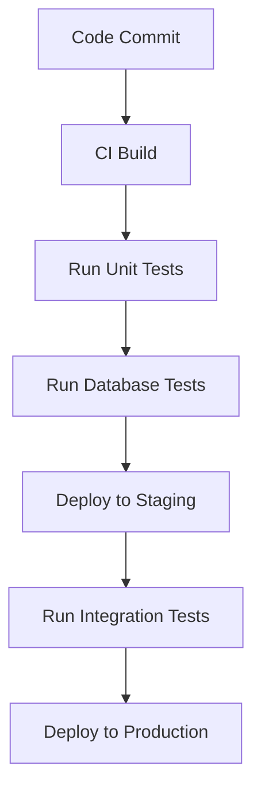

## 15.4 Automating Database Testing

In the realm of modern software development, automating database testing is a cornerstone for ensuring the reliability and efficiency of database systems. As databases become increasingly complex and integral to application architectures, the need for robust testing frameworks that can be seamlessly integrated into Continuous Integration (CI) and Continuous Deployment (CD) pipelines becomes paramount. This section delves into the principles, tools, and best practices for automating database testing, providing expert software engineers and architects with the knowledge to enhance their database testing strategies.

### Understanding Continuous Integration (CI) and Continuous Deployment (CD)

**Continuous Integration (CI)** is a development practice where developers integrate code into a shared repository frequently, ideally several times a day. Each integration is verified by an automated build and test process, allowing teams to detect problems early.

- **Integration**: Automating build and test cycles ensures that database changes are consistently validated against the latest codebase, reducing integration issues and improving code quality.

**Continuous Deployment (CD)** extends CI by automatically deploying code changes to production after passing the CI pipeline. This practice ensures that software can be released to users quickly and reliably.

- **Automation**: Deploying database changes through pipelines minimizes manual intervention, reducing the risk of human error and ensuring that deployments are consistent and repeatable.

### Key Concepts in Automating Database Testing

#### 1. Test Automation Frameworks

Test automation frameworks provide a structured environment for writing and executing automated tests. They offer libraries and tools to facilitate the creation of test scripts, manage test data, and generate test reports.

- **Example Frameworks**: Selenium, JUnit, TestNG for application testing; dbUnit, tSQLt for database-specific testing.

#### 2. Database Testing Types

Automating database testing involves several types of tests, each serving a distinct purpose:

- **Unit Tests**: Focus on individual database components, such as stored procedures and functions. These tests validate the correctness of database logic in isolation.
- **Integration Tests**: Verify the interaction between database components and other system parts, ensuring that data flows correctly through the application.
- **Performance Tests**: Assess the database's response time and throughput under various load conditions, identifying bottlenecks and scalability issues.
- **Security Tests**: Evaluate the database's resilience against unauthorized access and data breaches, ensuring compliance with security standards.

#### 3. Test Data Management

Effective test data management is crucial for automating database testing. It involves creating, maintaining, and cleaning up test data to ensure that tests are reliable and repeatable.

- **Data Generation**: Use tools like Faker or custom scripts to generate realistic test data.
- **Data Isolation**: Ensure that tests do not interfere with each other by using isolated test environments or database snapshots.

### Tools for Automating Database Testing

Several tools and platforms facilitate the automation of database testing, each offering unique features and integrations:

#### 1. CI/CD Platforms

CI/CD platforms provide the infrastructure to automate build, test, and deployment processes. They integrate with version control systems and offer plugins for various testing tools.

- **Jenkins**: An open-source automation server that supports building, deploying, and automating projects. Jenkins offers a wide range of plugins for database testing and integration.
- **GitHub Actions**: A CI/CD platform integrated with GitHub, allowing developers to automate workflows directly from their repositories.
- **Azure Pipelines**: A cloud-based CI/CD service that supports any language, platform, and cloud. Azure Pipelines provides robust integration with Azure SQL Database and other Microsoft services.

#### 2. Database Testing Tools

These tools are specifically designed for testing databases, offering features like test data generation, schema comparison, and performance analysis.

- **tSQLt**: A unit testing framework for SQL Server that allows developers to write tests in T-SQL. It supports mocking and isolation of database objects.
- **dbUnit**: A JUnit extension for database-driven projects, providing a way to load datasets into the database before executing tests.
- **SQLTest**: A tool for testing SQL Server databases, offering features like stress testing, performance analysis, and test automation.

### Benefits of Automating Database Testing

Automating database testing offers several advantages that enhance the overall software development lifecycle:

#### 1. Early Detection of Issues

Automated tests run frequently and consistently, catching issues early in the development process before they reach production. This early detection reduces the cost and effort required to fix defects.

#### 2. Consistency and Reliability

Automated testing ensures that tests are executed in a consistent manner, reducing the variability introduced by manual testing. This consistency leads to more reliable test results and higher confidence in the system's stability.

#### 3. Faster Feedback Loops

By integrating automated tests into CI/CD pipelines, teams receive immediate feedback on the impact of their changes. This rapid feedback loop accelerates development and allows for quicker iterations.

#### 4. Improved Collaboration

Automated testing facilitates better collaboration between developers, testers, and operations teams. By providing a common framework for testing, teams can work together more effectively to identify and resolve issues.

### Implementing Automated Database Testing

To successfully implement automated database testing, follow these best practices:

#### 1. Define Clear Testing Objectives

Establish clear objectives for your testing efforts, focusing on the most critical aspects of your database system. Prioritize tests that provide the most value in terms of risk reduction and quality assurance.

#### 2. Choose the Right Tools

Select tools that align with your team's skills, project requirements, and technology stack. Consider factors like ease of integration, support for your database platform, and community support.

#### 3. Integrate with CI/CD Pipelines

Integrate your automated tests into your CI/CD pipelines to ensure that they are executed consistently and automatically. Use pipeline stages to separate different types of tests and control the flow of your deployment process.

#### 4. Maintain Test Suites

Regularly review and update your test suites to ensure they remain relevant and effective. Remove obsolete tests, add new tests for emerging requirements, and refactor tests to improve readability and maintainability.

#### 5. Monitor and Analyze Test Results

Continuously monitor and analyze test results to identify trends, detect anomalies, and improve your testing strategy. Use dashboards and reporting tools to visualize test outcomes and track key metrics.

### Code Example: Automating Database Testing with tSQLt

Let's explore a simple example of automating database testing using the tSQLt framework for SQL Server.

```sql
-- Step 1: Install tSQLt framework
EXEC tSQLt.NewTestClass 'ExampleTests';

-- Step 2: Create a test case for a stored procedure
CREATE PROCEDURE ExampleTests.[test CalculateTotalPrice]
AS
BEGIN
    -- Arrange: Set up test data
    INSERT INTO Orders (OrderID, Quantity, UnitPrice)
    VALUES (1, 2, 10.00);

    -- Act: Execute the stored procedure
    EXEC CalculateTotalPrice @OrderID = 1;

    -- Assert: Verify the expected outcome
    EXEC tSQLt.AssertEquals @Expected = 20.00, @Actual = (SELECT TotalPrice FROM Orders WHERE OrderID = 1);
END;
GO

-- Step 3: Run the test
EXEC tSQLt.Run 'ExampleTests';
```

In this example, we define a test case for a stored procedure `CalculateTotalPrice`. The test sets up test data, executes the stored procedure, and verifies the expected outcome using `tSQLt.AssertEquals`.

### Visualizing the CI/CD Pipeline for Database Testing

To better understand the integration of automated database testing within a CI/CD pipeline, let's visualize the process using a flowchart.



**Figure 1: CI/CD Pipeline for Database Testing**

This flowchart illustrates a typical CI/CD pipeline, where database tests are executed after the CI build and unit tests, ensuring that database changes are validated before deployment.

### Try It Yourself

Experiment with the provided code example by modifying the test data or stored procedure logic. Try adding additional test cases to cover different scenarios, such as edge cases or error conditions. This hands-on practice will deepen your understanding of automated database testing and its integration into CI/CD pipelines.

### References and Further Reading

- [tSQLt: Database Unit Testing for SQL Server](http://tsqlt.org/)
- [Jenkins: The Leading Open Source Automation Server](https://www.jenkins.io/)
- [Azure Pipelines Documentation](https://docs.microsoft.com/en-us/azure/devops/pipelines/?view=azure-devops)
- [GitHub Actions Documentation](https://docs.github.com/en/actions)

### Knowledge Check

- What are the key benefits of automating database testing?
- How does integrating automated tests into CI/CD pipelines improve software development?
- What are some common tools used for automating database testing?

### Embrace the Journey

Remember, automating database testing is an ongoing journey. As you implement and refine your testing strategies, you'll gain valuable insights that will enhance your database systems' reliability and performance. Keep experimenting, stay curious, and enjoy the journey!

## Quiz Time!



### What is Continuous Integration (CI)?

- [x] A development practice where developers integrate code into a shared repository frequently.
- [ ] A process for deploying code changes to production automatically.
- [ ] A tool for managing database schemas.
- [ ] A method for generating test data.

> **Explanation:** Continuous Integration (CI) involves integrating code into a shared repository frequently, with automated build and test processes to detect issues early.

### What is the primary goal of Continuous Deployment (CD)?

- [x] To automatically deploy code changes to production after passing the CI pipeline.
- [ ] To generate test data for database testing.
- [ ] To manage database schemas and migrations.
- [ ] To provide a framework for writing automated tests.

> **Explanation:** Continuous Deployment (CD) aims to automatically deploy code changes to production after they pass the CI pipeline, ensuring quick and reliable releases.

### Which of the following is a benefit of automating database testing?

- [x] Early detection of issues.
- [ ] Increased manual testing effort.
- [ ] Reduced consistency in test execution.
- [ ] Slower feedback loops.

> **Explanation:** Automating database testing provides early detection of issues, reducing the cost and effort required to fix defects.

### Which tool is specifically designed for unit testing SQL Server databases?

- [x] tSQLt
- [ ] Selenium
- [ ] JUnit
- [ ] TestNG

> **Explanation:** tSQLt is a unit testing framework specifically designed for SQL Server databases, allowing developers to write tests in T-SQL.

### What is a key advantage of integrating automated tests into CI/CD pipelines?

- [x] Faster feedback loops.
- [ ] Increased manual intervention.
- [ ] Reduced test coverage.
- [ ] Slower deployment processes.

> **Explanation:** Integrating automated tests into CI/CD pipelines provides faster feedback loops, accelerating development and allowing for quicker iterations.

### Which CI/CD platform is integrated with GitHub?

- [x] GitHub Actions
- [ ] Jenkins
- [ ] Azure Pipelines
- [ ] SQLTest

> **Explanation:** GitHub Actions is a CI/CD platform integrated with GitHub, allowing developers to automate workflows directly from their repositories.

### What is the purpose of test data management in automated database testing?

- [x] To create, maintain, and clean up test data for reliable and repeatable tests.
- [ ] To increase the complexity of test cases.
- [ ] To reduce the number of test cases.
- [ ] To automate the deployment process.

> **Explanation:** Test data management involves creating, maintaining, and cleaning up test data to ensure that tests are reliable and repeatable.

### Which of the following is a type of database test?

- [x] Unit Test
- [ ] Code Review
- [ ] Deployment Test
- [ ] Code Refactoring

> **Explanation:** Unit tests focus on individual database components, such as stored procedures and functions, validating their correctness in isolation.

### What is the role of a test automation framework?

- [x] To provide a structured environment for writing and executing automated tests.
- [ ] To manage database schemas and migrations.
- [ ] To deploy code changes to production.
- [ ] To generate test data for database testing.

> **Explanation:** Test automation frameworks provide a structured environment for writing and executing automated tests, facilitating the creation of test scripts and management of test data.

### True or False: Automating database testing reduces the reliability of test results.

- [ ] True
- [x] False

> **Explanation:** Automating database testing increases the reliability of test results by ensuring that tests are executed consistently and reducing the variability introduced by manual testing.


