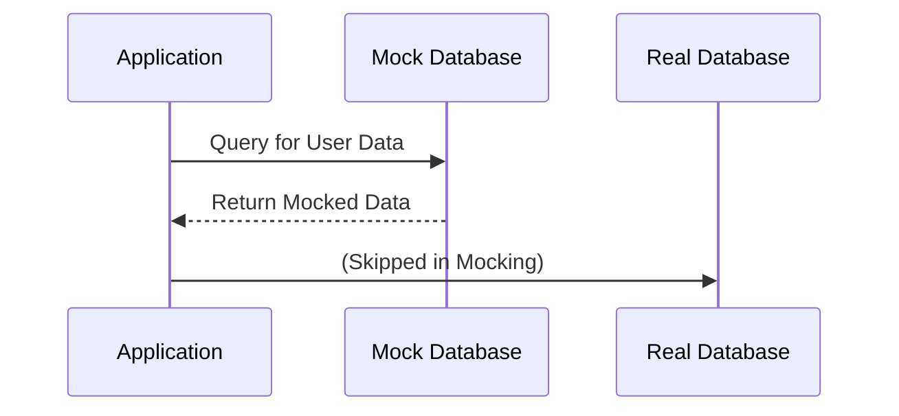

## 15.5 Mocking and Stubbing Databases

In the realm of software development, testing is a critical component that ensures the reliability and robustness of applications. When it comes to SQL and database-driven applications, testing can become complex due to the dependency on database interactions. Mocking and stubbing databases are powerful techniques that allow developers to isolate application logic from the database, facilitating faster and more focused testing.

### Understanding Mocking and Stubbing

**Mocking** and **stubbing** are techniques used to simulate the behavior of complex systems or components in a controlled manner. In the context of databases, these techniques help in creating a virtual database environment that mimics the behavior of a real database without involving actual database operations.

#### Mock Objects

Mock objects are simulated objects that mimic the behavior of real objects in a controlled way. They are used to test the interactions between components in isolation. In database testing, mock objects can simulate database connections, queries, and transactions.

#### Test Doubles

Test doubles are objects that stand in for real objects during testing. They provide controlled responses to interactions, allowing developers to test specific scenarios without relying on a real database. Test doubles can take various forms, including stubs, mocks, and fakes.

### Techniques for Mocking and Stubbing Databases

#### 1. Using Mock Libraries

Several libraries and frameworks are available to facilitate mocking and stubbing in SQL development. These libraries provide tools to create mock objects and test doubles for database interactions.

- **Mockito**: A popular Java-based mocking framework that allows developers to create mock objects for testing.
- **Mocha**: A JavaScript test framework that can be used with libraries like Sinon.js for mocking.
- **Pytest-mock**: An extension for the Pytest framework in Python, providing easy-to-use mocking capabilities.

#### 2. Creating Test Doubles

Test doubles can be created manually or using libraries. They replace real database interactions with predefined responses, allowing developers to test application logic without involving the database.

```python
from unittest.mock import MagicMock

mock_db = MagicMock()

mock_db.query.return_value = [{'id': 1, 'name': 'Test User'}]

def get_user_name(user_id, db):
    result = db.query(f"SELECT name FROM users WHERE id = {user_id}")
    return result[0]['name'] if result else None

assert get_user_name(1, mock_db) == 'Test User'
```

#### 3. Stubbing Database Methods

Stubbing involves replacing specific methods or functions with predefined responses. This technique is useful for testing specific scenarios without executing the actual database logic.

```java
// Example of stubbing in Java using Mockito
import static org.mockito.Mockito.*;

public class UserServiceTest {
    @Test
    public void testGetUserName() {
        // Create a mock database connection
        Database mockDb = mock(Database.class);

        // Stub the query method to return a controlled response
        when(mockDb.query("SELECT name FROM users WHERE id = 1"))
            .thenReturn("Test User");

        // Use the mock database in the service
        UserService userService = new UserService(mockDb);
        String userName = userService.getUserName(1);

        // Verify the result
        assertEquals("Test User", userName);
    }
}
```

### Advantages of Mocking and Stubbing Databases

#### Speed

By avoiding actual database calls, tests run significantly faster. This speed improvement is crucial for large test suites and continuous integration environments where quick feedback is essential.

#### Isolation

Mocking and stubbing allow developers to focus on testing application logic without side effects from the database. This isolation ensures that tests are not affected by changes in the database schema or data.

#### Control

With mock objects and test doubles, developers have complete control over the responses and behavior of database interactions. This control enables testing of edge cases and error scenarios that may be difficult to reproduce with a real database.

### Visualizing Mocking and Stubbing

To better understand the process of mocking and stubbing databases, let's visualize the interaction between application components and mock objects.



**Diagram Description**: This sequence diagram illustrates how an application interacts with a mock database instead of a real database during testing. The application sends a query to the mock database, which returns predefined data, bypassing the real database.

### Best Practices for Mocking and Stubbing

1. **Define Clear Expectations**: Clearly define the expected behavior and responses of mock objects and test doubles. This clarity ensures that tests are predictable and reliable.

2. **Use Mocking Libraries**: Leverage existing libraries and frameworks to simplify the creation and management of mock objects. These tools provide robust features for mocking and stubbing.

3. **Keep Tests Focused**: Ensure that tests focus on specific application logic and scenarios. Avoid over-mocking, which can lead to brittle tests that are difficult to maintain.

4. **Regularly Update Mocks**: As the application evolves, update mock objects and test doubles to reflect changes in the database schema or logic. Regular updates prevent tests from becoming outdated.

### Try It Yourself

To gain hands-on experience with mocking and stubbing databases, try modifying the code examples provided. Experiment with different scenarios, such as simulating database errors or testing edge cases. By doing so, you'll deepen your understanding of these techniques and their applications.

### References and Further Reading

- [Mockito Documentation](https://site.mockito.org/)
- [Mocha Documentation](https://mochajs.org/)
- [Pytest-mock Documentation](https://pypi.org/project/pytest-mock/)

### Knowledge Check

To reinforce your understanding of mocking and stubbing databases, consider the following questions and challenges:

- What are the key differences between mocking and stubbing?
- How can you simulate a database error using a mock object?
- Why is it important to isolate application logic from the database during testing?

### Embrace the Journey

Remember, mastering mocking and stubbing databases is just one step in your journey as a software engineer. As you continue to explore and experiment with these techniques, you'll build more reliable and robust applications. Keep experimenting, stay curious, and enjoy the journey!

## Quiz Time!



### What is the primary purpose of mocking and stubbing databases?

- [x] To isolate application logic from the database during testing
- [ ] To improve database performance
- [ ] To replace database administrators
- [ ] To enhance database security

> **Explanation:** Mocking and stubbing databases are primarily used to isolate application logic from the database during testing, allowing for faster and more focused tests.

### Which of the following is a popular Java-based mocking framework?

- [x] Mockito
- [ ] Mocha
- [ ] Pytest-mock
- [ ] Sinon.js

> **Explanation:** Mockito is a popular Java-based mocking framework used to create mock objects for testing.

### What is a test double?

- [x] An object that stands in for a real object during testing
- [ ] A database query optimizer
- [ ] A type of database index
- [ ] A SQL command

> **Explanation:** A test double is an object that stands in for a real object during testing, providing controlled responses to interactions.

### What advantage does mocking and stubbing provide in terms of test speed?

- [x] Tests run faster by avoiding actual database calls
- [ ] Tests run slower due to additional complexity
- [ ] Tests require more database resources
- [ ] Tests become less reliable

> **Explanation:** Mocking and stubbing allow tests to run faster by avoiding actual database calls, which can be time-consuming.

### How can you simulate a database error using a mock object?

- [x] By defining a controlled response that mimics an error
- [ ] By executing a real database query
- [ ] By modifying the database schema
- [ ] By disabling the database server

> **Explanation:** You can simulate a database error using a mock object by defining a controlled response that mimics an error scenario.

### What is the role of a mock object in testing?

- [x] To simulate the behavior of real objects in a controlled way
- [ ] To execute real database queries
- [ ] To replace the application logic
- [ ] To enhance database security

> **Explanation:** A mock object simulates the behavior of real objects in a controlled way, allowing for isolated testing of application logic.

### Why is it important to regularly update mock objects?

- [x] To reflect changes in the database schema or logic
- [ ] To increase test complexity
- [ ] To reduce test coverage
- [ ] To simplify database administration

> **Explanation:** Regularly updating mock objects ensures that tests remain accurate and reflect changes in the database schema or logic.

### What is the benefit of using mocking libraries?

- [x] They simplify the creation and management of mock objects
- [ ] They increase test execution time
- [ ] They replace the need for test doubles
- [ ] They enhance database security

> **Explanation:** Mocking libraries simplify the creation and management of mock objects, providing robust features for testing.

### What is the key difference between mocking and stubbing?

- [x] Mocking simulates behavior, while stubbing replaces methods with predefined responses
- [ ] Mocking is faster than stubbing
- [ ] Stubbing is more secure than mocking
- [ ] Mocking requires real database connections

> **Explanation:** Mocking simulates behavior, while stubbing involves replacing specific methods with predefined responses.

### True or False: Mocking and stubbing can help test edge cases and error scenarios.

- [x] True
- [ ] False

> **Explanation:** True. Mocking and stubbing provide control over responses, allowing developers to test edge cases and error scenarios effectively.


