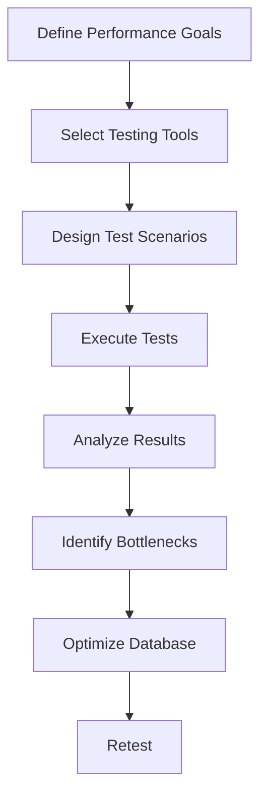

## 15.6 Performance and Load Testing

In the realm of SQL database development, ensuring optimal performance and reliability under various load conditions is paramount. Performance and load testing are critical components of the software development lifecycle, particularly for systems that rely heavily on database interactions. This section delves into the intricacies of performance and load testing, providing expert software engineers and architects with the knowledge and tools necessary to assess and enhance database performance.

### Understanding Performance and Load Testing

Performance testing is the process of determining the speed, responsiveness, and stability of a database under a particular workload. Load testing, a subset of performance testing, involves simulating a specific number of users or transactions to assess how the database handles peak loads. Together, these tests help identify bottlenecks, ensure scalability, and verify that the database meets performance requirements.

#### Goals of Performance and Load Testing

- **Assess Database Performance**: Evaluate how the database performs under expected and peak loads.
- **Identify Bottlenecks**: Detect areas where performance degrades and address them.
- **Ensure Scalability**: Verify that the database can handle increased loads as the application grows.
- **Optimize Resource Utilization**: Ensure efficient use of CPU, memory, and I/O resources.

### Tools for Performance and Load Testing

Selecting the right tools is crucial for effective performance and load testing. Here are some widely-used tools:

#### Load Testing Tools

1. **Apache JMeter**: An open-source tool designed for load testing and measuring performance. It supports various protocols and is highly extensible.
   
   ```shell
   # Example command to run a JMeter test
   jmeter -n -t test_plan.jmx -l results.jtl
   ```

2. **Gatling**: A powerful tool for load testing that provides detailed metrics and reports. It is particularly useful for testing web applications and APIs.

3. **LoadRunner**: A comprehensive performance testing tool that simulates user activity and measures system behavior under load.

#### Profiling Tools

1. **Database-Specific Profilers**: Tools like SQL Server Profiler, Oracle SQL Developer, and MySQL Enterprise Monitor help analyze query performance and identify slow-running queries.

2. **New Relic and AppDynamics**: These tools provide insights into database performance as part of broader application performance monitoring solutions.

### Key Metrics for Performance and Load Testing

Understanding and measuring the right metrics is essential for effective performance and load testing. Here are some critical metrics to consider:

#### Throughput

Throughput refers to the number of transactions processed by the database in a given time frame. It is a measure of the system's capacity to handle requests.

- **Formula**: Throughput = Total Transactions / Time Period

#### Latency

Latency is the time taken to complete a database operation, from the moment a request is made until the response is received. It is crucial to minimize latency to ensure a responsive user experience.

- **Formula**: Latency = Response Time - Request Time

### Optimization Techniques

Once performance issues are identified, optimization techniques can be applied to enhance database performance. Here are some strategies:

#### Indexing

Indexes are critical for improving query performance by reducing the amount of data scanned during query execution. Proper indexing can significantly speed up data retrieval operations.

- **Example**: Creating an index on a frequently queried column.

  ```sql
  CREATE INDEX idx_customer_name ON customers (name);
  ```

#### Query Tuning

Query tuning involves refining SQL statements to improve their execution efficiency. This can include rewriting queries, using joins effectively, and avoiding unnecessary computations.

- **Example**: Using a more efficient join operation.

  ```sql
  -- Original query
  SELECT * FROM orders, customers WHERE orders.customer_id = customers.id;

  -- Optimized query using INNER JOIN
  SELECT * FROM orders INNER JOIN customers ON orders.customer_id = customers.id;
  ```

#### Caching

Implement caching mechanisms to store frequently accessed data in memory, reducing the need for repeated database queries.

- **Example**: Using a caching layer like Redis or Memcached.

#### Partitioning

Partitioning involves dividing a database table into smaller, more manageable pieces, which can improve query performance and simplify maintenance.

- **Example**: Range partitioning based on date.

  ```sql
  CREATE TABLE orders (
    order_id INT,
    order_date DATE,
    ...
  ) PARTITION BY RANGE (YEAR(order_date));
  ```

### Visualizing Performance Testing Workflow

To better understand the workflow of performance testing, let's visualize the process using a flowchart.



**Figure 1**: Performance Testing Workflow

### Try It Yourself

To gain hands-on experience with performance and load testing, try the following exercises:

1. **Set Up a JMeter Test Plan**: Create a test plan in JMeter to simulate 100 concurrent users querying a database. Analyze the results to identify any performance bottlenecks.

2. **Optimize a Slow Query**: Identify a slow-running query in your database and apply indexing and query tuning techniques to improve its performance.

3. **Implement Caching**: Use a caching solution like Redis to store the results of a frequently executed query and measure the performance improvement.

### References and Links

- [Apache JMeter Documentation](https://jmeter.apache.org/usermanual/index.html)
- [Gatling Official Website](https://gatling.io/)
- [LoadRunner Product Page](https://www.microfocus.com/en-us/products/loadrunner-professional/overview)
- [SQL Server Profiler Documentation](https://docs.microsoft.com/en-us/sql/tools/sql-server-profiler/sql-server-profiler)
- [MySQL Enterprise Monitor](https://www.mysql.com/products/enterprise/monitor.html)

### Knowledge Check

- **What is the primary goal of performance testing?**
- **How does indexing improve query performance?**
- **What is the difference between throughput and latency?**

### Embrace the Journey

Remember, performance and load testing is an iterative process. As you continue to refine your skills, you'll become adept at identifying and resolving performance issues, ensuring your databases are robust and efficient. Keep experimenting, stay curious, and enjoy the journey!

## Quiz Time!



### What is the primary goal of performance testing?

- [x] To evaluate how the database performs under expected and peak loads
- [ ] To create new database schemas
- [ ] To develop new SQL queries
- [ ] To design user interfaces

> **Explanation:** Performance testing aims to assess how the database performs under various load conditions, identifying bottlenecks and ensuring scalability.

### Which tool is commonly used for load testing?

- [x] Apache JMeter
- [ ] Microsoft Excel
- [ ] Visual Studio
- [ ] Adobe Photoshop

> **Explanation:** Apache JMeter is a widely-used open-source tool for load testing and measuring performance.

### What does throughput measure in performance testing?

- [x] The number of transactions processed in a given time frame
- [ ] The total size of the database
- [ ] The number of users connected
- [ ] The amount of disk space used

> **Explanation:** Throughput measures the system's capacity to handle requests by counting the number of transactions processed over time.

### How can indexing improve query performance?

- [x] By reducing the amount of data scanned during query execution
- [ ] By increasing the size of the database
- [ ] By adding more tables to the database
- [ ] By changing the database schema

> **Explanation:** Indexing helps improve query performance by minimizing the data scanned, thus speeding up data retrieval operations.

### What is latency in the context of performance testing?

- [x] The time taken to complete a database operation
- [ ] The total number of users
- [ ] The size of the database
- [ ] The number of queries executed

> **Explanation:** Latency refers to the time taken from when a request is made until the response is received, impacting user experience.

### Which of the following is a profiling tool for SQL databases?

- [x] SQL Server Profiler
- [ ] Microsoft Word
- [ ] Adobe Acrobat
- [ ] Google Chrome

> **Explanation:** SQL Server Profiler is a tool used to analyze query performance and identify slow-running queries in SQL databases.

### What is the purpose of query tuning?

- [x] To refine SQL statements for improved execution efficiency
- [ ] To create new database tables
- [ ] To delete old data
- [ ] To design user interfaces

> **Explanation:** Query tuning involves refining SQL statements to enhance their execution efficiency, improving overall database performance.

### What is the benefit of using caching in database operations?

- [x] To store frequently accessed data in memory, reducing repeated queries
- [ ] To increase the size of the database
- [ ] To add more tables to the database
- [ ] To change the database schema

> **Explanation:** Caching stores frequently accessed data in memory, reducing the need for repeated database queries and improving performance.

### What does partitioning a database table involve?

- [x] Dividing a table into smaller, more manageable pieces
- [ ] Merging multiple tables into one
- [ ] Deleting unused tables
- [ ] Changing the database schema

> **Explanation:** Partitioning involves dividing a database table into smaller segments, which can enhance query performance and simplify maintenance.

### True or False: Load testing is a subset of performance testing.

- [x] True
- [ ] False

> **Explanation:** Load testing is indeed a subset of performance testing, focusing on simulating specific user loads to assess system behavior.


