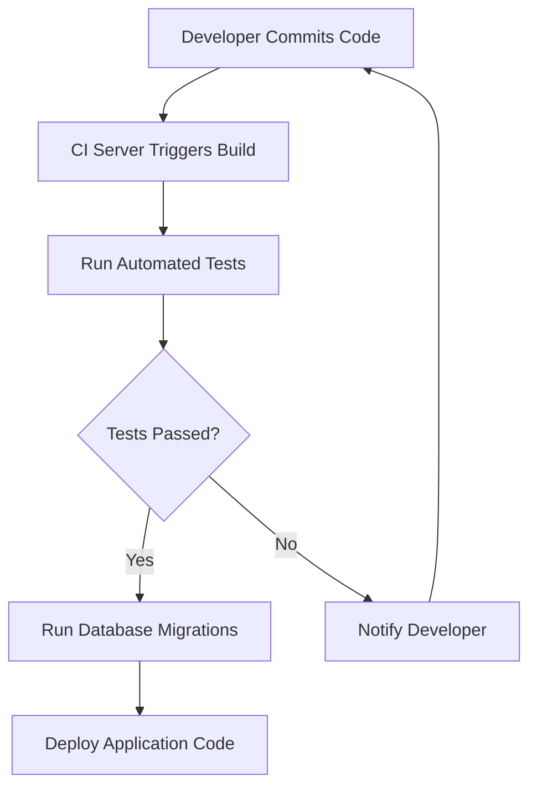

## 15.7 Continuous Integration and Deployment (CI/CD) for Databases

In the world of software development, Continuous Integration and Deployment (CI/CD) have become essential practices for delivering high-quality applications efficiently. However, when it comes to databases, implementing CI/CD presents unique challenges due to their stateful nature. In this section, we will delve into the intricacies of CI/CD for databases, explore the challenges, and provide best practices and tools to streamline the process.

### Understanding CI/CD for Databases

CI/CD for databases involves automating the integration and deployment of database changes, ensuring that they are tested and deployed in a consistent and reliable manner. This process is crucial for maintaining the integrity and performance of database systems as they evolve.

#### Key Concepts

- **Continuous Integration (CI)**: The practice of automatically integrating code changes from multiple contributors into a shared repository. For databases, this involves integrating schema changes, stored procedures, and other database objects.
- **Continuous Deployment (CD)**: The process of automatically deploying integrated changes to production environments. In the context of databases, this means deploying schema changes, data migrations, and configuration updates.

### Challenges in CI/CD for Databases

Implementing CI/CD for databases is not without its challenges. Here are some of the key obstacles:

#### State Management

Databases are inherently stateful, meaning they maintain persistent data that must be carefully managed during deployments. Unlike stateless application code, database changes can have significant impacts on data integrity and availability.

#### Dependency Order

Database changes often have dependencies that must be executed in a specific order. For example, a new column cannot be added to a table before the table itself is created. Managing these dependencies is crucial to avoid deployment failures.

#### Rollback Complexity

Rolling back database changes can be complex, especially when data transformations are involved. Unlike application code, where a simple redeployment can revert changes, databases require careful planning to ensure data consistency during rollbacks.

#### Testing and Validation

Testing database changes is more challenging than testing application code. It requires validating not only the schema changes but also the impact on existing data and application functionality.

### Best Practices for CI/CD in Databases

To overcome these challenges, it's essential to adopt best practices that ensure smooth and reliable database deployments.

#### Version Control

Store all database scripts, including schema definitions, stored procedures, and data migrations, in a version control system. This practice ensures that all changes are tracked, auditable, and can be rolled back if necessary.

#### Automated Migrations

Use tools to automate the application of schema changes and data migrations. These tools help manage the order of changes, handle dependencies, and ensure that migrations are applied consistently across environments.

#### Continuous Testing

Implement automated tests for database changes, including unit tests for stored procedures and integration tests for schema changes. This practice helps catch issues early in the development process and ensures that changes do not break existing functionality.

#### Environment Parity

Ensure that development, testing, and production environments are as similar as possible. This parity reduces the risk of environment-specific issues and ensures that changes behave consistently across all stages of deployment.

#### Rollback Strategies

Develop rollback strategies for database changes, including automated scripts to revert schema changes and data transformations. This preparation is crucial for minimizing downtime and data loss in the event of a failed deployment.

### Tools for CI/CD in Databases

Several tools can help automate and streamline the CI/CD process for databases. Here are some popular options:

#### Flyway

Flyway is an open-source database migration tool that supports versioned migrations. It integrates with CI/CD pipelines to automate the application of schema changes and ensures that migrations are applied consistently across environments.

```sql
-- Example Flyway migration script
-- Version 1.0.0 - Create users table
CREATE TABLE users (
    id SERIAL PRIMARY KEY,
    username VARCHAR(50) NOT NULL,
    email VARCHAR(100) NOT NULL
);
```

#### Liquibase

Liquibase is another popular database migration tool that supports version control for database changes. It provides a flexible XML-based format for defining migrations and integrates with CI/CD pipelines to automate deployments.

```xml
<!-- Example Liquibase changeSet -->
<changeSet id="1" author="dev">
    <createTable tableName="users">
        <column name="id" type="int" autoIncrement="true">
            <constraints primaryKey="true"/>
        </column>
        <column name="username" type="varchar(50)">
            <constraints nullable="false"/>
        </column>
        <column name="email" type="varchar(100)">
            <constraints nullable="false"/>
        </column>
    </createTable>
</changeSet>
```

#### Jenkins

Jenkins is a widely used automation server that can be configured to run database migrations as part of a CI/CD pipeline. It supports integration with tools like Flyway and Liquibase to automate database deployments.

```groovy
// Jenkins pipeline script for database deployment
pipeline {
    agent any
    stages {
        stage('Build') {
            steps {
                // Build application code
            }
        }
        stage('Test') {
            steps {
                // Run automated tests
            }
        }
        stage('Deploy Database') {
            steps {
                // Run Flyway migrations
                sh 'flyway migrate'
            }
        }
        stage('Deploy Application') {
            steps {
                // Deploy application code
            }
        }
    }
}
```

### Visualizing CI/CD Workflow for Databases

To better understand the CI/CD workflow for databases, let's visualize the process using a flowchart.



**Figure 1**: CI/CD Workflow for Databases

### Try It Yourself

To gain hands-on experience with CI/CD for databases, try setting up a simple pipeline using Jenkins and Flyway. Experiment with creating migration scripts, running automated tests, and deploying changes to a test environment. Modify the pipeline to include additional stages, such as rollback and notification, to enhance its functionality.

### Knowledge Check

- Explain the challenges of implementing CI/CD for databases.
- Describe the role of version control in database CI/CD.
- Demonstrate how to use Flyway for database migrations.
- Provide examples of automated tests for database changes.
- Discuss the importance of environment parity in CI/CD.

### Embrace the Journey

Remember, mastering CI/CD for databases is a journey. As you progress, you'll encounter new challenges and opportunities to refine your processes. Keep experimenting, stay curious, and enjoy the journey!

## Quiz Time!



### What is a key challenge of implementing CI/CD for databases?

- [x] State management
- [ ] Statelessness
- [ ] Lack of tools
- [ ] Code complexity

> **Explanation:** Databases are stateful, making state management a key challenge in CI/CD.

### Which tool is commonly used for database migrations in CI/CD pipelines?

- [x] Flyway
- [ ] Jenkins
- [ ] Docker
- [ ] Kubernetes

> **Explanation:** Flyway is a popular tool for managing database migrations in CI/CD pipelines.

### What is the purpose of version control in database CI/CD?

- [x] To track and manage database changes
- [ ] To automate deployments
- [ ] To run tests
- [ ] To monitor performance

> **Explanation:** Version control is used to track and manage database changes, ensuring they are auditable and reversible.

### Which of the following is a best practice for CI/CD in databases?

- [x] Automated migrations
- [ ] Manual deployments
- [ ] Ignoring dependencies
- [ ] Skipping tests

> **Explanation:** Automated migrations ensure that database changes are applied consistently and reliably.

### What is a rollback strategy in database CI/CD?

- [x] A plan to revert database changes
- [ ] A method to deploy changes
- [ ] A tool for testing
- [ ] A way to monitor performance

> **Explanation:** A rollback strategy is a plan to revert database changes in case of deployment failures.

### Which stage in a CI/CD pipeline involves running automated tests?

- [x] Test
- [ ] Build
- [ ] Deploy
- [ ] Monitor

> **Explanation:** The Test stage involves running automated tests to validate changes.

### What is the role of environment parity in CI/CD?

- [x] To ensure consistency across environments
- [ ] To automate deployments
- [ ] To track changes
- [ ] To run tests

> **Explanation:** Environment parity ensures that changes behave consistently across development, testing, and production environments.

### Which tool can be used to automate database deployments in a CI/CD pipeline?

- [x] Jenkins
- [ ] Docker
- [ ] Kubernetes
- [ ] Git

> **Explanation:** Jenkins can be configured to automate database deployments as part of a CI/CD pipeline.

### What is the purpose of continuous testing in database CI/CD?

- [x] To catch issues early in the development process
- [ ] To automate deployments
- [ ] To track changes
- [ ] To monitor performance

> **Explanation:** Continuous testing helps catch issues early, ensuring that changes do not break existing functionality.

### True or False: Rollback strategies are unnecessary in CI/CD for databases.

- [ ] True
- [x] False

> **Explanation:** Rollback strategies are essential for minimizing downtime and data loss in case of deployment failures.


