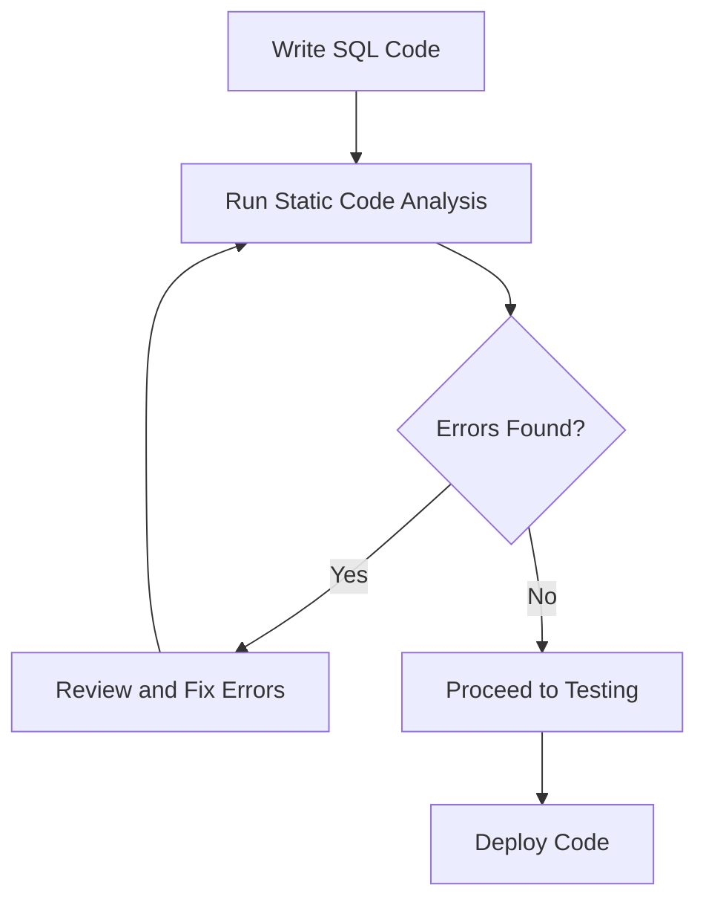

## 15.8 Static Code Analysis and Linting

In the realm of SQL development, ensuring the quality and reliability of your code is paramount. Static code analysis and linting are essential practices that help developers maintain high standards of code quality by identifying potential errors and enforcing coding standards without executing the code. This section will delve into the purpose, tools, benefits, and best practices associated with static code analysis and linting in SQL development.

### Understanding Static Code Analysis

**Static code analysis** refers to the process of examining SQL code for potential errors, vulnerabilities, and deviations from coding standards without executing the code. This analysis is performed by specialized tools that parse the code and apply a set of rules or patterns to identify issues. The primary goal is to catch errors early in the development process, reducing the risk of defects in production.

#### Key Concepts

- **Syntax Checking**: Ensures that the SQL code adheres to the correct syntax rules of the SQL dialect being used.
- **Style Enforcement**: Promotes consistency in code style, making it easier to read and maintain.
- **Error Detection**: Identifies potential runtime errors, such as missing semicolons, incorrect table names, or mismatched data types.
- **Security Vulnerabilities**: Detects common security issues like SQL injection vulnerabilities.

### The Role of Linting in SQL Development

**Linting** is a subset of static code analysis focused on enforcing coding standards and style guidelines. A linter is a tool that analyzes code to flag programming errors, bugs, stylistic errors, and suspicious constructs. In SQL development, linting helps maintain a consistent codebase, which is crucial for collaboration and long-term maintenance.

#### Common Linting Rules

- **Naming Conventions**: Ensures that tables, columns, and other database objects follow a consistent naming scheme.
- **Indentation and Formatting**: Enforces consistent indentation and formatting for readability.
- **Unused Variables**: Flags variables or temporary tables that are declared but not used.
- **Complex Queries**: Warns against overly complex queries that may be difficult to understand or maintain.

### Tools for Static Code Analysis and Linting

Several tools are available to assist with static code analysis and linting in SQL development. These tools can be integrated into development environments or continuous integration (CI) pipelines to automate the analysis process.

#### SQLLint

**SQLLint** is a popular tool for syntax and style checking in SQL code. It provides a set of configurable rules that can be tailored to the specific needs of a project. SQLLint can be integrated into various development environments and CI pipelines, making it a versatile choice for SQL developers.

```sql
-- Example of SQL code with linting issues
SELECT * FROM employees WHERE employee_id = 123;

-- Linting suggestions:
-- 1. Avoid using SELECT *; specify the columns needed.
-- 2. Use parameterized queries to prevent SQL injection.
```

#### Code Analysis Tools

Many integrated development environments (IDEs) and CI tools offer built-in code analysis features. These tools can automatically analyze SQL code for errors and style issues as you write it, providing real-time feedback.

- **Visual Studio Code**: Offers extensions for SQL linting and static analysis.
- **SonarQube**: Provides comprehensive static analysis for SQL and other languages, with a focus on code quality and security.
- **SQLFluff**: A popular linter for SQL that supports multiple dialects and offers extensive configuration options.

### Benefits of Static Code Analysis and Linting

Implementing static code analysis and linting in SQL development offers numerous benefits that contribute to the overall quality and maintainability of the codebase.

#### Quality Assurance

Static code analysis and linting enforce coding standards and best practices, ensuring that the codebase remains consistent and adheres to organizational guidelines. This consistency is crucial for collaboration and long-term maintenance.

#### Early Detection of Issues

By identifying potential errors and vulnerabilities early in the development process, static code analysis and linting help prevent defects from reaching production. This early detection reduces the cost and effort associated with fixing issues later in the development lifecycle.

#### Improved Code Readability

Linting enforces style guidelines that promote readability and maintainability. Consistent formatting and naming conventions make it easier for developers to understand and work with the code, reducing the likelihood of errors.

#### Enhanced Security

Static code analysis tools can detect common security vulnerabilities, such as SQL injection risks, before the code is deployed. This proactive approach to security helps protect sensitive data and maintain the integrity of the database.

### Best Practices for Static Code Analysis and Linting

To maximize the benefits of static code analysis and linting, it's important to follow best practices that align with the specific needs of your project and organization.

#### Define Coding Standards

Establish clear coding standards and guidelines for SQL development within your organization. These standards should cover syntax, style, naming conventions, and security practices. Ensure that all team members are familiar with these guidelines and understand their importance.

#### Integrate Tools into Development Workflows

Incorporate static code analysis and linting tools into your development workflows, including IDEs and CI pipelines. This integration ensures that code is automatically analyzed for errors and style issues as it is written and committed.

#### Customize Rules and Configurations

Tailor the rules and configurations of static code analysis and linting tools to suit the specific needs of your project. This customization allows you to focus on the most relevant issues and avoid unnecessary noise.

#### Regularly Review and Update Rules

As your project evolves, regularly review and update the rules and configurations used by your static code analysis and linting tools. This ongoing maintenance ensures that the tools remain effective and aligned with your coding standards.

#### Encourage Team Collaboration

Promote a culture of collaboration and continuous improvement within your development team. Encourage team members to share insights and suggestions for improving coding standards and practices.

### Visualizing the Static Code Analysis Process

To better understand the static code analysis process, let's visualize it using a flowchart. This diagram illustrates the steps involved in analyzing SQL code for errors and style issues.



**Figure 1: Static Code Analysis Process Flowchart**

### Try It Yourself

To gain hands-on experience with static code analysis and linting, try the following exercises:

1. **Install SQLLint**: Set up SQLLint in your development environment and configure it with a set of rules that align with your project's coding standards.

2. **Analyze Sample Code**: Use SQLLint to analyze a sample SQL script with intentional errors and style issues. Review the linting suggestions and make the necessary corrections.

3. **Integrate with CI Pipeline**: Integrate SQLLint into a CI pipeline to automatically analyze SQL code for errors and style issues whenever changes are committed.

### References and Further Reading

- [SQLLint GitHub Repository](https://github.com/joereynolds/sql-lint)
- [SonarQube Documentation](https://docs.sonarqube.org/)
- [SQLFluff Documentation](https://docs.sqlfluff.com/en/stable/)

### Knowledge Check

To reinforce your understanding of static code analysis and linting, consider the following questions:

- What are the primary goals of static code analysis in SQL development?
- How does linting contribute to code readability and maintainability?
- What are some common tools used for static code analysis and linting in SQL development?
- How can static code analysis help prevent security vulnerabilities in SQL code?

### Embrace the Journey

Remember, mastering static code analysis and linting is an ongoing journey. As you continue to refine your skills and integrate these practices into your workflows, you'll contribute to the development of high-quality, reliable SQL code. Keep experimenting, stay curious, and enjoy the journey!

## Quiz Time!



### What is the primary purpose of static code analysis in SQL development?

- [x] To identify potential errors without executing the code
- [ ] To execute SQL code and test its functionality
- [ ] To compile SQL code into machine language
- [ ] To optimize SQL queries for performance

> **Explanation:** Static code analysis is used to identify potential errors and enforce coding standards without executing the code.

### Which tool is commonly used for syntax and style checking in SQL code?

- [x] SQLLint
- [ ] SQLFluff
- [ ] Visual Studio Code
- [ ] SonarQube

> **Explanation:** SQLLint is a popular tool for syntax and style checking in SQL code.

### How does linting contribute to code readability?

- [x] By enforcing consistent formatting and style guidelines
- [ ] By executing the code and providing runtime feedback
- [ ] By optimizing SQL queries for performance
- [ ] By compiling SQL code into machine language

> **Explanation:** Linting enforces consistent formatting and style guidelines, which improves code readability and maintainability.

### What is a common benefit of integrating static code analysis into CI pipelines?

- [x] Automatic detection of errors and style issues upon code commits
- [ ] Execution of SQL code for testing purposes
- [ ] Compilation of SQL code into machine language
- [ ] Optimization of SQL queries for performance

> **Explanation:** Integrating static code analysis into CI pipelines allows for automatic detection of errors and style issues whenever code is committed.

### Which of the following is a common security vulnerability that static code analysis can detect?

- [x] SQL injection
- [ ] Buffer overflow
- [ ] Cross-site scripting
- [ ] Denial of service

> **Explanation:** Static code analysis can detect SQL injection vulnerabilities, which are common security risks in SQL code.

### What is the role of naming conventions in linting?

- [x] To ensure consistent naming of database objects
- [ ] To execute SQL code and test its functionality
- [ ] To compile SQL code into machine language
- [ ] To optimize SQL queries for performance

> **Explanation:** Naming conventions ensure consistent naming of database objects, which is enforced by linting.

### How can static code analysis improve code security?

- [x] By detecting common security vulnerabilities before deployment
- [ ] By executing the code and providing runtime feedback
- [ ] By optimizing SQL queries for performance
- [ ] By compiling SQL code into machine language

> **Explanation:** Static code analysis can detect common security vulnerabilities, such as SQL injection, before the code is deployed.

### What is a common practice to maximize the benefits of static code analysis?

- [x] Integrating tools into development workflows
- [ ] Executing SQL code for testing purposes
- [ ] Compiling SQL code into machine language
- [ ] Optimizing SQL queries for performance

> **Explanation:** Integrating static code analysis tools into development workflows ensures that code is automatically analyzed for errors and style issues.

### Which tool provides comprehensive static analysis for SQL and other languages?

- [x] SonarQube
- [ ] SQLLint
- [ ] SQLFluff
- [ ] Visual Studio Code

> **Explanation:** SonarQube provides comprehensive static analysis for SQL and other languages, focusing on code quality and security.

### True or False: Linting is a subset of static code analysis focused on enforcing coding standards and style guidelines.

- [x] True
- [ ] False

> **Explanation:** Linting is indeed a subset of static code analysis that focuses on enforcing coding standards and style guidelines.




