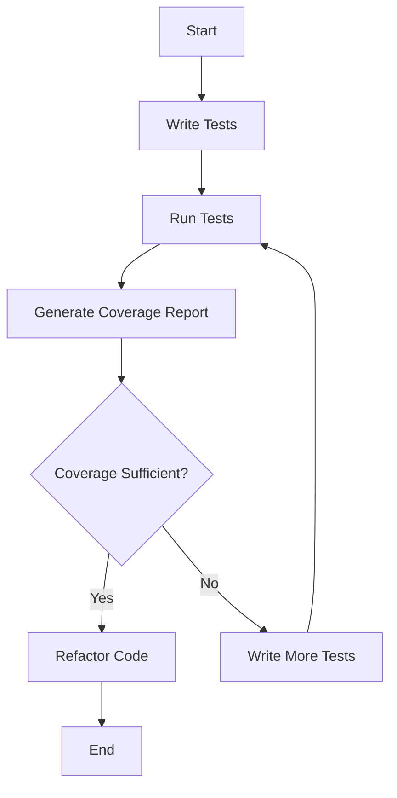

## 15.9 Monitoring Test Coverage

In the realm of SQL development, ensuring that your database code is thoroughly tested is crucial for maintaining the integrity, performance, and security of your applications. Monitoring test coverage is a key aspect of this process, providing insights into which parts of your codebase are being exercised by your tests and which are not. This section will delve into the concept of test coverage, the tools available for monitoring it, and the strategies for improving your test suites.

### Understanding Test Coverage

**Test Coverage** is a metric used to measure the extent to which the source code of a program is executed when a particular test suite runs. It is expressed as a percentage, indicating the proportion of code that is covered by tests. High test coverage is often associated with a lower likelihood of undetected bugs, as more code paths are tested.

#### Key Concepts

- **Code Coverage**: The percentage of code lines or blocks that are executed during testing.
- **Branch Coverage**: Ensures that each branch (e.g., if-else conditions) in the code is executed.
- **Function Coverage**: Measures whether each function in the code has been called.
- **Path Coverage**: Ensures that all possible paths through a given part of the code are executed.

### Importance of Monitoring Test Coverage

Monitoring test coverage is essential for several reasons:

1. **Identifying Gaps**: It highlights areas of the code that are not covered by tests, allowing developers to focus on writing additional tests for those parts.
2. **Improving Test Suites**: By identifying untested code, developers can enhance their test suites, leading to more robust and reliable applications.
3. **Ensuring Code Quality**: High test coverage is often correlated with high code quality, as it ensures that the code behaves as expected under various conditions.
4. **Facilitating Refactoring**: With comprehensive test coverage, developers can refactor code with confidence, knowing that existing functionality is preserved.

### Tools for Monitoring Test Coverage

Several tools are available for monitoring test coverage in SQL development. These tools provide insights into how much of your code is covered by tests and help identify areas that need more testing.

#### Coverage Analyzers

Coverage analyzers are tools that report on code coverage metrics. They can be integrated into your development workflow to provide continuous feedback on test coverage.

- **SQLCover**: A code coverage tool specifically designed for SQL Server. It provides detailed coverage reports and integrates with popular CI/CD pipelines.
- **tSQLt**: A unit testing framework for SQL Server that includes coverage analysis features.
- **PL/SQL Developer**: Offers code coverage analysis for Oracle PL/SQL code.
- **pgTAP**: A unit testing framework for PostgreSQL that can be used to measure test coverage.

### Implementing Test Coverage Monitoring

To effectively monitor test coverage, follow these steps:

1. **Select the Right Tool**: Choose a coverage analyzer that fits your development environment and supports your database platform.
2. **Integrate with CI/CD**: Incorporate test coverage monitoring into your continuous integration and continuous deployment (CI/CD) pipeline to ensure that coverage is checked automatically with each build.
3. **Set Coverage Goals**: Establish coverage targets for your project to ensure that a minimum level of coverage is maintained.
4. **Analyze Coverage Reports**: Regularly review coverage reports to identify untested code and prioritize writing tests for those areas.
5. **Refactor and Optimize**: Use coverage data to guide refactoring efforts, ensuring that code remains efficient and maintainable.

### Code Example: Using SQLCover for SQL Server

Let's explore how to use SQLCover to monitor test coverage for a SQL Server database.

```sql
-- Example SQL script to demonstrate SQLCover usage

-- Create a sample stored procedure
CREATE PROCEDURE GetEmployeeDetails
    @EmployeeID INT
AS
BEGIN
    SELECT FirstName, LastName, Department
    FROM Employees
    WHERE EmployeeID = @EmployeeID;
END;

-- Create a test case for the stored procedure
DECLARE @ExpectedFirstName NVARCHAR(50) = 'John';
DECLARE @ExpectedLastName NVARCHAR(50) = 'Doe';
DECLARE @ExpectedDepartment NVARCHAR(50) = 'Engineering';

DECLARE @ActualFirstName NVARCHAR(50);
DECLARE @ActualLastName NVARCHAR(50);
DECLARE @ActualDepartment NVARCHAR(50);

EXEC GetEmployeeDetails @EmployeeID = 1;

-- Assert the results
IF @ActualFirstName = @ExpectedFirstName AND
   @ActualLastName = @ExpectedLastName AND
   @ActualDepartment = @ExpectedDepartment
BEGIN
    PRINT 'Test Passed';
END
ELSE
BEGIN
    PRINT 'Test Failed';
END;
```

In this example, we have a stored procedure `GetEmployeeDetails` and a test case that verifies its output. By running this test case with SQLCover, we can generate a coverage report that shows which parts of the stored procedure were executed.

### Visualizing Test Coverage

Visualizing test coverage can help developers quickly understand which parts of the code are covered and which are not. Below is a simple flowchart illustrating the process of monitoring test coverage.



**Diagram Description**: This flowchart represents the process of monitoring test coverage. It begins with writing tests, running them, generating a coverage report, and then deciding whether the coverage is sufficient. If not, more tests are written, and the process repeats.

### Best Practices for Monitoring Test Coverage

- **Regularly Review Coverage Reports**: Make it a habit to review coverage reports after each build to ensure that coverage levels are maintained.
- **Focus on Critical Code Paths**: Prioritize testing critical code paths that are essential for the application's functionality.
- **Balance Coverage with Quality**: While high coverage is desirable, focus on writing meaningful tests that validate the application's behavior.
- **Use Coverage Data to Guide Refactoring**: Leverage coverage data to identify areas of the code that may benefit from refactoring.

### Try It Yourself

Experiment with the SQLCover tool by modifying the stored procedure and test case provided in the code example. Try adding new test cases to cover different scenarios and observe how the coverage report changes. This hands-on approach will help solidify your understanding of test coverage monitoring.

### Knowledge Check

- **What is test coverage, and why is it important?**
- **Name three tools used for monitoring test coverage in SQL development.**
- **Explain the difference between code coverage and branch coverage.**
- **How can test coverage data guide refactoring efforts?**

### Summary

Monitoring test coverage is a vital component of SQL development, ensuring that your code is thoroughly tested and reliable. By leveraging coverage analyzers and integrating them into your development workflow, you can identify untested code, improve your test suites, and maintain high code quality. Remember, this is just the beginning. As you progress, you'll build more robust and reliable SQL applications. Keep experimenting, stay curious, and enjoy the journey!

## Quiz Time!



### What is test coverage?

- [x] A metric that measures the extent to which the source code is executed by tests.
- [ ] A tool for writing SQL queries.
- [ ] A method for optimizing SQL performance.
- [ ] A database design pattern.

> **Explanation:** Test coverage measures the percentage of code exercised by tests, indicating how thoroughly the code is tested.

### Which tool is specifically designed for SQL Server test coverage?

- [x] SQLCover
- [ ] pgTAP
- [ ] PL/SQL Developer
- [ ] JUnit

> **Explanation:** SQLCover is a tool specifically designed for monitoring test coverage in SQL Server environments.

### What does branch coverage ensure?

- [x] Each branch in the code is executed.
- [ ] Every line of code is executed.
- [ ] Each function is called.
- [ ] All possible paths are executed.

> **Explanation:** Branch coverage ensures that each branch (e.g., if-else conditions) in the code is executed.

### Why is monitoring test coverage important?

- [x] It identifies untested code areas.
- [x] It improves test suites.
- [ ] It increases database size.
- [ ] It reduces code complexity.

> **Explanation:** Monitoring test coverage helps identify untested code areas and guides improvements in test suites.

### What is the first step in implementing test coverage monitoring?

- [x] Select the right tool.
- [ ] Write more tests.
- [ ] Refactor code.
- [ ] Analyze coverage reports.

> **Explanation:** The first step is to select the right tool that fits your development environment and supports your database platform.

### What is the purpose of generating a coverage report?

- [x] To identify which parts of the code are covered by tests.
- [ ] To increase database performance.
- [ ] To reduce code complexity.
- [ ] To optimize SQL queries.

> **Explanation:** A coverage report identifies which parts of the code are covered by tests, helping to highlight untested areas.

### How can test coverage data guide refactoring?

- [x] By identifying areas that may benefit from refactoring.
- [ ] By increasing database size.
- [ ] By reducing code complexity.
- [ ] By optimizing SQL queries.

> **Explanation:** Test coverage data can guide refactoring efforts by identifying areas of the code that may benefit from improvements.

### What is a key benefit of high test coverage?

- [x] Lower likelihood of undetected bugs.
- [ ] Increased database size.
- [ ] Reduced code complexity.
- [ ] Optimized SQL queries.

> **Explanation:** High test coverage is associated with a lower likelihood of undetected bugs, as more code paths are tested.

### What should you do if coverage is not sufficient?

- [x] Write more tests.
- [ ] Increase database size.
- [ ] Reduce code complexity.
- [ ] Optimize SQL queries.

> **Explanation:** If coverage is not sufficient, more tests should be written to cover untested code areas.

### True or False: Test coverage is only important for SQL development.

- [ ] True
- [x] False

> **Explanation:** Test coverage is important for all types of software development, not just SQL, as it ensures that code is thoroughly tested and reliable.




