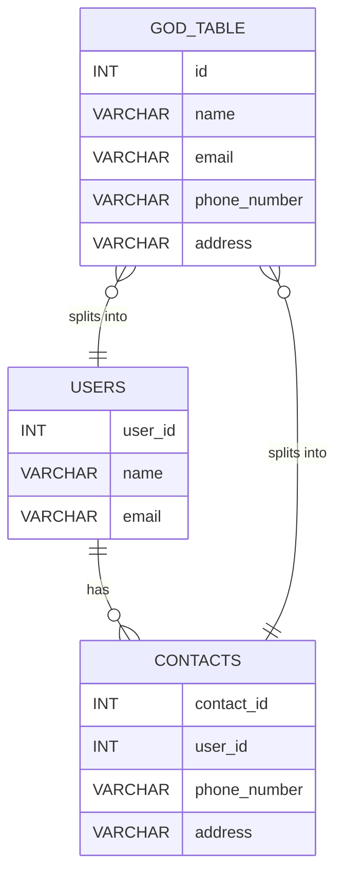

## 16.1 Understanding SQL Anti-Patterns

In the realm of SQL development, anti-patterns represent practices that, while common, lead to suboptimal performance, maintenance challenges, and potential bugs. Recognizing and avoiding these anti-patterns is crucial for building efficient, scalable, and reliable databases. This section delves into the concept of SQL anti-patterns, providing insights into their identification and strategies for avoidance.

### Definition of SQL Anti-Patterns

**SQL Anti-Patterns** are recurring practices in database design and query writing that are counterproductive. They often arise from a lack of understanding of SQL's capabilities, misuse of features, or ignoring established best practices. These patterns can lead to inefficient queries, increased complexity, and maintenance headaches.

### Importance of Recognizing SQL Anti-Patterns

Understanding and avoiding SQL anti-patterns is essential for several reasons:

- **Performance**: Anti-patterns can severely degrade query performance, leading to slow response times and increased load on database servers.
- **Scalability**: Poor design choices can hinder the ability to scale databases as data volume grows.
- **Maintainability**: Complex and convoluted SQL code is difficult to maintain, increasing the risk of errors and bugs.
- **Reliability**: Anti-patterns can introduce subtle bugs that compromise data integrity and reliability.

### Common SQL Anti-Patterns

Let's explore some of the most prevalent SQL anti-patterns, their implications, and how to avoid them.

#### 1. The God Table

**Definition**: A "God Table" is a table that attempts to store all possible data attributes for a domain, leading to a bloated and unwieldy structure.

**Implications**:
- **Performance Issues**: Large tables with many columns can lead to inefficient queries and increased I/O operations.
- **Complexity**: Managing and understanding such tables becomes increasingly difficult.
- **Data Integrity**: Increased risk of data anomalies and integrity issues.

**Solution**: Normalize the database design by breaking down the God Table into smaller, more focused tables. Use foreign keys to maintain relationships between tables.

```sql
-- Example of a God Table
CREATE TABLE GodTable (
    id INT PRIMARY KEY,
    name VARCHAR(255),
    email VARCHAR(255),
    phone_number VARCHAR(20),
    address VARCHAR(255),
    -- Many more columns
);

-- Normalized version
CREATE TABLE Users (
    user_id INT PRIMARY KEY,
    name VARCHAR(255),
    email VARCHAR(255)
);

CREATE TABLE Contacts (
    contact_id INT PRIMARY KEY,
    user_id INT,
    phone_number VARCHAR(20),
    address VARCHAR(255),
    FOREIGN KEY (user_id) REFERENCES Users(user_id)
);
```

#### 2. Metadata Tribbles

**Definition**: Overuse of metadata tables to store data attributes, leading to complex and inefficient queries.

**Implications**:
- **Complex Queries**: Queries become complex and difficult to optimize.
- **Performance**: Increased join operations can degrade performance.
- **Maintainability**: Hard to understand and maintain.

**Solution**: Use metadata tables judiciously and only when necessary. Consider alternative designs that reduce complexity.

```sql
-- Example of a Metadata Tribble
CREATE TABLE Metadata (
    entity_id INT,
    attribute_name VARCHAR(255),
    attribute_value VARCHAR(255)
);

-- Querying metadata
SELECT entity_id, attribute_value
FROM Metadata
WHERE attribute_name = 'email';

-- Alternative design
CREATE TABLE Users (
    user_id INT PRIMARY KEY,
    email VARCHAR(255)
);
```

#### 3. Overusing NULLs

**Definition**: Excessive use of NULL values in tables, often as placeholders for missing or optional data.

**Implications**:
- **Data Integrity**: NULLs can lead to unexpected results in queries and calculations.
- **Complexity**: Handling NULLs requires additional logic in queries.
- **Performance**: Can affect indexing and query optimization.

**Solution**: Use default values or separate tables to handle optional data. Ensure that NULLs are used only when semantically appropriate.

```sql
-- Example of overusing NULLs
CREATE TABLE Products (
    product_id INT PRIMARY KEY,
    name VARCHAR(255),
    description TEXT,
    price DECIMAL(10, 2),
    discount DECIMAL(10, 2) DEFAULT 0
);

-- Handling NULLs in queries
SELECT name, price * (1 - COALESCE(discount, 0)) AS final_price
FROM Products;
```

#### 4. One True Lookup Table

**Definition**: A single table used to store all lookup values for different domains, leading to a lack of clarity and potential data integrity issues.

**Implications**:
- **Complexity**: Difficult to manage and understand relationships between data.
- **Performance**: Increased join operations can degrade performance.
- **Data Integrity**: Risk of incorrect data associations.

**Solution**: Use separate lookup tables for different domains to maintain clarity and integrity.

```sql
-- Example of a One True Lookup Table
CREATE TABLE Lookup (
    id INT PRIMARY KEY,
    type VARCHAR(50),
    value VARCHAR(255)
);

-- Separate lookup tables
CREATE TABLE ProductCategories (
    category_id INT PRIMARY KEY,
    category_name VARCHAR(255)
);

CREATE TABLE OrderStatuses (
    status_id INT PRIMARY KEY,
    status_name VARCHAR(255)
);
```

### Visualizing SQL Anti-Patterns

To better understand the impact of SQL anti-patterns, let's visualize the concept of a "God Table" and its normalized counterpart using a diagram.



**Diagram Description**: The diagram illustrates a "God Table" with multiple columns and its normalized version, where data is split into two tables: `USERS` and `CONTACTS`. This normalization reduces complexity and improves performance.

### Try It Yourself

Experiment with the provided code examples by modifying the table structures or queries. Consider how changes impact performance and maintainability. For instance, try adding more columns to the God Table and observe the effects on query complexity and performance.

### References and Further Reading

- [SQL Anti-Patterns: Avoiding the Pitfalls of Database Programming](https://www.amazon.com/SQL-Anti-Patterns-Programming-Pragmatic-Programmers/dp/1934356557)
- [Database Design Best Practices](https://www.w3schools.com/sql/sql_best.asp)
- [Understanding SQL Joins](https://www.sqlshack.com/sql-join-types/)

### Knowledge Check

Before moving on, consider these questions to test your understanding of SQL anti-patterns:

1. What is a "God Table" and why is it problematic?
2. How can overusing NULLs affect query performance?
3. What are the benefits of using separate lookup tables instead of a "One True Lookup Table"?

### Embrace the Journey

Remember, recognizing and avoiding SQL anti-patterns is a continuous learning process. As you gain experience, you'll develop an intuition for identifying potential pitfalls and designing robust database solutions. Keep experimenting, stay curious, and enjoy the journey!

## Quiz Time!



### What is an SQL anti-pattern?

- [x] A recurring practice that leads to suboptimal performance and maintenance challenges.
- [ ] A design pattern that improves SQL performance.
- [ ] A method for optimizing SQL queries.
- [ ] A tool for database management.

> **Explanation:** SQL anti-patterns are practices that lead to poor performance and maintenance issues.

### Why is the "God Table" considered an anti-pattern?

- [x] It leads to performance issues and complexity.
- [ ] It simplifies database design.
- [ ] It enhances data integrity.
- [ ] It reduces the number of tables.

> **Explanation:** The "God Table" is problematic because it creates performance issues and increases complexity.

### How can overusing NULLs affect a database?

- [x] It can lead to unexpected query results and performance issues.
- [ ] It simplifies query logic.
- [ ] It enhances data integrity.
- [ ] It improves indexing.

> **Explanation:** Overusing NULLs can lead to unexpected results and affect performance.

### What is a "One True Lookup Table"?

- [x] A single table used to store all lookup values for different domains.
- [ ] A table that stores only unique values.
- [ ] A table that enhances query performance.
- [ ] A table that simplifies database design.

> **Explanation:** A "One True Lookup Table" stores all lookup values, leading to complexity and potential data integrity issues.

### What is the solution to the "God Table" anti-pattern?

- [x] Normalize the table into smaller, focused tables.
- [ ] Add more columns to the table.
- [ ] Use a single table for all data.
- [ ] Increase the table's storage capacity.

> **Explanation:** Normalizing the table into smaller, focused tables reduces complexity and improves performance.

### What is the impact of metadata tribbles?

- [x] They lead to complex and inefficient queries.
- [ ] They simplify database design.
- [ ] They enhance data integrity.
- [ ] They improve query performance.

> **Explanation:** Metadata tribbles lead to complex queries and inefficiencies.

### How can you avoid the "One True Lookup Table" anti-pattern?

- [x] Use separate lookup tables for different domains.
- [ ] Store all lookup values in a single table.
- [ ] Use a single table for all data.
- [ ] Increase the table's storage capacity.

> **Explanation:** Using separate lookup tables for different domains maintains clarity and integrity.

### What is the benefit of recognizing SQL anti-patterns?

- [x] It helps build efficient, scalable, and reliable databases.
- [ ] It simplifies database design.
- [ ] It reduces the number of tables.
- [ ] It enhances data integrity.

> **Explanation:** Recognizing SQL anti-patterns helps in building efficient and reliable databases.

### What is the main issue with overusing NULLs?

- [x] It can lead to unexpected query results and performance issues.
- [ ] It simplifies query logic.
- [ ] It enhances data integrity.
- [ ] It improves indexing.

> **Explanation:** Overusing NULLs can lead to unexpected results and affect performance.

### True or False: SQL anti-patterns are beneficial for database performance.

- [ ] True
- [x] False

> **Explanation:** SQL anti-patterns are detrimental to database performance and should be avoided.


