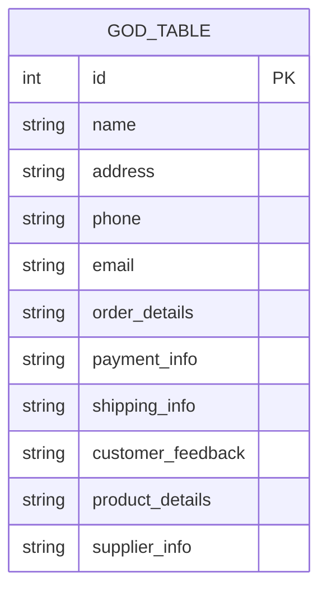

## 16.2.1 The God Table

In the realm of database design, the "God Table" is an anti-pattern that can lead to significant challenges in managing and scaling your database systems. This section delves into the concept of the God Table, its implications, and strategies for refactoring it into a more efficient and scalable structure.

### Understanding the God Table

**Definition**: The God Table is a single, monolithic table that attempts to encompass too many aspects of a database's data model. It often results from an attempt to simplify the database schema by consolidating multiple entities into one table. While this might seem convenient initially, it leads to a bloated and inefficient design.

**Characteristics**:
- **Overloaded Columns**: The table contains numerous columns, many of which may be sparsely populated or irrelevant for certain records.
- **High Nullability**: A significant number of columns are nullable, indicating that not all data is relevant for every row.
- **Data Redundancy**: Similar data is repeated across multiple rows, leading to redundancy and increased storage requirements.
- **Complex Queries**: Queries become complex and difficult to maintain as they must handle a wide variety of conditions and joins.

### Issues with the God Table

1. **Scalability Challenges**: As the table grows, performance degrades due to the sheer volume of data and the complexity of queries required to extract meaningful information.

2. **Data Integrity Risks**: With so many columns and potential for redundancy, maintaining data integrity becomes a challenge. Updates and deletions can lead to inconsistencies.

3. **Maintenance Complexity**: The complexity of maintaining such a table increases exponentially as business requirements evolve, making it difficult to adapt to changes.

4. **Poor Normalization**: The God Table often violates normalization principles, leading to anomalies in data insertion, update, and deletion.

### Visualizing the God Table

To better understand the structure and issues of a God Table, let's visualize a typical scenario using a Mermaid.js diagram:



**Diagram Description**: This Entity-Relationship diagram illustrates a God Table that attempts to store customer, order, payment, shipping, and product information all in one table. The result is a table with many columns, most of which are not relevant for every row, leading to high nullability and redundancy.

### Key Participants

- **Database Designers**: Responsible for creating and maintaining the database schema.
- **Developers**: Write queries and interact with the database, often facing challenges due to the complexity of the God Table.
- **Database Administrators (DBAs)**: Manage database performance and integrity, often struggling with the inefficiencies introduced by the God Table.

### Applicability

The God Table anti-pattern is often encountered in scenarios where:
- There is a lack of clear data modeling and design principles.
- Initial database design was rushed or not well thought out.
- There is a misconception that fewer tables equate to simpler design.

### Sample Code Snippet

Consider a simplified example of a God Table in SQL:

```sql
CREATE TABLE GodTable (
    id INT PRIMARY KEY,
    name VARCHAR(255),
    address VARCHAR(255),
    phone VARCHAR(20),
    email VARCHAR(255),
    order_details TEXT,
    payment_info TEXT,
    shipping_info TEXT,
    customer_feedback TEXT,
    product_details TEXT,
    supplier_info TEXT
);
```

**Code Explanation**: This table attempts to store a wide range of information, from customer contact details to order and product information, all in one place. This design leads to inefficiencies and maintenance challenges.

### Design Considerations

**When to Use**: Ideally, never. The God Table should be avoided in favor of a more normalized and modular design.

**Important Considerations**:
- **Normalization**: Break down the God Table into smaller, related tables that adhere to normalization principles.
- **Modularity**: Design tables to represent specific entities or concepts, reducing redundancy and improving clarity.
- **Scalability**: Ensure that the database design can scale with the application's growth and evolving requirements.

### Refactoring the God Table

To refactor a God Table, follow these steps:

1. **Identify Entities**: Determine the distinct entities represented within the God Table. For example, separate customer, order, and product information.

2. **Normalize the Schema**: Apply normalization principles to create separate tables for each entity, ensuring that each table represents a single concept.

3. **Define Relationships**: Establish foreign key relationships between tables to maintain data integrity and enable efficient querying.

4. **Migrate Data**: Carefully migrate existing data from the God Table to the new schema, ensuring that data integrity is preserved.

5. **Update Queries**: Refactor existing queries to work with the new schema, taking advantage of the improved structure for more efficient data retrieval.

### Differences and Similarities

**Similar Patterns**: The God Table is often confused with the "One True Lookup Table" anti-pattern, where a single table is used for multiple lookup values. Both patterns suffer from similar issues of complexity and inefficiency.

**Differences**: The God Table encompasses a broader range of data and is more likely to violate normalization principles, whereas the One True Lookup Table is specifically about lookup values.

### Try It Yourself

To better understand the impact of the God Table, try the following exercise:

1. **Create a God Table**: Design a table that attempts to store multiple types of information, such as customer, order, and product details.

2. **Analyze Queries**: Write queries to extract specific information and observe the complexity and performance issues.

3. **Refactor**: Break down the God Table into smaller, related tables and rewrite the queries to work with the new schema.

### References and Links

- [Normalization in Database Design](https://www.w3schools.com/sql/sql_normalization.asp)
- [Database Design Best Practices](https://www.geeksforgeeks.org/database-design-best-practices/)
- [Understanding SQL Anti-Patterns](https://www.sqlshack.com/sql-anti-patterns/)

### Knowledge Check

- **Question**: What are the main issues associated with the God Table?
- **Exercise**: Design a normalized schema from a given God Table example.

### Embrace the Journey

Remember, refactoring a God Table is a step towards a more efficient and scalable database design. As you progress, you'll gain a deeper understanding of normalization principles and how to apply them effectively. Keep experimenting, stay curious, and enjoy the journey!

## Quiz Time!



### What is a God Table in SQL?

- [x] A single table that tries to handle too many aspects, resulting in bloated and inefficient design.
- [ ] A table that is perfectly normalized.
- [ ] A table that only stores metadata.
- [ ] A table that is used for temporary data storage.

> **Explanation:** A God Table is a single, monolithic table that attempts to encompass too many aspects of a database's data model, leading to inefficiencies.

### What is a common characteristic of a God Table?

- [x] High nullability in columns.
- [ ] Perfect normalization.
- [ ] Minimal data redundancy.
- [ ] Simple queries.

> **Explanation:** God Tables often have high nullability due to many columns being irrelevant for certain records.

### What is a major issue with God Tables?

- [x] Difficulty in scaling.
- [ ] Easy maintenance.
- [ ] Efficient data retrieval.
- [ ] Low data redundancy.

> **Explanation:** God Tables face scalability challenges due to their bloated nature and complex queries.

### How can a God Table be refactored?

- [x] By normalizing the database into smaller, related tables.
- [ ] By adding more columns to the table.
- [ ] By removing all constraints.
- [ ] By using only primary keys.

> **Explanation:** Refactoring involves breaking down the God Table into smaller, related tables that adhere to normalization principles.

### What is the first step in refactoring a God Table?

- [x] Identify distinct entities within the God Table.
- [ ] Add more indexes to the table.
- [ ] Remove all foreign keys.
- [ ] Consolidate all data into one column.

> **Explanation:** The first step is to identify the distinct entities represented within the God Table.

### What is a similarity between the God Table and the One True Lookup Table?

- [x] Both suffer from complexity and inefficiency.
- [ ] Both are perfectly normalized.
- [ ] Both are used for temporary data storage.
- [ ] Both are examples of good database design.

> **Explanation:** Both patterns suffer from similar issues of complexity and inefficiency.

### What is a difference between the God Table and the One True Lookup Table?

- [x] The God Table encompasses a broader range of data.
- [ ] The God Table is used for lookup values.
- [ ] The One True Lookup Table is more likely to violate normalization principles.
- [ ] The God Table is always normalized.

> **Explanation:** The God Table encompasses a broader range of data and is more likely to violate normalization principles.

### What is a key participant in managing a God Table?

- [x] Database Designers
- [ ] Network Administrators
- [ ] Front-end Developers
- [ ] Graphic Designers

> **Explanation:** Database Designers are responsible for creating and maintaining the database schema, including managing God Tables.

### What is a benefit of refactoring a God Table?

- [x] Improved scalability and performance.
- [ ] Increased data redundancy.
- [ ] More complex queries.
- [ ] Higher nullability.

> **Explanation:** Refactoring a God Table leads to improved scalability and performance by adhering to normalization principles.

### True or False: A God Table is an example of a well-designed database schema.

- [ ] True
- [x] False

> **Explanation:** A God Table is an anti-pattern and is not an example of a well-designed database schema.




