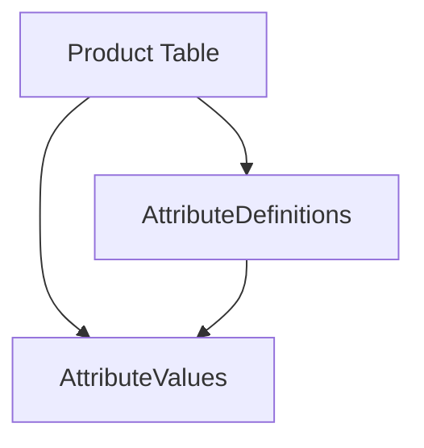

## 16.2.2 Metadata Tribbles

In the realm of SQL development, understanding anti-patterns is crucial for creating efficient and maintainable database systems. One such anti-pattern is the "Metadata Tribbles." This concept revolves around the overuse of metadata to store actual data, leading to tables that describe themselves recursively. This section will delve into the intricacies of Metadata Tribbles, the problems they cause, and best practices to avoid them.

### Concept of Metadata Tribbles

Metadata Tribbles occur when developers use metadata tables to store actual data, resulting in a recursive structure where tables describe themselves. This approach often stems from a desire to create flexible and dynamic database schemas. However, it can lead to significant performance issues and complicate data integrity enforcement.

#### What is Metadata?

Metadata is data that provides information about other data. In databases, metadata typically includes information about table structures, column types, constraints, and relationships between tables. While metadata is essential for understanding and managing database schemas, its misuse can lead to the Metadata Tribbles anti-pattern.

#### The Problem with Metadata Tribbles

The primary issue with Metadata Tribbles is the complexity they introduce. When metadata is used to store actual data, it often requires complex joins and recursive queries to retrieve meaningful information. This can lead to poor performance, as the database must process intricate query plans to extract data. Additionally, enforcing data integrity becomes challenging, as the recursive nature of Metadata Tribbles can obscure relationships and constraints.

### Problems Caused by Metadata Tribbles

1. **Performance Degradation**: The recursive nature of Metadata Tribbles necessitates complex joins and queries, which can significantly degrade performance. As the database grows, these queries become increasingly resource-intensive, leading to slow response times and potential bottlenecks.

2. **Data Integrity Challenges**: Enforcing data integrity is difficult with Metadata Tribbles. The recursive structure can obscure relationships and constraints, making it challenging to ensure data consistency and accuracy.

3. **Maintenance Complexity**: Maintaining a database with Metadata Tribbles is cumbersome. The recursive nature of the schema requires developers to have a deep understanding of the metadata structure, making updates and modifications prone to errors.

4. **Scalability Issues**: As the database grows, the recursive nature of Metadata Tribbles can hinder scalability. The complexity of queries and the need for extensive joins can limit the database's ability to handle large volumes of data efficiently.

### Best Practices to Avoid Metadata Tribbles

To avoid the pitfalls of Metadata Tribbles, it's essential to use metadata appropriately and maintain a clear separation between data and metadata. Here are some best practices to consider:

1. **Define Clear Boundaries**: Clearly define the boundaries between data and metadata. Use metadata to describe the structure and relationships of data, but avoid using it to store actual data.

2. **Normalize Data**: Normalize your database schema to eliminate redundancy and ensure data integrity. This will help maintain a clear separation between data and metadata.

3. **Use Appropriate Data Models**: Choose data models that align with your application's requirements. Avoid using overly flexible or dynamic schemas that rely heavily on metadata.

4. **Optimize Queries**: Optimize queries to minimize the impact of complex joins and recursive structures. Use indexing and query optimization techniques to improve performance.

5. **Regularly Review Schema Design**: Regularly review your database schema to identify and address potential issues related to Metadata Tribbles. This will help ensure your database remains efficient and maintainable.

### Sample Code Snippet

To illustrate the concept of Metadata Tribbles, let's consider a simple example. Suppose we have a table that stores information about products, and we decide to use metadata to store product attributes.

```sql
-- Metadata table to store attribute definitions
CREATE TABLE AttributeDefinitions (
    AttributeID INT PRIMARY KEY,
    AttributeName VARCHAR(255)
);

-- Metadata table to store attribute values
CREATE TABLE AttributeValues (
    ProductID INT,
    AttributeID INT,
    AttributeValue VARCHAR(255),
    FOREIGN KEY (AttributeID) REFERENCES AttributeDefinitions(AttributeID)
);

-- Example of inserting metadata
INSERT INTO AttributeDefinitions (AttributeID, AttributeName) VALUES (1, 'Color');
INSERT INTO AttributeDefinitions (AttributeID, AttributeName) VALUES (2, 'Size');

-- Example of inserting data using metadata
INSERT INTO AttributeValues (ProductID, AttributeID, AttributeValue) VALUES (101, 1, 'Red');
INSERT INTO AttributeValues (ProductID, AttributeID, AttributeValue) VALUES (101, 2, 'Large');
```

In this example, the `AttributeDefinitions` table stores metadata about product attributes, while the `AttributeValues` table stores actual data using metadata. This approach can lead to Metadata Tribbles if overused, as it requires complex joins to retrieve product information.

### Visualizing Metadata Tribbles

To better understand the concept of Metadata Tribbles, let's visualize the recursive structure using a Mermaid.js diagram.



**Diagram Description**: The diagram illustrates the recursive relationship between the Product Table, AttributeDefinitions, and AttributeValues. The Product Table references both the AttributeDefinitions and AttributeValues, creating a recursive structure.

### Design Considerations

When designing a database schema, it's crucial to consider the potential impact of Metadata Tribbles. Here are some design considerations to keep in mind:

- **Avoid Over-Engineering**: Resist the temptation to create overly flexible schemas that rely heavily on metadata. Instead, focus on designing schemas that meet your application's specific requirements.

- **Prioritize Performance**: Consider the performance implications of using metadata to store actual data. Optimize queries and use indexing to mitigate potential performance issues.

- **Ensure Data Integrity**: Implement constraints and validation rules to ensure data integrity. Avoid using metadata in ways that obscure relationships and constraints.

### Differences and Similarities with Other Patterns

Metadata Tribbles are often confused with other patterns that involve metadata, such as the Entity-Attribute-Value (EAV) model. While both patterns involve the use of metadata, they differ in their approach and impact on performance and data integrity.

- **Entity-Attribute-Value (EAV) Model**: The EAV model is a flexible schema design pattern that uses metadata to store attributes and values. While it can lead to similar performance issues as Metadata Tribbles, the EAV model is often used intentionally to support dynamic schemas.

- **Metadata Tribbles**: Metadata Tribbles occur when metadata is overused to store actual data, leading to recursive structures and performance issues. Unlike the EAV model, Metadata Tribbles are typically considered an anti-pattern due to their negative impact on performance and data integrity.

### Try It Yourself

To better understand the impact of Metadata Tribbles, try modifying the sample code snippet to add additional attributes and products. Observe how the complexity of queries increases as more metadata is added. Experiment with optimizing queries and using indexing to improve performance.

### References and Links

For further reading on Metadata Tribbles and related topics, consider the following resources:

- [MDN Web Docs: Database Design](https://developer.mozilla.org/en-US/docs/Web/Database/Design)
- [W3Schools: SQL Tutorial](https://www.w3schools.com/sql/)
- [SQL Performance Explained](https://sql-performance-explained.com/)

### Knowledge Check

To reinforce your understanding of Metadata Tribbles, consider the following questions:

- What are Metadata Tribbles, and why are they considered an anti-pattern?
- How can Metadata Tribbles impact database performance and data integrity?
- What are some best practices for avoiding Metadata Tribbles in database design?
- How does the Entity-Attribute-Value (EAV) model differ from Metadata Tribbles?

### Embrace the Journey

Remember, understanding and avoiding anti-patterns like Metadata Tribbles is just the beginning of mastering SQL design patterns. As you progress, you'll build more efficient and maintainable database systems. Keep experimenting, stay curious, and enjoy the journey!

## Quiz Time!



### What is the primary issue with Metadata Tribbles?

- [x] Performance degradation due to complex joins
- [ ] Lack of flexibility in schema design
- [ ] Overuse of indexing
- [ ] Excessive normalization

> **Explanation:** Metadata Tribbles lead to performance degradation because they require complex joins and recursive queries to retrieve data.

### How can Metadata Tribbles impact data integrity?

- [x] They obscure relationships and constraints
- [ ] They enhance data validation
- [ ] They simplify data retrieval
- [ ] They improve indexing efficiency

> **Explanation:** Metadata Tribbles obscure relationships and constraints, making it difficult to enforce data integrity.

### What is a best practice to avoid Metadata Tribbles?

- [x] Clearly define boundaries between data and metadata
- [ ] Use metadata to store all data
- [ ] Avoid using constraints
- [ ] Normalize data excessively

> **Explanation:** Clearly defining boundaries between data and metadata helps prevent the overuse of metadata to store actual data.

### What is the difference between Metadata Tribbles and the EAV model?

- [x] Metadata Tribbles are considered an anti-pattern, while EAV is a flexible schema design pattern
- [ ] Metadata Tribbles improve performance, while EAV degrades it
- [ ] Metadata Tribbles simplify schema design, while EAV complicates it
- [ ] Metadata Tribbles enhance data integrity, while EAV reduces it

> **Explanation:** Metadata Tribbles are considered an anti-pattern due to their negative impact on performance and data integrity, while the EAV model is a flexible schema design pattern.

### What is a common problem caused by Metadata Tribbles?

- [x] Maintenance complexity
- [ ] Simplified query optimization
- [ ] Enhanced data integrity
- [ ] Improved scalability

> **Explanation:** Metadata Tribbles lead to maintenance complexity due to their recursive structure and the need for complex joins.

### How can you optimize queries to mitigate the impact of Metadata Tribbles?

- [x] Use indexing and query optimization techniques
- [ ] Avoid using joins
- [ ] Normalize data excessively
- [ ] Store all data in a single table

> **Explanation:** Using indexing and query optimization techniques can help mitigate the performance impact of complex joins caused by Metadata Tribbles.

### What is a design consideration when dealing with Metadata Tribbles?

- [x] Avoid over-engineering schemas
- [ ] Use metadata to store all data
- [ ] Implement excessive constraints
- [ ] Normalize data excessively

> **Explanation:** Avoiding over-engineering schemas helps prevent the overuse of metadata and the resulting Metadata Tribbles.

### What is a potential scalability issue with Metadata Tribbles?

- [x] Limited ability to handle large volumes of data efficiently
- [ ] Enhanced performance with large datasets
- [ ] Simplified data retrieval
- [ ] Improved indexing efficiency

> **Explanation:** The recursive nature of Metadata Tribbles can limit the database's ability to handle large volumes of data efficiently.

### How can you maintain data integrity with Metadata Tribbles?

- [x] Implement constraints and validation rules
- [ ] Avoid using constraints
- [ ] Use metadata to store all data
- [ ] Normalize data excessively

> **Explanation:** Implementing constraints and validation rules helps maintain data integrity despite the complexity introduced by Metadata Tribbles.

### Metadata Tribbles are often confused with the EAV model.

- [x] True
- [ ] False

> **Explanation:** Metadata Tribbles and the EAV model both involve the use of metadata, but they differ in their approach and impact on performance and data integrity.


