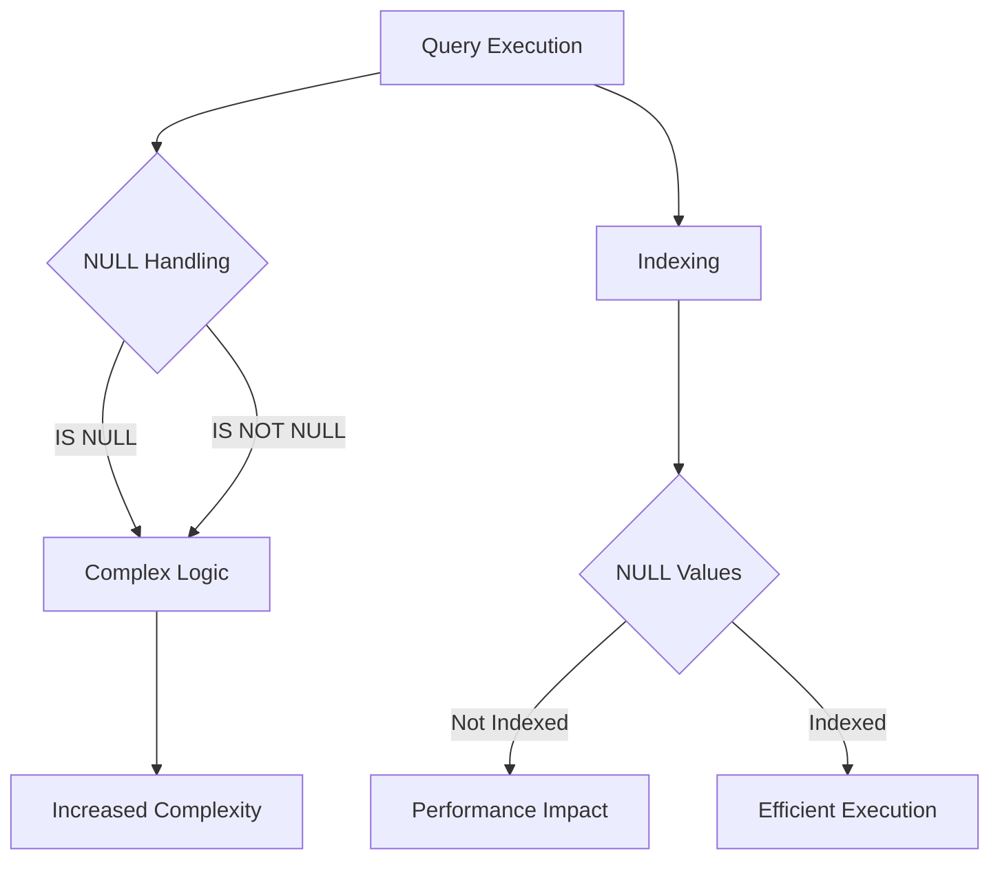

## 16.2.3 Overusing NULLs

In the realm of SQL database design, the use of NULL values is a common practice to represent missing or unknown data. However, overusing NULLs can lead to several complications, including complex query logic, inefficient indexing, and unexpected results. In this section, we will delve into the issues associated with excessive use of NULLs, explore the consequences, and provide recommendations for best practices to optimize database design.

### Understanding NULLs in SQL

NULL is a special marker used in SQL to indicate that a data value does not exist in the database. It is important to note that NULL is not equivalent to zero, an empty string, or any other default value. Instead, NULL represents the absence of a value.

#### Key Characteristics of NULL

- **Indeterminate Value**: NULL signifies an unknown or missing value. It is not comparable to any other value, including another NULL.
- **Three-Valued Logic**: SQL uses a three-valued logic system (true, false, unknown) when dealing with NULLs. This can complicate logical operations and comparisons.
- **Impact on Aggregations**: Functions like COUNT, SUM, AVG, etc., handle NULLs differently, often ignoring them in calculations.

### Issue: Overusing NULLs

The excessive use of NULLs can lead to several issues in database design and operation:

1. **Complicated Query Logic**: Queries involving NULLs require special handling using IS NULL or IS NOT NULL conditions. This can make SQL statements more complex and harder to maintain.

2. **Impact on Indexing**: NULLs can affect the performance of indexes. Many database systems do not index NULL values, which can lead to inefficient query execution plans.

3. **Unexpected Results**: The presence of NULLs can lead to unexpected results in queries, especially when using comparison operators or aggregate functions.

4. **Data Integrity Issues**: Overuse of NULLs can obscure the true state of data, leading to potential data integrity issues.

### Consequences of Overusing NULLs

#### Complicated Query Logic

When NULLs are overused, queries become more complex as they need to account for the presence of NULL values. Consider the following example:

```sql
SELECT employee_id, first_name, last_name
FROM employees
WHERE department_id IS NULL OR department_id = 10;
```

In this query, we need to explicitly check for NULL values using the `IS NULL` condition. As the number of columns with NULLs increases, the complexity of queries grows, making them harder to read and maintain.

#### Impact on Indexing

Indexes are crucial for optimizing query performance. However, many database systems do not index NULL values, which can lead to inefficient query execution plans. For example, consider a table with an index on the `department_id` column:

```sql
CREATE INDEX idx_department_id ON employees(department_id);
```

If a significant number of rows have NULL values in the `department_id` column, the index may not be as effective, leading to slower query performance.

#### Unexpected Results

NULLs can lead to unexpected results, especially when using comparison operators. For instance, consider the following query:

```sql
SELECT employee_id
FROM employees
WHERE salary > 50000;
```

If the `salary` column contains NULL values, those rows will not be included in the result set, as NULL is not greater than any number. This can lead to confusion and incorrect assumptions about the data.

#### Data Integrity Issues

Overusing NULLs can obscure the true state of data. For example, if a column is intended to store a specific value but frequently contains NULLs, it becomes difficult to determine the actual state of the data. This can lead to data integrity issues and complicate data analysis.

### Recommendations for Best Practices

To avoid the pitfalls of overusing NULLs, consider the following best practices:

#### Use DEFAULT Values

Where appropriate, use DEFAULT values instead of NULLs. This can simplify query logic and improve data integrity. For example:

```sql
CREATE TABLE employees (
    employee_id INT PRIMARY KEY,
    first_name VARCHAR(50),
    last_name VARCHAR(50),
    department_id INT DEFAULT 0
);
```

In this example, the `department_id` column has a DEFAULT value of 0, which can be used to represent employees not assigned to any department.

#### Avoid NULLs in Indexed Columns

Avoid using NULLs in columns that are frequently indexed. Instead, use meaningful default values that can be indexed effectively. This can improve query performance and ensure that indexes are used efficiently.

#### Use NOT NULL Constraints

Where possible, use NOT NULL constraints to enforce data integrity. This ensures that columns always contain valid data and reduces the need to handle NULLs in queries.

```sql
CREATE TABLE employees (
    employee_id INT PRIMARY KEY,
    first_name VARCHAR(50) NOT NULL,
    last_name VARCHAR(50) NOT NULL,
    department_id INT DEFAULT 0
);
```

#### Handle NULLs Explicitly in Queries

When NULLs are necessary, handle them explicitly in queries to avoid unexpected results. Use the `IS NULL` and `IS NOT NULL` conditions to account for NULL values.

```sql
SELECT employee_id, first_name, last_name
FROM employees
WHERE department_id IS NOT NULL;
```

#### Consider Application Logic

In some cases, it may be more appropriate to handle missing or unknown data at the application level rather than in the database. This can simplify database design and reduce the need for NULLs.

### Visualizing the Impact of NULLs

To better understand the impact of NULLs on query logic and indexing, consider the following diagram:



**Figure 1**: Visualizing the impact of NULLs on query execution and indexing.

### Try It Yourself

Experiment with the following SQL code to see the impact of NULLs on query results and indexing:

```sql
-- Create a sample table with NULL values
CREATE TABLE products (
    product_id INT PRIMARY KEY,
    product_name VARCHAR(50),
    category_id INT
);

-- Insert sample data with NULL values
INSERT INTO products (product_id, product_name, category_id) VALUES
(1, 'Laptop', NULL),
(2, 'Smartphone', 1),
(3, 'Tablet', NULL),
(4, 'Monitor', 2);

-- Query to find products with a specific category
SELECT product_id, product_name
FROM products
WHERE category_id = 1 OR category_id IS NULL;

-- Create an index on the category_id column
CREATE INDEX idx_category_id ON products(category_id);

-- Query to see the impact of the index
EXPLAIN SELECT product_id, product_name
FROM products
WHERE category_id = 1;
```

**Try modifying the code** to use DEFAULT values instead of NULLs and observe the changes in query results and performance.

### References and Further Reading

- [SQL NULL Values - W3Schools](https://www.w3schools.com/sql/sql_null_values.asp)
- [Handling NULL Values in SQL - Oracle Docs](https://docs.oracle.com/en/database/oracle/oracle-database/19/sqlrf/Handling-Null-Values.html)
- [SQL Server Indexing and NULLs - Microsoft Docs](https://docs.microsoft.com/en-us/sql/relational-databases/sql-server-index-design-guide)

### Knowledge Check

To reinforce your understanding of the impact of overusing NULLs, consider the following questions and exercises:

1. What are the key characteristics of NULL values in SQL?
2. How can overusing NULLs complicate query logic?
3. Why might NULLs impact the performance of indexes?
4. What are some best practices for avoiding the overuse of NULLs?
5. How can DEFAULT values be used to reduce the reliance on NULLs?

### Embrace the Journey

Remember, mastering SQL design patterns is a journey. As you continue to explore the intricacies of SQL, keep experimenting with different approaches to database design. Stay curious, and don't hesitate to seek out additional resources and learning opportunities. The more you practice, the more proficient you will become in creating efficient and effective database solutions.

## Quiz Time!



### What is a key characteristic of NULL values in SQL?

- [x] They represent an unknown or missing value.
- [ ] They are equivalent to zero.
- [ ] They are equivalent to an empty string.
- [ ] They are always indexed.

> **Explanation:** NULL values represent an unknown or missing value and are not equivalent to zero or an empty string.

### How can overusing NULLs complicate query logic?

- [x] By requiring special handling using IS NULL or IS NOT NULL conditions.
- [ ] By making queries faster.
- [ ] By simplifying the database schema.
- [ ] By reducing the number of columns.

> **Explanation:** Overusing NULLs requires special handling in queries, making them more complex and harder to maintain.

### Why might NULLs impact the performance of indexes?

- [x] Many database systems do not index NULL values.
- [ ] NULLs are always indexed.
- [ ] NULLs improve index performance.
- [ ] NULLs have no impact on indexing.

> **Explanation:** Many database systems do not index NULL values, which can lead to inefficient query execution plans.

### What is a best practice for avoiding the overuse of NULLs?

- [x] Use DEFAULT values where appropriate.
- [ ] Use NULLs in all columns.
- [ ] Avoid using indexes.
- [ ] Use NULLs to represent all missing data.

> **Explanation:** Using DEFAULT values where appropriate can reduce the reliance on NULLs and simplify query logic.

### How can DEFAULT values be used to reduce the reliance on NULLs?

- [x] By providing a meaningful default value for columns.
- [ ] By making all columns nullable.
- [ ] By removing all constraints.
- [ ] By using NULLs as the default value.

> **Explanation:** DEFAULT values provide a meaningful value for columns, reducing the need to use NULLs.

### What is the impact of NULLs on aggregate functions?

- [x] NULLs are often ignored in calculations.
- [ ] NULLs are always included in calculations.
- [ ] NULLs improve the accuracy of calculations.
- [ ] NULLs have no impact on aggregate functions.

> **Explanation:** Aggregate functions often ignore NULLs in calculations, which can lead to unexpected results.

### How can NOT NULL constraints help in database design?

- [x] By ensuring columns always contain valid data.
- [ ] By allowing NULLs in all columns.
- [ ] By making queries more complex.
- [ ] By reducing data integrity.

> **Explanation:** NOT NULL constraints ensure that columns always contain valid data, reducing the need to handle NULLs.

### What is the role of application logic in handling NULLs?

- [x] It can simplify database design by handling missing data at the application level.
- [ ] It complicates database design.
- [ ] It requires more NULLs in the database.
- [ ] It has no impact on database design.

> **Explanation:** Application logic can handle missing data, simplifying database design and reducing the need for NULLs.

### How can NULLs lead to unexpected results in queries?

- [x] By not being comparable to any other value.
- [ ] By always being included in results.
- [ ] By improving query accuracy.
- [ ] By simplifying query logic.

> **Explanation:** NULLs are not comparable to any other value, which can lead to unexpected results in queries.

### True or False: NULL is equivalent to an empty string in SQL.

- [ ] True
- [x] False

> **Explanation:** NULL is not equivalent to an empty string; it represents an unknown or missing value.


