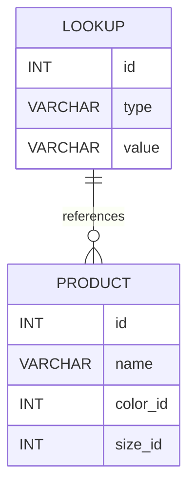

## 16.2.4 One True Lookup Table

In the realm of SQL database design, the One True Lookup Table (OTLT) is a common anti-pattern that can lead to significant challenges in maintaining data integrity and clarity. Understanding this anti-pattern, its drawbacks, and how to avoid it is crucial for expert software engineers and architects aiming to build robust and scalable database systems.

### Definition

The One True Lookup Table is a design approach where a single table is used to store all lookup values, regardless of their domain. This table typically contains a generic structure, often with columns like `id`, `type`, and `value`, to accommodate various types of lookup data.

### Drawbacks of the One True Lookup Table

While the OTLT might seem like a convenient way to centralize lookup data, it introduces several significant drawbacks:

1. **Lack of Foreign Key Constraints**: By consolidating all lookup values into a single table, it becomes impossible to enforce foreign key constraints effectively. This can lead to referential integrity issues, as there is no direct relationship between the lookup values and the tables that use them.

2. **Data Integrity Issues**: Without foreign key constraints, there is a higher risk of data integrity problems. For example, a lookup value might be deleted or modified without any checks, leading to orphaned records or inconsistent data.

3. **Performance Bottlenecks**: As the OTLT grows, performance can degrade. Queries that need to filter or join on specific lookup values may become slower due to the increased size and complexity of the table.

4. **Complexity in Querying**: Queries become more complex and less readable, as they often require additional filtering to distinguish between different types of lookup values.

5. **Lack of Clarity and Maintainability**: The OTLT can obscure the logical structure of the database, making it harder for developers to understand and maintain the system. It becomes challenging to determine which lookup values belong to which domain.

### Solution: Separate Lookup Tables

To address the issues associated with the One True Lookup Table, it is recommended to create separate lookup tables for distinct domains. This approach offers several benefits:

- **Enforce Foreign Key Constraints**: By having dedicated lookup tables, you can enforce foreign key constraints, ensuring referential integrity and preventing orphaned records.

- **Improve Data Integrity**: With foreign key constraints in place, data integrity is maintained, as changes to lookup values are automatically propagated to related tables.

- **Enhance Performance**: Smaller, domain-specific lookup tables can improve query performance, as they reduce the amount of data that needs to be processed.

- **Simplify Queries**: Queries become simpler and more readable, as they no longer require additional filtering to distinguish between different types of lookup values.

- **Increase Clarity and Maintainability**: The logical structure of the database is clearer, making it easier for developers to understand and maintain the system.

### Sample Code Snippet

Let's explore a practical example to illustrate the differences between the One True Lookup Table and separate lookup tables.

#### One True Lookup Table Example

```sql
-- One True Lookup Table
CREATE TABLE Lookup (
    id INT PRIMARY KEY,
    type VARCHAR(50),
    value VARCHAR(255)
);

-- Sample Data
INSERT INTO Lookup (id, type, value) VALUES (1, 'Color', 'Red');
INSERT INTO Lookup (id, type, value) VALUES (2, 'Color', 'Blue');
INSERT INTO Lookup (id, type, value) VALUES (3, 'Size', 'Small');
INSERT INTO Lookup (id, type, value) VALUES (4, 'Size', 'Large');

-- Query to get colors
SELECT value FROM Lookup WHERE type = 'Color';
```

#### Separate Lookup Tables Example

```sql
-- Separate Lookup Tables
CREATE TABLE Color (
    id INT PRIMARY KEY,
    name VARCHAR(50)
);

CREATE TABLE Size (
    id INT PRIMARY KEY,
    description VARCHAR(50)
);

-- Sample Data
INSERT INTO Color (id, name) VALUES (1, 'Red');
INSERT INTO Color (id, name) VALUES (2, 'Blue');
INSERT INTO Size (id, description) VALUES (1, 'Small');
INSERT INTO Size (id, description) VALUES (2, 'Large');

-- Query to get colors
SELECT name FROM Color;
```

### Design Considerations

When deciding whether to use separate lookup tables, consider the following:

- **Domain Complexity**: If your application has complex domain-specific logic, separate lookup tables can help encapsulate this complexity and make the system easier to understand.

- **Scalability**: Separate lookup tables can scale more effectively, as they allow for more targeted indexing and optimization strategies.

- **Maintenance**: Consider the long-term maintenance implications. Separate tables can simplify schema changes and reduce the risk of introducing errors.

### Differences and Similarities

The One True Lookup Table is often confused with other centralized data storage patterns. However, it is distinct in its lack of domain specificity and its inability to enforce foreign key constraints. By contrast, separate lookup tables align more closely with the principles of normalization and domain-driven design.

### Visualizing the One True Lookup Table

To better understand the structure and implications of the One True Lookup Table, let's visualize it using a Mermaid.js diagram.



In this diagram, the `PRODUCT` table references the `LOOKUP` table for both `color_id` and `size_id`, illustrating the lack of direct foreign key constraints.

### Try It Yourself

To deepen your understanding, try modifying the code examples above:

- **Add New Domains**: Create additional lookup tables for new domains, such as `Material` or `Category`, and populate them with sample data.
- **Implement Foreign Key Constraints**: Add foreign key constraints to the separate lookup tables to enforce referential integrity.
- **Optimize Queries**: Experiment with indexing strategies to optimize query performance for the separate lookup tables.

### Knowledge Check

To reinforce your understanding of the One True Lookup Table anti-pattern, consider the following questions:

- What are the primary drawbacks of using a One True Lookup Table?
- How do separate lookup tables improve data integrity and performance?
- What are the key differences between the One True Lookup Table and separate lookup tables?

### Embrace the Journey

Remember, mastering SQL design patterns is a journey. As you continue to explore and experiment with different patterns, you'll gain a deeper understanding of how to build efficient, scalable, and maintainable database systems. Keep experimenting, stay curious, and enjoy the journey!

## Quiz Time!



### What is a One True Lookup Table?

- [x] A single table used for all lookup values, regardless of their domain.
- [ ] A table that enforces strict foreign key constraints.
- [ ] A table designed for storing only unique values.
- [ ] A table that is used exclusively for indexing purposes.

> **Explanation:** A One True Lookup Table is a single table used to store all lookup values, which can lead to data integrity issues due to the lack of domain specificity.

### What is a major drawback of the One True Lookup Table?

- [x] It lacks foreign key constraints, leading to referential integrity issues.
- [ ] It requires too much storage space.
- [ ] It is too complex to implement.
- [ ] It is incompatible with most SQL databases.

> **Explanation:** The lack of foreign key constraints in a One True Lookup Table can lead to referential integrity issues, making it difficult to maintain data consistency.

### How can separate lookup tables improve performance?

- [x] By reducing the amount of data processed in queries.
- [ ] By increasing the complexity of queries.
- [ ] By requiring more storage space.
- [ ] By making the database schema more complex.

> **Explanation:** Separate lookup tables reduce the amount of data processed in queries, leading to improved performance.

### What is a benefit of using separate lookup tables?

- [x] They allow for the enforcement of foreign key constraints.
- [ ] They require less maintenance.
- [ ] They eliminate the need for indexing.
- [ ] They simplify the database schema.

> **Explanation:** Separate lookup tables allow for the enforcement of foreign key constraints, which helps maintain data integrity.

### Which of the following is a characteristic of the One True Lookup Table?

- [x] It consolidates all lookup values into a single table.
- [ ] It uses multiple tables for different domains.
- [ ] It enforces strict data validation rules.
- [ ] It is optimized for performance.

> **Explanation:** The One True Lookup Table consolidates all lookup values into a single table, which can lead to data integrity issues.

### What is a common issue with querying a One True Lookup Table?

- [x] Queries become more complex and less readable.
- [ ] Queries are faster and more efficient.
- [ ] Queries require less filtering.
- [ ] Queries are easier to write.

> **Explanation:** Queries against a One True Lookup Table become more complex and less readable due to the need to filter for specific types of lookup values.

### How do separate lookup tables enhance maintainability?

- [x] By clarifying the logical structure of the database.
- [ ] By consolidating all data into a single table.
- [ ] By eliminating the need for foreign key constraints.
- [ ] By reducing the number of tables in the database.

> **Explanation:** Separate lookup tables enhance maintainability by clarifying the logical structure of the database, making it easier to understand and manage.

### What is a key difference between the One True Lookup Table and separate lookup tables?

- [x] Separate lookup tables allow for domain-specific constraints.
- [ ] The One True Lookup Table is more efficient.
- [ ] Separate lookup tables require more storage space.
- [ ] The One True Lookup Table is easier to maintain.

> **Explanation:** Separate lookup tables allow for domain-specific constraints, which helps maintain data integrity and clarity.

### Why might the One True Lookup Table be considered an anti-pattern?

- [x] It leads to data integrity and performance issues.
- [ ] It is too complex to implement.
- [ ] It requires too much storage space.
- [ ] It is incompatible with most SQL databases.

> **Explanation:** The One True Lookup Table is considered an anti-pattern because it can lead to data integrity and performance issues due to its lack of domain specificity.

### True or False: The One True Lookup Table is a recommended practice for modern SQL database design.

- [ ] True
- [x] False

> **Explanation:** False. The One True Lookup Table is considered an anti-pattern and is not recommended for modern SQL database design due to its drawbacks.


