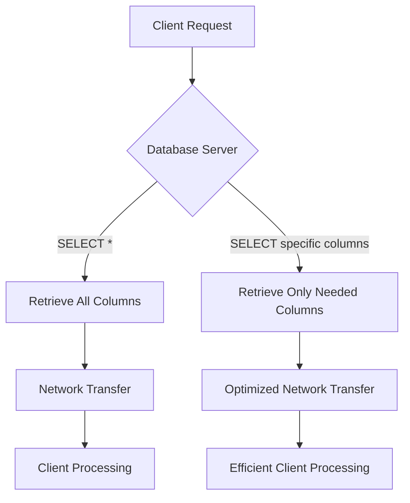

## 16.3.1 Implicit Columns (SELECT *)

In the realm of SQL development, the use of `SELECT *` is a common practice that can lead to significant inefficiencies and potential security risks. This section delves into the reasons why relying on implicit columns is considered an anti-pattern, the impact it can have on your database operations, and the best practices to adopt for more efficient and secure querying.

### Understanding the Problem

**Implicit Columns**: The use of `SELECT *` in SQL queries is often referred to as selecting implicit columns. This approach retrieves all columns from a table without explicitly specifying which ones are needed.

#### Why is `SELECT *` an Anti-Pattern?

1. **Performance Concerns**: 
   - **Increased Network Load**: Fetching all columns, especially from large tables, can lead to unnecessary data transfer over the network, increasing latency and bandwidth usage.
   - **Inefficient Query Execution**: The database engine must retrieve and process all columns, which can slow down query execution, especially if only a few columns are needed.

2. **Schema Dependency**:
   - **Unexpected Results**: Changes in the table schema, such as adding or removing columns, can lead to unexpected results in applications that rely on specific column orders or names.
   - **Maintenance Challenges**: Queries using `SELECT *` are harder to maintain and understand, as they do not clearly document which data is being used.

3. **Security Risks**:
   - **Data Exposure**: Retrieving all columns can inadvertently expose sensitive data, especially if the table contains confidential information that should not be accessed by all users.

### Best Practices for Avoiding `SELECT *`

To mitigate the issues associated with `SELECT *`, it is crucial to adopt best practices that enhance both performance and security.

#### Specify Columns Explicitly

- **Explicit Column Selection**: Always specify the columns you need in your query. This not only improves performance but also makes your queries more readable and maintainable.

```sql
-- Instead of using SELECT *
SELECT first_name, last_name, email
FROM employees;
```

#### Use Aliases for Clarity

- **Column Aliases**: Use aliases to make your queries more readable and to avoid conflicts when joining tables with columns of the same name.

```sql
SELECT e.first_name AS employee_first_name, d.name AS department_name
FROM employees e
JOIN departments d ON e.department_id = d.id;
```

#### Leverage Views for Complex Queries

- **Views**: Create views to encapsulate complex queries. This allows you to reuse query logic and ensure consistent data retrieval without exposing unnecessary columns.

```sql
CREATE VIEW employee_contact_info AS
SELECT first_name, last_name, email, phone_number
FROM employees;
```

#### Optimize for Performance

- **Indexing**: Ensure that columns frequently used in queries are indexed to improve retrieval speed.
- **Query Execution Plans**: Analyze query execution plans to identify bottlenecks and optimize query performance.

### Visualizing the Impact of `SELECT *`

To better understand the impact of using `SELECT *`, let's visualize the data flow and potential inefficiencies using a Mermaid.js diagram.



**Diagram Explanation**: The diagram illustrates the difference in data flow between using `SELECT *` and selecting specific columns. By retrieving only the needed columns, we reduce network transfer and improve client processing efficiency.

### Code Examples and Exercises

Let's explore some practical examples and exercises to reinforce the concepts discussed.

#### Example 1: Comparing Query Performance

Consider a table `orders` with a large number of columns and rows. Compare the performance of using `SELECT *` versus selecting specific columns.

```sql
-- Using SELECT *
SELECT * FROM orders WHERE order_date > '2024-01-01';

-- Selecting specific columns
SELECT order_id, customer_id, order_date FROM orders WHERE order_date > '2024-01-01';
```

**Exercise**: Use your database's query analyzer to compare the execution time and resource usage of these two queries.

#### Example 2: Handling Schema Changes

Imagine a scenario where a new column `sensitive_info` is added to the `employees` table. Using `SELECT *` could inadvertently expose this data.

```sql
-- Before schema change
SELECT * FROM employees;

-- After schema change
SELECT first_name, last_name, email FROM employees;
```

**Exercise**: Modify your queries to ensure that only necessary columns are retrieved, even after schema changes.

### Try It Yourself

Encourage experimentation by suggesting modifications to the code examples. For instance, try adding a new column to a table and observe how it affects queries using `SELECT *` versus those specifying columns explicitly.

### References and Further Reading

- [W3Schools SQL SELECT Statement](https://www.w3schools.com/sql/sql_select.asp)
- [MDN Web Docs: SQL SELECT](https://developer.mozilla.org/en-US/docs/Web/SQL/SELECT)
- [SQL Performance Tuning](https://www.sqlshack.com/sql-performance-tuning/)

### Knowledge Check

To reinforce your understanding, consider the following questions and challenges:

1. What are the main drawbacks of using `SELECT *` in SQL queries?
2. How can specifying columns explicitly improve query performance?
3. What are some security risks associated with using `SELECT *`?
4. How can views help in managing complex queries and ensuring data security?

### Embrace the Journey

Remember, mastering SQL design patterns is a journey. By understanding and avoiding anti-patterns like `SELECT *`, you are taking a significant step towards writing efficient, secure, and maintainable SQL code. Keep experimenting, stay curious, and enjoy the process of continuous learning and improvement.

## Quiz Time!



### What is a primary drawback of using `SELECT *` in SQL queries?

- [x] It can lead to inefficient queries and unexpected results.
- [ ] It simplifies query writing.
- [ ] It ensures all data is retrieved.
- [ ] It automatically optimizes queries.

> **Explanation:** Using `SELECT *` can lead to inefficient queries and unexpected results, especially when the table schema changes.

### How does specifying columns explicitly in a SELECT statement improve performance?

- [x] It reduces the amount of data transferred over the network.
- [ ] It increases the complexity of queries.
- [ ] It ensures all columns are retrieved.
- [ ] It has no impact on performance.

> **Explanation:** Specifying columns explicitly reduces the amount of data transferred over the network, improving performance.

### What security risk is associated with using `SELECT *`?

- [x] It can inadvertently expose sensitive data.
- [ ] It encrypts all data.
- [ ] It prevents unauthorized access.
- [ ] It ensures data integrity.

> **Explanation:** Using `SELECT *` can inadvertently expose sensitive data, especially if the table contains confidential information.

### Why is `SELECT *` considered an anti-pattern?

- [x] It leads to inefficient queries and maintenance challenges.
- [ ] It simplifies query writing.
- [ ] It ensures all data is retrieved.
- [ ] It automatically optimizes queries.

> **Explanation:** `SELECT *` is considered an anti-pattern because it leads to inefficient queries and maintenance challenges.

### What is a benefit of using views in SQL?

- [x] They encapsulate complex queries and ensure consistent data retrieval.
- [ ] They expose all columns of a table.
- [ ] They increase query complexity.
- [ ] They have no impact on query performance.

> **Explanation:** Views encapsulate complex queries and ensure consistent data retrieval without exposing unnecessary columns.

### How can you mitigate the issues associated with `SELECT *`?

- [x] By specifying the columns needed in the SELECT statement.
- [ ] By using `SELECT *` in all queries.
- [ ] By avoiding indexing.
- [ ] By ignoring query execution plans.

> **Explanation:** Mitigating the issues associated with `SELECT *` involves specifying the columns needed in the SELECT statement.

### What is a potential impact of schema changes on queries using `SELECT *`?

- [x] They can lead to unexpected results.
- [ ] They simplify query writing.
- [ ] They ensure all data is retrieved.
- [ ] They automatically optimize queries.

> **Explanation:** Schema changes can lead to unexpected results in queries using `SELECT *`.

### How can aliases improve SQL queries?

- [x] By making queries more readable and avoiding conflicts.
- [ ] By increasing query complexity.
- [ ] By exposing all columns of a table.
- [ ] By reducing query performance.

> **Explanation:** Aliases make queries more readable and help avoid conflicts when joining tables with columns of the same name.

### What is a common use case for creating views in SQL?

- [x] To encapsulate complex queries and ensure consistent data retrieval.
- [ ] To expose all columns of a table.
- [ ] To increase query complexity.
- [ ] To have no impact on query performance.

> **Explanation:** Views are commonly used to encapsulate complex queries and ensure consistent data retrieval.

### True or False: Using `SELECT *` is always the best practice for SQL queries.

- [ ] True
- [x] False

> **Explanation:** False. Using `SELECT *` is not the best practice as it can lead to inefficient queries, maintenance challenges, and security risks.




