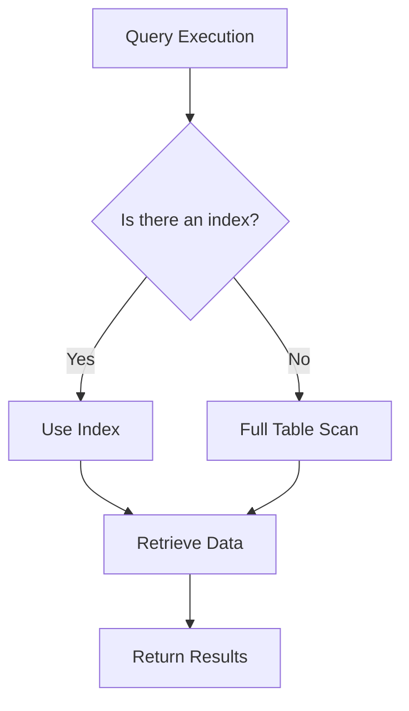

## 16.3.2 Neglecting Indexes

In the realm of SQL development, one of the most common anti-patterns is neglecting to create and maintain indexes. This oversight can lead to significant performance bottlenecks, as queries may resort to full table scans, consuming excessive resources and time. In this section, we will delve into the importance of indexes, explore the consequences of neglecting them, and provide strategies for effective indexing.

### Understanding Indexes

Indexes are database objects that improve the speed of data retrieval operations on a database table at the cost of additional writes and storage space. They function similarly to an index in a book, allowing the database engine to quickly locate and access the data without scanning the entire table.

#### Types of Indexes

1. **B-Tree Indexes**: The most common type, suitable for a wide range of queries. They are balanced tree structures that allow for fast data retrieval.

2. **Hash Indexes**: Ideal for equality comparisons, these indexes use a hash function to map keys to locations.

3. **Bitmap Indexes**: Efficient for columns with a limited number of distinct values, often used in data warehousing.

4. **Full-Text Indexes**: Designed for text search operations, enabling fast retrieval of text-based data.

5. **Spatial Indexes**: Used for geospatial data, allowing efficient querying of spatial objects.

### The Consequences of Neglecting Indexes

Neglecting indexes can have severe implications for database performance:

- **Full Table Scans**: Without indexes, the database engine may perform full table scans, reading every row to find the desired data. This is resource-intensive and slow.

- **Increased Query Execution Time**: Queries take longer to execute, leading to slower application performance and a poor user experience.

- **Higher Resource Consumption**: Full table scans consume more CPU and I/O resources, potentially affecting other operations and leading to increased costs in cloud environments.

- **Scalability Issues**: As the database grows, the lack of indexes can become a significant bottleneck, hindering scalability.

### Identifying the Need for Indexes

To determine where indexes are needed, analyze query patterns and performance metrics. Consider the following:

- **Frequent Queries**: Identify queries that are executed frequently and take a long time to complete.

- **Slow Queries**: Use database profiling tools to find queries with high execution times.

- **Join Operations**: Index columns used in join conditions to speed up join operations.

- **Filter Conditions**: Index columns used in WHERE clauses to improve filtering efficiency.

### Creating Effective Indexes

When creating indexes, consider the following best practices:

1. **Analyze Query Patterns**: Understand the queries that are run most often and the columns they access.

2. **Use Composite Indexes**: For queries that filter on multiple columns, composite indexes can be more efficient than multiple single-column indexes.

3. **Consider Index Selectivity**: High selectivity (the ratio of distinct values to the total number of rows) makes an index more effective.

4. **Balance Read and Write Performance**: While indexes improve read performance, they can slow down write operations. Balance the need for fast reads with the impact on writes.

5. **Regularly Review and Maintain Indexes**: As query patterns and data change, regularly review and adjust indexes to ensure they remain effective.

### Code Example: Creating Indexes

Let's look at a practical example of creating indexes in SQL:

```sql
-- Create a B-Tree index on the 'last_name' column
CREATE INDEX idx_last_name ON employees(last_name);

-- Create a composite index on 'department_id' and 'hire_date'
CREATE INDEX idx_department_hire_date ON employees(department_id, hire_date);

-- Create a full-text index on the 'description' column
CREATE FULLTEXT INDEX idx_description ON products(description);
```

In this example, we create a B-Tree index on the `last_name` column to speed up searches for employees by last name. We also create a composite index on `department_id` and `hire_date` to optimize queries filtering by department and hire date. Finally, we create a full-text index on the `description` column of the `products` table to enhance text search capabilities.

### Visualizing Index Usage

To better understand how indexes work, let's visualize the process of using an index to retrieve data:



This diagram illustrates the decision-making process during query execution. If an index is available, the database engine uses it to quickly locate the data. If not, a full table scan is performed, which is less efficient.

### Try It Yourself

To solidify your understanding, try creating indexes on a sample database. Experiment with different types of indexes and observe their impact on query performance. Consider modifying the indexes to see how changes affect execution times.

### Common Pitfalls and How to Avoid Them

1. **Over-Indexing**: Creating too many indexes can degrade performance due to increased maintenance overhead. Focus on the most beneficial indexes.

2. **Ignoring Maintenance**: Indexes require regular maintenance, such as rebuilding or reorganizing, to remain effective.

3. **Neglecting Composite Indexes**: Single-column indexes may not be sufficient for complex queries. Use composite indexes where appropriate.

4. **Failing to Monitor Performance**: Continuously monitor query performance and adjust indexes as needed.

### Knowledge Check

Before moving on, let's review some key points:

- Indexes are crucial for optimizing query performance.
- Neglecting indexes can lead to full table scans, increased execution time, and higher resource consumption.
- Effective indexing requires analyzing query patterns and balancing read and write performance.

### Embrace the Journey

Remember, mastering indexing is a journey. As you gain experience, you'll develop an intuition for when and how to use indexes effectively. Keep experimenting, stay curious, and enjoy the process of optimizing your SQL queries.

## Quiz Time!



### What is the primary purpose of an index in a database?

- [x] To improve the speed of data retrieval operations
- [ ] To increase storage space
- [ ] To slow down write operations
- [ ] To enforce data integrity

> **Explanation:** Indexes are used to improve the speed of data retrieval operations by allowing the database engine to quickly locate and access data.

### Which type of index is most suitable for text search operations?

- [ ] B-Tree Index
- [ ] Hash Index
- [x] Full-Text Index
- [ ] Bitmap Index

> **Explanation:** Full-text indexes are designed for text search operations, enabling fast retrieval of text-based data.

### What is a common consequence of neglecting indexes?

- [ ] Reduced storage space
- [x] Full table scans
- [ ] Faster write operations
- [ ] Improved query execution time

> **Explanation:** Neglecting indexes can lead to full table scans, which are resource-intensive and slow.

### What is the benefit of using composite indexes?

- [x] They can be more efficient for queries filtering on multiple columns
- [ ] They reduce the need for maintenance
- [ ] They are easier to create than single-column indexes
- [ ] They improve write performance

> **Explanation:** Composite indexes can be more efficient than multiple single-column indexes for queries that filter on multiple columns.

### What should be considered when creating indexes?

- [x] Query patterns and index selectivity
- [ ] Only the number of columns
- [ ] The color of the database interface
- [ ] The name of the database

> **Explanation:** When creating indexes, it's important to consider query patterns and index selectivity to ensure they are effective.

### What is a potential downside of over-indexing?

- [ ] Improved read performance
- [ ] Reduced storage space
- [x] Increased maintenance overhead
- [ ] Faster write operations

> **Explanation:** Over-indexing can lead to increased maintenance overhead, which can degrade performance.

### How can you monitor the effectiveness of indexes?

- [x] By using database profiling tools
- [ ] By counting the number of indexes
- [ ] By checking the color of the database interface
- [ ] By observing the database name

> **Explanation:** Database profiling tools can help monitor the effectiveness of indexes by analyzing query performance.

### What is the role of a B-Tree index?

- [x] To provide fast data retrieval for a wide range of queries
- [ ] To perform text search operations
- [ ] To handle geospatial data
- [ ] To map keys to locations using a hash function

> **Explanation:** B-Tree indexes are balanced tree structures that provide fast data retrieval for a wide range of queries.

### True or False: Indexes can slow down write operations.

- [x] True
- [ ] False

> **Explanation:** While indexes improve read performance, they can slow down write operations due to the additional maintenance required.

### What is the first step in creating effective indexes?

- [x] Analyzing query patterns
- [ ] Creating as many indexes as possible
- [ ] Ignoring maintenance
- [ ] Focusing only on single-column indexes

> **Explanation:** The first step in creating effective indexes is analyzing query patterns to understand which columns are accessed most often.


