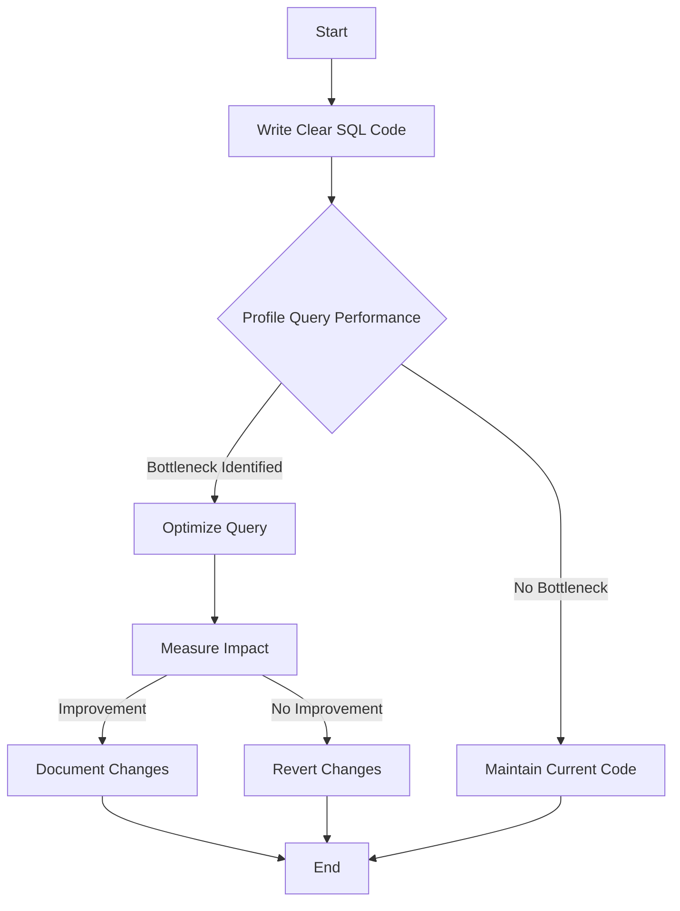

## 16.3.3 Premature Optimization

Premature optimization is a common anti-pattern in SQL development, where developers focus on optimizing code before understanding the actual performance bottlenecks. This often leads to wasted effort, increased complexity, and reduced maintainability. In this section, we will explore the concept of premature optimization, its risks, and best practices for writing efficient and maintainable SQL code.

### Understanding Premature Optimization

Premature optimization refers to the practice of making code optimizations before there is a clear understanding of the performance issues that need to be addressed. This can lead to several problems:

- **Wasted Effort**: Developers may spend time optimizing parts of the code that do not significantly impact performance.
- **Increased Complexity**: Optimizations can make code more complex and harder to understand, leading to maintenance challenges.
- **Missed Opportunities**: Focusing on premature optimizations can distract from identifying and addressing actual performance bottlenecks.

### Risks of Premature Optimization

1. **Complexity and Maintainability**: Optimized code is often more complex, making it difficult for other developers to understand and maintain. This can lead to bugs and errors in the future.

2. **Resource Misallocation**: Time and resources spent on optimizing non-critical parts of the code could be better used elsewhere, such as improving functionality or fixing bugs.

3. **Performance Trade-offs**: Some optimizations may improve performance in one area while degrading it in another. Without proper analysis, these trade-offs can lead to suboptimal performance.

4. **Technical Debt**: Premature optimizations can contribute to technical debt, where the cost of maintaining and updating the code increases over time.

### Best Practices to Avoid Premature Optimization

To avoid the pitfalls of premature optimization, follow these best practices:

1. **Focus on Clarity and Maintainability**: Write clear and maintainable code first. Ensure that your SQL queries are easy to read and understand.

2. **Profile Before Optimizing**: Use profiling tools to identify actual performance bottlenecks. Optimize only those parts of the code that have a significant impact on performance.

3. **Iterative Optimization**: Optimize iteratively, making small changes and measuring their impact. This approach allows you to assess the effectiveness of each optimization.

4. **Use Indexes Wisely**: Indexes can improve query performance, but they also add overhead. Use them judiciously and monitor their impact on performance.

5. **Avoid Over-Engineering**: Resist the temptation to over-engineer solutions. Keep your code simple and straightforward.

6. **Document Optimizations**: Document any optimizations you make, including the rationale and expected impact. This helps other developers understand the changes and their purpose.

### Profiling and Identifying Bottlenecks

Profiling is a critical step in identifying performance bottlenecks. Use profiling tools to analyze query performance and identify areas for improvement. Some popular SQL profiling tools include:

- **EXPLAIN**: Use the EXPLAIN command to analyze query execution plans and identify potential bottlenecks.
- **Query Profiler**: Many database management systems offer built-in query profilers that provide detailed performance metrics.
- **Third-Party Tools**: Tools like SolarWinds Database Performance Analyzer and Redgate SQL Monitor offer advanced profiling and monitoring capabilities.

### Sample Code Snippet

Let's consider a simple example to illustrate the concept of premature optimization:

```sql
-- Original query
SELECT customer_id, COUNT(order_id) AS order_count
FROM orders
GROUP BY customer_id
HAVING COUNT(order_id) > 5;

-- Premature optimization attempt
SELECT customer_id, order_count
FROM (
    SELECT customer_id, COUNT(order_id) AS order_count
    FROM orders
    GROUP BY customer_id
) AS subquery
WHERE order_count > 5;
```

In this example, the original query is straightforward and easy to understand. The premature optimization attempt introduces a subquery, which adds complexity without necessarily improving performance. Before making such changes, it's important to profile the query and determine if the optimization is necessary.

### Visualizing the Impact of Premature Optimization

To better understand the impact of premature optimization, let's visualize the process of query execution and optimization using a flowchart.



**Diagram Description**: This flowchart illustrates the process of writing SQL code, profiling query performance, and making optimizations based on profiling data. It emphasizes the importance of measuring the impact of optimizations and documenting changes.

### Try It Yourself

To better understand the concept of premature optimization, try modifying the sample code snippet above. Experiment with different query structures and use profiling tools to measure their performance. Consider the following questions:

- How does the use of subqueries impact performance?
- What effect do different indexing strategies have on query execution time?
- How can you simplify the query while maintaining or improving performance?

### References and Further Reading

- [SQL Performance Explained](https://sql-performance-explained.com/)
- [Understanding SQL Query Optimization](https://www.sqlshack.com/sql-query-optimization/)
- [Profiling and Tuning SQL Queries](https://www.red-gate.com/simple-talk/sql/performance/profiling-and-tuning-sql-queries/)

### Knowledge Check

1. **What is premature optimization, and why is it considered an anti-pattern?**
2. **List three risks associated with premature optimization.**
3. **What are some best practices to avoid premature optimization?**
4. **How can profiling tools help in identifying performance bottlenecks?**
5. **Why is it important to document optimizations?**

### Embrace the Journey

Remember, premature optimization is a common pitfall in SQL development, but it can be avoided with careful planning and analysis. Focus on writing clear and maintainable code, and use profiling tools to guide your optimization efforts. As you progress, you'll develop a deeper understanding of SQL performance and become more adept at identifying and addressing bottlenecks. Keep experimenting, stay curious, and enjoy the journey!

## Quiz Time!



### What is premature optimization?

- [x] Optimizing code before understanding actual performance bottlenecks
- [ ] Optimizing code after identifying performance bottlenecks
- [ ] Writing clear and maintainable code
- [ ] Using profiling tools to guide optimization efforts

> **Explanation:** Premature optimization refers to optimizing code before understanding the actual performance bottlenecks, which can lead to wasted effort and increased complexity.

### Which of the following is a risk of premature optimization?

- [x] Increased complexity and maintainability challenges
- [ ] Improved code readability
- [ ] Reduced technical debt
- [ ] Enhanced collaboration between developers

> **Explanation:** Premature optimization can lead to increased complexity and maintainability challenges, making it harder for other developers to understand and work with the code.

### What should you do before optimizing SQL code?

- [x] Profile the code to identify performance bottlenecks
- [ ] Optimize all parts of the code equally
- [ ] Focus on optimizing non-critical parts of the code
- [ ] Avoid using profiling tools

> **Explanation:** Before optimizing SQL code, it's important to profile the code to identify actual performance bottlenecks and focus optimization efforts on those areas.

### How can you avoid premature optimization?

- [x] Write clear and maintainable code first
- [ ] Optimize code without profiling
- [ ] Use complex query structures
- [ ] Ignore the impact of optimizations

> **Explanation:** To avoid premature optimization, write clear and maintainable code first, and use profiling tools to guide optimization efforts.

### Why is it important to document optimizations?

- [x] To help other developers understand the changes and their purpose
- [ ] To increase the complexity of the code
- [ ] To avoid using profiling tools
- [ ] To focus on non-critical parts of the code

> **Explanation:** Documenting optimizations helps other developers understand the changes and their purpose, making it easier to maintain and update the code.

### What is a common tool used for profiling SQL queries?

- [x] EXPLAIN
- [ ] SELECT *
- [ ] INSERT INTO
- [ ] DELETE FROM

> **Explanation:** The EXPLAIN command is commonly used to analyze query execution plans and identify potential performance bottlenecks.

### What is the first step in the iterative optimization process?

- [x] Write clear SQL code
- [ ] Optimize all parts of the code equally
- [ ] Ignore profiling data
- [ ] Use complex query structures

> **Explanation:** The first step in the iterative optimization process is to write clear SQL code, ensuring that it is easy to read and understand.

### What is a potential consequence of premature optimization?

- [x] Increased technical debt
- [ ] Improved code readability
- [ ] Reduced complexity
- [ ] Enhanced collaboration between developers

> **Explanation:** Premature optimization can contribute to increased technical debt, where the cost of maintaining and updating the code increases over time.

### What is the purpose of using indexes in SQL?

- [x] To improve query performance
- [ ] To increase code complexity
- [ ] To avoid profiling tools
- [ ] To focus on non-critical parts of the code

> **Explanation:** Indexes are used in SQL to improve query performance by allowing faster data retrieval.

### True or False: Premature optimization is always beneficial.

- [ ] True
- [x] False

> **Explanation:** False. Premature optimization is not always beneficial and can lead to wasted effort, increased complexity, and reduced maintainability.


