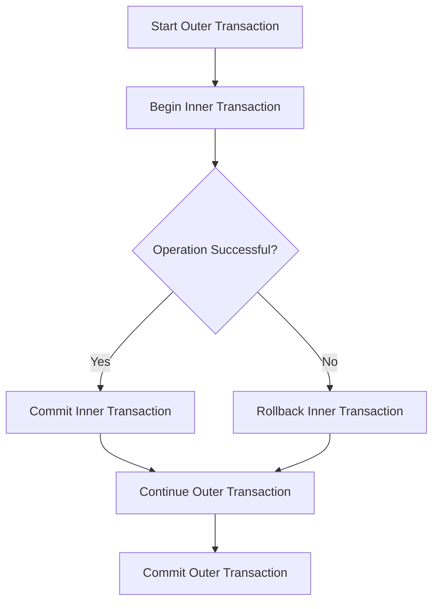

## 16.3.4 Nested Transactions Misuse

In the realm of SQL and database management, transactions are pivotal for maintaining data integrity and consistency. However, the misuse of nested transactions can lead to unexpected behaviors and data inconsistencies. In this section, we will delve into the intricacies of nested transactions, explore common pitfalls, and provide strategies to manage them effectively.

### Understanding Nested Transactions

**Nested Transactions** refer to the concept where a transaction is initiated within the scope of another transaction. This can occur when a database operation that is already part of a transaction calls another operation that starts a new transaction. While this might seem straightforward, the behavior of nested transactions can vary significantly across different Database Management Systems (DBMS).

#### Key Concepts

- **Outer Transaction**: The initial transaction that encompasses one or more inner transactions.
- **Inner Transaction**: A transaction that is initiated within the scope of an outer transaction.
- **Savepoints**: Markers within a transaction that allow partial rollbacks to a specific point without affecting the entire transaction.

### The Problem with Nested Transactions

The primary issue with nested transactions is the misconception that each transaction is independent and can be committed or rolled back individually. In reality, most DBMSs do not support true nested transactions. Instead, they use a flat transaction model where only the outermost transaction controls the commit or rollback.

#### Effects of Misuse

- **Incomplete Rollbacks**: If an inner transaction fails and is rolled back, it may not affect the outer transaction, leading to partial data updates.
- **Data Inconsistency**: Changes made by inner transactions might remain if the outer transaction is committed, even if the inner transaction was rolled back.
- **Unexpected Behavior**: Developers might expect inner transactions to behave independently, leading to flawed logic and data handling.

### Guidelines for Managing Nested Transactions

To avoid the pitfalls of nested transactions, it is crucial to understand the transaction handling mechanisms of your DBMS and implement best practices.

#### Use Savepoints

Savepoints are a powerful tool for managing transaction scopes. They allow you to set a point within a transaction to which you can roll back without affecting the entire transaction.

```sql
BEGIN TRANSACTION;

-- Set a savepoint
SAVEPOINT sp1;

-- Perform some operations
INSERT INTO Orders (OrderID, CustomerID) VALUES (1, 101);

-- Rollback to the savepoint if needed
ROLLBACK TO SAVEPOINT sp1;

-- Continue with other operations
INSERT INTO Orders (OrderID, CustomerID) VALUES (2, 102);

-- Commit the transaction
COMMIT;
```

In this example, if an error occurs after the first insert, we can roll back to `sp1` and retry or handle the error without affecting subsequent operations.

#### Properly Manage Transaction Scopes

Ensure that transaction scopes are well-defined and that operations are grouped logically. Avoid starting new transactions within existing ones unless absolutely necessary.

#### Understand DBMS-Specific Behavior

Different DBMSs handle nested transactions differently. For instance, SQL Server supports savepoints but not true nested transactions, while PostgreSQL allows subtransactions using savepoints.

### Visualizing Nested Transactions

To better understand the flow of nested transactions, let's visualize a scenario using a flowchart.



This flowchart illustrates the decision-making process within nested transactions, highlighting the importance of handling inner transaction outcomes correctly.

### Sample Code Snippet

Let's look at a practical example of nested transactions in a SQL environment.

```sql
-- Start the outer transaction
BEGIN TRANSACTION;

-- Perform some operations
UPDATE Accounts SET Balance = Balance - 100 WHERE AccountID = 1;

-- Start an inner transaction (conceptual)
BEGIN TRANSACTION;

-- Perform operations within the inner transaction
UPDATE Accounts SET Balance = Balance + 100 WHERE AccountID = 2;

-- Check for errors and rollback if necessary
IF @@ERROR <> 0
BEGIN
    -- Rollback inner transaction
    ROLLBACK TRANSACTION;
    PRINT 'Inner transaction rolled back';
END
ELSE
BEGIN
    -- Commit inner transaction
    COMMIT TRANSACTION;
    PRINT 'Inner transaction committed';
END

-- Continue with outer transaction
UPDATE Accounts SET Balance = Balance + 50 WHERE AccountID = 3;

-- Commit the outer transaction
COMMIT TRANSACTION;
```

In this example, the inner transaction is conceptually handled, but in reality, it is part of the outer transaction. The use of error checking and conditional logic helps manage the transaction flow.

### Design Considerations

When dealing with nested transactions, consider the following:

- **Transaction Isolation Levels**: Understand how isolation levels affect transaction visibility and locking behavior.
- **Error Handling**: Implement robust error handling to manage transaction failures gracefully.
- **Performance Implications**: Nested transactions can increase complexity and affect performance. Use them judiciously.

### Differences and Similarities

Nested transactions are often confused with savepoints. While both are used to manage transaction scopes, savepoints provide a more granular control within a single transaction, whereas nested transactions imply multiple independent transactions.

### Try It Yourself

Experiment with the provided code examples by modifying the operations within the transactions. Try introducing errors and observe how the transaction flow changes. This hands-on approach will help solidify your understanding of nested transactions.

### References and Links

For further reading on nested transactions and transaction management, consider the following resources:

- [Microsoft SQL Server Transactions](https://docs.microsoft.com/en-us/sql/t-sql/statements/transactions-transact-sql)
- [PostgreSQL Savepoints](https://www.postgresql.org/docs/current/sql-savepoint.html)
- [Oracle Nested Transactions](https://docs.oracle.com/en/database/oracle/oracle-database/19/sqlrf/SQL-Statements.html)

### Knowledge Check

To reinforce your understanding of nested transactions, consider the following questions:

1. What is the primary issue with nested transactions in most DBMSs?
2. How can savepoints be used to manage transaction scopes effectively?
3. What are the potential effects of misusing nested transactions?
4. How do different DBMSs handle nested transactions?

### Embrace the Journey

Remember, mastering nested transactions is just one step in your journey to becoming an expert in SQL design patterns. Keep experimenting, stay curious, and enjoy the process of learning and growing as a software engineer.

## Quiz Time!



### What is a common misconception about nested transactions?

- [x] Each transaction is independent and can be committed or rolled back individually.
- [ ] Nested transactions are always supported by all DBMSs.
- [ ] Nested transactions automatically improve performance.
- [ ] Nested transactions eliminate the need for error handling.

> **Explanation:** Many developers mistakenly believe that nested transactions can be committed or rolled back independently, which is not the case in most DBMSs.

### How can savepoints help in managing nested transactions?

- [x] They allow partial rollbacks within a transaction.
- [ ] They automatically commit transactions.
- [ ] They eliminate the need for outer transactions.
- [ ] They improve transaction performance.

> **Explanation:** Savepoints provide a way to rollback to a specific point within a transaction, offering more control over transaction scopes.

### Which of the following is a potential effect of nested transaction misuse?

- [x] Data inconsistency
- [ ] Improved data integrity
- [ ] Reduced transaction complexity
- [ ] Automatic error correction

> **Explanation:** Misusing nested transactions can lead to data inconsistencies due to incomplete rollbacks and unexpected behavior.

### What is the role of the outer transaction in nested transactions?

- [x] It controls the commit or rollback of the entire transaction scope.
- [ ] It is independent of inner transactions.
- [ ] It only affects the first operation.
- [ ] It automatically resolves conflicts.

> **Explanation:** The outer transaction is responsible for the final commit or rollback, encompassing all inner transactions.

### What should be considered when using nested transactions?

- [x] Transaction isolation levels
- [x] Error handling
- [ ] Ignoring performance implications
- [ ] Avoiding savepoints

> **Explanation:** Transaction isolation levels and error handling are crucial considerations, while performance implications should not be ignored.

### Which DBMS feature allows for partial rollbacks?

- [x] Savepoints
- [ ] Nested transactions
- [ ] Commit statements
- [ ] Indexes

> **Explanation:** Savepoints enable partial rollbacks within a transaction, providing more control over transaction management.

### How do different DBMSs handle nested transactions?

- [x] They vary in their support and implementation.
- [ ] All DBMSs support true nested transactions.
- [ ] DBMSs do not support any form of nested transactions.
- [ ] Nested transactions are standardized across all DBMSs.

> **Explanation:** Different DBMSs have varying levels of support and implementation for nested transactions, with some using savepoints instead.

### What is a key benefit of using savepoints?

- [x] They allow for more granular control within a transaction.
- [ ] They automatically commit transactions.
- [ ] They eliminate the need for error handling.
- [ ] They reduce transaction complexity.

> **Explanation:** Savepoints provide more granular control by allowing rollbacks to specific points within a transaction.

### What is the primary control mechanism for transaction outcomes?

- [x] The outer transaction
- [ ] The inner transaction
- [ ] Savepoints
- [ ] Error codes

> **Explanation:** The outer transaction is the primary control mechanism for committing or rolling back the entire transaction scope.

### True or False: Nested transactions are always independent of each other.

- [ ] True
- [x] False

> **Explanation:** Nested transactions are not independent; they are part of the outer transaction scope and do not behave as separate entities in most DBMSs.


