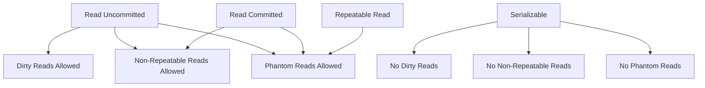

## 16.4 Transaction Management Anti-Patterns

In the realm of SQL development, transaction management is a critical aspect that ensures data integrity and consistency. However, improper handling of transactions can lead to significant performance bottlenecks and data anomalies. In this section, we will explore common transaction management anti-patterns, including long-running transactions, autocommit misuse, and ignoring transaction isolation levels. By understanding these pitfalls, expert software engineers and architects can design more efficient and reliable database systems.

### Long-Running Transactions

**Long-running transactions** occur when a transaction is kept open for an extended period, often leading to lock contention and reduced system performance. This anti-pattern is particularly detrimental in high-concurrency environments where multiple transactions compete for the same resources.

#### Key Issues with Long-Running Transactions

1. **Lock Contention**: Long-running transactions hold locks on resources, preventing other transactions from accessing them. This can lead to deadlocks and reduced throughput.
2. **Resource Consumption**: Open transactions consume system resources, such as memory and CPU, which can degrade overall system performance.
3. **Increased Risk of Failures**: The longer a transaction remains open, the higher the risk of encountering failures, such as network interruptions or system crashes.

#### Strategies to Avoid Long-Running Transactions

- **Break Down Transactions**: Divide complex operations into smaller, manageable transactions to minimize the time locks are held.
- **Optimize Queries**: Ensure that queries within a transaction are optimized for performance to reduce execution time.
- **Use Batch Processing**: For operations involving large datasets, consider using batch processing to handle data in smaller chunks.

#### Code Example: Breaking Down Transactions

```sql
-- Instead of a single long-running transaction
BEGIN TRANSACTION;

-- Complex operation
UPDATE Orders SET Status = 'Processed' WHERE OrderDate < '2024-01-01';

-- Additional operations
DELETE FROM TempOrders WHERE OrderDate < '2024-01-01';

COMMIT;

-- Break it down into smaller transactions
BEGIN TRANSACTION;

-- Update operation
UPDATE Orders SET Status = 'Processed' WHERE OrderDate < '2024-01-01';

COMMIT;

BEGIN TRANSACTION;

-- Delete operation
DELETE FROM TempOrders WHERE OrderDate < '2024-01-01';

COMMIT;
```

### Autocommit Misuse

**Autocommit** is a feature in SQL databases where each individual SQL statement is treated as a transaction and is automatically committed upon execution. While convenient, relying on autocommit can lead to incomplete transactions and data inconsistencies if not managed correctly.

#### Key Issues with Autocommit Misuse

1. **Lack of Atomicity**: Autocommit can lead to partial updates if a series of related operations are not grouped into a single transaction.
2. **Inconsistent Data States**: Without explicit transaction boundaries, data can be left in an inconsistent state if an error occurs mid-operation.
3. **Difficulty in Error Handling**: Autocommit makes it challenging to roll back changes in case of errors, leading to potential data corruption.

#### Best Practices to Manage Autocommit

- **Explicit Transaction Control**: Use `BEGIN`, `COMMIT`, and `ROLLBACK` statements to explicitly define transaction boundaries.
- **Disable Autocommit When Necessary**: For operations requiring atomicity, disable autocommit and manage transactions manually.
- **Implement Error Handling**: Ensure robust error handling mechanisms are in place to manage transaction rollbacks effectively.

#### Code Example: Managing Transactions Explicitly

```sql
-- Disable autocommit
SET AUTOCOMMIT = 0;

BEGIN TRANSACTION;

-- Series of related operations
INSERT INTO Accounts (AccountID, Balance) VALUES (1, 1000);
UPDATE Accounts SET Balance = Balance - 100 WHERE AccountID = 1;
UPDATE Accounts SET Balance = Balance + 100 WHERE AccountID = 2;

-- Commit the transaction
COMMIT;

-- Re-enable autocommit
SET AUTOCOMMIT = 1;
```

### Ignoring Transaction Isolation Levels

**Transaction isolation levels** define the degree to which the operations in one transaction are isolated from those in other transactions. Ignoring appropriate isolation levels can lead to issues such as dirty reads, non-repeatable reads, and phantom reads.

#### Key Issues with Ignoring Isolation Levels

1. **Dirty Reads**: Occur when a transaction reads data that has been modified by another transaction but not yet committed.
2. **Non-Repeatable Reads**: Happen when a transaction reads the same data multiple times and gets different results due to concurrent modifications.
3. **Phantom Reads**: Occur when a transaction reads a set of rows that match a condition, and another transaction inserts or deletes rows that affect the result set.

#### Choosing the Right Isolation Level

- **Read Uncommitted**: Allows dirty reads; offers the highest concurrency but lowest data integrity.
- **Read Committed**: Prevents dirty reads; ensures that only committed data is read.
- **Repeatable Read**: Prevents dirty and non-repeatable reads; ensures consistent data reads within a transaction.
- **Serializable**: Provides the highest level of isolation; prevents dirty, non-repeatable, and phantom reads but can reduce concurrency.

#### Code Example: Setting Isolation Levels

```sql
-- Set transaction isolation level to Repeatable Read
SET TRANSACTION ISOLATION LEVEL REPEATABLE READ;

BEGIN TRANSACTION;

-- Operations within the transaction
SELECT * FROM Orders WHERE CustomerID = 1;

-- Commit the transaction
COMMIT;
```

### Visualizing Transaction Isolation Levels

To better understand transaction isolation levels, let's visualize how different levels affect data consistency and concurrency.



**Figure 1**: Transaction Isolation Levels and Their Effects

### Try It Yourself

Experiment with the code examples provided by modifying the transaction boundaries and isolation levels. Observe how changes affect data consistency and system performance. Consider the following exercises:

- Modify the isolation level in the code example to `Read Committed` and observe the behavior.
- Introduce an error in one of the operations within a transaction and implement error handling to roll back changes.

### Knowledge Check

- What are the potential risks of long-running transactions?
- How does autocommit misuse affect data consistency?
- What are the differences between `Read Committed` and `Serializable` isolation levels?

### Embrace the Journey

Remember, mastering transaction management is a journey. As you progress, you'll gain a deeper understanding of how to design efficient and reliable database systems. Keep experimenting, stay curious, and enjoy the process!

## Quiz Time!



### What is a common issue caused by long-running transactions?

- [x] Lock contention
- [ ] Increased data redundancy
- [ ] Faster query execution
- [ ] Improved data integrity

> **Explanation:** Long-running transactions can lead to lock contention, where multiple transactions compete for the same resources, causing performance bottlenecks.

### How can autocommit misuse affect a database?

- [x] It can lead to incomplete transactions.
- [ ] It ensures all transactions are atomic.
- [ ] It prevents data anomalies.
- [ ] It automatically optimizes queries.

> **Explanation:** Autocommit misuse can result in incomplete transactions if related operations are not grouped into a single transaction, leading to data inconsistencies.

### Which isolation level allows dirty reads?

- [x] Read Uncommitted
- [ ] Read Committed
- [ ] Repeatable Read
- [ ] Serializable

> **Explanation:** The Read Uncommitted isolation level allows dirty reads, where a transaction can read data modified by another uncommitted transaction.

### What is the highest isolation level in SQL?

- [x] Serializable
- [ ] Read Committed
- [ ] Repeatable Read
- [ ] Read Uncommitted

> **Explanation:** Serializable is the highest isolation level, preventing dirty, non-repeatable, and phantom reads, ensuring the highest data integrity.

### Which strategy helps avoid long-running transactions?

- [x] Break down transactions into smaller parts
- [ ] Use autocommit for all operations
- [ ] Increase transaction timeout
- [ ] Disable all locks

> **Explanation:** Breaking down transactions into smaller parts reduces the time locks are held, minimizing the risk of long-running transactions.

### What is a phantom read?

- [x] A read that returns different results due to concurrent inserts or deletes
- [ ] A read that occurs without a transaction
- [ ] A read that is faster than usual
- [ ] A read that is always consistent

> **Explanation:** Phantom reads occur when a transaction reads a set of rows that match a condition, and another transaction inserts or deletes rows that affect the result set.

### How can you manage transactions explicitly?

- [x] Use BEGIN, COMMIT, and ROLLBACK statements
- [ ] Enable autocommit
- [ ] Use only SELECT statements
- [ ] Disable all constraints

> **Explanation:** Explicit transaction management involves using BEGIN, COMMIT, and ROLLBACK statements to define transaction boundaries and manage changes.

### What is the effect of the Serializable isolation level?

- [x] It prevents dirty, non-repeatable, and phantom reads.
- [ ] It allows dirty reads.
- [ ] It increases concurrency.
- [ ] It reduces data integrity.

> **Explanation:** The Serializable isolation level provides the highest data integrity by preventing dirty, non-repeatable, and phantom reads.

### Which isolation level prevents non-repeatable reads but allows phantom reads?

- [x] Repeatable Read
- [ ] Read Uncommitted
- [ ] Serializable
- [ ] Read Committed

> **Explanation:** The Repeatable Read isolation level prevents dirty and non-repeatable reads but allows phantom reads.

### True or False: Autocommit ensures that all transactions are atomic.

- [ ] True
- [x] False

> **Explanation:** False. Autocommit treats each individual SQL statement as a transaction, which can lead to incomplete transactions if related operations are not grouped together.




