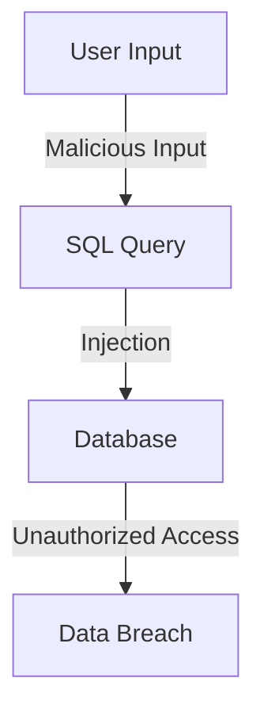
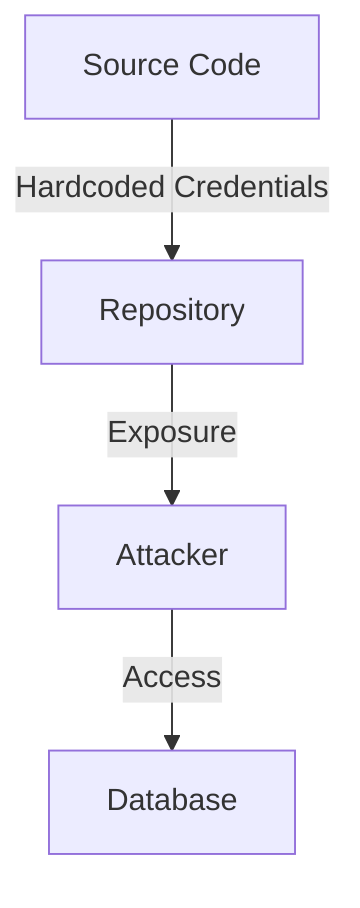
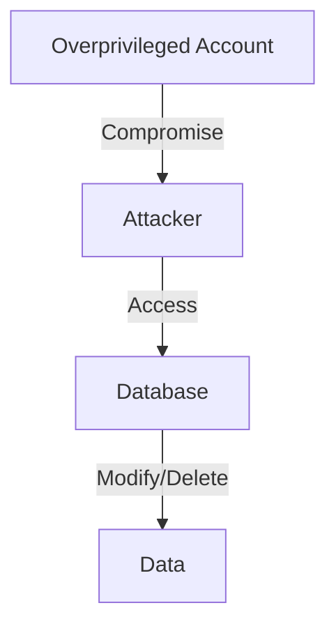

## 16.5 Security Anti-Patterns

In the realm of SQL development, security is paramount. As expert software engineers and architects, understanding and avoiding security anti-patterns is crucial to safeguarding your databases from vulnerabilities and breaches. This section delves into common security anti-patterns, providing insights and strategies to mitigate risks and enhance your database security posture.

### SQL Injection Vulnerabilities

**SQL Injection** is one of the most notorious security vulnerabilities in SQL development. It occurs when untrusted input is concatenated directly into SQL queries, allowing attackers to execute arbitrary SQL code. This can lead to unauthorized data access, data manipulation, or even complete database compromise.

#### Understanding SQL Injection

SQL injection exploits the lack of input validation and sanitization. By injecting malicious SQL code into input fields, attackers can manipulate the query execution. Consider the following example:

```sql
-- Vulnerable SQL query
SELECT * FROM users WHERE username = 'admin' AND password = 'password';
```

If user inputs are not properly sanitized, an attacker could input:

```sql
-- Malicious input
' OR '1'='1
```

This transforms the query into:

```sql
-- Resulting SQL query
SELECT * FROM users WHERE username = '' OR '1'='1' AND password = 'password';
```

The condition `'1'='1'` is always true, potentially granting unauthorized access.

#### Mitigating SQL Injection

To prevent SQL injection, adopt the following best practices:

1. **Use Prepared Statements**: Prepared statements separate SQL logic from data, preventing injection. Here's an example in Python using a parameterized query:

    ```python
    # Secure SQL query using prepared statements
    cursor.execute("SELECT * FROM users WHERE username = %s AND password = %s", (username, password))
    ```

2. **Input Validation**: Validate and sanitize all user inputs. Use whitelisting to allow only expected input formats.

3. **Stored Procedures**: Encapsulate SQL logic within stored procedures to limit direct SQL execution.

4. **Least Privilege Principle**: Limit database permissions to only what's necessary for each user or application.

5. **Regular Security Audits**: Conduct regular security audits and penetration testing to identify and address vulnerabilities.

### Hardcoding Credentials

Hardcoding database credentials in source code or configuration files is a common anti-pattern that poses significant security risks. If source code is exposed, attackers can easily access sensitive credentials, leading to unauthorized database access.

#### Risks of Hardcoding Credentials

- **Exposure**: Source code repositories, especially public ones, can inadvertently expose credentials.
- **Lack of Flexibility**: Hardcoded credentials make it difficult to change passwords or rotate keys without modifying and redeploying code.
- **Increased Attack Surface**: Compromised credentials can lead to data breaches and unauthorized access.

#### Best Practices for Credential Management

1. **Environment Variables**: Store credentials in environment variables, which can be accessed by the application at runtime.

2. **Configuration Management Tools**: Use tools like HashiCorp Vault or AWS Secrets Manager to securely store and manage credentials.

3. **Encryption**: Encrypt sensitive information both in transit and at rest. Use strong encryption algorithms and key management practices.

4. **Access Controls**: Implement strict access controls to limit who can view or modify credentials.

5. **Regular Rotation**: Regularly rotate credentials to minimize the impact of potential exposure.

### Overprivileged Accounts

Using accounts with excessive permissions is another security anti-pattern that can lead to significant vulnerabilities. Overprivileged accounts increase the risk of unauthorized data access and modification.

#### Understanding Overprivileged Accounts

Overprivileged accounts have more permissions than necessary, often due to convenience or oversight. This can lead to:

- **Data Breaches**: If an account is compromised, attackers can access more data than intended.
- **Accidental Data Modification**: Users may inadvertently modify or delete critical data.
- **Increased Attack Surface**: More permissions mean more potential entry points for attackers.

#### Strategies to Mitigate Overprivileged Accounts

1. **Principle of Least Privilege**: Grant only the permissions necessary for a user or application to perform its tasks.

2. **Role-Based Access Control (RBAC)**: Implement RBAC to manage permissions based on roles rather than individual users.

3. **Regular Audits**: Conduct regular audits of user permissions to ensure compliance with security policies.

4. **Separation of Duties**: Divide responsibilities among different users to prevent conflicts of interest and reduce risk.

5. **Monitoring and Alerts**: Implement monitoring and alerting for unusual access patterns or permission changes.

### Visualizing Security Anti-Patterns

To better understand the flow and impact of these security anti-patterns, let's visualize them using Mermaid.js diagrams.

#### SQL Injection Flow



**Diagram Description**: This flowchart illustrates how malicious user input can lead to SQL injection, resulting in unauthorized database access and potential data breaches.

#### Credential Exposure



**Diagram Description**: This flowchart shows how hardcoded credentials in source code can be exposed, allowing attackers to gain unauthorized access to the database.

#### Overprivileged Account Risks



**Diagram Description**: This flowchart depicts the risks associated with overprivileged accounts, highlighting how attackers can exploit them to access and modify database data.

### Try It Yourself

To reinforce your understanding of these security anti-patterns, try the following exercises:

1. **SQL Injection Simulation**: Create a simple web application with a vulnerable SQL query. Test different inputs to see how SQL injection can be exploited. Then, refactor the code to use prepared statements and observe the difference.

2. **Credential Management**: Set up a secure environment for storing and accessing database credentials using environment variables or a configuration management tool. Compare this approach to hardcoding credentials in your application.

3. **Permission Audit**: Conduct a permission audit on a sample database. Identify overprivileged accounts and adjust permissions according to the principle of least privilege.

### Knowledge Check

Before we wrap up, let's review some key takeaways:

- **SQL Injection**: Always validate and sanitize user inputs. Use prepared statements to separate SQL logic from data.
- **Credential Management**: Avoid hardcoding credentials. Use secure storage solutions and encrypt sensitive information.
- **Account Permissions**: Implement the principle of least privilege and conduct regular audits to ensure appropriate access levels.

### Embrace the Journey

Remember, mastering SQL security is a continuous journey. As you progress, you'll encounter new challenges and opportunities to enhance your database security practices. Keep experimenting, stay curious, and enjoy the journey!

## Quiz Time!



### What is a common consequence of SQL injection vulnerabilities?

- [x] Unauthorized data access
- [ ] Improved query performance
- [ ] Enhanced database security
- [ ] Reduced data redundancy

> **Explanation:** SQL injection vulnerabilities can lead to unauthorized data access, allowing attackers to manipulate or retrieve sensitive information.

### Which of the following is a best practice for managing database credentials?

- [x] Use environment variables
- [ ] Hardcode credentials in source code
- [ ] Store credentials in plain text files
- [ ] Share credentials with all team members

> **Explanation:** Using environment variables is a secure way to manage database credentials, preventing exposure in source code.

### What is the principle of least privilege?

- [x] Granting only necessary permissions
- [ ] Allowing all users full access
- [ ] Storing credentials in plain text
- [ ] Using hardcoded credentials

> **Explanation:** The principle of least privilege involves granting only the permissions necessary for a user or application to perform its tasks.

### How can overprivileged accounts increase security risks?

- [x] By providing excessive permissions
- [ ] By improving query performance
- [ ] By reducing data redundancy
- [ ] By enhancing database security

> **Explanation:** Overprivileged accounts increase security risks by providing excessive permissions, which can be exploited by attackers.

### What is a common risk of hardcoding credentials?

- [x] Exposure in source code
- [ ] Improved security
- [ ] Enhanced performance
- [ ] Reduced data redundancy

> **Explanation:** Hardcoding credentials can lead to exposure in source code, increasing the risk of unauthorized access.

### Which of the following is a mitigation strategy for SQL injection?

- [x] Use prepared statements
- [ ] Hardcode SQL queries
- [ ] Grant full access to all users
- [ ] Store credentials in plain text

> **Explanation:** Using prepared statements is an effective mitigation strategy for SQL injection, as it separates SQL logic from data.

### How can you prevent unauthorized access to a database?

- [x] Implement strict access controls
- [ ] Use overprivileged accounts
- [ ] Hardcode credentials
- [ ] Allow all users full access

> **Explanation:** Implementing strict access controls helps prevent unauthorized access by ensuring only authorized users can access the database.

### What is a benefit of using configuration management tools for credentials?

- [x] Secure storage and management
- [ ] Increased exposure risk
- [ ] Reduced security
- [ ] Improved query performance

> **Explanation:** Configuration management tools provide secure storage and management of credentials, reducing the risk of exposure.

### Why is regular rotation of credentials important?

- [x] To minimize impact of exposure
- [ ] To improve query performance
- [ ] To enhance data redundancy
- [ ] To reduce database size

> **Explanation:** Regular rotation of credentials minimizes the impact of potential exposure by ensuring that compromised credentials are quickly replaced.

### True or False: Overprivileged accounts are a security best practice.

- [ ] True
- [x] False

> **Explanation:** Overprivileged accounts are not a security best practice, as they increase the risk of unauthorized access and data breaches.




