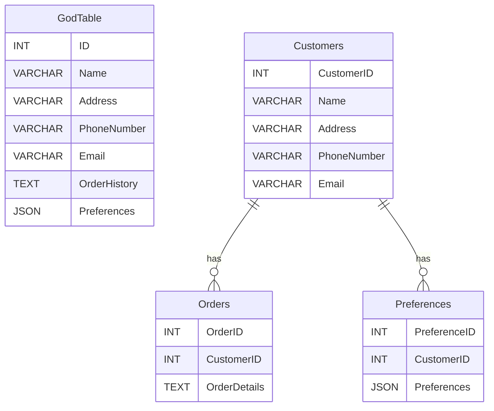

## 16.6 Identifying and Refactoring SQL Anti-Patterns

In the realm of SQL development, anti-patterns are common pitfalls that can lead to inefficient, unscalable, and error-prone database systems. Identifying and refactoring these anti-patterns is crucial for maintaining optimal database performance and ensuring the longevity of your applications. In this section, we will delve into the process of recognizing these anti-patterns and employing effective refactoring techniques to address them.

### Understanding SQL Anti-Patterns

An anti-pattern is a common response to a recurring problem that is usually ineffective and risks being counterproductive. In SQL development, anti-patterns can manifest in various forms, such as inefficient queries, poor schema design, or inadequate transaction handling. Recognizing these patterns is the first step towards refactoring them.

#### Common SQL Anti-Patterns

1. **The God Table**: A table that attempts to store too much information, leading to excessive null values and complex queries.
2. **Implicit Columns (SELECT \*)**: Using `SELECT *` can lead to performance issues and maintenance headaches as the schema evolves.
3. **Neglecting Indexes**: Failing to use indexes appropriately can result in slow query performance.
4. **Nested Transactions Misuse**: Overusing nested transactions can lead to complex error handling and potential deadlocks.
5. **Overusing NULLs**: Excessive use of NULLs can complicate query logic and lead to unexpected results.

### Code Review: Identifying Anti-Patterns

Regular code reviews are essential for identifying anti-patterns in SQL code. During a code review, developers should focus on:

- **Query Performance**: Analyze execution plans to identify slow queries.
- **Schema Design**: Ensure that tables are normalized and appropriately indexed.
- **Transaction Management**: Check for proper use of transactions and isolation levels.
- **Code Clarity**: Ensure that SQL code is readable and maintainable.

#### Example Code Review Checklist

- Are there any `SELECT *` statements that should be replaced with specific column names?
- Are indexes used effectively to optimize query performance?
- Is the schema design normalized to at least 3NF?
- Are transactions used appropriately, with proper error handling?

### Refactoring Techniques

Refactoring involves systematically improving the structure of existing code without changing its external behavior. In SQL, refactoring can lead to significant performance improvements and increased maintainability.

#### Refactoring the God Table

**Problem**: A table with too many columns, leading to sparse data and complex queries.

**Solution**: Break down the God Table into smaller, more focused tables. Use normalization techniques to ensure that each table represents a single entity or concept.

```sql
-- Original God Table
CREATE TABLE GodTable (
    ID INT PRIMARY KEY,
    Name VARCHAR(255),
    Address VARCHAR(255),
    PhoneNumber VARCHAR(20),
    Email VARCHAR(255),
    OrderHistory TEXT,
    Preferences JSON
);

-- Refactored Tables
CREATE TABLE Customers (
    CustomerID INT PRIMARY KEY,
    Name VARCHAR(255),
    Address VARCHAR(255),
    PhoneNumber VARCHAR(20),
    Email VARCHAR(255)
);

CREATE TABLE Orders (
    OrderID INT PRIMARY KEY,
    CustomerID INT,
    OrderDetails TEXT,
    FOREIGN KEY (CustomerID) REFERENCES Customers(CustomerID)
);

CREATE TABLE Preferences (
    PreferenceID INT PRIMARY KEY,
    CustomerID INT,
    Preferences JSON,
    FOREIGN KEY (CustomerID) REFERENCES Customers(CustomerID)
);
```

#### Refactoring Implicit Columns

**Problem**: Using `SELECT *` can lead to performance issues and maintenance challenges.

**Solution**: Replace `SELECT *` with specific column names to improve performance and clarity.

```sql
-- Original Query
SELECT * FROM Customers WHERE CustomerID = 1;

-- Refactored Query
SELECT Name, Address, PhoneNumber, Email FROM Customers WHERE CustomerID = 1;
```

#### Refactoring Neglected Indexes

**Problem**: Lack of indexes can cause slow query performance.

**Solution**: Analyze query patterns and create indexes on columns that are frequently used in WHERE clauses or JOIN conditions.

```sql
-- Adding an index to improve query performance
CREATE INDEX idx_customer_email ON Customers(Email);
```

### Testing: Ensuring Quality and Performance

After refactoring, it's crucial to test the changes to ensure that they do not introduce new issues and that performance is improved. Testing should include:

- **Unit Tests**: Validate that individual queries return the expected results.
- **Integration Tests**: Ensure that the refactored database interacts correctly with the application.
- **Performance Tests**: Measure query execution times before and after refactoring to confirm improvements.

### Visualizing the Refactoring Process

To better understand the refactoring process, let's visualize the transformation of a God Table into a normalized schema using a Mermaid.js diagram.



### Try It Yourself

Experiment with the refactoring techniques discussed in this section. Take a complex SQL query or schema from your own projects and apply these refactoring strategies. Observe the impact on performance and maintainability.

### Knowledge Check

- What are some common SQL anti-patterns, and how can they be identified?
- How can refactoring improve the performance and maintainability of SQL code?
- What testing strategies should be employed after refactoring SQL code?

### Embrace the Journey

Remember, identifying and refactoring anti-patterns is an ongoing process. As you gain experience, you'll become more adept at recognizing these patterns and applying the appropriate refactoring techniques. Keep experimenting, stay curious, and enjoy the journey of mastering SQL design patterns!

## Quiz Time!



### Which of the following is an example of an SQL anti-pattern?

- [x] Using SELECT *
- [ ] Using specific column names in SELECT
- [ ] Normalizing tables to 3NF
- [ ] Creating indexes on frequently queried columns

> **Explanation:** Using `SELECT *` is an anti-pattern because it can lead to performance issues and maintenance challenges.

### What is the primary goal of refactoring SQL code?

- [x] To improve code structure without changing external behavior
- [ ] To add new features to the database
- [ ] To change the database schema
- [ ] To remove all indexes

> **Explanation:** Refactoring aims to improve the internal structure of the code without altering its external behavior.

### Which technique can help improve query performance by reducing the amount of data processed?

- [x] Replacing SELECT * with specific columns
- [ ] Using nested transactions
- [ ] Overusing NULLs
- [ ] Creating a God Table

> **Explanation:** Replacing `SELECT *` with specific columns reduces the amount of data processed, improving performance.

### What is a common issue with the God Table anti-pattern?

- [x] It leads to sparse data and complex queries
- [ ] It improves query performance
- [ ] It simplifies schema design
- [ ] It reduces the number of tables

> **Explanation:** The God Table anti-pattern leads to sparse data and complex queries due to its excessive number of columns.

### How can indexes improve query performance?

- [x] By allowing faster data retrieval
- [ ] By increasing the size of the database
- [ ] By reducing the number of tables
- [ ] By eliminating the need for normalization

> **Explanation:** Indexes improve query performance by allowing faster data retrieval.

### What should be included in a code review checklist for SQL?

- [x] Checking for SELECT * statements
- [x] Ensuring proper use of indexes
- [ ] Adding more NULL values
- [ ] Increasing the number of tables

> **Explanation:** A code review checklist should include checking for `SELECT *` statements and ensuring proper use of indexes.

### Why is testing important after refactoring SQL code?

- [x] To ensure changes do not introduce new issues
- [x] To confirm performance improvements
- [ ] To add new features
- [ ] To remove all constraints

> **Explanation:** Testing ensures that refactoring does not introduce new issues and confirms performance improvements.

### What is the benefit of using specific column names in SELECT statements?

- [x] Improved performance and clarity
- [ ] Increased database size
- [ ] Simplified schema design
- [ ] Reduced number of tables

> **Explanation:** Using specific column names improves performance and clarity by reducing the amount of data processed.

### What is the purpose of normalization in database design?

- [x] To reduce data redundancy and improve integrity
- [ ] To increase the number of tables
- [ ] To add more NULL values
- [ ] To simplify query logic

> **Explanation:** Normalization reduces data redundancy and improves data integrity.

### True or False: Refactoring SQL code can change the external behavior of the database.

- [ ] True
- [x] False

> **Explanation:** Refactoring SQL code should not change the external behavior of the database; it focuses on improving internal structure.


