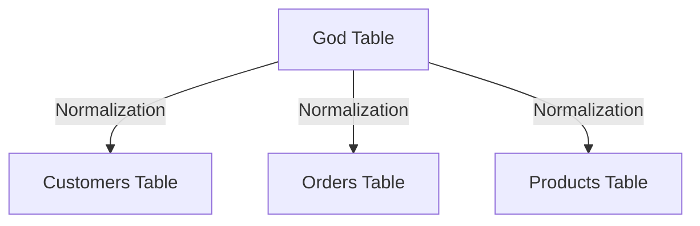
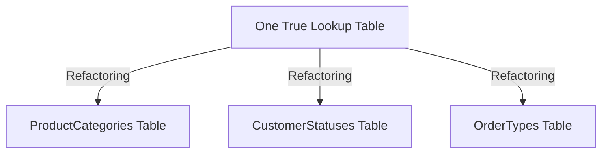

## 16.7 Case Studies on Anti-Patterns

In this section, we delve into real-life case studies where SQL anti-patterns led to significant issues in database systems. By examining these scenarios, we aim to understand how these anti-patterns were identified, the steps taken to resolve them, and the lessons learned to prevent similar issues in future projects.

### Case Study 1: The God Table

#### Background

In a large e-commerce platform, the development team decided to consolidate multiple related entities into a single table, which they referred to as the "God Table." This table contained a wide array of attributes, some of which were only relevant to specific entities.

#### Problem Identification

The God Table quickly became unwieldy, with over 100 columns and millions of rows. This design led to several issues:

- **Performance Degradation**: Queries became slow due to the sheer volume of data and the need to filter irrelevant columns.
- **Complexity in Maintenance**: Adding new features or modifying existing ones required changes across many parts of the application.
- **Data Integrity Issues**: The lack of clear entity boundaries led to frequent data anomalies.

#### Resolution

The team decided to refactor the database schema by normalizing the God Table into multiple smaller, more focused tables. They identified distinct entities and relationships, creating separate tables for each.

```sql
-- Example of refactoring the God Table into separate tables
CREATE TABLE Customers (
    CustomerID INT PRIMARY KEY,
    Name VARCHAR(100),
    Email VARCHAR(100)
);

CREATE TABLE Orders (
    OrderID INT PRIMARY KEY,
    CustomerID INT,
    OrderDate DATE,
    FOREIGN KEY (CustomerID) REFERENCES Customers(CustomerID)
);

CREATE TABLE Products (
    ProductID INT PRIMARY KEY,
    ProductName VARCHAR(100),
    Price DECIMAL(10, 2)
);
```

#### Lessons Learned

- **Embrace Normalization**: Avoid the temptation to consolidate unrelated data into a single table. Embrace normalization to maintain data integrity and simplify maintenance.
- **Design for Scalability**: Consider the long-term impact of design decisions on performance and scalability.

### Case Study 2: Overusing NULLs

#### Background

A financial services company used a database schema where NULL values were extensively used to represent missing or optional data across various tables.

#### Problem Identification

The overuse of NULLs led to several challenges:

- **Complex Query Logic**: Queries became complex and error-prone due to the need to handle NULL values explicitly.
- **Inconsistent Data Interpretation**: Different parts of the application interpreted NULLs differently, leading to inconsistent business logic.

#### Resolution

The team introduced default values and used separate tables to represent optional data, reducing the reliance on NULLs.

```sql
-- Example of using default values and separate tables
CREATE TABLE Accounts (
    AccountID INT PRIMARY KEY,
    Balance DECIMAL(10, 2) DEFAULT 0.00
);

CREATE TABLE AccountDetails (
    AccountID INT,
    DetailType VARCHAR(50),
    DetailValue VARCHAR(100),
    FOREIGN KEY (AccountID) REFERENCES Accounts(AccountID)
);
```

#### Lessons Learned

- **Minimize NULL Usage**: Use NULLs sparingly and only when semantically appropriate. Consider alternative designs, such as default values or separate tables.
- **Consistent Interpretation**: Ensure consistent interpretation of NULLs across the application to avoid logic errors.

### Case Study 3: One True Lookup Table

#### Background

A retail company implemented a single lookup table to store various types of lookup data, such as product categories, customer statuses, and order types.

#### Problem Identification

The One True Lookup Table led to several issues:

- **Lack of Referential Integrity**: The table lacked foreign key constraints, leading to data integrity problems.
- **Poor Query Performance**: Queries became inefficient due to the need to filter and join on a single table for different types of data.

#### Resolution

The team refactored the schema to create separate lookup tables for each type of data, enforcing referential integrity with foreign keys.

```sql
-- Example of creating separate lookup tables
CREATE TABLE ProductCategories (
    CategoryID INT PRIMARY KEY,
    CategoryName VARCHAR(100)
);

CREATE TABLE CustomerStatuses (
    StatusID INT PRIMARY KEY,
    StatusName VARCHAR(100)
);

CREATE TABLE OrderTypes (
    TypeID INT PRIMARY KEY,
    TypeName VARCHAR(100)
);
```

#### Lessons Learned

- **Use Specific Lookup Tables**: Create separate lookup tables for different types of data to maintain referential integrity and improve query performance.
- **Enforce Constraints**: Use foreign key constraints to ensure data integrity and prevent anomalies.

### Case Study 4: Implicit Columns (SELECT *)

#### Background

A software development firm frequently used the `SELECT *` syntax in their queries to retrieve all columns from tables.

#### Problem Identification

The use of `SELECT *` led to several issues:

- **Unnecessary Data Retrieval**: Queries retrieved more data than needed, impacting performance.
- **Schema Change Vulnerability**: Changes to the table schema, such as adding or removing columns, broke existing queries.

#### Resolution

The team revised their queries to explicitly specify the required columns, improving performance and reducing vulnerability to schema changes.

```sql
-- Example of specifying required columns
SELECT CustomerID, Name, Email
FROM Customers
WHERE CustomerID = 1;
```

#### Lessons Learned

- **Avoid SELECT ***: Specify only the columns needed in queries to improve performance and reduce schema change vulnerability.
- **Maintain Query Stability**: Explicitly specifying columns helps maintain query stability across schema changes.

### Case Study 5: Nested Transactions Misuse

#### Background

A logistics company implemented nested transactions in their database operations, assuming it would provide better error handling and rollback capabilities.

#### Problem Identification

The misuse of nested transactions led to several issues:

- **Unexpected Rollback Behavior**: Nested transactions did not behave as expected, leading to partial rollbacks and data inconsistencies.
- **Complexity in Error Handling**: Error handling became complex and difficult to manage due to the nested transaction structure.

#### Resolution

The team refactored their transaction management strategy, using savepoints and a single transaction per operation to ensure consistent rollback behavior.

```sql
-- Example of using savepoints for transaction management
BEGIN TRANSACTION;

SAVEPOINT BeforeUpdate;

UPDATE Orders SET Status = 'Shipped' WHERE OrderID = 123;

-- Rollback to savepoint if needed
ROLLBACK TO SAVEPOINT BeforeUpdate;

COMMIT;
```

#### Lessons Learned

- **Understand Transaction Behavior**: Understand the behavior of nested transactions and use them judiciously.
- **Simplify Transaction Management**: Use savepoints and a single transaction per operation to simplify error handling and ensure consistent rollback behavior.

### Visualizing Anti-Patterns and Resolutions

To better understand the impact of these anti-patterns and their resolutions, let's visualize the transformation process using Mermaid.js diagrams.

#### Diagram: God Table to Normalized Tables



*Caption: Visualizing the transformation from a God Table to normalized tables.*

#### Diagram: One True Lookup Table to Specific Lookup Tables



*Caption: Visualizing the refactoring of a One True Lookup Table into specific lookup tables.*

### Knowledge Check

Before we conclude, let's reinforce our understanding with some questions and exercises:

- **Why is it important to avoid the God Table anti-pattern?**
- **What are the risks associated with overusing NULLs in a database schema?**
- **How can specifying columns in a query improve performance and stability?**
- **What are the benefits of using savepoints in transaction management?**

### Embrace the Journey

Remember, understanding and avoiding anti-patterns is a crucial step in mastering SQL design patterns. As you progress, you'll build more robust and efficient database systems. Keep experimenting, stay curious, and enjoy the journey!

## Quiz Time!



### What is a common issue with the God Table anti-pattern?

- [x] Performance degradation due to large volume of data
- [ ] Increased security due to centralized data
- [ ] Simplified maintenance due to fewer tables
- [ ] Enhanced data integrity with fewer constraints

> **Explanation:** The God Table anti-pattern often leads to performance degradation due to the large volume of data and complex queries needed to filter irrelevant columns.

### How can overusing NULLs in a database schema affect query logic?

- [x] It makes queries complex and error-prone
- [ ] It simplifies query logic by reducing conditions
- [ ] It enhances data integrity by representing missing data
- [ ] It improves performance by reducing data size

> **Explanation:** Overusing NULLs can make queries complex and error-prone as they require explicit handling of NULL values.

### What is a benefit of using specific lookup tables instead of a One True Lookup Table?

- [x] Improved query performance and data integrity
- [ ] Simplified schema with fewer tables
- [ ] Reduced need for foreign key constraints
- [ ] Enhanced data retrieval speed with fewer joins

> **Explanation:** Using specific lookup tables improves query performance and data integrity by maintaining referential integrity and reducing the need for complex joins.

### Why should you avoid using SELECT * in queries?

- [x] It retrieves unnecessary data and impacts performance
- [ ] It simplifies query writing and reduces errors
- [ ] It enhances schema flexibility and adaptability
- [ ] It improves data security by retrieving all columns

> **Explanation:** Using SELECT * retrieves unnecessary data, impacting performance and making queries vulnerable to schema changes.

### What is a key advantage of using savepoints in transaction management?

- [x] Simplified error handling and consistent rollback behavior
- [ ] Enhanced transaction speed and efficiency
- [ ] Reduced need for transaction logs
- [ ] Improved data security with partial rollbacks

> **Explanation:** Savepoints simplify error handling and ensure consistent rollback behavior by allowing partial rollbacks within a transaction.

### How can normalization help resolve the God Table anti-pattern?

- [x] By breaking down a large table into smaller, focused tables
- [ ] By consolidating multiple tables into a single table
- [ ] By removing foreign key constraints
- [ ] By increasing the number of columns in a table

> **Explanation:** Normalization resolves the God Table anti-pattern by breaking down a large table into smaller, focused tables, improving data integrity and performance.

### What is a risk of using nested transactions?

- [x] Unexpected rollback behavior and data inconsistencies
- [ ] Simplified error handling and transaction management
- [ ] Enhanced performance with multiple transactions
- [ ] Improved data integrity with nested rollbacks

> **Explanation:** Nested transactions can lead to unexpected rollback behavior and data inconsistencies, complicating error handling.

### How can specifying columns in a query improve stability?

- [x] By reducing vulnerability to schema changes
- [ ] By increasing the number of columns retrieved
- [ ] By simplifying query syntax
- [ ] By enhancing data security

> **Explanation:** Specifying columns in a query reduces vulnerability to schema changes, ensuring query stability.

### What is a common consequence of the One True Lookup Table anti-pattern?

- [x] Poor query performance and data integrity issues
- [ ] Simplified schema with fewer tables
- [ ] Enhanced data retrieval speed with fewer joins
- [ ] Improved data security with centralized lookups

> **Explanation:** The One True Lookup Table anti-pattern often leads to poor query performance and data integrity issues due to the lack of specific constraints.

### True or False: Using NULLs extensively in a database schema is a best practice.

- [ ] True
- [x] False

> **Explanation:** Using NULLs extensively is not a best practice as it can lead to complex query logic and inconsistent data interpretation.


