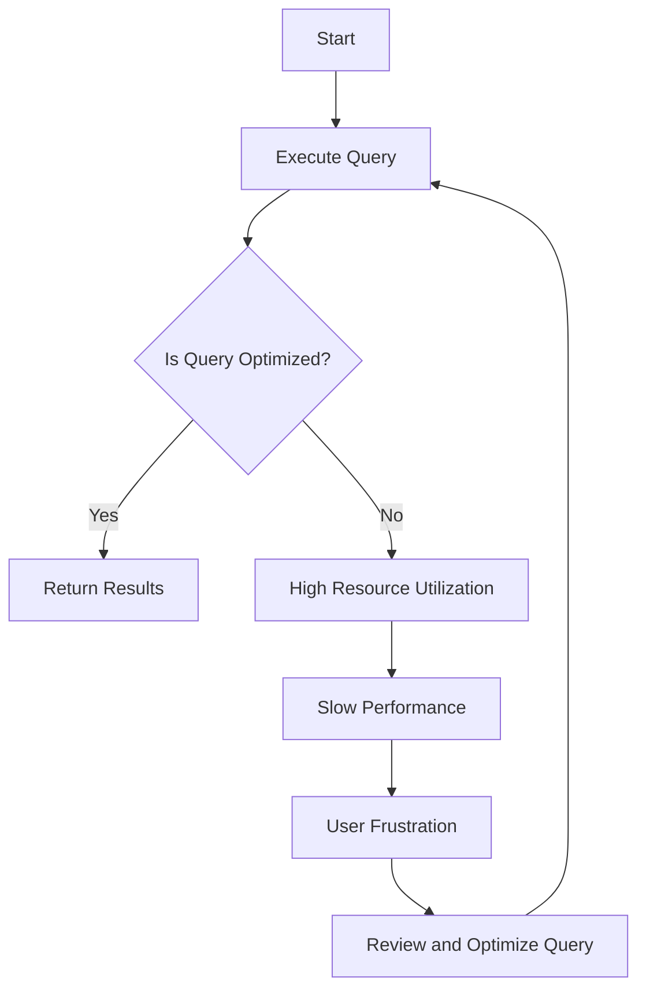

## 16.8 Best Practices to Avoid Anti-Patterns

In the realm of SQL development, anti-patterns can lead to inefficient, unscalable, and error-prone database systems. As expert software engineers and architects, it is crucial to recognize these pitfalls and adopt best practices that ensure robust and efficient SQL solutions. This section delves into strategies to avoid common SQL anti-patterns, emphasizing education, coding standards, and automated tools.

### Understanding SQL Anti-Patterns

Before we explore best practices, let's briefly revisit what SQL anti-patterns are. Anti-patterns are common responses to recurring problems that are ineffective and counterproductive. In SQL, they often manifest as poor database design choices, inefficient queries, or flawed transaction management. Recognizing these anti-patterns is the first step toward avoiding them.

### Education and Training

#### Continuous Learning

**Explain the Importance of Education**: Keeping the development team informed about common anti-patterns is essential. Regular training sessions, workshops, and seminars can help developers stay updated on the latest best practices and emerging trends in SQL development.

**Provide Resources for Learning**: Encourage the use of reputable resources such as [MDN Web Docs](https://developer.mozilla.org/), [W3Schools](https://www.w3schools.com/), and SQL-focused books and courses. These resources offer comprehensive insights into SQL standards and practices.

#### Knowledge Sharing

**Foster a Culture of Knowledge Sharing**: Encourage team members to share their experiences and insights. Regular team meetings or lunch-and-learn sessions can be effective platforms for discussing SQL challenges and solutions.

**Create a Knowledge Base**: Develop an internal knowledge base or wiki where team members can document solutions to common problems, best practices, and lessons learned from past projects.

### Coding Standards

#### Establishing Guidelines

**Define SQL Coding Standards**: Establish clear coding standards and guidelines that promote best practices. These standards should cover naming conventions, query formatting, and the use of comments for clarity.

**Document and Disseminate Standards**: Ensure that these standards are well-documented and easily accessible to all team members. Regularly review and update them to reflect new insights and technologies.

#### Enforcing Standards

**Implement Code Reviews**: Conduct regular code reviews to ensure adherence to coding standards. Code reviews provide an opportunity to catch anti-patterns early and foster a culture of continuous improvement.

**Use Pair Programming**: Encourage pair programming, where two developers work together on the same code. This practice can help identify potential anti-patterns and promote knowledge sharing.

### Automated Tools

#### Static Code Analysis

**Utilize Static Code Analysis Tools**: Employ static code analysis and linting tools to automatically detect potential anti-patterns in SQL code. Tools like SonarQube and SQLFluff can identify issues such as unused indexes, inefficient queries, and security vulnerabilities.

**Integrate Tools into CI/CD Pipelines**: Integrate these tools into your continuous integration and continuous deployment (CI/CD) pipelines to ensure that code quality checks are part of the development process.

#### Monitoring and Alerts

**Set Up Monitoring and Alerts**: Implement monitoring tools to track database performance and identify potential anti-patterns in real-time. Tools like New Relic and Datadog can provide insights into query performance and resource utilization.

**Use Alerts for Proactive Management**: Configure alerts to notify the team of performance issues or anomalies, enabling proactive management and resolution of potential problems.

### Best Practices for SQL Development

#### Query Optimization

**Design Efficient Queries**: Focus on writing efficient SQL queries by using appropriate indexing, avoiding unnecessary joins, and leveraging query optimization techniques.

**Use Explain Plans**: Utilize explain plans to understand query execution paths and identify bottlenecks. This practice can help in refining queries for better performance.

#### Database Design

**Normalize Data Appropriately**: Apply normalization techniques to eliminate redundancy and ensure data integrity. However, balance normalization with performance considerations, as excessive normalization can lead to complex queries.

**Consider Denormalization When Necessary**: In some cases, denormalization can improve performance by reducing the need for complex joins. Evaluate the trade-offs carefully before implementing denormalization.

#### Transaction Management

**Understand ACID Properties**: Ensure that transactions adhere to ACID (Atomicity, Consistency, Isolation, Durability) properties to maintain data integrity and consistency.

**Choose Appropriate Isolation Levels**: Select the appropriate isolation level based on the application's concurrency requirements. Understand the trade-offs between isolation and performance.

#### Security Practices

**Implement Role-Based Access Control (RBAC)**: Use RBAC to manage user permissions and ensure that users have access only to the data they need.

**Prevent SQL Injection**: Use parameterized queries and prepared statements to prevent SQL injection attacks. Regularly review and test code for vulnerabilities.

### Visualizing SQL Anti-Patterns

To better understand the impact of SQL anti-patterns, let's visualize a common scenario using a Mermaid.js diagram. This diagram illustrates the flow of a poorly optimized query and its impact on database performance.

**Diagram Description**: This flowchart represents the lifecycle of a query execution. If the query is not optimized, it leads to high resource utilization and slow performance, resulting in user frustration. The solution is to review and optimize the query, creating a feedback loop for continuous improvement.

### Try It Yourself

Encourage experimentation by suggesting modifications to the code examples. For instance, take a complex query and try optimizing it by adding indexes or rewriting it using Common Table Expressions (CTEs). Observe the impact on performance and resource utilization.

### Knowledge Check

To reinforce learning, pose questions or small challenges within the text. For example, ask readers to identify potential anti-patterns in a given SQL query or database design scenario.

### Conclusion

Avoiding SQL anti-patterns is crucial for building efficient, scalable, and secure database systems. By focusing on education, coding standards, and automated tools, we can proactively identify and mitigate these pitfalls. Remember, this is just the beginning. As you progress, continue to refine your skills and stay curious about emerging trends and technologies in SQL development.

## Quiz Time!



### What is the primary purpose of establishing SQL coding standards?

- [x] To promote best practices and ensure consistency in code
- [ ] To make SQL code more complex
- [ ] To limit the creativity of developers
- [ ] To increase the number of lines in SQL scripts

> **Explanation:** Establishing SQL coding standards helps promote best practices and ensures consistency across the codebase, making it easier to maintain and understand.

### Which tool can be used for static code analysis in SQL development?

- [x] SonarQube
- [ ] Photoshop
- [ ] Microsoft Word
- [ ] Excel

> **Explanation:** SonarQube is a tool used for static code analysis, helping to identify potential anti-patterns and code quality issues in SQL development.

### What is the benefit of using explain plans in SQL?

- [x] To understand query execution paths and identify bottlenecks
- [ ] To increase the complexity of queries
- [ ] To reduce the number of queries
- [ ] To make queries unreadable

> **Explanation:** Explain plans help developers understand how queries are executed, allowing them to identify and address performance bottlenecks.

### What is the role of monitoring tools in SQL development?

- [x] To track database performance and identify potential anti-patterns
- [ ] To create more complex queries
- [ ] To delete unnecessary data
- [ ] To increase database size

> **Explanation:** Monitoring tools track database performance and help identify potential anti-patterns, enabling proactive management and optimization.

### What is a key benefit of using role-based access control (RBAC)?

- [x] To manage user permissions effectively
- [ ] To increase the number of users
- [ ] To make the database more complex
- [ ] To reduce database security

> **Explanation:** RBAC helps manage user permissions effectively, ensuring that users have access only to the data they need, enhancing security.

### How can SQL injection be prevented?

- [x] By using parameterized queries and prepared statements
- [ ] By writing more complex queries
- [ ] By using SELECT * in queries
- [ ] By ignoring user input

> **Explanation:** SQL injection can be prevented by using parameterized queries and prepared statements, which ensure that user input is treated as data, not executable code.

### What is the purpose of normalization in database design?

- [x] To eliminate redundancy and ensure data integrity
- [ ] To make databases more complex
- [ ] To increase the number of tables
- [ ] To reduce database size

> **Explanation:** Normalization eliminates redundancy and ensures data integrity, making databases more efficient and easier to maintain.

### What is the trade-off when choosing isolation levels in transactions?

- [x] Between isolation and performance
- [ ] Between complexity and simplicity
- [ ] Between size and speed
- [ ] Between security and accessibility

> **Explanation:** Choosing isolation levels involves a trade-off between isolation and performance, as higher isolation levels can reduce concurrency and impact performance.

### What is the impact of using denormalization in database design?

- [x] It can improve performance by reducing the need for complex joins
- [ ] It increases data redundancy
- [ ] It makes databases more complex
- [ ] It reduces data integrity

> **Explanation:** Denormalization can improve performance by reducing the need for complex joins, but it may increase data redundancy and complexity.

### True or False: Pair programming can help identify potential anti-patterns in SQL development.

- [x] True
- [ ] False

> **Explanation:** Pair programming involves two developers working together, which can help identify potential anti-patterns and promote knowledge sharing.


