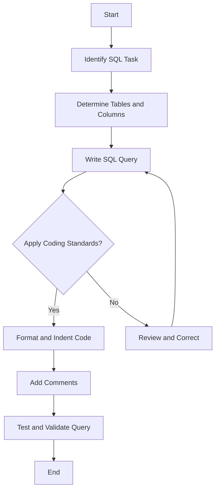

## 17.1 SQL Coding Standards and Conventions

In the realm of SQL development, adhering to coding standards and conventions is crucial for creating efficient, maintainable, and scalable database solutions. This section delves into the best practices for SQL coding, focusing on consistency, naming conventions, and commenting, among other essential guidelines. By following these standards, expert developers and architects can ensure that their SQL code is not only functional but also easy to understand and modify.

### Consistency: The Cornerstone of SQL Coding

Consistency in SQL coding is about adopting a uniform style across all SQL scripts and queries. This practice enhances readability and makes it easier for teams to collaborate and maintain codebases. Let's explore some key areas where consistency plays a vital role:

#### 1. SQL Syntax and Formatting

- **Capitalization**: Use uppercase for SQL keywords (e.g., `SELECT`, `FROM`, `WHERE`) and lowercase for identifiers (e.g., table and column names). This distinction helps in quickly identifying SQL commands.
  
  ```sql
  SELECT first_name, last_name
  FROM employees
  WHERE department_id = 10;
  ```

- **Indentation**: Align SQL clauses for better readability. Use consistent indentation (e.g., two or four spaces) to separate different parts of the query.

  ```sql
  SELECT
      first_name,
      last_name
  FROM
      employees
  WHERE
      department_id = 10;
  ```

- **Line Breaks**: Place each SQL clause on a new line to enhance clarity, especially in complex queries.

#### 2. Consistent Use of Aliases

- **Alias Naming**: Use meaningful aliases for tables and columns to make queries more understandable. Avoid single-letter aliases unless they are widely recognized (e.g., `e` for `employees`).

  ```sql
  SELECT e.first_name, e.last_name
  FROM employees AS e
  WHERE e.department_id = 10;
  ```

- **AS Keyword**: Use the `AS` keyword for defining aliases to improve readability, even though it's optional.

### Naming Conventions: Standardizing SQL Object Names

Naming conventions are critical for maintaining a clear and organized database schema. They help in quickly identifying the purpose and type of database objects. Here are some guidelines for naming SQL objects:

#### 1. Tables and Views

- **Singular vs. Plural**: Use singular nouns for table names to represent a single entity (e.g., `employee`, `order`). This approach aligns with object-oriented programming principles.

- **Prefixes and Suffixes**: Avoid using prefixes or suffixes that indicate the type of object (e.g., `tbl_`, `_view`). Instead, rely on context and schema to convey this information.

#### 2. Columns

- **Descriptive Names**: Use clear and descriptive names for columns that indicate their content or purpose (e.g., `first_name`, `order_date`).

- **Avoid Abbreviations**: Avoid using abbreviations unless they are widely understood (e.g., `qty` for quantity).

#### 3. Indexes

- **Naming Pattern**: Use a consistent pattern that includes the table name and column(s) involved (e.g., `idx_employee_last_name`).

#### 4. Constraints

- **Prefixing**: Use prefixes to indicate the type of constraint (e.g., `pk_` for primary keys, `fk_` for foreign keys).

  ```sql
  CREATE TABLE employees (
      employee_id INT PRIMARY KEY,
      department_id INT,
      CONSTRAINT fk_department FOREIGN KEY (department_id) REFERENCES departments(department_id)
  );
  ```

### Commenting: Enhancing SQL Code Clarity

Comments are essential for explaining complex logic, decisions, and assumptions in SQL code. They provide context and guidance for future developers who may work on the codebase.

#### 1. Inline Comments

- **Purpose**: Use inline comments to explain specific parts of a query or logic that may not be immediately obvious.

  ```sql
  SELECT first_name, last_name
  FROM employees
  WHERE department_id = 10; -- Filter employees in department 10
  ```

#### 2. Block Comments

- **Usage**: Use block comments for providing detailed explanations or documenting complex queries.

  ```sql
  /*
   * This query retrieves the first and last names of employees
   * who belong to department 10. It is used for generating
   * department-specific reports.
   */
  SELECT first_name, last_name
  FROM employees
  WHERE department_id = 10;
  ```

### Code Examples and Best Practices

Let's explore some practical examples and best practices for writing SQL code that adheres to these standards and conventions.

#### Example 1: Consistent Query Formatting

```sql
-- Retrieve employee details for a specific department
SELECT
    e.employee_id,
    e.first_name,
    e.last_name,
    d.department_name
FROM
    employees AS e
JOIN
    departments AS d ON e.department_id = d.department_id
WHERE
    d.department_name = 'Sales';
```

**Key Points:**

- SQL keywords are in uppercase.
- Each clause is on a new line with consistent indentation.
- Meaningful aliases (`e` for employees, `d` for departments) are used.

#### Example 2: Naming Conventions for Indexes

```sql
-- Create an index on the last_name column of the employees table
CREATE INDEX idx_employees_last_name ON employees(last_name);
```

**Key Points:**

- The index name follows a consistent pattern: `idx_<table>_<column>`.

#### Example 3: Commenting Complex Logic

```sql
/*
 * This query calculates the total sales for each product category
 * for the current year. It uses a subquery to filter sales data
 * based on the current year.
 */
SELECT
    c.category_name,
    SUM(s.amount) AS total_sales
FROM
    sales AS s
JOIN
    products AS p ON s.product_id = p.product_id
JOIN
    categories AS c ON p.category_id = c.category_id
WHERE
    YEAR(s.sale_date) = YEAR(CURRENT_DATE)
GROUP BY
    c.category_name;
```

**Key Points:**

- A block comment provides a high-level overview of the query's purpose.
- Inline comments can be added to explain specific parts if needed.

### Visualizing SQL Coding Standards

To further illustrate the importance of SQL coding standards, let's visualize the process of writing a well-structured SQL query using a flowchart.



**Diagram Description:** This flowchart represents the process of writing a well-structured SQL query, emphasizing the application of coding standards and conventions.

### References and Further Reading

- [SQL Style Guide by Simon Holywell](https://www.sqlstyle.guide/)
- [SQL Formatting and Style Guide by Redgate](https://www.red-gate.com/hub/product-learning/sql-prompt/sql-formatting-and-style-guide)
- [W3Schools SQL Tutorial](https://www.w3schools.com/sql/)

### Knowledge Check

To reinforce your understanding of SQL coding standards and conventions, consider the following questions and exercises:

- **Question 1**: Why is consistency important in SQL coding?
- **Question 2**: What are the benefits of using meaningful aliases in SQL queries?
- **Exercise 1**: Rewrite a complex SQL query from your codebase to adhere to the discussed standards.
- **Exercise 2**: Create a naming convention guide for your team's database objects.

### Embrace the Journey

Remember, mastering SQL coding standards and conventions is an ongoing journey. As you continue to write and refine SQL code, you'll develop a deeper understanding of best practices that enhance both individual and team productivity. Keep experimenting, stay curious, and enjoy the process of crafting clean and efficient SQL code!

## Quiz Time!



### Why is consistency important in SQL coding?

- [x] It enhances readability and maintainability.
- [ ] It makes SQL code run faster.
- [ ] It reduces the number of SQL keywords.
- [ ] It eliminates the need for comments.

> **Explanation:** Consistency in SQL coding enhances readability and maintainability, making it easier for teams to collaborate and understand the code.

### What is the recommended practice for SQL keyword capitalization?

- [x] Use uppercase for SQL keywords.
- [ ] Use lowercase for SQL keywords.
- [ ] Use mixed case for SQL keywords.
- [ ] Use camelCase for SQL keywords.

> **Explanation:** Using uppercase for SQL keywords helps in quickly identifying SQL commands and improves readability.

### What is the purpose of using aliases in SQL queries?

- [x] To make queries more understandable.
- [ ] To reduce query execution time.
- [ ] To eliminate the need for joins.
- [ ] To increase the number of columns in the result set.

> **Explanation:** Aliases make queries more understandable by providing meaningful names for tables and columns.

### Which of the following is a good practice for naming tables?

- [x] Use singular nouns to represent a single entity.
- [ ] Use plural nouns to represent multiple entities.
- [ ] Use abbreviations for table names.
- [ ] Use prefixes to indicate table types.

> **Explanation:** Using singular nouns for table names aligns with object-oriented programming principles and represents a single entity.

### What is the benefit of using block comments in SQL code?

- [x] To provide detailed explanations for complex queries.
- [ ] To reduce the size of the SQL script.
- [ ] To increase query execution speed.
- [ ] To eliminate the need for inline comments.

> **Explanation:** Block comments provide detailed explanations for complex queries, offering context and guidance for future developers.

### What is a recommended naming pattern for indexes?

- [x] Use a pattern that includes the table name and column(s) involved.
- [ ] Use a pattern that includes the index creation date.
- [ ] Use a pattern that includes the database name.
- [ ] Use a pattern that includes the SQL version.

> **Explanation:** A naming pattern that includes the table name and column(s) involved helps in quickly identifying the purpose of the index.

### Why should abbreviations be avoided in column names?

- [x] They can be unclear and lead to misunderstandings.
- [ ] They make SQL queries run slower.
- [ ] They increase the size of the database.
- [ ] They are not supported by all SQL dialects.

> **Explanation:** Abbreviations can be unclear and lead to misunderstandings, so it's best to use descriptive names for columns.

### What is the purpose of using the AS keyword for aliases?

- [x] To improve readability, even though it's optional.
- [ ] To increase query execution speed.
- [ ] To eliminate the need for joins.
- [ ] To reduce the number of columns in the result set.

> **Explanation:** Using the AS keyword for aliases improves readability, even though it's optional.

### Which of the following is a benefit of using consistent indentation in SQL code?

- [x] It enhances the readability of the code.
- [ ] It reduces the number of SQL keywords.
- [ ] It increases query execution speed.
- [ ] It eliminates the need for comments.

> **Explanation:** Consistent indentation enhances the readability of the code, making it easier to understand and maintain.

### True or False: Using uppercase for SQL keywords is a recommended practice.

- [x] True
- [ ] False

> **Explanation:** Using uppercase for SQL keywords is a recommended practice as it helps in quickly identifying SQL commands and improves readability.


