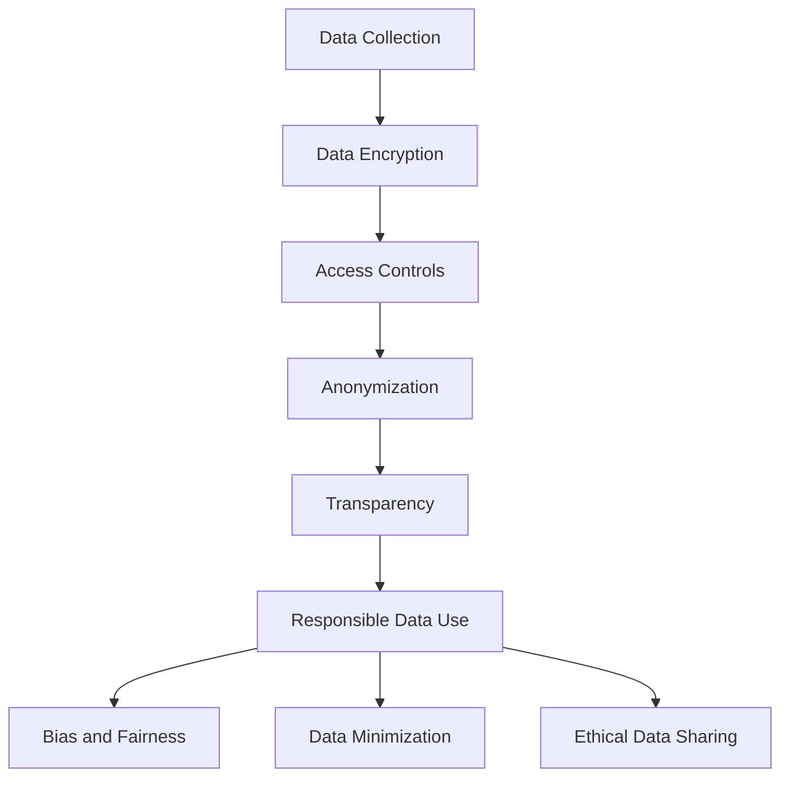

## 17.10 Ethical Considerations in Data Management

In today's digital age, data is a valuable asset that drives decision-making, innovation, and growth. However, with great power comes great responsibility. As expert software engineers and architects, we must navigate the complex landscape of data management with an ethical compass. This section delves into the ethical considerations in data management, focusing on privacy, transparency, and responsible data use. We will explore how to protect user data, ensure transparency, and consider the ethical implications of data analysis and sharing.

### Privacy: Protecting User Data

Privacy is a fundamental human right, and protecting user data from unauthorized access and breaches is paramount. As custodians of data, we must implement robust security measures to safeguard sensitive information.

#### Data Encryption

Data encryption is a critical technique for protecting data at rest and in transit. By converting data into a coded format, encryption ensures that only authorized parties can access it.

```sql
-- Example of encrypting a column in a SQL database
CREATE TABLE Users (
    UserID INT PRIMARY KEY,
    UserName VARCHAR(100),
    Email VARCHAR(100),
    EncryptedPassword VARBINARY(256)
);

-- Encrypting a password before storing it
INSERT INTO Users (UserID, UserName, Email, EncryptedPassword)
VALUES (1, 'JohnDoe', 'john.doe@example.com', ENCRYPTBYPASSPHRASE('mySecretKey', 'password123'));
```

In this example, we use the `ENCRYPTBYPASSPHRASE` function to encrypt a user's password before storing it in the database. This ensures that even if the database is compromised, the passwords remain secure.

#### Access Controls

Implementing strict access controls is essential to prevent unauthorized access to sensitive data. Role-based access control (RBAC) is a common approach that restricts data access based on user roles.

```sql
-- Example of creating roles and granting permissions
CREATE ROLE DataAnalyst;
GRANT SELECT ON Users TO DataAnalyst;

CREATE ROLE DataAdmin;
GRANT SELECT, INSERT, UPDATE, DELETE ON Users TO DataAdmin;
```

By assigning roles and granting specific permissions, we can control who has access to different parts of the database, thereby enhancing data security.

#### Anonymization and Pseudonymization

Anonymization and pseudonymization are techniques used to protect user privacy by removing or altering personally identifiable information (PII).

```sql
-- Example of pseudonymizing user data
UPDATE Users
SET UserName = CONCAT('User', UserID),
    Email = CONCAT('user', UserID, '@example.com');
```

In this example, we replace actual user names and emails with generic placeholders, making it difficult to identify individuals from the data.

### Transparency: Being Open About Data Collection and Usage

Transparency is crucial in building trust with users. Being open about data collection and usage practices helps users understand how their data is being used and for what purposes.

#### Privacy Policies

Developing clear and concise privacy policies is essential for transparency. These policies should outline what data is collected, how it is used, and who it is shared with.

#### Consent Mechanisms

Implementing consent mechanisms ensures that users are aware of and agree to data collection practices. This can be achieved through opt-in forms and consent banners.

```html
<!-- Example of a consent banner -->
<div id="consent-banner">
    <p>We use cookies to enhance your experience. By continuing to visit this site, you agree to our use of cookies.</p>
    <button onclick="acceptConsent()">Accept</button>
</div>
```

By providing users with the option to accept or decline data collection, we respect their autonomy and privacy.

#### Data Usage Reports

Providing users with data usage reports enhances transparency by showing them how their data is being used. This can include information on data access, sharing, and processing activities.

### Responsible Data Use: Considering Ethical Implications

Responsible data use involves considering the ethical implications of data analysis and sharing. It requires balancing the benefits of data-driven insights with potential risks to individuals and society.

#### Bias and Fairness

Data-driven algorithms can perpetuate biases if not carefully managed. Ensuring fairness in data analysis involves identifying and mitigating biases in data collection and processing.

```sql
-- Example of checking for bias in data
SELECT Gender, AVG(Salary)
FROM Employees
GROUP BY Gender;
```

In this example, we analyze salary data by gender to identify potential biases in compensation. By examining such patterns, we can take corrective actions to ensure fairness.

#### Data Minimization

Data minimization is the practice of collecting only the data necessary for a specific purpose. This reduces the risk of data breaches and enhances privacy.

```sql
-- Example of selecting only necessary columns
SELECT UserName, Email
FROM Users;
```

By limiting the data collected to only what is necessary, we minimize the potential for misuse and protect user privacy.

#### Ethical Data Sharing

Sharing data responsibly involves considering the potential impact on individuals and society. This includes obtaining consent, anonymizing data, and ensuring that data sharing agreements are in place.

### Visualizing Ethical Data Management

To better understand the ethical considerations in data management, let's visualize the process using a flowchart.



This flowchart illustrates the key steps in ethical data management, from data collection to responsible data use.

### Knowledge Check

- Explain the importance of data encryption in protecting user privacy.
- Demonstrate how role-based access control can enhance data security.
- Provide examples of how transparency can be achieved in data management.
- Discuss the ethical implications of data sharing and how to mitigate potential risks.

### Embrace the Journey

Remember, ethical data management is an ongoing journey. As technology evolves, so do the ethical challenges we face. Stay informed, be proactive, and continue to prioritize privacy, transparency, and responsible data use in your work.

### References and Links

- [GDPR: General Data Protection Regulation](https://gdpr-info.eu/)
- [NIST Privacy Framework](https://www.nist.gov/privacy-framework)
- [Data Ethics Canvas](https://theodi.org/article/data-ethics-canvas/)

## Quiz Time!



### What is a fundamental technique for protecting data at rest and in transit?

- [x] Data Encryption
- [ ] Data Minimization
- [ ] Data Anonymization
- [ ] Data Sharing

> **Explanation:** Data encryption is a critical technique for protecting data at rest and in transit by converting it into a coded format.

### Which SQL function is used to encrypt a password before storing it in a database?

- [x] ENCRYPTBYPASSPHRASE
- [ ] DECRYPTBYPASSPHRASE
- [ ] HASHBYTES
- [ ] ENCRYPTBYKEY

> **Explanation:** The `ENCRYPTBYPASSPHRASE` function is used to encrypt data, such as passwords, before storing them in a database.

### What is the purpose of role-based access control (RBAC)?

- [x] To restrict data access based on user roles
- [ ] To encrypt data at rest
- [ ] To anonymize user data
- [ ] To provide data usage reports

> **Explanation:** Role-based access control (RBAC) restricts data access based on user roles, enhancing data security.

### How can transparency be achieved in data management?

- [x] By developing clear privacy policies
- [ ] By encrypting data
- [ ] By anonymizing data
- [ ] By minimizing data collection

> **Explanation:** Transparency can be achieved by developing clear privacy policies that outline data collection and usage practices.

### What is data minimization?

- [x] Collecting only the data necessary for a specific purpose
- [ ] Encrypting data to protect privacy
- [ ] Sharing data responsibly
- [ ] Providing data usage reports

> **Explanation:** Data minimization involves collecting only the data necessary for a specific purpose, reducing the risk of data breaches.

### What is a key consideration in responsible data sharing?

- [x] Obtaining consent from users
- [ ] Encrypting data
- [ ] Minimizing data collection
- [ ] Providing data usage reports

> **Explanation:** Responsible data sharing involves obtaining consent from users and ensuring that data sharing agreements are in place.

### How can bias in data analysis be identified?

- [x] By analyzing patterns in data
- [ ] By encrypting data
- [ ] By minimizing data collection
- [ ] By providing data usage reports

> **Explanation:** Bias in data analysis can be identified by analyzing patterns in data and taking corrective actions to ensure fairness.

### What is the role of anonymization in data management?

- [x] To protect user privacy by removing identifiable information
- [ ] To encrypt data at rest
- [ ] To provide data usage reports
- [ ] To minimize data collection

> **Explanation:** Anonymization protects user privacy by removing or altering personally identifiable information.

### What is the significance of providing data usage reports?

- [x] To enhance transparency by showing users how their data is used
- [ ] To encrypt data
- [ ] To anonymize data
- [ ] To minimize data collection

> **Explanation:** Providing data usage reports enhances transparency by showing users how their data is being used.

### Ethical data management is an ongoing journey.

- [x] True
- [ ] False

> **Explanation:** Ethical data management is an ongoing journey as technology evolves, and ethical challenges continue to arise.


