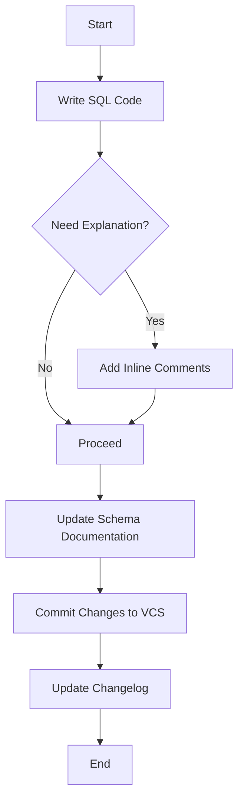

## 17.2 Documentation and Commenting Strategies

In the realm of SQL development, documentation and commenting are pivotal for ensuring that database systems are maintainable, scalable, and comprehensible. As expert developers and architects, it's crucial to adopt strategies that not only enhance code readability but also facilitate collaboration and future-proofing of database solutions. This section delves into the best practices for inline documentation, schema documentation, and version history management, providing you with the tools to excel in SQL documentation.

### Inline Documentation

Inline documentation refers to the use of comments within SQL scripts to elucidate complex or non-obvious code segments. This practice is essential for maintaining code clarity and aiding other developers in understanding the logic behind SQL queries and procedures.

#### Importance of Inline Documentation

- **Enhances Readability**: Comments make SQL scripts more readable by explaining the purpose and functionality of complex queries.
- **Facilitates Collaboration**: Well-commented code is easier for team members to understand and modify, promoting effective collaboration.
- **Aids Debugging**: Comments can help identify the intent behind code, making it easier to spot and fix errors.

#### Best Practices for Inline Documentation

1. **Use Clear and Concise Language**: Write comments that are easy to understand, avoiding technical jargon unless necessary.
2. **Explain the Why, Not the What**: Focus on explaining why a particular approach was taken rather than what the code does, as the latter should be evident from the code itself.
3. **Keep Comments Up-to-Date**: Regularly update comments to reflect changes in the code to prevent misinformation.
4. **Use Consistent Commenting Style**: Adopt a uniform style for comments across the project to maintain consistency.

#### Example of Inline Documentation

```sql
-- Calculate the total sales for each product category
SELECT category_id, SUM(sales_amount) AS total_sales
FROM sales
GROUP BY category_id
ORDER BY total_sales DESC;
```

In this example, the comment succinctly explains the purpose of the SQL query, making it clear to any developer what the query is intended to achieve.

### Schema Documentation

Schema documentation involves maintaining detailed descriptions of database schemas, including tables, columns, relationships, and constraints. This documentation is crucial for understanding the structure and design of the database.

#### Components of Schema Documentation

- **Table Descriptions**: Provide an overview of each table, including its purpose and the type of data it stores.
- **Column Descriptions**: Detail each column's data type, constraints, and any special considerations.
- **Relationship Descriptions**: Explain the relationships between tables, such as foreign key constraints and join conditions.
- **Constraint Descriptions**: Document any constraints applied to tables or columns, such as primary keys, unique constraints, and check constraints.

#### Tools for Schema Documentation

- **Database Management Systems (DBMS)**: Many DBMSs offer built-in tools for generating schema documentation.
- **Third-Party Tools**: Tools like SchemaSpy and dbdocs.io can automate the generation of schema documentation.
- **Manual Documentation**: For smaller projects, manual documentation using tools like Markdown or Word processors can be effective.

#### Example of Schema Documentation

| Table Name | Description |
|------------|-------------|
| `customers` | Stores customer information, including personal details and contact information. |
| `orders` | Contains order details, including order date, customer ID, and total amount. |

### Version History

Version history involves keeping track of changes to the database schema and SQL scripts through changelogs or version control systems. This practice is vital for maintaining a clear record of modifications and facilitating rollbacks if necessary.

#### Benefits of Version History

- **Tracks Changes**: Provides a detailed record of changes, making it easier to understand the evolution of the database.
- **Facilitates Rollbacks**: Enables developers to revert to previous versions if a change introduces errors.
- **Enhances Collaboration**: Allows multiple developers to work on the database simultaneously without conflicts.

#### Implementing Version History

1. **Use Version Control Systems (VCS)**: Tools like Git can be used to track changes to SQL scripts and schema files.
2. **Maintain Changelogs**: Keep a detailed changelog documenting each change, including the date, author, and reason for the change.
3. **Adopt a Versioning Strategy**: Use semantic versioning to clearly indicate the nature of changes (e.g., major, minor, patch).

#### Example of a Changelog Entry

```
## [1.2.0] - 2024-11-01
### Added
- Added a new `discounts` table to store promotional discounts.

### Changed
- Updated the `orders` table to include a `discount_id` foreign key.

### Fixed
- Corrected data type for `total_amount` in the `orders` table.
```

### Visualizing Documentation Strategies

To better understand the flow and importance of documentation strategies, let's visualize the process using a Mermaid.js flowchart.



**Diagram Description**: This flowchart illustrates the process of integrating documentation strategies into SQL development. It begins with writing SQL code, deciding if inline comments are needed, updating schema documentation, committing changes to a version control system, and finally updating the changelog.

### Try It Yourself

To solidify your understanding of documentation and commenting strategies, try the following exercises:

1. **Add Comments to a Complex Query**: Take a complex SQL query from your project and add inline comments explaining the logic and purpose of each part.
2. **Create Schema Documentation**: Document the schema of a small database, including table and column descriptions.
3. **Implement Version Control**: Set up a version control system for your SQL scripts and practice committing changes and updating the changelog.

### Knowledge Check

Before we wrap up, let's reinforce what we've learned with a few questions:

- Why is inline documentation important in SQL scripts?
- What are the key components of schema documentation?
- How does version history benefit SQL development?

### Embrace the Journey

Remember, mastering documentation and commenting strategies is an ongoing journey. As you continue to develop and maintain SQL databases, these practices will become second nature, enhancing the quality and maintainability of your work. Keep experimenting, stay curious, and enjoy the journey!

## Quiz Time!



### Why is inline documentation important in SQL scripts?

- [x] It enhances readability and aids debugging.
- [ ] It increases the execution speed of queries.
- [ ] It reduces the size of the database.
- [ ] It automatically updates schema documentation.

> **Explanation:** Inline documentation enhances readability and aids debugging by explaining the logic behind SQL queries.

### What should be the focus of inline comments?

- [x] Explaining why a particular approach was taken.
- [ ] Describing every line of code.
- [ ] Providing a detailed history of the code.
- [ ] Listing all possible errors in the code.

> **Explanation:** Inline comments should focus on explaining why a particular approach was taken, not describing every line of code.

### Which tool can be used for schema documentation?

- [x] SchemaSpy
- [ ] Git
- [ ] Docker
- [ ] Jenkins

> **Explanation:** SchemaSpy is a tool that can be used for generating schema documentation.

### What is a benefit of maintaining version history?

- [x] It facilitates rollbacks if necessary.
- [ ] It increases the speed of query execution.
- [ ] It reduces the need for inline comments.
- [ ] It automatically generates schema documentation.

> **Explanation:** Maintaining version history facilitates rollbacks if necessary by providing a detailed record of changes.

### Which of the following is a component of schema documentation?

- [x] Table descriptions
- [ ] Inline comments
- [ ] Execution plans
- [ ] Index statistics

> **Explanation:** Table descriptions are a component of schema documentation, providing an overview of each table's purpose.

### What is the purpose of a changelog?

- [x] To document changes made to the database schema and SQL scripts.
- [ ] To list all SQL queries executed in the database.
- [ ] To provide a backup of the database.
- [ ] To generate execution plans for queries.

> **Explanation:** A changelog documents changes made to the database schema and SQL scripts, including the date, author, and reason for each change.

### Which version control system is commonly used for SQL scripts?

- [x] Git
- [ ] Docker
- [ ] Jenkins
- [ ] Kubernetes

> **Explanation:** Git is a commonly used version control system for tracking changes to SQL scripts.

### What is a key benefit of using inline comments?

- [x] They make SQL scripts more readable.
- [ ] They increase the execution speed of queries.
- [ ] They reduce the need for schema documentation.
- [ ] They automatically update the changelog.

> **Explanation:** Inline comments make SQL scripts more readable by explaining the purpose and functionality of complex queries.

### Which of the following is a best practice for inline documentation?

- [x] Use clear and concise language.
- [ ] Describe every line of code.
- [ ] Use technical jargon extensively.
- [ ] Avoid updating comments after code changes.

> **Explanation:** A best practice for inline documentation is to use clear and concise language, making comments easy to understand.

### True or False: Schema documentation should include descriptions of relationships between tables.

- [x] True
- [ ] False

> **Explanation:** True. Schema documentation should include descriptions of relationships between tables, such as foreign key constraints and join conditions.


