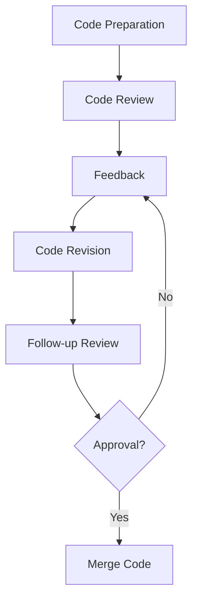

## 17.3 Code Reviews and Pair Programming

In the realm of SQL development, ensuring high-quality code is paramount. Two powerful methodologies that have proven effective in achieving this are **code reviews** and **pair programming**. These practices not only enhance the quality of the code but also foster a culture of collaboration and continuous learning within development teams. In this section, we will delve into the intricacies of these methodologies, exploring their benefits, implementation strategies, and best practices.

### Understanding Code Reviews

**Code reviews** are a systematic examination of computer source code intended to find and fix mistakes overlooked in the initial development phase, improving the overall quality of software. They are an integral part of the software development lifecycle, especially in SQL development, where the complexity of queries and database interactions can lead to subtle bugs and performance issues.

#### The Importance of Code Reviews

1. **Error Detection**: Code reviews help in identifying errors that might have been missed during initial development. This is crucial in SQL, where a small mistake can lead to significant data integrity issues or performance bottlenecks.

2. **Knowledge Sharing**: They provide an opportunity for team members to learn from each other. Reviewing code written by others exposes developers to different coding styles and techniques, broadening their understanding and expertise.

3. **Consistency and Standards**: Code reviews ensure that coding standards and best practices are adhered to, leading to a more consistent and maintainable codebase.

4. **Improved Design**: They encourage developers to think critically about their design choices, leading to better-architected solutions.

5. **Security Enhancements**: By having multiple eyes on the code, potential security vulnerabilities can be identified and addressed early in the development process.

#### Implementing Effective Code Reviews

To maximize the benefits of code reviews, it's essential to implement them effectively. Here are some strategies:

- **Define Clear Objectives**: Establish what you aim to achieve with code reviews, such as error detection, adherence to coding standards, or knowledge sharing.

- **Create a Checklist**: Develop a checklist of common issues to look for during reviews, such as SQL injection vulnerabilities, inefficient queries, or improper use of transactions.

- **Use Automated Tools**: Leverage tools that can automatically check for syntax errors, adherence to coding standards, and potential security issues.

- **Encourage Constructive Feedback**: Foster a culture where feedback is given constructively and is focused on the code, not the developer.

- **Limit Review Size**: Keep the size of code reviews manageable to ensure that reviewers can thoroughly examine the code without feeling overwhelmed.

- **Set a Time Limit**: Allocate a reasonable amount of time for reviews to ensure they are thorough but not overly time-consuming.

#### Code Review Process

A typical code review process involves several steps:

1. **Preparation**: The author of the code prepares it for review, ensuring it is complete and adheres to coding standards.

2. **Review**: The reviewer examines the code, looking for errors, potential improvements, and adherence to standards.

3. **Feedback**: The reviewer provides feedback, which can be in the form of comments, suggestions, or questions.

4. **Revision**: The author revises the code based on the feedback received.

5. **Follow-up**: The reviewer checks the revised code to ensure that the feedback has been adequately addressed.

6. **Approval**: Once the code meets the required standards, it is approved and merged into the main codebase.

### Pair Programming: A Collaborative Approach

**Pair programming** is a software development technique in which two programmers work together at one workstation. One, the "driver," writes code while the other, the "observer" or "navigator," reviews each line of code as it is typed. The two programmers switch roles frequently.

#### Benefits of Pair Programming

1. **Enhanced Code Quality**: With two developers working on the same code, errors are caught more quickly, and the overall quality of the code is improved.

2. **Knowledge Transfer**: Pair programming facilitates the transfer of knowledge between team members, making it an excellent tool for onboarding new developers or sharing expertise.

3. **Increased Collaboration**: It fosters a collaborative environment where team members learn to communicate effectively and work together towards a common goal.

4. **Improved Problem Solving**: Two minds working on the same problem can often find solutions more quickly and creatively than one.

5. **Reduced Bottlenecks**: By sharing knowledge and skills, pair programming helps reduce bottlenecks that can occur when only one team member has expertise in a particular area.

#### Implementing Pair Programming

To implement pair programming effectively, consider the following tips:

- **Choose the Right Pair**: Pair developers with complementary skills and experience levels to maximize learning and productivity.

- **Set Clear Goals**: Define what you aim to achieve with each pair programming session, whether it's solving a specific problem, learning a new technology, or improving code quality.

- **Rotate Pairs Regularly**: Regularly rotating pairs helps ensure that knowledge is shared across the team and prevents burnout.

- **Create a Supportive Environment**: Encourage open communication and create an environment where team members feel comfortable sharing ideas and asking questions.

- **Use the Right Tools**: Ensure that you have the necessary tools and infrastructure to support pair programming, such as shared development environments and communication tools.

### Feedback Mechanisms in Code Reviews and Pair Programming

Feedback is a critical component of both code reviews and pair programming. It helps developers learn from their mistakes, improve their skills, and produce higher-quality code.

#### Providing Constructive Feedback

1. **Be Specific**: Provide specific examples of issues or improvements, rather than vague or general comments.

2. **Focus on the Code**: Keep feedback focused on the code and avoid making it personal.

3. **Be Positive**: Highlight what was done well, in addition to pointing out areas for improvement.

4. **Offer Solutions**: When pointing out issues, offer potential solutions or alternatives.

5. **Encourage Dialogue**: Foster an open dialogue where developers feel comfortable discussing feedback and asking questions.

#### Receiving Feedback

1. **Be Open-Minded**: Approach feedback with an open mind and a willingness to learn.

2. **Ask Questions**: If something is unclear, ask questions to gain a better understanding.

3. **Reflect on Feedback**: Take time to reflect on the feedback and consider how it can be applied to improve your code.

4. **Implement Changes**: Make the necessary changes to your code based on the feedback received.

5. **Follow Up**: Follow up with the reviewer or pair programming partner to ensure that the changes meet their expectations.

### Code Review and Pair Programming in SQL Development

In SQL development, code reviews and pair programming can be particularly beneficial due to the complexity and critical nature of database interactions. Here are some specific considerations for implementing these practices in SQL development:

#### SQL Code Review Checklist

- **Syntax and Formatting**: Ensure that SQL code follows consistent syntax and formatting standards.

- **Query Performance**: Check for inefficient queries that could lead to performance issues.

- **Data Integrity**: Verify that data integrity constraints are properly implemented and enforced.

- **Security**: Look for potential security vulnerabilities, such as SQL injection risks.

- **Transaction Management**: Ensure that transactions are properly managed to maintain data consistency.

#### Pair Programming in SQL

- **Schema Design**: Collaborate on database schema design to ensure it meets the application's requirements and follows best practices.

- **Query Optimization**: Work together to optimize complex queries and improve performance.

- **Problem Solving**: Use pair programming to tackle challenging SQL problems or debug issues.

- **Learning and Mentorship**: Pair experienced SQL developers with less experienced team members to facilitate learning and mentorship.

### Visualizing the Code Review Process

To better understand the code review process, let's visualize it using a flowchart:

**Figure 1**: The Code Review Process Flowchart

### Try It Yourself

To get hands-on experience with code reviews and pair programming, try the following exercises:

1. **Conduct a Code Review**: Select a piece of SQL code from your project and conduct a code review with a colleague. Use the checklist provided to guide your review.

2. **Pair Programming Session**: Pair up with a colleague and work on a SQL task together. Take turns being the driver and navigator, and focus on optimizing a complex query or designing a database schema.

3. **Provide Feedback**: Practice providing constructive feedback on a code review or pair programming session. Focus on being specific, positive, and solution-oriented.

### References and Further Reading

- [Code Review Best Practices](https://www.atlassian.com/software/git/tutorials/comparing-workflows/code-review)
- [Pair Programming Benefits](https://www.agilealliance.org/glossary/pairing/)
- [SQL Injection Prevention](https://owasp.org/www-community/attacks/SQL_Injection)

### Knowledge Check

Before we wrap up, let's reinforce what we've learned with a few questions:

1. What are the main benefits of code reviews in SQL development?
2. How can pair programming enhance knowledge transfer within a team?
3. What are some key considerations when providing feedback during a code review?
4. How can code reviews help improve SQL query performance?
5. What are some best practices for implementing pair programming in SQL development?

### Embrace the Journey

Remember, mastering code reviews and pair programming is a journey. As you continue to practice these methodologies, you'll find that they not only improve your code but also enhance your skills as a developer. Keep experimenting, stay curious, and enjoy the journey!

## Quiz Time!



### What is the primary goal of code reviews in SQL development?

- [x] To identify errors and improve code quality
- [ ] To increase the number of lines of code
- [ ] To reduce the number of developers needed
- [ ] To eliminate the need for testing

> **Explanation:** The primary goal of code reviews is to identify errors, improve code quality, and ensure adherence to coding standards.

### How does pair programming facilitate knowledge transfer?

- [x] By allowing developers to work together and share expertise
- [ ] By reducing the amount of code written
- [ ] By eliminating the need for documentation
- [ ] By increasing the number of meetings

> **Explanation:** Pair programming facilitates knowledge transfer by allowing developers to work together, share expertise, and learn from each other.

### What is a key component of providing constructive feedback?

- [x] Being specific and offering solutions
- [ ] Criticizing the developer personally
- [ ] Ignoring positive aspects of the code
- [ ] Providing vague comments

> **Explanation:** Constructive feedback should be specific, focused on the code, and offer solutions or alternatives.

### What should be checked during a SQL code review?

- [x] Query performance and security vulnerabilities
- [ ] The number of comments in the code
- [ ] The length of variable names
- [ ] The color scheme of the IDE

> **Explanation:** During a SQL code review, it's important to check for query performance, security vulnerabilities, and adherence to coding standards.

### How can pair programming improve problem-solving?

- [x] By combining the skills and perspectives of two developers
- [ ] By reducing the time spent on a task
- [ ] By eliminating the need for testing
- [ ] By increasing the complexity of the code

> **Explanation:** Pair programming improves problem-solving by combining the skills and perspectives of two developers, leading to more creative and effective solutions.

### What is a benefit of rotating pairs in pair programming?

- [x] It ensures knowledge is shared across the team
- [ ] It increases the number of lines of code written
- [ ] It reduces the need for code reviews
- [ ] It eliminates the need for meetings

> **Explanation:** Rotating pairs ensures that knowledge is shared across the team and prevents burnout.

### What is a common pitfall to avoid in code reviews?

- [x] Providing vague or unconstructive feedback
- [ ] Reviewing too much code at once
- [ ] Ignoring coding standards
- [ ] All of the above

> **Explanation:** Common pitfalls in code reviews include providing vague feedback, reviewing too much code at once, and ignoring coding standards.

### What role does the "navigator" play in pair programming?

- [x] Reviewing the code and providing guidance
- [ ] Writing the code
- [ ] Documenting the code
- [ ] Testing the code

> **Explanation:** In pair programming, the "navigator" reviews the code as it is written and provides guidance and suggestions.

### How can code reviews enhance security in SQL development?

- [x] By identifying potential vulnerabilities like SQL injection
- [ ] By increasing the number of security meetings
- [ ] By reducing the number of developers
- [ ] By eliminating the need for testing

> **Explanation:** Code reviews enhance security by identifying potential vulnerabilities, such as SQL injection risks, early in the development process.

### True or False: Pair programming is only beneficial for new developers.

- [ ] True
- [x] False

> **Explanation:** Pair programming is beneficial for developers of all experience levels, as it facilitates knowledge sharing, collaboration, and improved problem-solving.


