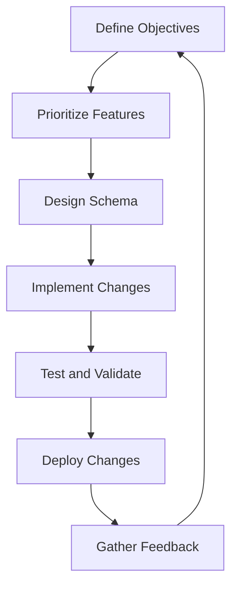

## 17.4 Agile Methodologies in Database Development

In the ever-evolving landscape of software development, Agile methodologies have emerged as a beacon of adaptability and efficiency. When applied to database development, Agile practices can significantly enhance the process, ensuring that databases are not only robust and scalable but also responsive to changing requirements. This section delves into the core principles of Agile methodologies and how they can be effectively integrated into database development.

### Understanding Agile Methodologies

Agile methodologies prioritize flexibility, collaboration, and customer satisfaction. They emphasize iterative development, where work is broken down into manageable increments, allowing for regular reassessment and adaptation. This approach is particularly beneficial in database development, where requirements can change rapidly, and the need for quick adjustments is paramount.

#### Key Principles of Agile

1. **Iterative Development**: Agile methodologies advocate for breaking down work into small, manageable increments. This allows for regular reassessment and adaptation, ensuring that the database evolves in tandem with the application's needs.

2. **Continuous Integration**: Frequent integration of code changes into a shared repository, followed by automated testing, ensures that the database remains stable and functional throughout the development process.

3. **Adaptability**: Agile methodologies emphasize the importance of being responsive to change. This is crucial in database development, where requirements can evolve, necessitating refinements in the database design.

4. **Collaboration**: Agile promotes close collaboration between developers, database administrators, and stakeholders, ensuring that the database aligns with business objectives and user needs.

5. **Customer Focus**: Agile methodologies prioritize customer satisfaction by delivering functional components early and incorporating feedback into subsequent iterations.

### Implementing Agile in Database Development

To effectively implement Agile methodologies in database development, it's essential to understand how these principles can be applied in practice. Let's explore some key strategies and techniques.

#### Iterative Development in Database Design

Iterative development involves breaking down the database design process into smaller, manageable tasks. This allows for regular reassessment and adaptation, ensuring that the database evolves in tandem with the application's needs.

- **Define Clear Objectives**: Start by defining clear objectives for each iteration. This helps in setting realistic goals and measuring progress effectively.

- **Prioritize Features**: Prioritize database features based on their importance and impact on the overall system. Focus on delivering the most critical features first.

- **Regular Feedback Loops**: Establish regular feedback loops with stakeholders to gather insights and make necessary adjustments to the database design.

- **Incremental Changes**: Implement changes incrementally, allowing for continuous improvement and refinement of the database.

#### Continuous Integration and Testing

Continuous integration (CI) is a cornerstone of Agile methodologies, ensuring that code changes are frequently integrated into a shared repository and tested automatically.

- **Automated Testing**: Implement automated testing for database changes to ensure that new code does not introduce errors or regressions.

- **Version Control**: Use version control systems to manage database scripts and changes, enabling easy tracking and rollback if necessary.

- **Build Pipelines**: Set up build pipelines to automate the integration and testing process, ensuring that the database remains stable and functional.

- **Frequent Deployments**: Deploy database changes frequently to catch issues early and ensure that the database aligns with the latest application requirements.

#### Adaptability and Responsive Design

Adaptability is a key tenet of Agile methodologies, allowing for quick adjustments to the database design as requirements evolve.

- **Flexible Schema Design**: Design database schemas with flexibility in mind, allowing for easy modifications and extensions.

- **Refactoring**: Regularly refactor the database to improve performance, maintainability, and scalability.

- **Prototyping**: Use prototyping to test new ideas and concepts before implementing them in the production database.

- **Change Management**: Implement effective change management processes to handle evolving requirements and ensure that changes are documented and communicated.

### Agile Tools and Techniques for Database Development

Several tools and techniques can facilitate the implementation of Agile methodologies in database development. Let's explore some of the most effective ones.

#### Agile Project Management Tools

Agile project management tools can help organize and track database development tasks, ensuring that the team stays on track and meets deadlines.

- **JIRA**: A popular tool for managing Agile projects, JIRA allows teams to plan, track, and release software efficiently.

- **Trello**: Trello offers a visual way to manage tasks and collaborate with team members, making it ideal for Agile projects.

- **Asana**: Asana provides a platform for teams to organize work, track progress, and collaborate effectively.

#### Database Automation Tools

Automation tools can streamline database development processes, reducing manual effort and minimizing errors.

- **Liquibase**: A database schema change management tool that automates the deployment of database changes.

- **Flyway**: A tool for versioning and automating database migrations, ensuring consistency across environments.

- **DbUp**: A .NET library that helps automate database deployments, making it easier to manage database changes.

#### Continuous Integration Tools

Continuous integration tools can automate the integration and testing of database changes, ensuring that the database remains stable and functional.

- **Jenkins**: An open-source automation server that supports building, deploying, and automating database changes.

- **Travis CI**: A continuous integration service that automates the testing and deployment of database changes.

- **CircleCI**: A cloud-based CI/CD platform that integrates with version control systems to automate database deployments.

### Challenges and Solutions in Agile Database Development

Implementing Agile methodologies in database development can present several challenges. However, with the right strategies and solutions, these challenges can be effectively addressed.

#### Challenge: Managing Complex Database Changes

Managing complex database changes can be challenging in an Agile environment, where frequent iterations and deployments are common.

- **Solution**: Use database automation tools to streamline the deployment of complex changes and ensure consistency across environments.

#### Challenge: Ensuring Data Integrity

Ensuring data integrity is crucial in database development, especially when changes are made frequently.

- **Solution**: Implement automated testing and validation processes to catch errors early and ensure data integrity.

#### Challenge: Balancing Flexibility and Stability

Balancing flexibility and stability can be difficult, as frequent changes can introduce instability in the database.

- **Solution**: Design flexible schemas and implement effective change management processes to maintain stability while accommodating changes.

#### Challenge: Collaboration and Communication

Collaboration and communication are essential in Agile database development, but they can be challenging in distributed teams.

- **Solution**: Use collaboration tools and establish clear communication channels to facilitate effective collaboration and information sharing.

### Visualizing Agile Database Development

To better understand the Agile database development process, let's visualize it using a flowchart that illustrates the key steps and interactions.

**Figure 1: Agile Database Development Process**

This flowchart represents the iterative nature of Agile database development, where each step feeds into the next, allowing for continuous improvement and adaptation.

### Try It Yourself

To truly grasp the concepts of Agile methodologies in database development, it's essential to experiment and apply these principles in practice. Here are some exercises to get you started:

1. **Create a Simple Database Schema**: Design a simple database schema for a hypothetical application. Break down the design process into iterations and prioritize features based on their importance.

2. **Implement Continuous Integration**: Set up a continuous integration pipeline for your database project. Use tools like Jenkins or Travis CI to automate the integration and testing process.

3. **Adapt to Changing Requirements**: Simulate a change in requirements and adjust your database design accordingly. Document the changes and communicate them to your team.

4. **Collaborate with Team Members**: Use Agile project management tools like JIRA or Trello to collaborate with team members and track progress.

### Knowledge Check

To reinforce your understanding of Agile methodologies in database development, consider the following questions:

- How can iterative development improve the database design process?
- What are the benefits of continuous integration in database development?
- How can adaptability be achieved in database design?
- What tools can facilitate Agile project management in database development?
- How can collaboration and communication be improved in distributed teams?

### Embrace the Journey

Remember, Agile methodologies are not a one-size-fits-all solution. They require continuous learning and adaptation to suit the unique needs of each project. As you progress in your journey, keep experimenting, stay curious, and enjoy the process of building robust and adaptable database solutions.

## Quiz Time!



### What is the primary goal of Agile methodologies in database development?

- [x] To enhance adaptability and efficiency
- [ ] To increase the complexity of database designs
- [ ] To eliminate the need for testing
- [ ] To reduce collaboration among team members

> **Explanation:** Agile methodologies aim to enhance adaptability and efficiency by promoting iterative development, continuous integration, and collaboration.

### Which of the following is a key principle of Agile methodologies?

- [x] Iterative Development
- [ ] Waterfall Approach
- [ ] Monolithic Design
- [ ] Static Planning

> **Explanation:** Iterative development is a core principle of Agile methodologies, allowing for regular reassessment and adaptation.

### What is the purpose of continuous integration in Agile database development?

- [x] To ensure frequent integration and testing of code changes
- [ ] To delay the deployment of database changes
- [ ] To eliminate the need for version control
- [ ] To increase manual testing efforts

> **Explanation:** Continuous integration ensures frequent integration and testing of code changes, maintaining stability and functionality.

### How can adaptability be achieved in database design?

- [x] By designing flexible schemas and implementing change management processes
- [ ] By avoiding any changes to the database
- [ ] By using only static schemas
- [ ] By eliminating feedback loops

> **Explanation:** Adaptability can be achieved by designing flexible schemas and implementing effective change management processes.

### Which tool is commonly used for Agile project management?

- [x] JIRA
- [ ] SQL Server
- [ ] MongoDB
- [ ] GitHub

> **Explanation:** JIRA is a popular tool for managing Agile projects, allowing teams to plan, track, and release software efficiently.

### What is a challenge in Agile database development?

- [x] Managing complex database changes
- [ ] Eliminating the need for collaboration
- [ ] Reducing the frequency of deployments
- [ ] Avoiding automated testing

> **Explanation:** Managing complex database changes is a challenge in Agile database development, requiring effective tools and processes.

### How can collaboration be improved in distributed teams?

- [x] By using collaboration tools and establishing clear communication channels
- [ ] By avoiding any form of communication
- [ ] By working in isolation
- [ ] By eliminating team meetings

> **Explanation:** Collaboration can be improved by using collaboration tools and establishing clear communication channels.

### What is the role of automated testing in Agile database development?

- [x] To catch errors early and ensure data integrity
- [ ] To increase manual testing efforts
- [ ] To delay the deployment of changes
- [ ] To eliminate the need for version control

> **Explanation:** Automated testing helps catch errors early and ensures data integrity, maintaining stability and functionality.

### What is the benefit of using database automation tools?

- [x] To streamline the deployment of database changes
- [ ] To increase manual effort
- [ ] To eliminate the need for testing
- [ ] To reduce collaboration

> **Explanation:** Database automation tools streamline the deployment of changes, reducing manual effort and minimizing errors.

### True or False: Agile methodologies require continuous learning and adaptation.

- [x] True
- [ ] False

> **Explanation:** Agile methodologies require continuous learning and adaptation to suit the unique needs of each project.


