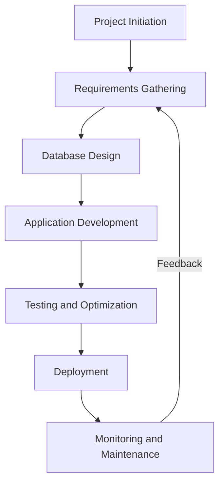

## 17.5 Collaboration Between Developers and DBAs

In the realm of software development, the collaboration between developers and database administrators (DBAs) is crucial for creating robust, efficient, and scalable database solutions. This section delves into the strategies and best practices that foster effective collaboration, ensuring that both parties work towards common objectives such as performance, security, and scalability.

### Understanding the Roles

Before diving into collaboration strategies, it's essential to understand the distinct roles of developers and DBAs:

- **Developers**: Primarily focus on application logic, user interfaces, and ensuring that the application meets business requirements. They write the code that interacts with the database, often prioritizing functionality and user experience.

- **DBAs**: Specialize in the design, implementation, maintenance, and security of databases. They ensure data integrity, optimize performance, and manage database resources.

### The Importance of Communication

**Communication** is the cornerstone of successful collaboration. Without open dialogue, misunderstandings can lead to inefficient database designs, performance bottlenecks, and security vulnerabilities.

#### Establishing Communication Channels

- **Regular Meetings**: Schedule regular meetings to discuss ongoing projects, address concerns, and share updates. This ensures that both teams are aligned and aware of each other's priorities.

- **Collaborative Tools**: Utilize tools like Slack, Microsoft Teams, or Jira to facilitate real-time communication and project management. These platforms allow for quick exchanges and documentation of discussions.

- **Feedback Loops**: Implement feedback loops where developers and DBAs can provide constructive feedback on each other's work. This encourages continuous improvement and learning.

### Aligning on Shared Goals

To achieve optimal database solutions, developers and DBAs must align on shared goals. This involves understanding each other's objectives and working towards common outcomes.

#### Performance

- **Query Optimization**: Developers should work with DBAs to optimize SQL queries, ensuring they are efficient and do not strain database resources. This can involve indexing strategies, query rewriting, and understanding execution plans.

- **Load Testing**: Conduct joint load testing sessions to identify performance bottlenecks and address them collaboratively. This helps in understanding how the application and database interact under stress.

#### Security

- **Data Protection**: Both teams should prioritize data protection, implementing encryption, access controls, and regular security audits. Developers need to write secure code, while DBAs ensure the database is configured to prevent unauthorized access.

- **Compliance**: Stay informed about industry regulations and compliance requirements. Collaborate to ensure that both application and database meet these standards.

#### Scalability

- **Database Design**: Work together on database design to ensure it can scale with the application's growth. This includes considering partitioning, sharding, and replication strategies.

- **Resource Management**: DBAs should provide insights into resource management, while developers ensure that the application can efficiently utilize these resources.

### Cross-Training and Knowledge Sharing

Cross-training is an effective way to bridge the knowledge gap between developers and DBAs. By understanding each other's domains, team members can make more informed decisions and collaborate more effectively.

#### Encouraging Cross-Training

- **Workshops and Training Sessions**: Organize workshops where developers can learn about database management, and DBAs can understand application development. This fosters mutual respect and understanding.

- **Job Shadowing**: Encourage job shadowing, where team members spend time in each other's roles. This hands-on experience provides valuable insights into the challenges and considerations of each domain.

- **Shared Documentation**: Maintain shared documentation that includes best practices, guidelines, and lessons learned. This serves as a reference for both teams and promotes consistency.

### Code Examples and Best Practices

To illustrate the importance of collaboration, let's explore some code examples and best practices that highlight common areas where developers and DBAs can work together.

#### Example: Optimizing a SQL Query

Consider a scenario where a developer writes a query to fetch user data:

```sql
SELECT * FROM users WHERE last_login > '2024-01-01';
```

While this query is functional, it may not be optimal. A DBA can suggest improvements:

```sql
-- Use specific columns instead of SELECT *
SELECT id, username, email FROM users WHERE last_login > '2024-01-01';

-- Ensure an index exists on the last_login column
CREATE INDEX idx_last_login ON users(last_login);
```

**Key Points**:
- **Selective Columns**: Fetch only the necessary columns to reduce data transfer and improve performance.
- **Indexing**: Ensure appropriate indexes are in place to speed up query execution.

#### Example: Implementing Security Measures

Developers and DBAs must collaborate to implement security measures such as preventing SQL injection:

```sql
-- Vulnerable to SQL injection
string query = "SELECT * FROM users WHERE username = '" + userInput + "'";

-- Use parameterized queries to prevent SQL injection
string query = "SELECT * FROM users WHERE username = ?";
PreparedStatement pstmt = connection.prepareStatement(query);
pstmt.setString(1, userInput);
```

**Key Points**:
- **Parameterized Queries**: Use parameterized queries to prevent SQL injection attacks.
- **Input Validation**: Validate user input to ensure it meets expected formats and constraints.

### Visualizing Collaboration

To better understand the collaborative process, let's visualize the workflow between developers and DBAs using a flowchart.



**Diagram Description**: This flowchart illustrates the iterative process of collaboration between developers and DBAs, from project initiation to monitoring and maintenance. Feedback loops ensure continuous improvement.

### Knowledge Check

To reinforce the concepts covered, consider the following questions:

1. What are the key roles of developers and DBAs in a project?
2. How can regular meetings improve collaboration between developers and DBAs?
3. Why is query optimization important for performance?
4. What are some common security measures that developers and DBAs should implement?
5. How can cross-training benefit both developers and DBAs?

### Embrace the Journey

Remember, collaboration between developers and DBAs is an ongoing journey. By fostering open communication, aligning on shared goals, and encouraging cross-training, both teams can work together to create efficient, secure, and scalable database solutions. Keep experimenting, stay curious, and enjoy the journey!

## Quiz Time!



### What is the primary focus of developers in a project?

- [x] Application logic and user interfaces
- [ ] Database maintenance and optimization
- [ ] Network configuration
- [ ] Hardware management

> **Explanation:** Developers focus on application logic and user interfaces, ensuring the application meets business requirements.

### Which tool can facilitate real-time communication between developers and DBAs?

- [x] Slack
- [ ] Microsoft Word
- [ ] Adobe Photoshop
- [ ] AutoCAD

> **Explanation:** Slack is a collaborative tool that facilitates real-time communication and project management.

### What is a key benefit of query optimization?

- [x] Improved performance
- [ ] Increased data redundancy
- [ ] Slower execution times
- [ ] Higher storage costs

> **Explanation:** Query optimization improves performance by making SQL queries more efficient and reducing resource usage.

### How can SQL injection be prevented?

- [x] Using parameterized queries
- [ ] Using SELECT *
- [ ] Ignoring user input
- [ ] Disabling database constraints

> **Explanation:** Parameterized queries prevent SQL injection by separating SQL code from user input.

### What is the purpose of cross-training between developers and DBAs?

- [x] To bridge the knowledge gap and foster mutual understanding
- [ ] To replace each other's roles permanently
- [ ] To reduce the number of team members
- [ ] To eliminate the need for communication

> **Explanation:** Cross-training helps bridge the knowledge gap, fostering mutual understanding and collaboration.

### What is a common goal for both developers and DBAs?

- [x] Ensuring data security
- [ ] Increasing application complexity
- [ ] Reducing database size
- [ ] Eliminating all indexes

> **Explanation:** Ensuring data security is a common goal for both developers and DBAs.

### Which of the following is a security measure that should be implemented?

- [x] Data encryption
- [ ] Using SELECT *
- [ ] Disabling all constraints
- [ ] Ignoring user input

> **Explanation:** Data encryption is a security measure that protects sensitive information.

### What is the role of feedback loops in collaboration?

- [x] To encourage continuous improvement and learning
- [ ] To increase project costs
- [ ] To reduce team communication
- [ ] To eliminate the need for testing

> **Explanation:** Feedback loops encourage continuous improvement and learning by allowing team members to provide constructive feedback.

### What is the benefit of using specific columns in a SQL query?

- [x] Reduces data transfer and improves performance
- [ ] Increases data redundancy
- [ ] Slows down query execution
- [ ] Increases storage costs

> **Explanation:** Using specific columns reduces data transfer and improves performance by fetching only the necessary data.

### True or False: Regular meetings between developers and DBAs are unnecessary for effective collaboration.

- [ ] True
- [x] False

> **Explanation:** Regular meetings are essential for effective collaboration, ensuring both teams are aligned and aware of each other's priorities.




