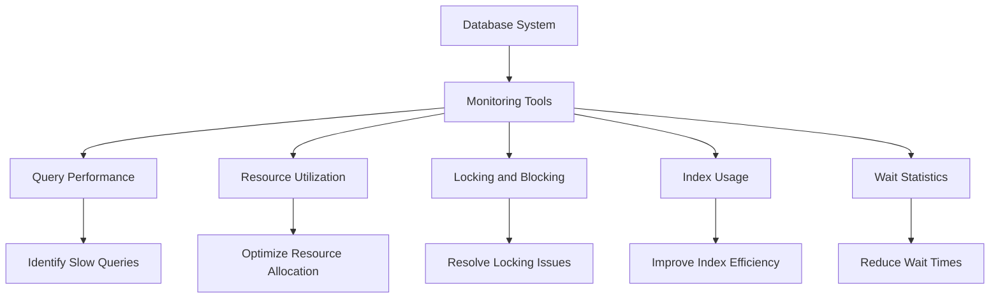

## 17.6 Performance Monitoring and Maintenance

In the realm of SQL databases, performance monitoring and maintenance are critical components that ensure the smooth operation and scalability of your systems. As expert software engineers and architects, it is imperative to understand the nuances of these processes to optimize database performance and anticipate future needs. This section will guide you through the essential strategies and tools for effective performance monitoring and maintenance.

### Monitoring Tools

Monitoring tools are indispensable for tracking database performance metrics over time. They provide insights into the health and efficiency of your database systems, allowing you to identify bottlenecks and areas for improvement.

#### Key Monitoring Metrics

1. **Query Performance**: Monitor the execution time of queries to identify slow-running queries that may need optimization.
2. **Resource Utilization**: Track CPU, memory, and disk usage to ensure resources are not being overutilized.
3. **Locking and Blocking**: Identify locking issues that can lead to performance degradation.
4. **Index Usage**: Analyze index usage patterns to determine if indexes are being used effectively.
5. **Wait Statistics**: Examine wait types and times to understand where delays are occurring.

#### Popular Monitoring Tools

- **SQL Server Profiler**: A tool for monitoring SQL Server events, useful for identifying slow queries and performance bottlenecks.
- **pgAdmin**: A comprehensive tool for PostgreSQL that includes monitoring capabilities.
- **MySQL Enterprise Monitor**: Provides real-time monitoring and alerts for MySQL databases.
- **Oracle Enterprise Manager**: Offers a wide range of monitoring and management features for Oracle databases.

### Proactive Maintenance

Proactive maintenance involves performing regular tasks to keep your database running efficiently. This includes index rebuilding, statistics updating, and other routine tasks.

#### Index Maintenance

Indexes play a crucial role in query performance, and maintaining them is essential for optimal database operation.

- **Rebuilding Indexes**: Over time, indexes can become fragmented, leading to slower query performance. Regularly rebuilding indexes can help maintain their efficiency.
  
  ```sql
  -- Rebuild an index in SQL Server
  ALTER INDEX index_name ON table_name REBUILD;
  ```

- **Updating Statistics**: Statistics provide the query optimizer with information about data distribution. Keeping statistics up-to-date ensures that the optimizer can make informed decisions.

  ```sql
  -- Update statistics in SQL Server
  UPDATE STATISTICS table_name;
  ```

#### Backup and Recovery

Regular backups are vital for data protection and recovery in case of failures.

- **Full Backups**: Capture the entire database at a specific point in time.
- **Incremental Backups**: Only capture changes since the last backup, reducing storage requirements and backup time.

### Capacity Planning

Capacity planning involves anticipating future growth and planning resources accordingly. This ensures that your database can handle increased loads without performance degradation.

#### Steps in Capacity Planning

1. **Analyze Current Usage**: Understand current resource utilization and performance metrics.
2. **Forecast Growth**: Predict future data growth and user load based on historical trends and business projections.
3. **Plan Resources**: Allocate additional resources such as CPU, memory, and storage to accommodate anticipated growth.
4. **Implement Scalability Solutions**: Consider solutions such as sharding or partitioning to distribute load and improve performance.

#### Example of Capacity Planning

Consider a scenario where your database is expected to grow by 50% over the next year. By analyzing current usage patterns and forecasting growth, you can plan for additional storage and compute resources to ensure continued performance.

### Try It Yourself

Experiment with the following code examples to gain hands-on experience with performance monitoring and maintenance tasks:

1. **Modify Index Rebuilding**: Change the index name and table name in the index rebuilding example to practice rebuilding different indexes.
2. **Update Statistics**: Use the statistics updating example on a different table to see how it affects query performance.

### Visualizing SQL Performance Monitoring

To better understand the flow of SQL performance monitoring, consider the following diagram:



**Diagram Description**: This flowchart illustrates the process of SQL performance monitoring, starting from the database system and utilizing various monitoring tools to track key performance metrics. Each metric leads to specific actions that can be taken to optimize performance.

### References and Links

- [SQL Server Profiler Documentation](https://docs.microsoft.com/en-us/sql/tools/sql-server-profiler/sql-server-profiler)
- [pgAdmin Official Website](https://www.pgadmin.org/)
- [MySQL Enterprise Monitor](https://www.mysql.com/products/enterprise/monitor.html)
- [Oracle Enterprise Manager](https://www.oracle.com/enterprise-manager/)

### Knowledge Check

- What are the key metrics to monitor in a SQL database?
- How does index fragmentation affect query performance?
- What are the benefits of proactive maintenance in SQL databases?

### Embrace the Journey

Remember, mastering SQL performance monitoring and maintenance is an ongoing journey. As you continue to explore and experiment with these concepts, you'll gain deeper insights into optimizing your database systems. Keep learning, stay curious, and enjoy the process!

### Formatting and Structure

- **Organize content with clear headings and subheadings**.
- **Use bullet points** to break down complex information.
- **Highlight important terms or concepts** using bold or italic text sparingly.

### Writing Style

- **Use first-person plural (we, let's)** to create a collaborative feel.
- **Avoid gender-specific pronouns**; use they/them or rewrite sentences to be inclusive.
- **Define acronyms and abbreviations** upon first use.

## Quiz Time!



### What is the primary purpose of performance monitoring tools in SQL databases?

- [x] To track database performance metrics over time
- [ ] To replace manual query optimization
- [ ] To automate database backups
- [ ] To eliminate the need for indexing

> **Explanation:** Performance monitoring tools are used to track database performance metrics over time, helping identify bottlenecks and areas for improvement.

### Which of the following is a key metric to monitor in SQL databases?

- [x] Query Performance
- [ ] User Interface Design
- [ ] Network Bandwidth
- [ ] Application Code Quality

> **Explanation:** Query performance is a critical metric to monitor in SQL databases to identify slow-running queries.

### What is the purpose of rebuilding indexes in SQL databases?

- [x] To reduce fragmentation and improve query performance
- [ ] To delete old data
- [ ] To increase storage space
- [ ] To enhance user interface design

> **Explanation:** Rebuilding indexes reduces fragmentation, which can improve query performance.

### What does proactive maintenance in SQL databases involve?

- [x] Performing regular tasks such as index rebuilding and statistics updating
- [ ] Writing new SQL queries
- [ ] Designing user interfaces
- [ ] Developing new applications

> **Explanation:** Proactive maintenance involves performing regular tasks like index rebuilding and statistics updating to keep the database running efficiently.

### Which of the following is NOT a step in capacity planning?

- [ ] Analyze Current Usage
- [ ] Forecast Growth
- [ ] Plan Resources
- [x] Design User Interfaces

> **Explanation:** Designing user interfaces is not a step in capacity planning, which focuses on analyzing usage, forecasting growth, and planning resources.

### What is the benefit of updating statistics in SQL databases?

- [x] Ensures the query optimizer can make informed decisions
- [ ] Deletes unnecessary data
- [ ] Increases storage capacity
- [ ] Enhances user experience

> **Explanation:** Updating statistics ensures the query optimizer has accurate information about data distribution, allowing it to make informed decisions.

### Which tool is used for monitoring SQL Server events?

- [x] SQL Server Profiler
- [ ] pgAdmin
- [ ] MySQL Workbench
- [ ] Oracle SQL Developer

> **Explanation:** SQL Server Profiler is used for monitoring SQL Server events and identifying performance bottlenecks.

### What is the role of capacity planning in SQL databases?

- [x] To anticipate future growth and plan resources accordingly
- [ ] To design user interfaces
- [ ] To automate query writing
- [ ] To develop new applications

> **Explanation:** Capacity planning involves anticipating future growth and planning resources to ensure continued performance.

### How can you experiment with index rebuilding in SQL?

- [x] Change the index name and table name in the example code
- [ ] Write new SQL queries
- [ ] Design a new database schema
- [ ] Develop a new application

> **Explanation:** You can experiment with index rebuilding by changing the index name and table name in the example code provided.

### True or False: Regular backups are not necessary if you have a robust monitoring system.

- [ ] True
- [x] False

> **Explanation:** Regular backups are essential for data protection and recovery, regardless of the monitoring system in place.


