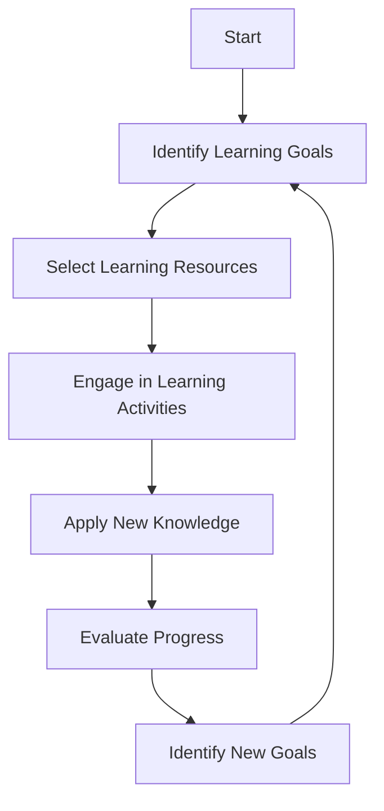

## 17.7 Continual Learning and Skill Enhancement

In the ever-evolving landscape of technology, continual learning and skill enhancement are not just beneficial—they are essential. For expert software engineers and architects specializing in SQL design patterns, staying ahead of the curve requires a proactive approach to professional development, staying updated with industry trends, and engaging in knowledge sharing. This section will guide you through strategies to enhance your skills and keep your knowledge up-to-date.

### Professional Development

Professional development is a cornerstone of continual learning. It involves investing time and resources into training, workshops, and certifications that can elevate your expertise and open new career opportunities.

#### Training and Workshops

**Participate in Workshops**: Workshops offer hands-on experience and direct interaction with experts. They are an excellent way to learn new SQL design patterns and techniques. Look for workshops that focus on advanced SQL features, query optimization, and database architecture.

**Enroll in Online Courses**: Platforms like Coursera, Udemy, and edX offer courses on SQL and database management. These courses range from beginner to advanced levels and often include practical exercises and projects.

**Attend Conferences and Seminars**: Conferences such as SQL PASS Summit and Oracle OpenWorld provide insights into the latest trends and technologies in SQL. They also offer networking opportunities with industry leaders and peers.

#### Certifications

**Pursue Relevant Certifications**: Certifications validate your skills and knowledge. Consider certifications like Microsoft Certified: Azure Database Administrator Associate or Oracle Certified Professional, MySQL Database Administrator.

**Stay Certified**: Many certifications require periodic renewal. Ensure you stay certified by completing necessary continuing education credits or retaking exams.

### Staying Updated

The SQL landscape is dynamic, with new standards, tools, and technologies emerging regularly. Staying updated is crucial for maintaining your expertise and relevance in the field.

#### Following Industry Trends

**Subscribe to Industry Publications**: Journals and magazines such as SQL Server Pro and Database Trends and Applications provide in-depth articles and analysis on the latest developments in SQL.

**Follow Influential Blogs and Websites**: Websites like SQLServerCentral and Database Journal offer tutorials, tips, and news on SQL and database management.

**Engage with Thought Leaders on Social Media**: Platforms like LinkedIn and Twitter are excellent for following industry thought leaders. Engage with their content to gain insights and perspectives on SQL trends.

#### Updates in SQL Standards

**Monitor SQL Standard Updates**: Keep an eye on updates to SQL standards, such as SQL:2016. Understanding these updates can help you leverage new features and capabilities in your projects.

**Experiment with New Features**: As new SQL features are released, experiment with them in a test environment. This hands-on approach will help you understand their potential applications and limitations.

### Knowledge Sharing

Knowledge sharing is a powerful tool for learning and growth. By participating in communities and contributing to open-source projects, you can enhance your skills and give back to the community.

#### Participating in Communities

**Join SQL User Groups**: User groups provide a platform for sharing experiences and learning from others. They often host regular meetings, webinars, and discussions.

**Contribute to Forums and Discussion Boards**: Platforms like Stack Overflow and Reddit have active SQL communities. Participate in discussions, ask questions, and share your knowledge.

**Engage in Meetups**: Meetups are informal gatherings where professionals discuss topics of interest. Look for SQL-focused meetups in your area or online.

#### Contributing to Open-Source Projects

**Find Projects on GitHub**: GitHub hosts numerous open-source SQL projects. Contributing to these projects can enhance your coding skills and provide valuable experience in collaborative development.

**Start Your Own Project**: If you have a unique idea or solution, consider starting your own open-source project. This can demonstrate your expertise and attract contributions from others.

**Collaborate with Peers**: Collaboration fosters learning and innovation. Work with peers on projects to gain new perspectives and insights.

### Code Examples

Let's explore some practical examples to illustrate the concepts discussed.

#### Example 1: Using New SQL Features

Suppose a new SQL standard introduces a feature for handling JSON data more efficiently. Here's how you might experiment with it:

```sql
-- Create a table with a JSON column
CREATE TABLE orders (
    id INT PRIMARY KEY,
    order_data JSON
);

-- Insert data into the table
INSERT INTO orders (id, order_data) VALUES
(1, '{"customer": "John Doe", "items": [{"product": "Laptop", "quantity": 1}]}'),
(2, '{"customer": "Jane Smith", "items": [{"product": "Smartphone", "quantity": 2}]}');

-- Query the JSON data
SELECT id, JSON_VALUE(order_data, '$.customer') AS customer
FROM orders;
```

**Try It Yourself**: Modify the JSON structure to include additional details, such as order date or shipping address, and update the query to extract this information.

#### Example 2: Contributing to an Open-Source Project

Imagine you're contributing to an open-source SQL project that aims to optimize query performance. You might add a feature to analyze query execution plans:

```sql
-- Example function to analyze query execution plans
CREATE FUNCTION analyze_query_plan(query TEXT) RETURNS TEXT AS $$
DECLARE
    plan TEXT;
BEGIN
    -- Execute the query and get the execution plan
    EXECUTE 'EXPLAIN ' || query INTO plan;
    RETURN plan;
END;
$$ LANGUAGE plpgsql;

-- Use the function to analyze a query
SELECT analyze_query_plan('SELECT * FROM orders WHERE id = 1');
```

**Try It Yourself**: Extend the function to provide recommendations for optimizing the query based on the execution plan.

### Visualizing the Learning Process

To better understand the continual learning process, let's visualize it using a flowchart.



**Description**: This flowchart represents the cyclical nature of continual learning. It begins with identifying learning goals, selecting resources, engaging in activities, applying knowledge, evaluating progress, and setting new goals.

### References and Links

- [Coursera SQL Courses](https://www.coursera.org/courses?query=sql)
- [SQLServerCentral](https://www.sqlservercentral.com/)
- [Stack Overflow SQL Community](https://stackoverflow.com/questions/tagged/sql)
- [GitHub SQL Projects](https://github.com/topics/sql)

### Knowledge Check

Let's reinforce what we've learned with some questions and exercises.

1. **What are some benefits of attending SQL workshops and conferences?**
   - Networking opportunities
   - Hands-on experience
   - Exposure to new trends

2. **How can you stay updated with SQL standard updates?**
   - Subscribe to industry publications
   - Follow influential blogs
   - Experiment with new features

3. **Why is knowledge sharing important in the SQL community?**
   - Enhances learning
   - Fosters collaboration
   - Builds a supportive network

### Embrace the Journey

Remember, continual learning is a journey, not a destination. As you progress, you'll encounter new challenges and opportunities. Stay curious, keep experimenting, and enjoy the process of learning and growth.

### Formatting and Structure

To ensure clarity and ease of understanding, this section has been organized with clear headings and subheadings. Bullet points have been used to break down complex information, and important terms have been highlighted for emphasis.

### Writing Style

This guide uses first-person plural to create a collaborative feel and avoids gender-specific pronouns to ensure inclusivity. Acronyms and abbreviations have been defined upon first use to aid understanding.

## Quiz Time!



### What is a key benefit of participating in SQL workshops?

- [x] Hands-on experience
- [ ] Immediate certification
- [ ] Guaranteed job placement
- [ ] Free software licenses

> **Explanation:** Workshops provide hands-on experience and direct interaction with experts, which is invaluable for learning new SQL design patterns and techniques.

### How can you stay updated with the latest SQL standards?

- [x] Subscribe to industry publications
- [ ] Ignore new updates
- [ ] Only rely on past knowledge
- [ ] Avoid experimenting with new features

> **Explanation:** Subscribing to industry publications and experimenting with new features help you stay informed about the latest SQL standards.

### Why is knowledge sharing important in the SQL community?

- [x] Enhances learning
- [ ] Isolate individual contributors
- [ ] Discourages collaboration
- [ ] Limits innovation

> **Explanation:** Knowledge sharing enhances learning, fosters collaboration, and builds a supportive network within the SQL community.

### What is a benefit of contributing to open-source SQL projects?

- [x] Enhances coding skills
- [ ] Guarantees financial gain
- [ ] Limits exposure to new ideas
- [ ] Reduces collaboration opportunities

> **Explanation:** Contributing to open-source projects enhances coding skills and provides valuable experience in collaborative development.

### Which platform is recommended for following SQL industry thought leaders?

- [x] LinkedIn
- [ ] MySpace
- [ ] Friendster
- [ ] Vine

> **Explanation:** LinkedIn is a professional platform where you can follow industry thought leaders and engage with their content.

### What is the purpose of SQL certifications?

- [x] Validate skills and knowledge
- [ ] Provide free software
- [ ] Guarantee job placement
- [ ] Offer unlimited resources

> **Explanation:** SQL certifications validate your skills and knowledge, demonstrating your expertise to employers and peers.

### How can you engage with the SQL community online?

- [x] Participate in forums and discussion boards
- [ ] Avoid online interactions
- [ ] Only read without contributing
- [ ] Ignore community events

> **Explanation:** Engaging in forums and discussion boards allows you to participate in discussions, ask questions, and share your knowledge.

### What is a recommended way to apply new SQL knowledge?

- [x] Experiment in a test environment
- [ ] Implement immediately in production
- [ ] Ignore new knowledge
- [ ] Avoid practical application

> **Explanation:** Experimenting in a test environment allows you to safely apply new SQL knowledge and understand its potential applications and limitations.

### What is the cyclical nature of continual learning?

- [x] Identify goals, select resources, engage, apply, evaluate, set new goals
- [ ] Learn once and stop
- [ ] Only focus on theory
- [ ] Avoid setting goals

> **Explanation:** Continual learning involves identifying goals, selecting resources, engaging in activities, applying knowledge, evaluating progress, and setting new goals.

### True or False: Continual learning is a journey, not a destination.

- [x] True
- [ ] False

> **Explanation:** Continual learning is an ongoing process of growth and development, emphasizing the journey rather than a final destination.




