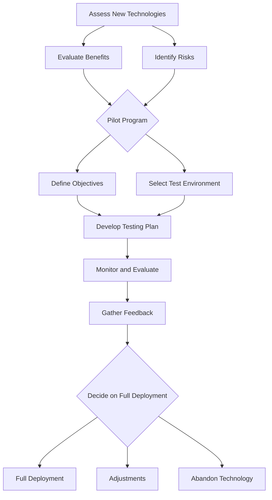

## 17.8 Balancing Innovation and Stability

In the rapidly evolving world of software engineering and database management, balancing innovation with stability is crucial for maintaining efficient, scalable, and secure systems. As expert software engineers and architects, we must navigate the delicate equilibrium between adopting cutting-edge technologies and ensuring the reliability of our existing systems. This section explores strategies for assessing new technologies, implementing pilot programs, and managing risks to achieve this balance.

### Assessing New Technologies

When considering the adoption of new technologies, it's essential to evaluate both the potential benefits and the associated risks. This process involves a thorough analysis of how the new technology aligns with your organization's goals, the impact on existing systems, and the readiness of your team to embrace change.

#### Evaluating Benefits

1. **Increased Efficiency**: Determine if the new technology can streamline processes, reduce resource consumption, or enhance performance. For instance, a new indexing strategy might significantly speed up query execution times.

2. **Scalability**: Assess whether the technology can support future growth. This is particularly important for databases that need to handle increasing volumes of data and user requests.

3. **Security Enhancements**: Consider if the technology offers improved security features, such as advanced encryption methods or better access control mechanisms.

4. **Integration Capabilities**: Evaluate how well the technology integrates with existing systems and whether it supports interoperability with other tools and platforms.

#### Identifying Risks

1. **Compatibility Issues**: New technologies may not be fully compatible with existing systems, leading to integration challenges.

2. **Learning Curve**: Assess the time and resources required for your team to learn and effectively use the new technology.

3. **Vendor Lock-In**: Be cautious of technologies that may tie your organization to a specific vendor, limiting future flexibility.

4. **Stability Concerns**: New technologies may not be as stable or mature as established solutions, potentially leading to unexpected issues.

### Pilot Programs

Implementing pilot programs is a strategic approach to testing innovations in a controlled environment before full-scale deployment. This allows you to evaluate the technology's performance and impact on your systems without risking widespread disruption.

#### Steps to Implement a Pilot Program

1. **Define Objectives**: Clearly outline what you aim to achieve with the pilot program, such as performance improvements or enhanced security.

2. **Select a Test Environment**: Choose a representative subset of your system where the new technology can be tested without affecting critical operations.

3. **Develop a Testing Plan**: Create a detailed plan that includes test cases, success criteria, and timelines.

4. **Monitor and Evaluate**: Continuously monitor the pilot program's progress and evaluate its outcomes against the defined objectives.

5. **Gather Feedback**: Collect feedback from users and stakeholders to understand their experiences and identify any issues.

6. **Decide on Full Deployment**: Based on the pilot program's results, decide whether to proceed with full-scale implementation, make adjustments, or abandon the technology.

### Risk Management

Effective risk management is essential to minimize potential disruptions when adopting new technologies. This involves identifying potential risks, assessing their impact, and developing strategies to mitigate them.

#### Risk Identification

1. **Technical Risks**: Identify risks related to system compatibility, data integrity, and performance.

2. **Operational Risks**: Consider risks associated with changes in workflows, user adoption, and training requirements.

3. **Financial Risks**: Evaluate the costs of implementation, including potential hidden expenses.

4. **Regulatory Risks**: Ensure compliance with industry regulations and standards when adopting new technologies.

#### Risk Mitigation Strategies

1. **Thorough Testing**: Conduct comprehensive testing to identify and address potential issues before full deployment.

2. **Incremental Implementation**: Gradually implement the new technology in phases to minimize disruption and allow for adjustments.

3. **Backup and Recovery Plans**: Develop robust backup and recovery plans to ensure data integrity and system availability.

4. **Training and Support**: Provide adequate training and support to help your team adapt to the new technology.

5. **Regular Reviews**: Conduct regular reviews to assess the technology's performance and make necessary adjustments.

### Code Examples

To illustrate the concepts discussed, let's explore a code example demonstrating the implementation of a new indexing strategy in SQL. This example highlights the potential benefits of increased efficiency and scalability.

```sql
-- Create a new table with sample data
CREATE TABLE Orders (
    OrderID INT PRIMARY KEY,
    CustomerID INT,
    OrderDate DATE,
    TotalAmount DECIMAL(10, 2)
);

-- Insert sample data into the Orders table
INSERT INTO Orders (OrderID, CustomerID, OrderDate, TotalAmount)
VALUES
(1, 101, '2024-01-15', 150.00),
(2, 102, '2024-01-16', 200.00),
(3, 103, '2024-01-17', 250.00);

-- Create an index on the OrderDate column to improve query performance
CREATE INDEX idx_OrderDate ON Orders (OrderDate);

-- Query to retrieve orders within a specific date range
SELECT * FROM Orders
WHERE OrderDate BETWEEN '2024-01-15' AND '2024-01-17';
```

In this example, we create an index on the `OrderDate` column to enhance query performance. By indexing this column, we can quickly retrieve orders within a specific date range, demonstrating the potential efficiency gains from adopting new indexing strategies.

### Visualizing the Balance

To better understand the balance between innovation and stability, let's visualize the process using a flowchart. This diagram illustrates the steps involved in assessing new technologies, implementing pilot programs, and managing risks.



This flowchart provides a clear visual representation of the process, helping you understand how each step contributes to balancing innovation and stability.

### References and Links

For further reading on balancing innovation and stability in SQL design patterns, consider exploring the following resources:

- [MDN Web Docs: SQL](https://developer.mozilla.org/en-US/docs/Web/SQL)
- [W3Schools: SQL Tutorial](https://www.w3schools.com/sql/)
- [Oracle: Database Design and Management](https://www.oracle.com/database/)

### Knowledge Check

To reinforce your understanding of balancing innovation and stability, consider the following questions:

1. What are the key benefits of adopting new technologies in SQL design patterns?
2. How can pilot programs help mitigate risks associated with new technologies?
3. What are some common risks to consider when evaluating new technologies?
4. How can you ensure compliance with industry regulations when adopting new technologies?
5. What strategies can be used to manage risks during the implementation of new technologies?

### Embrace the Journey

Remember, balancing innovation and stability is an ongoing process. As you explore new technologies and design patterns, stay curious and open to learning. By continuously assessing and adapting your approach, you can create efficient, scalable, and secure database solutions that meet the evolving needs of your organization.

## Quiz Time!



### What is the primary goal of balancing innovation and stability in SQL design patterns?

- [x] To maintain efficient, scalable, and secure systems
- [ ] To adopt as many new technologies as possible
- [ ] To avoid any changes to existing systems
- [ ] To focus solely on performance improvements

> **Explanation:** The primary goal is to maintain efficient, scalable, and secure systems by balancing innovation with stability.

### Which of the following is a benefit of adopting new technologies?

- [x] Increased efficiency
- [ ] Increased complexity
- [ ] Higher costs
- [ ] Vendor lock-in

> **Explanation:** Increased efficiency is a potential benefit of adopting new technologies.

### What is a pilot program?

- [x] A controlled test of new technology before full deployment
- [ ] A mandatory training session for all employees
- [ ] A complete overhaul of existing systems
- [ ] A marketing strategy for new products

> **Explanation:** A pilot program is a controlled test of new technology before full deployment.

### What is a common risk associated with new technologies?

- [x] Compatibility issues
- [ ] Improved security
- [ ] Enhanced performance
- [ ] Increased scalability

> **Explanation:** Compatibility issues are a common risk associated with new technologies.

### How can pilot programs help mitigate risks?

- [x] By testing innovations in a controlled environment
- [ ] By immediately implementing new technologies
- [ ] By avoiding any changes to existing systems
- [ ] By focusing solely on cost reduction

> **Explanation:** Pilot programs help mitigate risks by testing innovations in a controlled environment.

### What is a key component of risk management?

- [x] Identifying potential risks
- [ ] Ignoring potential risks
- [ ] Implementing all new technologies
- [ ] Reducing team size

> **Explanation:** Identifying potential risks is a key component of risk management.

### What should be included in a testing plan for a pilot program?

- [x] Test cases and success criteria
- [ ] Marketing strategies
- [ ] Budget forecasts
- [ ] Employee evaluations

> **Explanation:** A testing plan should include test cases and success criteria.

### What is a potential benefit of a new indexing strategy?

- [x] Improved query performance
- [ ] Increased data redundancy
- [ ] Higher storage costs
- [ ] Reduced security

> **Explanation:** A new indexing strategy can improve query performance.

### What is a risk mitigation strategy?

- [x] Incremental implementation
- [ ] Immediate full deployment
- [ ] Ignoring potential risks
- [ ] Reducing team training

> **Explanation:** Incremental implementation is a risk mitigation strategy.

### True or False: Balancing innovation and stability is a one-time process.

- [ ] True
- [x] False

> **Explanation:** Balancing innovation and stability is an ongoing process that requires continuous assessment and adaptation.


